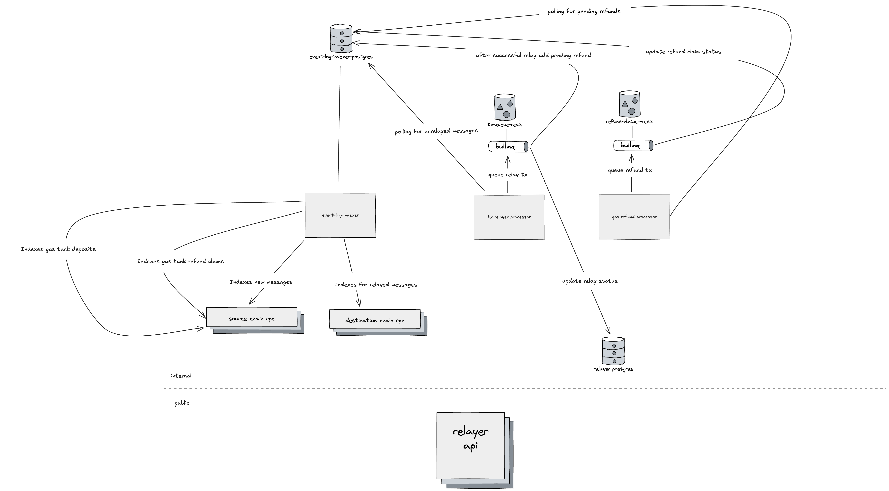

# L2toL2CrossDomainMessenger Autorelayer: Design Doc

|                    |                                                    |
| ------------------ | -------------------------------------------------- |
| Author             | Harry Markley                                      |
| Created at         | 2025-04-21                                         |
| Initial Reviewers  | Hamdi Allam, Skeletor, Kelvin Fichter, Karl Floersch         |
| Need Approval From | Hamdi Allam                                        |
| Status             | Draft                                              |

## Purpose

This document outlines the architecture of an offchain service that will automatically relay messages sent through the `L2toL2CrossDomainMessenger#sendMessage` function to the appropriate destination chain.

## Summary

The following components are needed to autorelay `L2toL2CrossDomainMessenger` messages:
- Indexer - indexes `L2toL2CrossDomainMessenger` messages. This is needed for finding new messages that need to be relayed and for tracking messages that have already been relayed.
- Tx relayer processor - this handles sending `L2toL2CrossDomainMessenger#relayMessage` transactions.
- Gas refund processor - refunds the gas paid by the transaction sender using the [gas receipt](https://github.com/ethereum-optimism/design-docs/pull/266/) of the relay transaction and the [fee vault](https://github.com/ethereum-optimism/design-docs/pull/272)
- Relayer API - supports any API calls from external consumers. For example: status of messages, relay metadata (successes, failures, retries, etc.), relayer management. 

## Problem Statement + Context

In order to perform an interop action that requires a message sent from the source chain to be executed on a destination chain, two transactions are required - one for initiating the message on the source and a second for executing the message on the destination. Developers seeking to build seamless interoperable UX in their apps, will integrate with the auto-relayer in order to deliver a smooth user experience where crosschain transactions are auto-executed.

The following considerations must be taken into account when building the autorelayer:
- Scalable: the service needss to be able to scale to meet the needs of many apps and to handle a high transaction throughput. Thus it must be designed in such a way that it can be scaled to meet increased demands.
- Robust: applications will be depending on these transactions to go through, therefore, this service must be reliable and therefore, monitoring and graceful error handling is important.
- Speed: Applications will expect a "single" transaction experience, therefore, the relayer should strive to relay transactions as quickly as they become available.
- Cost Efficient: the service must optimize both operational costs and users fees to ensure economic viability for operators and affordability for users.

## Proposed Solution

### Architecture diagram

This architecture will be repeated for each interop dependency set (devnet, sepolia, and mainnet). This is a multi-chain architecture grouped by dependency set and each component will handle traffic across all chains within the dependency set. As the interop dependency set expands we may start to run into scaling bottlenecks, from there we can determine which services to split out into dedicated instances per chain.

### Database schema

#### Sent Messages
db: `event-log-indexer-postgres`
| name | type   |
|------|--------|
| messageHash   | string | 
| sourceTxHash   | string | 
| chainID   | bigint | 
| destinationChainID   | bigint | 
| target   | string | 
| messageOrigin   | string | 
| sender   | string | 
| txOrigin   | string | 
| messagePayload   | string | 
| messageNonce   | bigint | 
| blockNumber   | bigint | 
| logIndex   | int | 
| timestamp   | bigint | 
| rootMessageHash | string |
| depth | int |
| status | enum |

#### Relayed Messages
db: `event-log-indexer-postgres`
| name | type   |
|------|--------|
| messageHash   | string | 
| rootMessageHash | string |
| depth | int |
| chainID | string |
| txHash | string |
| timestamp | bigint |
| relayer | string |
| cost | bigint |

#### Gas Tank by Message Hash
db: `event-log-indexer-postgres`
| name | type   |
|------|--------|
| rootMsgHash | string |
| balance | bigint |

#### Gas Tank by Address
db: `event-log-indexer-postgres`
| name | type   |
|------|--------|
| account | address |
| balance | bigint |

#### Refunds
db: `event-log-indexer-postgres`
| name | type   |
|------|--------|
| messageHash | string |
| messageTxOrigin | string |
| status | enum |
| refundTxHash | string | 

#### Relay Attempts
db: `relayer-postgres`
| name | type   |
|------|--------|
| messageHash | string |
| timestamp | bigint
| result | enum |
| relayer | string |

### Resource Usage

#### Database Resource Usage
The most significant source of resource usage for the database will be the indexing of all `SentMessage` and `RelayMessage` events from the `L2toL2CrossDomainMessenger`. Initially we will store all of these events without a retention period, however, as resource usage increases we can make optimizations to remove messages that have expired or are no longer needed because they have been relayed.

### Transaction submission
For submitting relay transactions a queue based approach will be utilized. The queue will be configured with `n` workers that will have access to a dedicated EOA that will be used for submitting transactions. The transaction flow will be as follows:
1. Tx Relayer Processor polls for a batch of unrelayed messages from the `event-log-indexer-postgres`.
2. The messages are placed on the queue and grouped by `rootMessageHash`
3. Worker takes a message off the queue and runs validation checks (i.e. simulation, gas tank balance, etc) on it prior to submitting it on chain
4. Updates whether the relay succeeded or failed in the `Relay Attempts` table in `relayer-postgres`.
5. If the relay succeeded, adds an entry for a pending refund to the `Refunds` table in  `event-log-indexer-postgres`. For details on failures see [Transaction Reverts](#transaction-reverts).

### Gas refunding
For claiming refunds from the gas tank for relayers, a queue based approach will be utilized. The queue will be configured with `n` workers that will have access to a dedicated EOA that can be used for claiming refunds. It is important that these workers use different EOA's than the EOA's used by the workers for submitting relay transactions in order to avoid congestion. The flow will be as follows:
1. Gas Refund Processor polls for a batch of pending refunds from the `Refunds` table in `event-log-indexer-postgres`.
2. Pending refund jobs are placed on the queue.
3. Worker processes a job and submits a claim transaction for the given message, using the message identifier.
4. Updates whether the claim succeeded or failed in the `Refunds` table in  `event-log-indexer-postgres`.

### Nonce management
Each EOA will handle one transaction at a time. Once the transaction has been confirmed and the receipt has been fetched, then the EOA will be released to handle another transaction. If a transaction gets stuck, then that worker is marked as stuck and then placed on a job queue which handles canceling the stuck transaction and then marking the worker as healthy, so that it can begin picking up new transactions again.

### Stuck transactions
If a transaction is attempted, but the gas is not set high enough and the transaction becomes stuck in the mempool, then the EOA used by the worker will be marked as being in a stuck state and the pending message will be placed back on the queue so that the transaction can be attempted again. A separate job will be created that will be responsible for canceling the stuck transaction. Once unstuck, the EOA will be marked as healthy and will be free to start picking up relay transactions from the queue again.

### Transaction Reverts
**_Open question: if a relay transaction reverts, how should we surface this to the user and what should the retry strategy be?_**

If a relay transaction fails because the transaction reverts, then the relay will be marked as failed and there will be an additional n retry attempts with an exponential backoff. If the transaction still hasn't succeeded after n retry attempts, the message must be resent using the `resendMessage` function on the `L2toL2CrossDomainMessenger` in order to re-trigger the process and the transaction will go through another n attempts.

### Gas Refunding Failures Due to Low Gas Tank Balance
It is possible that a gas refund claim could fail because the gas tank is too low for that message. If this happens it is important that this event is logged and monitored. Additionally, the refund should be marked as failed in the `Refunds` table. If we encounter a gas tank that is too low to refund for the relay tx, this means the gas tank balance was not properly checked prior to relaying the message. It will be important to monitor how many times we encounter this state in order to optimize the relay transaction submission.

### Wallet Management
The following approach will be used to keep wallets funded on the relayer:
1. A Drippie contract is deployed and funded on each network in the interop set
2. Drips on the Drippie contract are configured for each wallet, so that when the balance of the wallet is below x amount, Drippie will send funds to it
3. The Gas Refund Processor has a cron job configured on it to regularly call the Drippie contract and trigger drips

In order to make sure that this is running efficiently the following will be monitored:
- Balance on each Drippie contract
- Balance on each wallet
- Drip transaction failures

This approach provides easier management of funds. Instead of having to individually fund each wallet, just have to make sure one contract on each chain is funded.

### Logging and Alerting
The following metrics will be used in order to track the overall health of the relayer and to configure alerting:
- count of successful relays
- count of successful refund claims
- count of sent messages
- count of failed relays
- count of failed refund claims
- balance of each wallet
- storage available on indexer db
- memory available on tx relayer processor redis
- memory available on gas refund processor redis
- time between message sent and message relayed

### Gas Price
**_Open question: do we need to allow a user to specify a max gas price?_**

The gas fee charged by the relayer is based on `block.basefee` and not the `tx.gasprice` (see (#266)[https://github.com/ethereum-optimism/design-docs/pull/266/files]), which means that the priority fee set by the relayer will not be charged to the user. In later iterations of this service, we will consider exploring a priority fee mechanism, where users can leverage a priority fee in order to increase the speed at which their messages are relayed.

### Testing
Since the relayer is a production critical service, it is important that we have a high degree of confidence that the changes  pushed to it do not break the service. As a part of this effort we will need to run integration tests that spins up the relayer against [kurtosis interop devnets](https://github.com/ethereum-optimism/optimism/tree/develop/kurtosis-devnet).

## Failure Mode Analysis

TODO

## Alternatives Considered

### Dedicated services for each chain
Considered having a dedicated indexer, tx processor, and gas refund processor for each chain. This would have allowed for the system to be scaled based on chain traffic and prevents heavy traffic on one chain from slowing down relays on lower traffic chains. We ultimately opted against this strategy in order to simplify the architecture to start. This could ultimately be the correct architecture long term but at the current size of the interop dependency set, we get the benefits of the simplicity of a multichain architecture, which will increase our velocity and allow us to thoughtfully scale the service as we identify bottlenecks.

## Risks & Uncertainties

**_Open question: do we need to allow a user to specify a max gas price?_**

**_Open question: if a relay transaction reverts, how should we surface this to the user and what should the retry strategy be?_**
