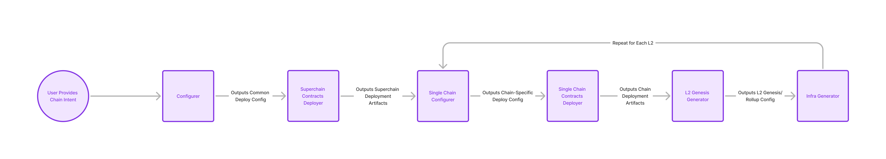

# Purpose

Introduce `op-deployer`, an end-to-end chain deployment tool, and get buy-in on its architecture and implementation.

## Goals

- Provide a canonical way to deploy chains.
- Enable deploying multiple L2s to a single L1 as part of a single logical Superchain.
- Make it easier for teams like Protocol and Proofs to maintain their deployment tooling.

## Non-Goals

- Replacing `op-e2e`. This will be discussed later, once `op-deployer` is live.

# Problem Statement + Context

As we've
discussed [previously](https://docs.google.com/document/d/13f8UoO9j05PJdvAZDWuVJWD1UAIEAfb8VbphBnPE3cA/edit#heading=h.jxalqw91xhd0),
deploying and upgrading OP Chains remains a complicated and frustrating process. Users are directed to a tutorial
with [18 manual steps](https://docs.optimism.io/builders/chain-operators/tutorials/create-l2-rollup) to follow in order
to create their own testnet. Within Labs, we use a combination of different tools depending on where the chain is to be
hosted:

- **opc** deploys new chains to our cloud infrastructure.
- The **compose devnet** uses a bunch of custom Python tooling to deploy a chain locally using `docker-compose`.
- The **Kurtosis devnet** uses a combination of custom deployer scripts and the fault proof's `getting-started.sh` to
  deploy a chain to a new enclave.
- The Interop team now has [their own](https://github.com/ethereum-optimism/optimism/pull/11590) devnet setup to deploy
  a set of interoperable chains locally.

Notably, with the exception of the Interop devnet none of the solutions above enable deploying multiple L2s to a single
L1 as part of a single logical Superchain. This is a huge gap in functionality, that will only become more magnified as
time goes on.

To resolve this problem we need set of well-integrated, modular tools that define the canonical way of deploying a
chain. Users can then leverage these tools to build their own deployment tooling on top.

Much of what's described below is already implemented as part of `opc`. By extracting these concepts out of `opc`
and into the monorepo, we can make them more accessible to other teams and users.

# Proposed Solution

The high-level architecture is described
in [Modular Deployments](https://docs.google.com/document/d/13f8UoO9j05PJdvAZDWuVJWD1UAIEAfb8VbphBnPE3cA/edit#heading=h.jxalqw91xhd0),
so read that document first if you haven't already. This design doc will focus on the implementation details of the
architecture it describes.

## Deployment Pipeline

The core of the modular deployment tooling is the concept of a _deployment pipeline_. The pipeline consists of stages
that each perform a single piece of the deployment. The stages each take an input file, and enrich it with the data
pertaining to that particular stage of the deployment. This allows the output of upstream stages to be cached.

The diagram below outlines what these stages are:



## Deployment Intents

We'll create a new tool called `op-deployer` to orchestrate deployments. Users won't need to interact with the pipeline
directly. Instead, they'll define a _deployment intent_ which will describe the properties of the chains they want to
deploy. `op-deployer` will then diff the intent against the current state of the deployment, and run the pipeline to
ensure that the real deployment matches the intent.

An example deployment intent is below. Deployment intents are encoded as TOML to match what the OP Contracts Manager
expects:

```toml
[intent]
l1ChainID = 11_155_111
useFaultProofs = true
fundDevAccounts = true
# Define the version of the smart contracts to deploy
contractsVersion = "op-contracts/1.2.0"
# Override specific variables in the deploy config globally
overrides = { }

# Define the chains to deploy, by chain ID
[intent.chains.901]
# Override variables in the deploy config for this specific chain
overrides = { }

[intent.chains.902]
# ... etc.
```

Under the hood, `op-deployer` will run through the deployment pipeline. The output of each intermediate stage will
be stored by default within the intent's TOML file, however the implementation of the "state store" will be
pluggable in order to support use cases like `opc` which store the deployment state in a database. Example output from a
stage is below:

```toml
[intent]
# Intent data is same as above and elided

[state.chains.901]
# Ownership addresses derived from a mnemonic
proxyAdminOwner = "0xe59a881b2626f948f56f509f180c32428585629a"
finalSystemOwner = "0xb9cdf788704088a4c0191d045c151fcbe2db14a4"
baseFeeVaultRecipient = "0xbc4a9110dad00b4d9fb61743598848ddda6eeb03"
l1FeeVaultRecipient = "0x6b0c2542fa2cadced5c7f64ef6fb9ebbce7630ff"
sequencerFeeVaultRecipient = "0xb4e5b724bbc54c95d292613d956871281120ead6"

# Address of OPCM so that other addresses can be retrieved from on-chain data
opContractsManagerAddress = "0x79c6c6b1844e3db7c30107f189cfb095bd2c4b5d"

# Genesis data
genesis = "base64://abcd..."
genesisHash = "0x1234..."
genesisTime = 1234567890

[state.chains.902]
# ... etc.
```

Only the minimum necessary state is stored. For example, the rollup config can be derived from deploy config
variables and therefore can be generated on-the-fly when it is needed. `op-deployer` will expose utility subcommands
output any generated data, such as the rollup config, to the console.

`op-deployer` itself will be a single Go binary that can be run from the command line. Some stages - like those that
interact with Forge tooling to deploy contracts - will either shell out to other tools or orchestrate Docker
containers that run the necessary tools. This way both local development and pre-packaged use cases are supported.
Given the overall migration towards Go tooling over Forge for genesis creation and deployments, we expect that the
number of tools requiring Docker/shell integrations will decrease over time.

Each stage will be represented as a standalone Go function for easy integration with additional tooling.

## Deploy Config Cleanup

The deployment config file is a hodgepodge of almost 100 variables which all need to be set in order to deploy a chain.
Some of these variables are only used in specific contexts, but all of them need to be set in order for some of our
tools to work. Additionally, the deploy config expects to deploy a single L2, which makes it impossible to deploy
multiple chains.

To fix this, we will:

- Remove the L1 genesis variables from the deploy config. Deploying a new l1 should be a separate process from
  deploying an L2.
- Remove legacy config variables that are no longer used, like `l1UseClique` or `deploymentWaitConfirmations`.
- Split the deploy config into multiple stanzas, so that irrelevant config variables can be ignored. For example,
  the DA configuration must be specified right now for the config to validate, even when it's not used by a given chain.
- Remove booleans that are used to enable/disable features. This data belongs inside of the deployment intent, not
  the config - the config describes the chain, not the deployment process.

Some of this is already started by the OP Contracts Manager work. The `op-deployer` project will complete it.

# Alternatives Considered

## Imperative deployment tools

An earlier version of this design considered building a set of imperative deployment tools that could be
orchestrated together like a Linux pipe. This was rejected in favor of the declarative approach described above.
Users can still build custom tooling by calling out to the individual stages of the pipeline, but the primary
interface should be the deployment intent since it lets us abstract away the upgrade complexity.

# Risks & Uncertainties

- `op-deployer` can be used to version the smart contracts as well. We'll need to define how we want `op-deployer`
  to work with the smart contract versioning system.
- We'll need to make sure that all deployment tooling runs through `op-deployer`. This will require a migration, as
  well as buy-in from several different teams, in order to avoid creating another fragmented tool. For example,
  `op-deployer` would replace the `getting-started` script in the fault proofs repo, as well as much of the tooling
  the Kurtosis devnet uses to deploy new chains.