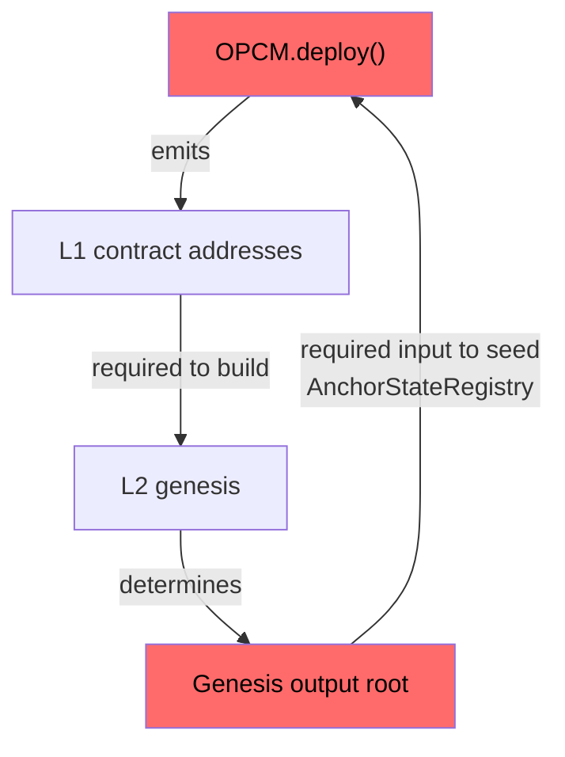
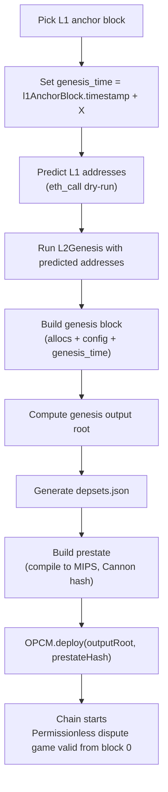
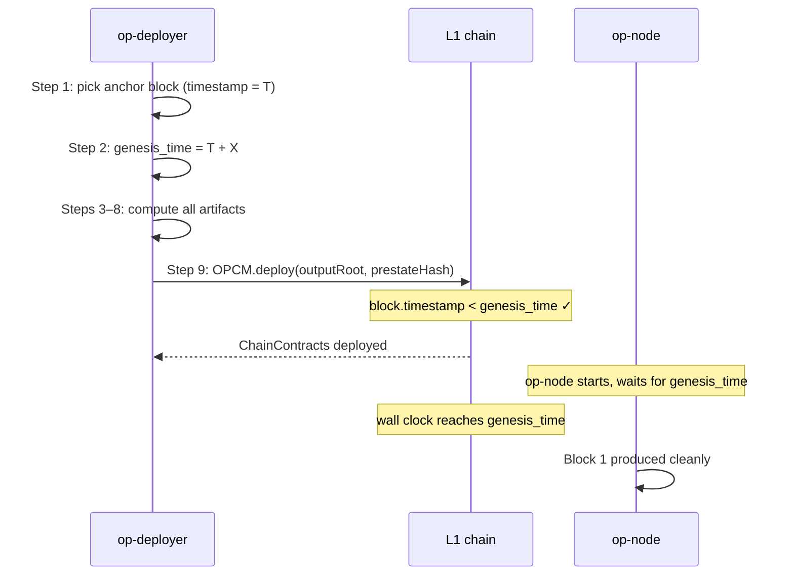
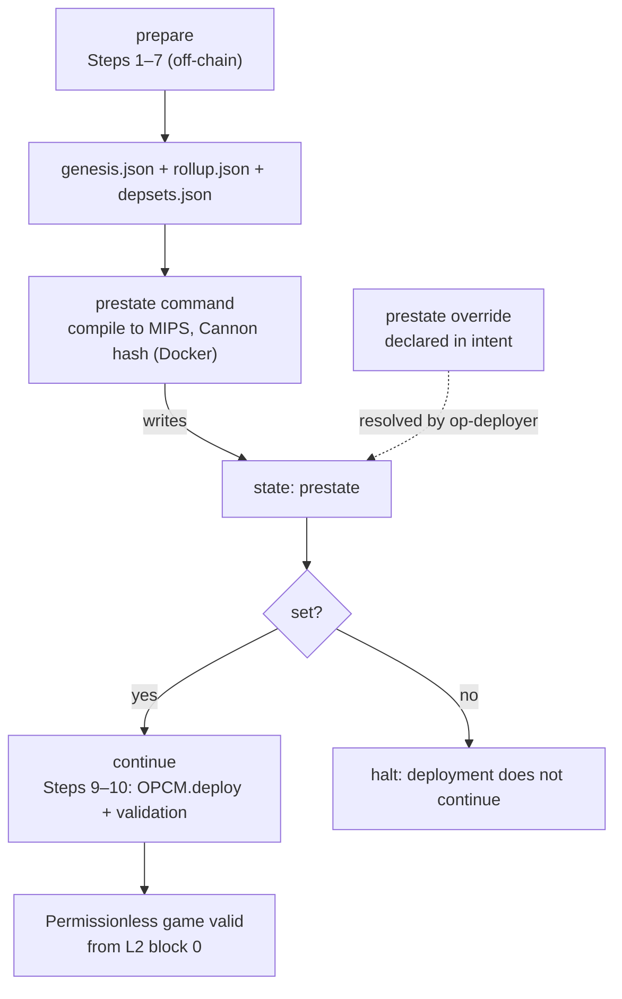

# Breaking the Cyclic Dependency

|                    |                                    |
| ------------------ | ---------------------------------- |
| Author             | _Author Name_                      |
| Created at         | _YYYY-MM-DD_                       |
| Initial Reviewers  | _Reviewer Name 1, Reviewer Name 2_ |
| Need Approval From | _Reviewer Name_                    |
| Status             | _Draft_                            |

## Purpose

Eliminate the ~7-day permissioned window every new OP Stack chain currently incurs before its permissionless dispute game can activate. The window is a deployment tooling artifact, and this document specifies the tooling redesign that removes it.

## Summary

New OP Stack chains today launch under a permissioned dispute game for roughly a week. The deployment pipeline can't seed the L1 dispute system with a real anchor at deploy time, because the L2 genesis depends on L1 contract addresses and the L1 dispute system needs the resulting output root, and today's tooling can't satisfy both at once. It ships placeholder values and defers permissionless proofs until a real dispute resolves a week later.

This design closes the gap by deriving everything off-chain before any transaction lands. `op-deployer` predicts the L1 contract addresses, builds the L2 genesis state and its output root, obtains the prestate hash, and finally submits `OPCM.deploy()` with the real values. The dispute system is seeded atomically with L1 contract deployment, and the permissionless game is valid from L2 block 0.

## Problem Statement + Context

Launching a new OP Stack chain forces a hard ordering: deploy L1 contracts first, then generate the L2 genesis using the addresses those contracts land at.

The L2 genesis embeds L1 contract addresses directly into the chain's starting state. Those addresses are only known after OPCM runs, so the genesis cannot exist before the L1 deployment. And because the genesis is unknown at deploy time, `AnchorStateRegistry` cannot be seeded with a valid output root.

Every new chain spends its first `~7 days` in a permissioned state. The permissionless dispute game cannot activate until `AnchorStateRegistry` holds a valid anchor state, and that requires a real output root to be finalized. Under the dispute game's finality delay, that takes about a week.

This is a sequencing problem in the deployment tooling, not a protocol constraint.

### The Cyclic Dependency

`op-deployer` runs two sequential stages. First it calls OPCM on L1 to deploy all L1 contracts. Then it runs `L2Genesis.s.sol`, passing the newly-known L1 addresses as inputs to configure the L2 predeploys.

The genesis output root cannot be computed until the genesis exists. The genesis cannot be produced until the L1 contracts exist. OPCM cannot seed `AnchorStateRegistry` until it has the output root. This mutual dependency is what we call the **cyclic dependency problem**.



Today's tooling resolves the cycle by deferring the L1 commitments: hardcoded `startingAnchorRoot = 0xdead`, only `PERMISSIONED_CANNON` enabled, and retrofit later.

**Out of scope for this milestone**

- **Shared super dispute game deployments**: Since chains can be deployed today even into a shared dependency set while keeping separate per-chain dispute games.

## Proposed Solution

The pipeline shifts from "deploy first, derive everything after" to "derive everything off-chain, then submit a fully-specified deploy". This is possible since the current deployment can be predicted given the configs and constants, so that it is possible to known everything beforehand and get a predictable behavior during the deployment.

### High-level flow

The proposed flow will be as follows:

1. Pick the L1 block as the anchor reference.
2. Set the L2 genesis timestamp to the anchor's timestamp plus a configurable offset `X`.
3. Predict the L1 contract addresses by running an `eth_call` dry-run of `OPCM.deploy()`.
4. Run `L2Genesis.s.sol` with the predicted addresses to produce the chain-specific L2 allocs.
5. Build the genesis block from the allocs, chain config, and genesis timestamp.
6. Compute the L2 genesis output root from the genesis block.
7. Generating `depsets.json`. For non-interop chains this contains only the chain itself.
8. Build the prestate: `op-program` or `kona` compiles to MIPS with the chain config embedded, and Cannon hashes the initial machine state to produce the prestate hash.
9. Submit `OPCM.deploy()` carrying the real `startingAnchorRoot` and `absolutePrestate`.
10. Chain starts. The permissionless dispute game is valid from block 0.



The numbered steps below detail each stage.

### Step 1: Picking the L1 Anchor Block

The L1 anchor block is the L2 chain's immutable reference point on L1. The artifacts `rollup.json`, the prestate, and the L2 genesis block header all depend on it. The anchor records the `hash`, `number`, and `timestamp`.

Picking a block that later gets reorged out invalidates `rollup.json` and the prestate, requiring a full redeployment. Only blocks at the `safe` tag or deeper are eligible. `op-deployer` can pick a block e.g., the latest safe block at the time `deploy` is executed. Safe blocks take one epoch (~6 minutes) to finalize on L1, so the anchor will trail the wall clock by that margin. In this case, a drift of a few minutes is acceptable.

**Reorg Safety**

The anchor's hash is baked into `rollup.json`, which is used to generate the prestate at build time. If Ethereum reorgs past the anchor after deployment, the chain will be unable to start.

### Step 2: Setting the Genesis Timestamp

The genesis timestamp is a direct input to two artifacts:

- The **genesis block header**, which determines the genesis block hash.
- The genesis time in the `rollup.json` file, which the fault proof program reads at compile time.
- The **genesis output root**, derived from the genesis block hash.

Through these, it transitively determines the genesis block hash, the genesis output root (which includes the block hash), and the prestate hash (which embeds `rollup.json`). A different timestamp produces a different value for every downstream artifact.

```
genesis_time = l1AnchorBlock.timestamp + X
```

X is a value the operator **commits** to during the deployment. Everything else follows deterministically from the anchor block and X.

#### The deployment window

Between fixing `genesis_time` (Step 2) and `OPCM.deploy()` being mined (Step 9), wall-clock time elapses while Steps 3–8 run. The dominant cost is the Docker-based prestate build (Step 8, minutes). The correctness of the deployment depends on `genesis_time` being in the future when `OPCM.deploy()` is mined.



**Nominal case (`genesis_time` still in the future when `OPCM.deploy()` is mined):**

- `AnchorStateRegistry` contract is seeded with the correct genesis output root.
- `op-node` starts but does not produce blocks until wall clock reaches the genesis time.
- Block 1 is produced cleanly at the `genesis_time + L2BlockTime`.
- Portal deposits made between `OPCM.deploy()` and the genesis time are included in the first L2 blocks via normal derivation.

**Overrun case (`genesis_time` has already passed when `OPCM.deploy()` is mined):**

- The deployment succeeds. There is no on-chain guard against this.
- `op-node` sees it is behind and fills the gap with empty blocks at `L2BlockTime` intervals.
- A 10-minute overrun produces ~300 empty blocks before any user transaction can land.

#### Choosing X

`X` must cover:

1. Anchor-block staleness when `op-deployer` reads it.
2. Full runtime of steps 3-8.
3. L1 inclusion latency for the `OPCM.deploy()` transaction.

The Docker-based prestate build in step 8 is the bottleneck. The default X should be set conservatively above the typical build time. Operators running faster build infrastructure can lower it via the override flag; operators on slower hardware should raise it.

### Step 3: Predicting L1 Addresses

`L2Genesis.s.sol` consumes three L1 proxy addresses: `L1CrossDomainMessenger`, `L1StandardBridge`, and `L1ERC721Bridge`. Those contracts don't exist yet when the genesis is built, so their addresses must be predicted before any deployment transaction is sent.

Meanwhile, `OptimismPortal` and `SystemConfig` are also predicted to be written into `rollup.json`.

#### `eth_call` dry-run

Call `OPCM.deploy()` with the full `FullConfig` without broadcasting the transaction. The EVM executes against current L1 state and returns the `ChainContracts` struct containing all proxy addresses, without writing anything on-chain.

```solidity
// Represents the full configuration of a
// chain deployment in the OPContractsManagerV2
struct FullConfig {
	// Deployment
	string saltMixer;
	ISuperchainConfig superchainConfig;
	// Roles
	address proxyAdminOwner;
	address systemConfigOwner;
	address unsafeBlockSigner;
	address batcher;
	// Anchor state (seeded with genesis output root)
	Proposal startingAnchorRoot;
	GameType startingRespectedGameType;
	// L2 config
	uint32 basefeeScalar;
	uint32 blobBasefeeScalar;
	uint64 gasLimit;
	uint256 l2ChainId;
	IResourceMetering.ResourceConfig resourceConfig;
	// Dispute games
	IOPContractsManagerUtils.DisputeGameConfig[] disputeGameConfigs;
	bool useCustomGasToken;
}
```

The dry-run must be sent `from` the same address that will broadcast the real `OPCM.deploy()` transaction. OPCM mixes `msg.sender` into the CREATE2 salt for every proxy deployment. A dry-run from a different address produces different predicted addresses, and the genesis built from them will be invalid.

### Step 4: Generating L2 Allocs

The `L2Genesis.s.sol` produces the L2 genesis state with the set of accounts, code and storage. This generates the `stateRoot`.

### Step 5: Building the Genesis Block

The genesis block is L2 block 0. Its header fields are sourced as follows:

| **Field**                                                                                  | **Source**                                                                                 |
| ------------------------------------------------------------------------------------------ | ------------------------------------------------------------------------------------------ |
| `parentHash`                                                                               | `0x00…00` (no parent)                                                                      |
| `uncleHash`                                                                                | empty list hash                                                                            |
| `coinbase`                                                                                 | `predeploys.SequencerFeeVaultAddr`                                                         |
| `stateRoot`                                                                                | Step 4                                                                                     |
| `transactionsRoot`                                                                         | empty trie root                                                                            |
| `receiptsRoot`                                                                             | empty trie root                                                                            |
| `logsBloom`                                                                                | zeros                                                                                      |
| `difficulty`                                                                               | 0                                                                                          |
| `number`                                                                                   | 0 (`L2GenesisBlockNumber`)                                                                 |
| `gasLimit`                                                                                 | chain config (`L2GenesisBlockGasLimit`)                                                    |
| `gasUsed`                                                                                  | 0 (`L2GenesisBlockGasUsed`)                                                                |
| `timestamp`                                                                                | `genesis_time` from Step 2                                                                 |
| `extraData`                                                                                | Hardfork determined                                                                        |
| `mixHash`                                                                                  | 0 (`L2GenesisBlockMixHash`)                                                                |
| `nonce`                                                                                    | 0 (`L2GenesisBlockNonce`)                                                                  |
| `baseFee`                                                                                  | 1 gwei                                                                                     |
| `withdrawalsRoot`, `blobGasUsed`, `excessBlobGas`, `parentBeaconBlockRoot`, `requestsRoot` | per-hardfork standard genesis values (Empty or zero if hardforks are activated at genesis) |

The block hash is the keccak256 of the RLP-encoded header. Given fixed inputs from earlier stages, it is deterministic.

### Step 6: Computing the Genesis Output Root

`AnchorStateRegistry` stores a `Proposal { root, l2SequenceNumber }` as the chain's starting anchor. Dispute games are played against roots that descend from this anchor. Seeding it with the genesis output root means the permissionless game is valid from block 0.

The output root is computed from the genesis block:

```
outputRoot = keccak256(version || stateRoot || messagePasserStorageRoot || blockHash)
```

`version` is 32 zero bytes (OutputV0). `messagePasserStorageRoot` is the storage root of `L2ToL1MessagePasser` at genesis. `blockHash` is the genesis block hash.

This root is passed as `startingAnchorRoot` to `OPCM.deploy()` at step 9, with `l2SequenceNumber` as 0.

### Step 7: Generating `depset.json`

The dependency set will contain only the chain itself. The `depset.json` file enumerates the chains the proof program needs to know about. Generation is unchanged from the current pipeline: a single-chain depset for standalone deployments, and a multi-chain depset for shared-depset deployments. Note that deploying chains directly into a shared super dispute game is not supported and is out of scope for this milestone.

### Step 8: Prestate Generation

The prestate is the starting point both sides of a dispute agree on. It is the Cannon hash of the initial MIPS machine state produced by compiling `op-program` or `kona` with the chain config baked in.

Because the chain config is embedded at compile time rather than fetched at runtime, the prestate hash is deterministic for a given chain config. Concretely: `rollup.json` contains `l2_time`, which is the genesis timestamp set at step 2.

The resolved prestate hash is written to the state, and the op-deployers reads `absolutePrestate` from there.

`op-deployer` derives that state value two ways, and treats the result identically:

- **Computed.** A dedicated command builds the prestate from the Phase 1 artifacts and writes the hash to the state.
- **From an override.** The operator declares a prestate override in the intent. `op-deployer` resolves it into the state prestate without building, so no build runs inside `op-deployer`.

### Step 9: Wiring into `OPCM.deploy()`

`OPCM.deploy()` already accepts the two fields this design fills in: `startingAnchorRoot` is set to the genesis output root from Step 6 with sequence number 0, and each entry in `disputeGameConfigs` carries its corresponding prestate hash from Step 8 inside `absolutePrestate`.

Three call-site changes are required:

1. In the OP Chain deployment script, the require guard that currently restricts game types to `PERMISSIONED_CANNON` at initial deployment is removed; `CANNON` and `CANNON_KONA` are enabled with their respective prestate hashes read from the prestate field; and the hardcoded `0xdead` placeholder for the starting anchor root is replaced with the computed genesis output root.
2. The Go-side input struct for the OP Chain deployment gains a `StartingAnchorRoot` field and per-game-type prestate-hash fields.
3. op-deployer's chain orchestration code wires those new fields through into the FullConfig passed to OPCM.

### Step 10: Post Deploy verification

Runs after `DeployOPChain` completes. It confirms the deployed chain matches what was computed in earlier pipeline steps.

1. The actual deployed L1 contract addresses match the predicted addresses from Step 3. A mismatch means the L2 genesis was built against the wrong state and the chain is unsafe to operate.
2. `AnchorStateRegistry` is seeded with the genesis output root computed in Step 6. Without this seed, the dispute game has no valid starting point.
3. Guardian and system config addresses are set to the values in the intent. These gate privileged operations and must be confirmed before handing off to the operator.

### Pipeline commands: prepare, prestate, and continue

`op-deployer` splits the flow into three commands around the **prestate boundary**:

1. **`prepare`** runs Steps 1–7: pick the anchor, set `genesis_time`, predict the L1 addresses, run `L2Genesis`, build the genesis block, compute the output root, and emit `genesis.json`, `rollup.json`, and `depsets.json`. Pure off-chain computation, no L1 transaction, no Docker.
2. **`prestate`** computes the prestate hash from `rollup.json`, `genesis.json`, and `depsets.json` and writes it to the state. It is skipped when the intent carries a prestate override, which `op-deployer` resolves into the state instead.
3. **`continue`** runs Steps 9–10: submit `OPCM.deploy()` with `startingAnchorRoot` and the `absolutePrestate` read from the state, then run post-deploy validation.

The prestate and the output root in the state are the hand-off point between the commands and the sole driver of continuation. `continue` reads them and proceeds only if they are set; if they are unset, the deployment halts.

This is what lets a caller without Docker deploy: run `prepare`, have the prestate computed elsewhere, declare it as a prestate override in the intent, then run `continue`. A caller with Docker can run all three commands in sequence.



### Resource Usage

The prestate build moves from a deferred upgrade path to the critical path of every greenfield deployment that intends to use permissionless proofs. On `op-deployer`'s side, the end-to-end deployment time grows by the prestate build duration. There are no changes on node clients.

### Single Point of Failure and Multi Client Considerations

The prestate gates deployment through the state: `continue` does not proceed until the state prestate is set, whether computed by the `prestate` command or resolved from an intent override. The L1 RPC used for the `eth_call` dry-run and for `OPCM.deploy()` is a dependency for the loop to work properly.

The design is client-agnostic and requires no changes on node clients. It is compatible with Cannon and Kona today and with future ZK fault-proof clients.

## Failure Mode Analysis

See [fma.md](./fma.md).

## Backward Compatibility

No on-chain contract logic changes. Existing deployed chains are unaffected. The `op-deployer` pipeline change replaces the previous `startingAnchorRoot = 0xdead` flow; no compatibility layer is provided.

## Impact on Developer Experience

- Operators must set the prestate before deploying, either by running the `prestate` command or by declaring a precomputed prestate override in the intent. This adds to the end-to-end deployment time.
- Permissioness games are possible from block 0, highly useful for all cases: mainnets, testnets and devnets.

## Alternatives Considered

### Standard Allocs + Chain Init Transaction

A previous proposal considered breaking the cyclic dependency by making L2 genesis allocs chain-agnostic, and injecting chain-specific data via a `chainInitTx` system transaction. However, it was rejected since it requires `op-node`, `op-program` and `kona` changes without actually providing real value since that did not avoid per-chain prestate.

## Risks & Uncertainties

### Open Questions

- **Default X**: what is the right default offset between the anchor block timestamp and `genesis_time`? Needs benchmarking of the typical end-to-end pipeline runtime, including the prestate build.
- **Re-run idempotency spec**: the exact skip conditions for `PredictL1Addresses`, `ComputeGenesisOutputRoot`, and the updated `GeneratePreState` need to be formally defined.
- **Permissioned Games**: Should this still be supported?
- **Docker-free callers**: the prepare/prestate/continue split lets an orchestrator without Docker run `prepare`, declare a prestate override in the intent, and run `continue`. Integration specifics for such callers are tracked separately.

---

## Glossary

**Output root**

A 32-byte commitment to the L2 state at a specific block, computed as:

```jsx
keccak256(version || stateRoot || messagePasserStorageRoot || blockHash);
```

`version` is 32 zero bytes. `AnchorStateRegistry` stores the genesis output root as the starting anchor. All dispute games trace back to it.

**Prestate / prestate hash**

The agreed starting point for a fault proof dispute. It is the Cannon hash of the initial MIPS machine state produced by compiling `op-program` (Go) or `kona` (Rust) with the chain config baked in. Because the chain config is embedded at compile time, the prestate hash is deterministic for a given chain config. Both the challenger and defender must agree on this hash before a dispute can proceed.

**Genesis block**

L2 block 0. It has no parent (`parentHash = 0x00...00`) and contains no transactions. Its header fields are derived from the L2 allocs (state root), the chain config, and the genesis timestamp. The block hash is `keccak256(RLP(header))` and feeds directly into the genesis output root.

**Chain config**

The set of parameters that define the chain: hardfork activation blocks or timestamps, genesis block parameters (gas limit, base fee), and the L1 anchor block reference. Stored across `rollup.json` and `genesis.json`. The fault proof program reads `rollup.json` at compile time, which is why a different genesis timestamp produces a different prestate hash.

**L2 allocs**

The initial account and storage layout of the L2 chain, produced by running `L2Genesis.s.sol` with the L1 contract addresses as inputs. It defines which predeploy contracts exist at genesis, their bytecode, and their starting storage. The Merkle root of this layout becomes the `stateRoot` field of the genesis block header.
