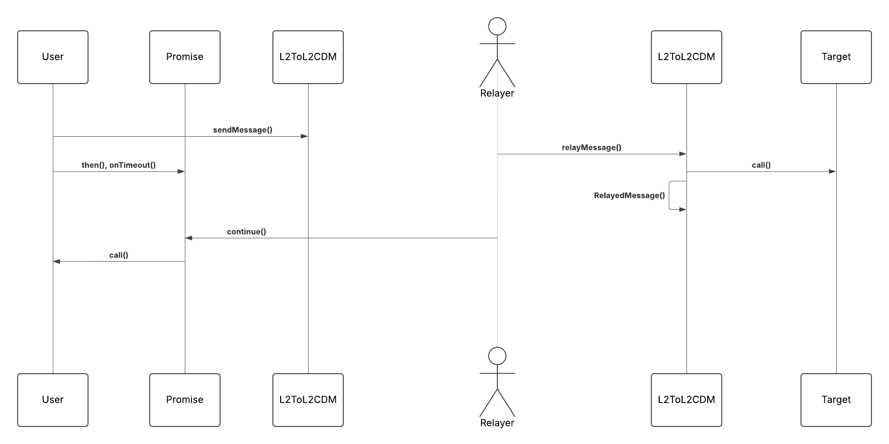
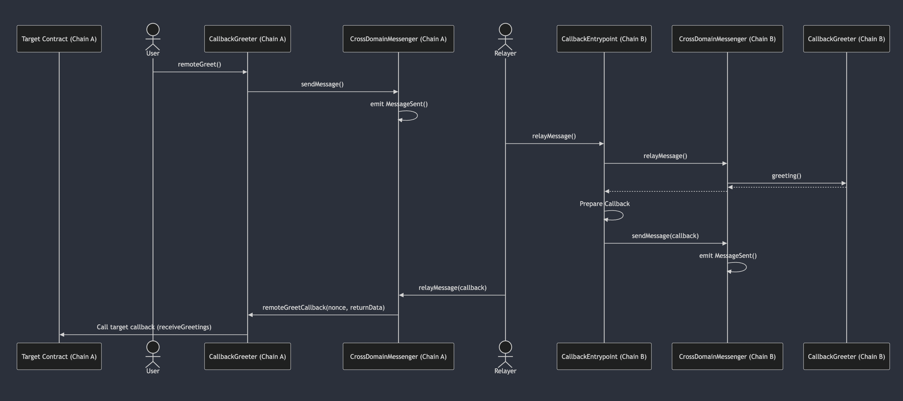

# Purpose

Superchain interop enables async programming at the smart contract level. Onchain state will increasingly become more fragmented as we horizontally scale. Thus accessing remote state as easy and familiar as possible for devs.

## Goals

- Provide a canonical way to query the remote state of any contract
- Avoid extra contract deployments to faciliate remote queries

## Non-Goals

- Handle dependencies between different cross chain messages.

# Problem Statement + Context

In solidity, if we wanted to query the `balanceOf` function of an ERC20 that lives on a different chain, gateway contracts would have to deployed that could ping-pong the return value back the a handler on the sending chain.

```solidity
contract ERC20BalanceGateway {
    L2ToL2CrossDomainMessenger messenger;

    // Gateway contract that can be used to query ERC20s with a specified handler
    function query(IERC20 token, address account, bytes4 selector) external {
        uint256 balance = token.balanceOf(account);

        // Message sent back with the value as an encoded argument
        (address sender, uint256 source) = messenger.crossDomainMessageContext();
        messenger.sendMessage(source, sender, abi.encode(selector, balance));
    }
}
```

Contracts like the above gateway would have to be created and deployed on every target chain while covering all uses cases for contract reads.

- Deployment overhead for the Gateway. N+1 contract addresses as these kinds of contracts are created.

# Proposed Solution

When a message is relayed the `L2ToL2CrossDomainMessenger` emits:

`RelayedMessage(uint256 indexed source, uint256 indexed messageNonce, bytes32 indexed messageHash);`

By including the return data of the target call, this event itself can be used to continue any attached continuations on the source without a message sent back or additional data propogated from the sending chain.

```solidity
contract L2ToL2CrossDomainMessenger {
    function relayMessage(Identifier calldata _id, bytes calldata _sentMessage) {
        // include return data
        (, returnData_) = target.call{ value: msg.value }(message);
        emit RelayedMessage(source, nonce, messageHash, returnData_);
    }
}
```

The returned `messageHash` which identifies a sent messages can be behave like a Promise that the caller can attach continuations to. All state
related to the callback is managed on the sending chain and works with any remote target.

```solidity
library Promise {
    struct Callback {
        address target;
        bytes4 selector;
        bytes context;
    }

    mapping(bytes32 => Callback[]) callbacks;

    /// @notice attach a continuation dependent only on the return value of the remote message
    function then(bytes32 _msgHash, bytes4 _selector) external {
        callbacks[_msgHash].push(Callback({ target: msg.sender, selector: _selector, context: ""}))
        emit CallbackRegistered(_msgHash);
    }

    /// @notice attach a continuation dependent on the return value and some additional saved context
    function then(bytes32 _msgHash, bytes4 _selector, bytes memory _context) external {
        callbacks[_msgHash].push(Callback({ target: msg.sender, selector: _selector, context: _context}))
        emit CallbackRegistered(_msgHash);
    }
}
```

The updated `RelayedMessage` event can be used to invoke these continuations by a relayer.

```solidity
library Promise {

    /// @notice invoke continuations present on the completion of a remote message
    function continue(Identifier calldata _id, bytes calldata payload) external payable {
        if (_id.origin != Predeploys.L2_TO_L2_CROSS_DOMAIN_MESSENGER) revert InvalidOrigin();
        ICrossL2Inbox(Predeploys.CROSS_L2_INBOX).validateMessage(_id, keccak256(_payload));

        bytes32 eventSel = abi.decode(_payload[:32], (bytes32));
        if (eventSel != IL2ToL2CrossDomainMessenger.RelayedMessage.selector) revert InvalidEvent();

        (,, bytes32 msgHash, bytes memory returnData) = abi.decode(_payload[32:], (uint256, uint256, bytes32, bytes));

        for (uint256 i = 0; i < callbacks[msgHash].length; i++) {
            Callback memory callback = callbacks[msgHash];
            bytes memory data = callback.context.length > 0 ?
                abi.encode(callback.selector, returnData, callback.context) :
                abi.encode(callback.selector, returnData);

            (completed,) = target.call(data);
            require(completed)
        }

        delete callbacks[msgHash];
        emit CallbacksCompleted(msgHash);
    }
}
```



## Notes

- Requires no fundamental contract API changes to the CDM besides the event.
- Different kinds of callbacks can be introduced on the source, all without change to the destination. `onFailure`, `onTimeout`, etc. The log identifier for the event has timestamp information. Currently the `L2ToL2CrossDomainMessenger` does not allow for failed message delivery but if it did, failure callbacks could be created as well.
- Multiple callbacks can be registered to the same message. `then()` and `onTimeout()`.
- Relayers must listen to `CallbackRegistered` events to know when which messages have pending continuations. The tradeoff being additional touch-points for relayers to hook into. In the alternative, if a message was to be sent back from the destination, it would be almost be a no-op in relayer infra since the message outbox would look the same.

# Alternatives Considered

## Callback Entrypoint

Implementation [draft](https://github.com/defi-wonderland/optimism/pull/162/) that leverages Entrypoints -- [design doc](https://github.com/ethereum-optimism/design-docs/pull/163).

A new entrypoint contract is created, `CallbackEntrypoint` that expects callback information to be propogated with the message to the destination. When relaying, the entrypoint contract parses the callback information and sends a message back to the source invoking the callback with the return data of the relay.



## Notes

- Tight coupling between the source & destination chains. Callback information must be propogated between networks
- Multiple callbacks cant clearly be registered. Must be enshrined in the propogated callback data.
- Single interface for relayers `relayMessage`.
- The proposed solution could be implemented via a generic entrypoint to avoid adding the return data to the event. However this feels like more complexity from a code & call path perspective. Propogate callback -> parse callback -> relay -> capture return and sendMessage(). Versus -- RelayedMessage() -> continue().

# Risks & Uncertainties

By adding the return data to the event, there's some additional gas used. Since there's no other API changes to the messenger, this is a low-risk change. If desired, the additonal field can be deprecated and replaced with empty bytes.
