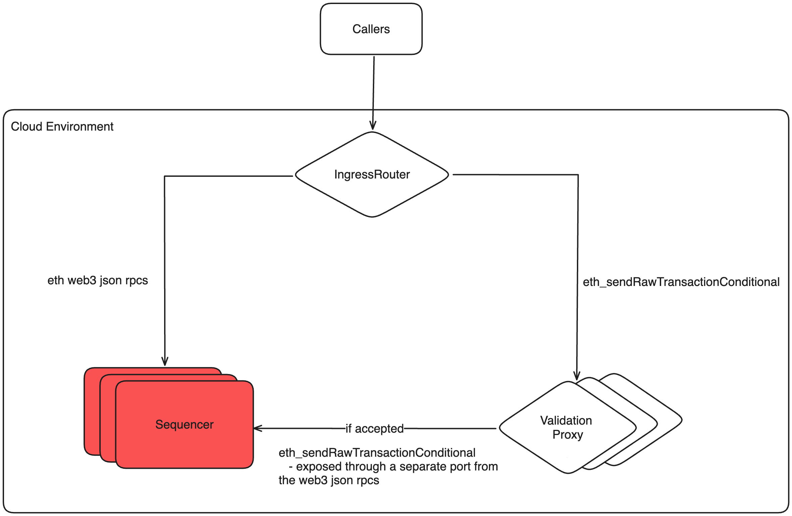

# Purpose

To fully unlock ERC-4337 on the OP-Stack.

# Summary

By providing an auxiliary transaction submission mechanism, [eth_sendRawTransactionConditional](https://notes.ethereum.org/@yoav/SkaX2lS9j), we can enable Bundlers to submit [Entrypoint](https://eips.ethereum.org/EIPS/eip-4337#entrypoint-definition) transactions with stronger guarantees, avoiding costly inadvertent reverts. The endpoint is an extension to `eth_sendRawTransaction` with the added ability to attach a conditional. The conditional are a set of options that specify requirements for inclusion, otherwise rejected out of protocol.

We can implement this endpoint in op-geth with an additional layer of external validation to ensure this endpoint is safe from DoS, does not supersede `eth_sendRawTransaction`, and can be deprecated if native account abstraction efforts in the future absolves the need for this endpoint.

**Note:** As a result of [EIP-3074](https://eips.ethereum.org/EIPS/eip-3074), the interop project is also exploring external validation as a mechanism to preventing DoS. A low-stakes scoped version of this for `eth_sendRawTransactionConditional` is a good starting point and opportunity for learning.

# Problem Statement + Context

Account Abstraction is a [growing ecosystem](https://dune.com/sixdegree/account-abstraction-overview) and solution to many wallet UX issues. Polygon currently dominates the market on the number of active smart accounts and we want to ensure the op-stack enables this growth in the superchain as the ecosystem continues to evolve.

Bundlers aggregate [UserOp](https://eips.ethereum.org/EIPS/eip-4337#useroperation)s from an external mempool into a single transaction sent to the enshrined 4337 [Entrypoint](https://eips.ethereum.org/EIPS/eip-4337#entrypoint-definition) contract. It is the Bundler responsibility to ensure every UserOp can successfully execute its validation step, otherwise resulting in a reverted top-level transaction. With private Bundler mempools, the likelihood of these reverts are small as Bundlers are operating over different sets of UserOps. Unless a smart account frontruns a submitted UserOp to the Entrypoint, a Bundler doesn't have to worry about changes in network state such as an incremented smart account nonce invalidating their entire transaction during the building process.

The account abstraction [roadmap](https://notes.ethereum.org/@yoav/AA-roadmap-May-2024) is chugging along and shared 4337 mempools are coming into [production](https://medium.com/etherspot/decentralized-future-erc-4337-shared-mempool-launches-on-ethereum-b6c860072f41), launched on Ethereum and some L2 testnets, decentralizing 4337 infrastructure. Multiple Bundlers operating on this mempool can create transactions including the same UserOp, increasing the likelihood of reverts due to changed account states, like account nonces. These reverts are too high of a cost for bundlers to operate.

This problem is worked around on L1 through special block builders like Flashbots that provide atomic inclusion when building blocks through a custom rpc like [eth_sendBundle](https://docs.flashbots.net/flashbots-auction/advanced/rpc-endpoint#eth_sendbundle), avoiding on-chain reverts for the caller. However on L2 there's only a single block builder, the sequencer, creating the requirement for the `eth_sendRawTransactionConditional` endpoint providing similar inclusion guarantees to launch shared 4337 mempools.

# Alternatives Considered

## Do Nothing

4337 account abstraction is currently live on optimism. Dapps utilize the bundler endpoints that are come with a vendor-specific SDK -- Alchemy, Pimilico, Thirdweb, etc -- each with their own mempools. As 4337 infrastructure becomes more permissionless, we will later have to play catch-up to ensure the op-stack remains compatible while other L2 offerings have already moved towards supporting `eth_sendRawTransactionConditional`.

## Verticalize the OP-Stack

Rather than externalize the 4337 mempool, the op-stack could natively offer a UserOp mempool alongside the regular tx mempool. When creating a new block, the sequencer can pull from the two, ensuring the bundled UserOps do not conflict with the latest network state. However, this adds additional complexity to the stack, where the proposer-builder seperation in 4337 nicely keeps these concerns seperate.

Verticalization is possible in the proposed solution by configuring the allowlist of the authenticated `eth_sendRawTransactionConditional` endpoint to either a self-managed bundler or that of a partner, achieving the same outcome as native mempool without the complexity of a deeper change in the op-stack.

# Proposed Solution

1. Implement `eth_sendRawTransactionConditional` in op-geth with support for the conditionals described in the [spec](https://notes.ethereum.org/@yoav/SkaX2lS9j), for which a draft implementation [exists](https://github.com/ethereum/go-ethereum/compare/master...tynes:go-ethereum:eip4337) but requires a refresh. The conditional attached to the transaction is checked against the latest unsafe head the prior to mempool submisison and re-checked when included in the block being built.

    * There exists implementations for [Arbitrum](https://github.com/OffchainLabs/go-ethereum/blob/da4c975e354648c7be814ab9667b42f1c19cdc0f/arbitrum/conditionaltx.go#L25) and [Polygon](https://github.com/maticnetwork/bor/blob/b8ad00095a9e3e508517d802c5358a5ce3e81ed3/internal/ethapi/bor_api.go#L70) conforming to the [spec](https://notes.ethereum.org/@yoav/SkaX2lS9j). On Polygon, the API is authenticated under the` bor` namespace but public on Arbitrum under the `eth` namespace.

    * This endpoint will be exposed on a separate port from the execution engine RPCs. The rationale is to be explicit on how custom sequencer rpcs are accessed publicly.

    * To remove the incentive of using this endpoint for MEV, adopt the protective strategy implemented by Arbitrum. The conditional will also be applied on the previous block in addition to HEAD, introducing a time delay, making it worse than `sendRawTransaction` for MEV opportunities.

2. Implement external validation rules. These rules are not enshrined in the node software's implementation of `eth_sendRawTransactionConditional`, instead scoped a layer higher, a validating proxy that's horizontally scalable.

    * **Only 4337 Entrypoint Contract Support**: `tx.to() == entrypoint_contract_address`

        The rationale is to make it easier to rollback if deprecated in the future due to native account abstraction or better solutions. Otherwise new uses case might create unwanted dependencies on this endpoint.

        There does exist different [versions](https://github.com/eth-infinitism/account-abstraction/releases) of the Entrypoint contract as the 4337 spec is iterated on. We'll need to stay up to date with these version as a part of op-stack [preinstalls](https://docs.optimism.io/builders/chain-operators/features/preinstalls) and pass through calls to all the supported versions of `EntryPoint`.

    * **Authentication**: Allowlist Policy

        Requests to this endpoint MUST be authenticated with a secp256K1 keypair, similar to [flashbots authentication](https://docs.flashbots.net/flashbots-auction/advanced/rpc-endpoint#authentication). The [EIP-191](https://eips.ethereum.org/EIPS/eip-191) hash of the json-rpc payload must be signed and included in the the `X-Optimism-Signature` header of the request in a `<public key adddress>:<signature>` format.

        With the public key of the caller, we can implement an allowlist policy module, allowing the chain operator to verticalize by running their own bundler or delegating to partners. This allowlist module does NOT have to be enabled for permissionless bundler participation.

    * **Runtime Shutoff**

        Through an admin endpoint or environment variable in the proxy, all calls can be rejected without reaching the sequencer. When rejecting, the json-rpc request will return an error with the code -32000 and "unavailable" message. Bundlers should be setup to observe this error state and fallback to `sendRawTransaction` until further communication.

        As long as a single bundler supports a fallback to `eth_sendRawTransaction`, shared-mempool 4337 liveness should remain OK

    * **Global Rate Limit**

        Rate limit how many conditional txs can be sent over a configured time period. Like with the runtime shutoff, if the validation proxy is horizontally scaled, the design space for this rate limit should be explored -- i.e globally synchronized rate limit vs per-host limits.

        When this rate limit is reached, the proxy should set the response HTTP status code to 429 (Too Many Requests), as an indicator for the caller.

With the validation proxy described in (2) and the `sendRawTransactionConditional` op-geth endpoint described in (1), the cloud architecture for how this setup works should look like the following diagram. An operator that wishes to expose the endpoint publicly without the validating proxy in front can simply route the method directly to the sequencer from the ingress router.

With this initial set of validation rules, we should be in a good position to safely launch this endpoint permissionlessly. Instrumentation is critical to surface further action -- key metrics to track:

* **conditional requests / s (by caller)**: understanding of overall usage and alert setup with the configured rate limits. The breakdown of requests by caller will help identify single-use authentication keys and the general activity of different bundlers

* **conditional submission success rate % (by caller)**: understanding of requests failing the initial conditional check. Elevated rates will indicate that a caller is not doing sufficient simulation with the latest unsafe head prior to submission. This metric will help understand if localized rules should be applied.

* **conditional inclusion success rate %**: understanding of conditional transactions frontrunned in the mempool. In combination with mempool latencies, lowered rates will signal actionable next steps, such as enforcing a higher minimum fee.

* **conditional mempool latency**: understanding of how long conditional transactions are sitting in the mempool. We would expect failed inclusion the longer a conditional tx remains in the mempool due to state changes since submission.  Elevated latencies in combination with a low inclusion success rate will indicate if the proxy should be enforcing a higher minimum fee for these transactions to minimize mempool time.

The public keys of known bundlers should be collected and registered. With alerts setup on the metrics above, when in a state of degradation, the allowlist policy should first be enabled to avoid 4337 downtime while assessing next steps. If still in a degradaded state, the endpoint should then be fully shutoff, having bundlers revert to `sendRawTransaction` until further iteration. Both of these actions should occur in tandem with public comms.

Additional validation rules can be applied to boost performance of this endpoint. Here are a some extra applicable validation rules:

* **Elevated minimum fee**

    The longer a conditional transaction is in the mempool, the more likely it is to fail when included in a block due to state changes since submission. To minimize this latency, we may want to monitor the base fee of the network and add a premium for conditional transactions in order to minimize the time spent the mempool.

* **Local Rate Limiting**

    Adopt flashbots-style [reputation](https://docs.flashbots.net/flashbots-auction/advanced/reputation) score that's computed based on the success rate of conditional txs. Designed to filter out inefficient callers and promote honest ones.

* **Optimized State Lookups**

    Verifying the conditional associated with the transaction requires state access, for which the sequencer is not compensated when the transaction is rejected. To minimize resource usage, these checks could also be applied by the validating proxy prior to the sequencer mempool. This could then leverage an optimized state store through solutions like [revm](https://github.com/bluealloy/revm) to reject failed conditionals both cheaper and faster.

# Risks & Uncertainties

**Risk 1: Private 4337 mempools remain the status quo.** Bundlers can still suffer from reverts and have a strong desire for an endpoint like `eth_sendRawTransactionConditional`. Even without shared 4337 mempools, this endpoint adds value bundlers. In our proposed solution, we can allowlist these bundlers and hold them to an SLA. It also provides the opportunity for chain operators to verticalize their 4337 offering through the same allowlist functionality.

**Risk 2: Implemented validation isn't enough for permissionless bundler participation.** The listed validation rules are a starting point and there's room for exploration in horizontally scalable validation. However we can fallback to a permissioned allowlist for this endpoint which still enables 4337 shared mempools and likely makes no difference to dapp developers which already use a small subset of known infra providers.

**Risk 3: Generalized External Validation.** Validation policies should be DRY'd between interop, eth_sendRawTransactionConditional, and any future use cases. These policies that are implementated should work well between these usecases as this approach is adopted and scales. The tech-debt here can grow quickly if each solution has it's own methods of preventing DoS and validation, especially operationally.

**Risk 4: Excessive Compute/Operational Requirements**. This endpoint is a feature provided out of protocol by the block builder -- the sequencer. With failed conditional transactions, the sequencer is not compensated with charged gas like when processing a reverted transaction, nor for the addtional checks of successful conditional transactions. There's also the added overhead of managing new services to mitigate DoS and increases the surface area where manual intervention will be required. The uncompensated compute or inability to effectively mitigate DoS may be a reason to rollback this feature.
