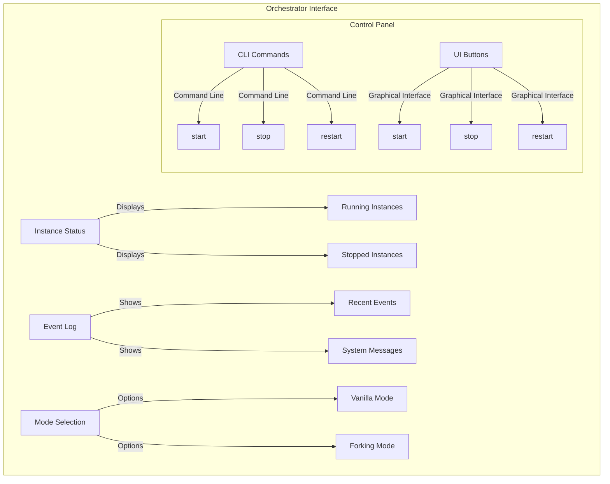
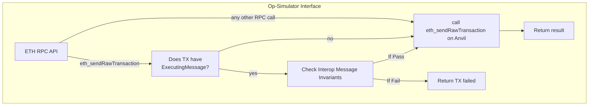
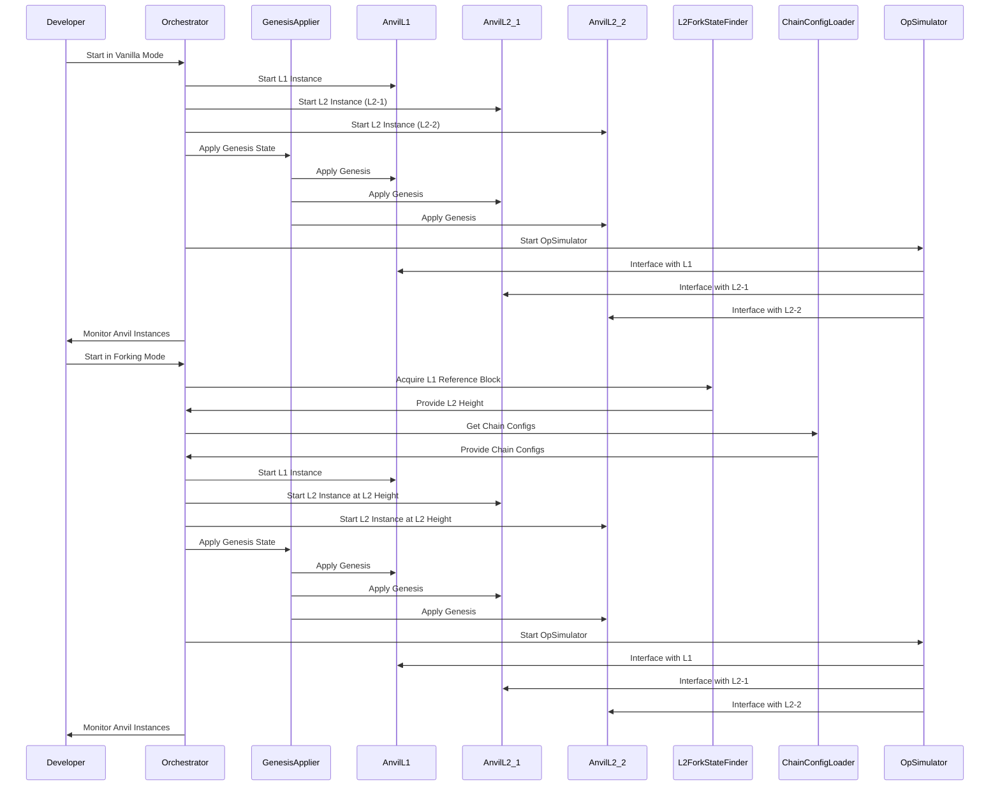
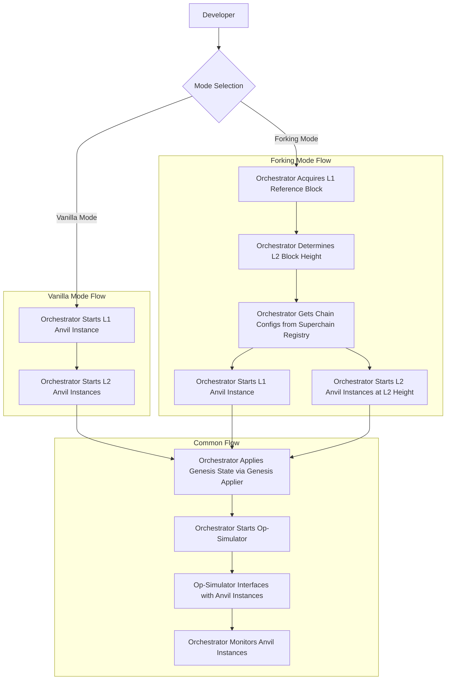

# Purpose

The purpose of this document is to introduce the rationale and proposed design for `supersim`, a local multichain development environment. 

# Problem Statement + Context

As the Superchain becomes interoperable, applications will need to be tested against multiple chains in the Superchain simultaneously. While Anvil enables a single chain local environment, `supersim` enables developers to use their favorite tools (like Anvil) in a multi-chain local environment.

Interop will usher in a paradigm shift in the way that developers build and deploy their applications, and a way to test their work locally is foundational to their success and thus the success of interop. 


# High-Level Overview

Supersim will allow developers to start multiple local Layer 2 chains with one command, and it will simulate the experience of interop via a command line interface. 

# Proposed Solution

Supersim will be a lightweight tool that simulates an interoperable Superchain environment locally. It will not require a complicated devnet setup and will be run using cli commands with configuration options that fall back to sensible defaults if they are not specified. Predefined state can be passed in at startup or the state can be forked based on specified block height.

From a developer perspective, supersim will offer a command line interface through which to easily start up multiple local testnets that can be used interoperably via the [Optimism Interop Protocol](https://github.com/ethereum-optimism/specs/tree/main/specs/interop). 

## Usage

```bash
// brings up two vanilla op chains with each other in the dep set with the same L1 chain

supersim
```

```bash
// brings up all forked chains in the superchain registry, if l1BlockHeight is not specified, uses the latest safe head

supersim --superchain --l1BlockHeight=423012

// can also specify a subset of members in the superchain

supersim --superchain --networks=base,op-mainnet
```

config.toml(optional)

```yaml
[[networks]]
forkRpcUrl = "https://sepolia.optimism.io"
chainId = 420
port = 8645
dependencySet = []

[[networks]]
chainId = 99999
port = 8646
```

## Architecture

The **orchestrator** is responsible for spinning up the requested number of **anvil instances** and also for spinning up the **op-simulator**. It is also responsible for the interface between the **anvil instances** and the **op-simulator**.

### Application Flow

The flow of this tool will differ depending on whether the user opts for **vanilla** mode or **forking** mode.

1. **Vanilla mode**: 
    a. Orchestrator has preset chain configs and starts chains anew.
    b. Orchestrator applies genesis state via the genesis-applier.
    c. Orchestrator starts op-simulator and offers an interface between anvil instances and op-simulator.
    d. Orchestrator monitors status of running local anvil instances.
2. **Forking mode**: 
    a. Orchestrator acquires L1 reference block to get the latest L2 height for forking using l2-fork-state-finder. 
    b. Orchestrator gets appropriate chain configs from the superchain registry using the chain-config-loader.
    c. Orchestrator starts the requested chains at determined L2 block height.
    d. Orchestrator applies genesis to each chain using the genesis-applier.
    e. Orchestrator starts op-simulator and offers interface between anvil instances and op-simulator.
    f. Orchestrator monitors status of running local anvil instances.
    

### Interfaces

1. **Orchestrator** interface provides the following to the developer: 
    a. Instance status
    b. Event log
    c. Mode selection
    d. Control panel (in cli? Some ui option? both?): buttons/commands to start/stop/restart individual instances
    e. Genesis state interface: could be a long term goal to give devs more control over what they do here. Would offer an interface for applying and managing genesis states: 
        i. File upload: upload genesis files
        ii. Genesis history: list of applied genesis states with timestamps/details
        iii. Apply button/command: apply the selected genesis state to the chosen instances.
    f. Configuration loader: interface for loading and managing chain configurations from the chain-config-loader. 
        i. Config list: display available configurations from the registry
        ii. Download button/command for the selected configuration
        iii. Apply button/command
        iv. Configuration details: show detailed information about the selected configuration

2. **Op-simulator** interface checks instance status as served by orchestrator interface and listens for RPC calls that require op-simulator intervention. The purpose of this interface is to intercept RPC calls that should go to the interface rather than to anvil instances directly. This is essentially a proxy between the app's RPC calls and the op-simulator. 





### Services

Given the application flow, the following services will be part of supersim: 

1. **Orchestrator**: This is the main focus and interface for developers using supersim. 
    a. Runs all of the other services in supersim and manages their lifecycle. 
    b. Provides an interface to the user
        i. Initially a static interface.
        ii. Medium-term, offer an API interface that the orchestrator exposes to make it easier to build new offchain services that hook into the runtime.
2. **Anvil Instances**: Anvil instances are run by the orchestrator after initial prep work to allow them to mirror the Superchain interop environment.
    a. Should be run in `--optimism` mode so the extra fields in transactions are there.
    b. Orchestrator should also run an L1 instance, though L1 withdrawals won’t initially be supported.
    c. Eventually supersim can be extended to be used with HardHat and other local simulation tools as well.
3. **Genesis-applier** : The `genesis-applier` takes genesis files output by the monorepo and applies them to anvil instances.
    a. The genesis files needed will differ depending on whether the user is in vanilla or forked mode, and forked mode is unlikely to need anything other than the interop contracts initially. 
    b. Can be multi-step: multiple genesis files can be applied idempotently, particularly in forking mode (when you fork a network that has bedrock contracts but not interop contracts, for instance).
    c. Genesis-applier should work as a standalone tool: if a developer is using Anvil outside the context of the orchestrator, they should be able to use genesis-applier to apply genesis state to their instance. In the context of supersim, the `orchestrator` will use the `genesis-applier` to apply the needed genesis state to the anvil instances it is running. 
4. **Chain-config-loader**: Downloads the latest chain config from the superchain registry to allow the orchestrator to apply needed configs to anvil instances. Should be a standalone tool that works with the orchestrator but could be used directly on local testing nodes. 
5. **L2-fork-state-finder**: From an L1 reference block, runs an algorithm to identify the latest L2 height derived from the L1 block for each network.
6. **Op-simulator**: Proxy server in front of anvil instances that simulates op-stack services without the real derivation pipeline.
    a. Simulates deposits by listening to the `optimismPortal` and forwarding deposit txs via `eth_sendRawTransaction`.
    b. Implements `eth_sendRawTransaction` and first applies any necessary out-of-protocol validation such as the interop spec variants.
    c. Calls `eth_getLog` on other chains to fetch event logs for invariant checks.
    d. All other rpc calls are proxied by the orchestrator to the anvil instances.
    e. **Withdrawal pathway to Ethereum is not supported** (at least to start)

### Sequence Diagram



### Flow Chart



## Testing

In the interest of working in the open we should apply a TDD approach to development. This means we should start off by writing a foundry test script that includes coverage for all the developer actions we intend to support and use this as our main specification. 

### Test Cases
* `test_environment_initialization`: It should verify that multiple Anvil instances can be started and configured correctly.
* `test_genesis_state`: It should pre-deploy all smart contracts needed for testing interoperable optimism chains, when run in vanilla mode.
* `test_genesis_state_fork`: It should update the genesis state for forked chains to ensure all smart contracts needed for testing interoperability are present.
* `test_cross_chain_message_passing`: It should ensure that messages can be sent and received between different L2 chains running locally. 
    * `test_invariants`: It should check for interop message invariants and fail if they are not met
        * `test_timestamp_invariant`: It should fail if the timestamp at the time of inclusion of the executing message is less than the timestamp of the initiating message.
        * `test_chainID_invariant`: It should fail if the initiating message is not in the dependency set. 
        * `test_message_expiry_invariant`: It should fail if the timestamp at the time of inclusion of the executing message is higher than the initiating message timestamp.
    * `test_message_relaying`: It should ensure that messages can be “sent” and “received” between different L2 instances. 
        * `test_initiating_message`: It should log an event when an initiating message from the source chain is created.
        * `test_destination_receipt`: It should ensure that destination chain can ingest source chain message`.
        * `test_destination_execution`: It should fire an executing message after confirming the source initiating message.
* `test_cross_chain_erc20_asset_transfers`: ensures that erc20’s can be transferred between chains.
    * The exact implementation on this is still TBD (see [this doc](https://www.notion.so/oplabs/Mirror-superc20-idea-5fa1d3b139e344bdbb4a86ce5f636b13&sa=D&source=docs&ust=1718736334304945&usg=AOvVaw2qCkqLdAfI4t0tp5ThVOhM)), so this may be out of scope for the initial version.

## Alternatives

1. Use the Optimism devnet instead. Make our documentation for how developers can use it better and point them there when they wish to try out interop locally. While this would technically meet the need to test locally, the devnet is cumbersome at this time and this approach would fail to give developers a magical experience when developing optimism applications. 
2. Do nothing, and hope application developers cobble together a sufficient solution for their development needs. It is possible that a developer external to OPLabs will build an elegant solution for local testing, but such an approach leaves a lot to chance. By providing tools for developers in our ecosystem, we make it easier for them to contribute and get started in the Superchain ecosystem.

## Risks and Uncertainties

1. Will OPLabs have the bandwidth to maintain this tool once it is live? If not, how can we be sure we find support for its maintenance in the ecosystem when it is time to do so? 
2. What metrics can we use to assess success/adoption, and how will we ensure continuous feedback from developers who try this tool?

## Appendix
[PRFAQ](https://docs.google.com/document/d/154K98TwgzaHQMQ--7rvGod-WLDsn8XtFBpgO5eGhXYA/edit#heading=h.bdadv42dvm88)
[Optimism Interop Specs](https://github.com/ethereum-optimism/specs/tree/main/specs/interop)