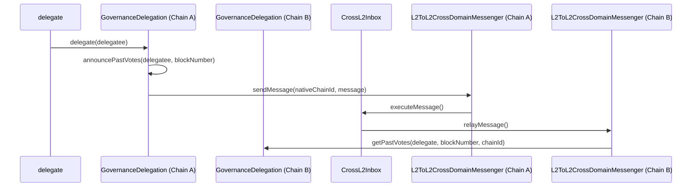

# Purpose

The primary purpose of this design document is to outline an approach to support cross-chain voting power delegations of the `GovernanceToken`. This document also aims to provide context around the desired behavior of the interactions between the contracts that exist on both OP mainnet as well as each of these bespoke chains. Furthermore, user flows and use cases are outlined to provide a more comprehensive understanding of the proposed changes.

# Summary

There will be two main changes to the existing `GovernanceDelegation` [contract](https://github.com/ethereum-optimism/specs/blob/main/specs/experimental/gov-delegation.md) to support interoperability. First, the function in which the checkpoints can be queried from the contract will now check for the migration status prior to retrieving voting power and implement an announce function that will emit an event that contains the chain ID and the block number of the latest checkpoint. The contract on OP mainnet will then consume these events, and in its own storage provide a mapping between chainIds and an object containing both the latest checkpoint and the block number. After tokens are transferred using the `GovernanceToken` [contract](https://github.com/ethereum-optimism/optimism/blob/develop/packages/contracts-bedrock/src/governance/GovernanceToken.sol) a check is performed on the delegation contract that ensures that before this mapping is updated, the nonce of the token transfer received has been incremented as well as being sent from a block number greater than the current one.

# Problem Statement + Context

As described in the [advanced delegation](advanced-delegation.md) design document, the `GovernanceToken` contract supports advanced delegation by integrating with the `GovernanceDelegation` contract. However, the `GovernanceDelegation` contract does not support interoperability, which means that when the `GovernanceToken` gets deployed across networks in the Superchain, the total voting supply in OP Mainnet may decrease as the token would be fragmented across other networks.

Therefore, this design document aims to modify the `GovernanceDelegation` contract to support cross-chain delegations of voting power, maximazing user experience and ensuring that relayers have the proper incentives to handle cross-chain messages of delegations.
messages.

# Alternatives Considered

When originally considering this [problem](https://github.com/ethereum-optimism/specs/blob/5046a5b7f95e7a238cbfabc2b353709c9737b50b/specs/governance/alligator-interop.md), the idea was to create a hook during the `afterTokenTransfer` event. As alluded to above, this do not provide some of the desired functionality.It also makes a few assumptions about the behaviors of delegates that receive tokens and stifles their ability to create partial delegations in a low-cost manner. Moreover, if there was a want to later batch updates of voting power to mainnet it would be costly to those operating governance.

Another active consideration is the use of block timestamp of each L2 instead of block number while implementing this new solution. The primary reason for block numbers to be used in its stead, stems from a concern of manipulation by sequencers and the possible delays that might need to be enforced between events to ensure correctness.

# Proposed Solution

## Rationale

Due to the fact that the `GovernanceDelegation` contract now has awareness of the block numbers and chain IDs of all of the voting power checkpoints each L2 can now be responsible for their own checkpointing and thus make as many updates necessary without cost to relayers. From an implementation standpoint many of the changes are quite small and should minimize the risk of complication of an already intricate interface. There will be a mapping between chainIDs and the `Checkpoint` object that will contain an additional field `blockNumber`. Since events are being consumed ad-hoc the logic in which `Checkpoint` is stored will not be based on branching logic on chain ID, but instead on the messages being processed inside the L2Crosschain Inbox.

The main goal is to ensure that the incentives are set up correctly so that relayers and indexers can manage and provide users the latest delegation changes when exercising their voting
power.

## Implementation

Again, the implementation involves updates the Governor that will ensure that for voting power that has been migrated can be retrieved and updated based on the state on each of the L2 chains. It accomplishes this by keeping track of the token nonce and block numbers of each checkpoint in the mainnet contract. Instead of directly sending messages between the different instances, Governors on non-OP mainnet chains will now emit events regarding these blocks in the their checkpoint updates.

The new storage values will be used to keep track of both the voting power that has been accumulated on the native chain as well as others thus not breaking backwards compatibility for non-migrated tokens. Indexers will now need to be aware of the events being emitted on both OP mainnet and the other L2's that implement the `GovernanceToken` to show checkpoints that have yet to be processed on the mainnet contract. Each L2 will now have the total cumulative voting power for every partial delegation. Vote retrieval on mainnet will take in a parameter that specifies the height of the latest block it cares about of a given L2 chain.

## Invariants

The implementation should maintain the following invariants:

1. **Awareness of migration status**: To ensure that existing voting power is preserved that do not have L1 block number.
2. **Checkpoint mapping**: A new storage field that contains the block number and L2 chain IDs of the latest checkpoint.

# Risks & Uncertainties

1. The biggest risk in implementing this change is ensuring that all existing voting power is preserved such that the checkpoints that already exist on the contract is accessible.
2. Indexers must now accept a delay in updates if wishing to give an accurate voting status for a particular delegate.
3. Batch ordering of checkpoints across all L2 chains. Mainly with exposing a function that allows the Governor contract to batch process messages being received in the L2Crosschain Inbox.
