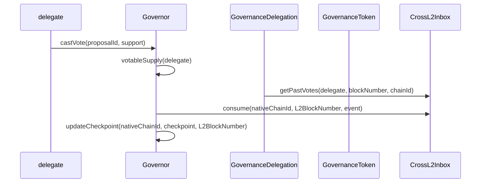

# Purpose

The main goal of this document is to address the changes to the `Governor` [contract](https://github.com/ethereum-optimism/specs/blob/main/specs/governance/governor.md) to support the
capability of handling cross-chain partial delegation utilizing the interop protocol. As outlined in previous [specifications](https://github.com/ethereum-optimism/specs/pull/285)
and design [documents](https://github.com/ethereum-optimism/design-docs/blob/main/governance/advanced-delegation.md), there is an ask to support tracking of voting power across several
L2's once the `GovernanceToken` and `GovernanceDelegation` contract (fka. Alligator) predeploys become available. So far, the considerations around handling this use-case require
changes to the `Governor` contract itself to properly support the checkpointing system on OP mainnet so that token holders can delegate their votes cross-chain.

# Summary

Below you will find an outline of changes to the functionality of the governor as well as the stated purpose of such a mechanism to support vote aggregation. It forwards a solution
in which each an additional hook is to be added on token transfers and delegation emitted events. The `Governor` then consumes both these messages and a corresponding L2 block time or
or block number. These are then stored in a mapping for every checkpoint that exists on each of the respective chains, i.e. `chainId`. In short the new governor attempts to reconcile the state of voting power across each chain by utilizng this storage field that contains the voting power at a given block height.

# Problem Statement + Context

The core problem this solution attempts to solve is how to handle the cross-chain messaging passing in such a way that it's clear to users who vote on proposals what is their voting
power. Furthermore, it clarifies the main concern around whether or not voting power should solely be tracked on OP mainnet or instead on each of the L2 chains. While the token itself
can more or less remain unchanged.

## Constraints

As we set out to design a solution for Interop Governance one of the main constraints we had from our foundation stakeholders was to limit the number of times the OP Token would need to be updated in the process, even if that meant losing scope, or features. Token upgrades are technically challenging, and pose a substantial risk.

# Alternatives Considered

In the previous PR that made changes to the `GovernanceToken` there was a hook for `_afterTransfer` that would send messages to the token contract to track balances. This had the
downside where these events could be censored before some block timing and moved the cost onto block sequencers. Moreover, it had branching logic depending on if the token lived on OP
mainnet or an arbitrary L2 which was not preferable, making the system more convoluted.

There are two primary ways we could handle interop governance across the superchain. After careful consideration, this document outlines our recommendation for Solution 2.

## Solution 1: Delegating and Voting across chains, Aggregation on OP Mainnet

In this approach, each chain is responsible for its own proposals and votes, with the main OP Mainnet aggregating all proposals and votes to reach a consensus.

**Impact on users:** Each delegate will need to vote on proposals for every chain where they have delegated OP, repeating this process for each vote.

## Solution 2: Delegating across chains, Voting on OP Mainnet

This scenario allows users to freely delegate across the superchain as needed. During a vote, the voting power will be aggregated by the governor on the OP Mainnet, and delegates will vote on a single proposal with their combined superchain voting power.

**Impact on users:** Delegates won't need to worry about voting on different chains. Voting becomes easier and simpler, as it occurs on the OP Mainnet chain by combining their voting power at the time of a vote.

As for the first solution, this has been explored by other projects in the space namely Wormhole. This hub and spoke model for conducting votes, and having each governor run their
proposals on the native chain. The tally is then counted by the hub chain once the voting period has ended. While this model simplifies the design greatly, it presents a difficult UX 
question of displaying users voting power on all of the chains and requires a soft governance layer where proposals are recreated on each chain. Users then must track their holdings 
across each chain and send N transactions for a single proposal, where N is then number of chains in which they hold voting power.

## Alternatives Considered

One way to handle multichain voting is the hub and spoke model introduced by [Wormhole](https://wormhole.com/blog/wormhole-tally-and-scopelift-announce-multigov-the-first-ever-multichain). The hub chain will tally the votes it has collected from all the spoke chains and from users who submitted directly on the hub. If the proposal passes, it is executed on the hub chain, and sent to each of the spokes for execution via a cross-chain message. Creating new proposals to vote on follows a similar design, where proposals are created on the hub chain and then broadcast to each spoke chain. Users are also given the ability to transfer tokens to each spoke chain and vote there directly.

Our considerations around this approach is elaborated in the `Solution 2: Delegating across chains, Voting on OP Mainnet` section in this document. This has the drawback from a UX experience displaying the voting power of all the different chains. Furthermore it makes it more complicated to run proposals as each governor will need to mirror the proposals that are effectively only relevant to OP Mainnet.

LayerZero has attempted to solve the multi-chain voting problem by expanding the functionality of their governance token in a new standard called  [Omnichain Fungible Token Standard (OFT)](https://docs.layerzero.network/v2/home/token-standards/oft-standard). This adds a capability for tracking the bridged voting power within a single token contract. Proposals are then in sync across all of the different chains as the hub chain will tally these votes and then allow for execution on each of the respective side-chains.

This is very similar to the previously open partial delegation interoperable spec, where we had made changes to the token to emit events upon transfer. This had a downside of a potential griefing vector in which delegates could always delegate to N+1 users thus having the token holder incur some extra cost when transferring their holdings. The LayerZero approach avoids this by not having partial delegation support in the token itself but rather it would be a separate voting module. Tallying only happens on a single chain as well as execution, thus at best there are only two bridged assets that exists, which is much simpler version than the OP superchain context.

## Ongoing Discussions and Considerations

There is an ongoing discussion about having each chain be responsible for tracking its respective balances to determine voting power. Given that proposals may not be supported across all chains, it's crucial that the solution's main considerations pertain to OP Mainnet and its voting periods.

This approach allows the cost of operating such a system to be the responsibility of the protocol itself, rather than relying on external relayers. It also addresses the context of not supporting proposals that would only live on a single chain.

Another potential issue, is the ability to multiply a token holders voting power by timing a transfer of tokens to another L2, such that the checkpoint on origin chain has be updated by the governor, but on not so for the destination chain. To mitigate this, voting periods should be announced and the updates can be pulled atomically for a given timestamp range.

We are using Figma to discuss trade offs and model the system with relevant stakeholders [here](https://www.figma.com/board/KAzGdfSXUHCNEzgwBhlJ0T/OP-Governance-Token?node-id=0-1&t=gl7KooaaOgHVqRB7-1).

# Proposed Solution

Based on the simplified user experience and the ability to aggregate voting power efficiently, we recommend pursuing Solution 2. This approach aligns with the ongoing discussions about balance tracking and centralizes the voting process on OP Mainnet, which is consistent with the goal of maintaining the protocol's responsibility for system operations.

In this solution, the governor will now have and new storage mapping between `chainIds` and `Checkpoint` objects that contain the L2 block number or timestamp. Then when voting power /
or votable supply is calculated it will retrieve this object at a certain block height and only retrieve the data at a certain threshold. There will also need to be an additional hook
in the governor that will retrieve messages from the delegation events, see the design document above, and pull messages from the cross-chain inbox into the contract given some interval.

## Rationale

The original purpose of the governor contract is to allow token holders the capability of casting votes against proposals. It acheives this by using the underlying `GovToken` balances
as voting power, and using the `GovernanceDelegation` contract to handle partial delegations. In the system without interop, the assumption is that token holders only exist on a single
chain and therefore, their delegations are checked only against this base chain. With the introduction of interop, the problem arises of having tokens living on many different chains
with possible cross-chain delegations that may be partial in nature. Or in other words, users can delegate some of their balance to a user who is on Chain X, and Chain Y while operating
with contracts that live on Chain Z.

Given this environment, there is a need to accurately track the delegations across all these L2's while still giving the user a clean experience when interacting with proposals whose
scope remains relegated to OP mainnet. The approach attempts to do this by having their checkpoints, (balance / delegations) be tracked in a multi-dieminsional construct where each 
potential chain that has deployed the token can let the `Governor` on OP mainnet know that status of these checkpoints and a given block height. This allows users to interact with the
token using the native chain, while still interacting with the set of OP mainnet contracts that manage proposals.

## Implementation

The main updates will be focused on the following function:

`votableSupply`: This function will now use this new mapping when performing the check if a given `account` has delegated or updated a checkpoint during transfer or delegation event
on a given chain.

There will be a new mapping in the governor called `checkpoints` that is a `mapping(uint8 chainId => CheckpointL2)`. The checkpoint L2 will have both the original `Checkpoint` object
with the additional field contain the L2 block number. A new method to be introduced as either a hook on `votableSupply` or a brand new method will then consume the events
emitted on `getPastVotes` to retrieve the `Checkpoint` object and the block number of the latest checkpoint. Furthermore, a list of known `chainIds` will be stored in the `Governor` allowing for a new method `votableSupplyL2` to retrieve the checkpoint for both that block number as well as a given chainId.

This additional method to consume cross-chain events can either be called as a hook when retrieving `votableSupply` or be called atomically by the admin role of the `Governor` to ensure
the state is up-to-date up to a certain block height.

See [here](https://github.com/ethereum-optimism/design-docs/blob/main/governance/delegation-interop.md) for a diagram pertaining to tracking delegations and the structure of the events
to be consumed.

Below shows the flow in the `Governor` contract for handling these messages:

## Invariants

The implementation should maintain the following invariants:

1. **Migration status**: Not all chains will have the L1 block number this migration status will need to managed by the `GovToken`
2. **Votable Supply**: The current set of votable supply will need to be accounted for each of the relevant L2's and thus for quorum thresholds to be set correctly given a checkpoint may
not represent the correct value at the time of proposal execution.

# Risks & Uncertainties

1. Given that there are now multiple governor contracts running on each chain, which one will be indexed, i.e. OP mainnet as the source or truth or having many indexers for each L2.
2. Inconsistencies of block times / block numbers. Ensuring that the expected window of when votes will be counted will introduce variable delay since sequencers update at different
rates.
3. When creating a front-end, showing voting power (token balances) could become complicated if we begin to query each of the governors that may exist on the respective chains.
4. Which timing mechanism provides the most accurate voting period and prevents censorship, L2 block number or timestamp.
