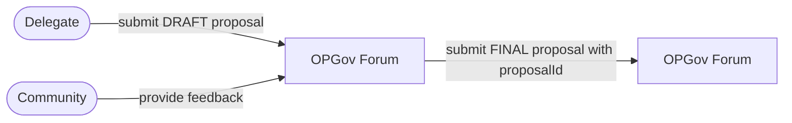
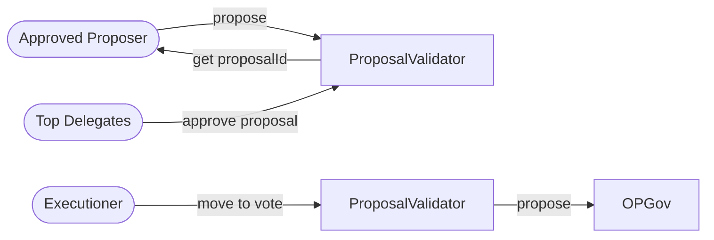

# Purpose

This document outlines the design for enabling permissionless proposals in the Optimism governance system. The goal is to allow top delegates to submit a proposal on-chain without requiring prior approval or gatekeeping by the manager. Instead, if all automated gating rules are met, the proposal is submitted for voting.

# Summary

We propose introducing a `Top100DelegatesProposalValidator` contract that sits in front of the existing Governor. This contract will enforce additional permissions rules such as verifying delegate approvals, checking submission windows, and proposal type rules via the `ProposalTypeConfigurator`, before forwarding the proposal to the underlying governor. 
This design represents a step towards fully permissionless proposals. While it removes manual gatekeeping and automates rule enforcement on-chain, it still relies on configurable thresholds and permissions to ensure system integrity.

# Problem Statement + Context

The current process (per the Operating Manual v0.4.2) requires proposals to be drafted on the forum, receive explicit approvals from at least four of the top 100 delegates (via linked attestations), and then be submitted for a vote during a specific voting cycle. The existing process is partially off-chain and manually enforced.

We need to replicate this process on-chain so that:

- Any eligible participant can submit a proposal without manual gatekeeping by the manager.
- The on-chain system automatically enforces delegate approvals, submission windows, and type-specific gating.
- The system remains non-plutocratic by relying on multiple delegate approvals instead of token thresholds alone.
- Additionally, certain roles (Security Council or a timelock) can still veto or cancel proposals if needed.

# Proposed Solution

At a high-level, we propose the creation of an `Top100DelegatesProposalValidator` contract that becomes the sole interface for proposal submissions to the Governor. The `Top100DelegatesProposalValidator` will:

- **Intercept proposal submissions**: Provide functions such as `propose()` and `proposeWithModule()` that include pre-validation steps.
- **Delegate approval verification**: Require that a proposal submission gathers the sufficient delegate sign-offs before moving it for voting. These approvals will be validated by setting a minimum threshold of voting power that a delegate needs in order to approve, this threshold will be set by the manager along with the voting window.
- **Submission window check:** Ensure the proposal is submitted within a defined short window relative to the current voting cycle. (Type proposal check, this is not valid of all types of proposals)
- **Type-aware validation:** Confirm that the proposal meets any additional criteria based on its type (e.g. higher thresholds for larger OP grants) as defined in the `ProposalTypesConfigurator`.
- **Distribution rate limit**: Ensures the proposed amount does not go over the distribution rate limit.
- **Forward valid proposals:** Once all checks pass, forward the call to the existing `OptimismGovernor` without reimplementing its core functions. To enable this, the `Top100DelegatesProposalValidator` must be granted proposal rights, which are currently restricted to the manager role.

## The Workflow

The general workflow would be:

1. **Draft Proposal:** A delegate starts by creating a Draft proposal and posting it on the optimism governance forum. At this stage, the proposal is open to the entire community for feedback. 
2. **Proposal Finalization**: After the proposal has been drafted, delegates provide feedback, ask clarifying questions, and propose changes. Once the delegate incorporates this input and the proposal is refined, an approved proposer will be able to call `propose` on the `Top100DelegatesProposalValidator` contract which will return a `proposalId` , aimed to be added into the forum proposal and mark it as “FINAL”.
3. **Move to vote via Top100DelegatesProposalValidator:** With the final proposal ready, the top 100 delegates can start signing-off on the on-chain proposal using the `proposalId`. When the proposal is ready to move to voting anyone should be able to call `moveToVote` , and if the proposal meets the necessary rules, such as having the required top 100 delegates sign-offs, being submitted within the correct time window, not going over the distribution rate limit, and adhering to any proposal type-specific threshold it will be moved to the Governor for voting.
4. **Governor:** If the `Top100DelegatesProposalValidator`confirms that the proposal is valid, it forwards the proposal to the OP Governor contract. Then, the voting time begins as usual.

### Off-chain flow

### On-chain flow

# Alternatives Considered

- **Permissioned voting cycle configuration**: As an MVP, we allow a permissioned role to set the voting cycle and delegate approval thresholds. While not fully decentralized, this is acceptable given OF’s existing veto power. A future improvement could use an optimistic oracle to fetch these values on-chain, but this adds complexity we don’t believe is needed yet.
- **Forum sign-offs with signature verification**: The current process relies on forum comments from top delegates as attestations. We considered maintaining this model, where proposers collect these off-chain signatures and verify them in the `Top100DelegatesProposalValidator`. However, direct on-chain approvals are simpler, reduce errors, and avoid coordination overhead.

# Risks and Uncertainties

- **Proposal type flexibility**: The current design relies on a permissioned `ProposalTypesConfigurator` to define and update proposal types. This is acceptable for the MVP but introduces centralization risk. In the future, we’ll need a more permissionless or community-driven mechanism to support new proposal types without relying on a single role.
- **Alligator voting power**: This design does not currently account for subdelegations via the Alligator contract. In a very rare case, a subdelegator could appear in the top 100 delegates by aggregating voting power from multiple authority chains. This introduces ambiguity, as subdelegated voting power may be partially consumed elsewhere.