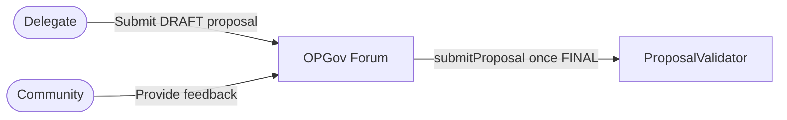
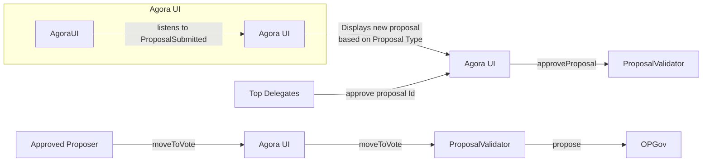

# Purpose

This document outlines the design for enabling permissionless proposals in the Optimism governance system. The goal is to allow an approved address or anyone, based on the Proposal Type, to submit a proposal on-chain without requiring prior approval or gatekeeping by the manager. Instead, if all automated gating rules are met, the proposal is submitted for voting. 

# Summary

We propose introducing a `ProposalValidator` contract that sits in front of the existing Governor. This contract will enforce additional permissions rules such as verifying delegate approvals, checking submission windows, and validating the Proposal Type, before forwarding the proposal to the underlying governor. This design represents a step towards fully permissionless proposals. While it removes manual gatekeeping and automates rule enforcement on-chain, it continues to rely on configurable thresholds and permissions, set by a manager, to ensure system integrity. 

# Problem Statement + Context

The current process, per the [**Operating Manual v1.0.0**](https://github.com/ethereum-optimism/OPerating-manual/blob/main/manual.md), involves proposals being drafted on the forum, receiving delegate approvals (explicit sign-offs from four of the top 100 delegates), and then being submitted for a vote during a specific voting cycle. The existing flow is partially off-chain and manually enforced: delegates post drafts in the forum, approvals are coordinated in the comments, and a designated manager is responsible for calling the Governor to formally start the voting cycle.

We need to replicate this process on-chain so that:

- Any eligible participant can submit a proposal without manual gatekeeping by the manager. Eligibility to propose will still depend on the proposal type.
- The on-chain system automatically enforces delegate approvals, submission windows, and type-specific gating.
- The system remains non-plutocratic by relying on multiple delegate approvals instead of token thresholds alone.
- Additionally, specific roles (Security Council or a timelock) can still veto or cancel proposals if needed.

# Proposed Solution

At a high-level, we propose the creation of a `ProposalValidator` contract that becomes the sole interface for proposal submissions to the Governor. The `ProposalValidator` will:

- **Intercept proposal submissions**: Provide functions such as `submitProposal()` and `moveToVote()` that ensure a proposal is correctly validated before moving to the governor.
- **Proposer Role:** This is the address that initiates a governance proposal. There are two classes of proposers, depending on the proposal type:
  - **Approved Proposer:** An address that has been explicitly attested, by the OP Foundation, as eligible to submit a given proposal type. These proposers must hold an on-chain attestation that confirms they are authorized to submit proposals of a specific `ProposalType`. This model is used for sensitive categories like protocol upgrades or elections, where tighter permissioning is necessary.
  - **Permissionless Proposer:** Any address may submit a proposal (no attestation required) as long as the proposal type allows it. In this case, the proposer must gather the required number of approvals (from top 100 delegates) before calling `moveToVote(...)`. This model is used for more open categories like the Governance Fund and Council Budget, supporting broader community participation.
- **Delegate approval verification**: Require that a proposal submission gathers sufficient delegate approvals before moving it for voting through the Agora UI. These approvals will be validated by setting a minimum threshold of voting power that a delegate needs to approve. This threshold will be set by the manager along with the voting window. This check will also happen for the specific proposal types that are shown below.
- **Move to Vote window check:** Ensure the proposal is forwarded to the Governor within a defined short window relative to the current voting cycle. (Submission window checks may not apply to all `ProposalTypes`).
- **Proposal Voting Type Validation:** Each proposal must be validated to ensure it uses the correct voting configuration as defined by the ProposalTypeConfigurator. This includes verifying the appropriate voting system (e.g., approval voting, ranked choice, optimistic)
- **No-ops checker:** This will be a guard that ensures non-executable proposals (those with no on-chain actions) do not execute OP transfers.
- **Proposal distribution rate limit**: Ensures the proposed amount, for each proposal, does not go over the distribution rate limit. This check applies only to proposals that involve treasury outflows. Non-financial proposals may bypass this check entirely. The `ProposalTypes` determines whether a proposal type is subject to this treasury rate limit.
- **Forward valid proposals:** Once all checks pass, forward the call to the existing `OptimismGovernor` without reimplementing its core functions.

Each proposal type and their validation steps are detailed in the following table:

| **Proposal Type**             | **Description**                                                                                                                                                                                          | **Proposer**                          | **Proposal Voting Type** | **Submission Checks**                                                                                                | **Moving To Vote Checks**                                          |
|-------------------------------|----------------------------------------------------------------------------------------------------------------------------------------------------------------------------------------------------------|---------------------------------------|--------------------------|----------------------------------------------------------------------------------------------------------------------|--------------------------------------------------------------------|
| Protocol or Governor Upgrade  | Scheduled changes to the on-chain smart contracts comprising the mainnet Optimism protocol or governance contract.                                                                                       | Any approved address by OP Foundation | Optimistic                 | - Input valid proposal type - Proposer is an approved address - No funds are transferred - No state changes | - Gathered needed delegate approvals                               |
| Maintenance Upgrade Proposals | Protocol maintenance required to continue network operation on a shorter timescale than voting periods. Must not materially change behavior for end users, infrastructure providers, or chain governors. | Any approved address by OP Foundation | Optimistic               | - Input valid proposal type - Proposer is an approved address - No funds are transferred - No state changes | - N/A                                                              |
| Council Member Elections      | Elections to replace or renew signers in a given cohort.                                                                                                                                                 | Any approved address by OP Foundation | Ranked Choice            | - Input valid proposal type - Proposer is an approved address - No funds are transferred - No state changes | - Gathered needed delegate approvals - Voting cycle enforcement |
| Governance Fund (Missions)    | Used to support Collective development and ecosystem growth via the Mission framework.                                                                                                                   | Permissionless                        | Approval                 | - Input valid proposal type - Requested amount does not exceed the OP Cap                                         | - Gathered needed delegate approvals - Voting cycle enforcement |
| Council Budget                | Allocation of funds for governance operations.                                                                                                                                                           | Permissionless                        | Approval                 | - Input valid proposal type - Requested amount does not exceed the OP Cap                                         | - Gathered needed delegate approvals - Voting cycle enforcement |

# The Workflow

The general workflow would be:

1. **Draft Proposal:** A delegate starts by creating a Draft proposal and posting it on the optimism governance forum. At this stage, the proposal is open to the entire community for feedback. 
2. **Proposal Finalization**: After the proposal has been drafted and shared on the forum, delegates provide feedback, ask clarifying questions, and propose changes. Once the delegate incorporates this input and the proposal is refined, the delegate updates its status to "Final". At this point, the delegate must create an on-chain transaction to create the proposal metadata record in the `ProposalValidator` by calling `submitProposal()`, which can be done either through Etherscan or Agora UI. This call emits a `ProposalSubmitted` event, which includes the `proposalId` and other relevant data. Agora listens for this event and uses it to fetch and display the submitted proposal on its UI, allowing delegates to begin the approval process.
    

    
3. **On-chain approvals via Agora**: With the final proposal submitted, the top 100 delegates can start approving the on-chain proposal using the `proposalId` through Agora. Their approvals are recorded via the `approveProposal(...)` function in the `ProposalValidator` contract, that emits a `ProposalApproved` event. Agora will display the real-time signature status for each proposal.
4. **Move to vote via** `ProposalValidator`**:** Once the required number of approvals is reached, the "Approve Proposal" button in Agora changes to "Move To Vote". Any user can click this button to call `moveToVote(...)` on the `ProposalValidator`. If the proposal meets the necessary rules, such as having the required top 100 delegate approvals, being submitted within the correct time window, not going over the distribution rate limit, and adhering to any proposal type-specific threshold it will be moved to the Governor for voting. This is done by internally calling `proposeWithModule(...)` **within `moveToVote(...)`.
5. **Governor:** If the `ProposalValidator` checks that the proposal is approved, it forwards the proposal to the OP Governor contract. Then, the voting time begins as usual.

Detailed flows for each Proposal Type can be seen [here](https://www.figma.com/board/V0zh1Lg5QqhGfhVrJaIJVu/Permissionless-Proposals-DRAFT?node-id=0-1&p=f&t=sFuVhRioJR1kAIzV-0).

# Alternatives Considered

- **Permissioned voting cycle configuration**: As an MVP, we allow a permissioned role to set the voting cycle and delegate approval thresholds. While not fully decentralized, this is acceptable given OP Foundation’s existing veto power. A future improvement could use an optimistic oracle to fetch these values on-chain, but this adds complexity we don’t believe is needed yet.
- **Forum approvals with signature verification**: The current process relies on forum comments from top delegates as attestations. We considered maintaining this model, where proposers collect these off-chain signatures and verify them in the `ProposalValidator`. However, direct on-chain approvals are simpler, reduce errors, and avoid coordination overhead.
- **On-chain approvals initiated from the Forum**: An alternative flow would be to allow approvals to begin directly from the forum once a proposal is marked as “Final”. In this model, delegates would click a “Approve Proposal” button embedded in the forum interface. Once the required number of approvals are collected, any user could call `propose(...)`. While feasible, this option creates more fragmented UX across governance tools and adds complexity for users interacting with the proposal lifecycle. We opted for Agora as the source of truth to unify coordination and finalization into a single interface.
- **Constant Voting Power Threshold**: Another option considered for identifying if an approver is in the top 100 delegates was to define a minimum threshold of voting power, set by OP Foundation, and check if the caller has more voting power than the threshold. However, it was decided to use the Dynamic Attestation Service that updates the top 100 delegates automatically every day.

# Risks and Uncertainties

- **Proposal type flexibility**: The current design relies on a permissioned role to define and update proposal types. This is acceptable for the MVP but introduces centralization risk. In the future, we’ll need a more permissionless or community-driven mechanism to support new proposal types without relying on a single role.
- **Alligator voting power**: This design does not currently account for subdelegations via the Alligator contract. In a very rare case, a subdelegator could appear in the top 100 delegates by aggregating voting power from multiple authority chains. This introduces ambiguity, as subdelegated voting power may be partially consumed elsewhere.
- **Operational Monitoring and security responsibility**: As the `ProposalValidator` process becomes fully on-chain, it’s important to define which actors are responsible for monitoring its correct operation. For example, what conditions should be enforced or tracked by the smart contract itself, and which anomalies should be monitored off-chain by the Foundation or other ecosystem participants? If a bug or unexpected behavior occurs in `ProposalValidator`, it could block valid proposals from reaching the Governor or allow invalid ones through.
- **Dynamic Attestation Service**: Since we heavily rely on the dynamic attestation service for updating the attestations of the top 100 delegates, it raises the concern of the service going offline and stopping the updating of attestations for a long period of time. Another concern is that currently the Schema used by the service uses a custom Resolver Contract that checks the issuer of the attestations, this should be managed only by the OP Foundation.
