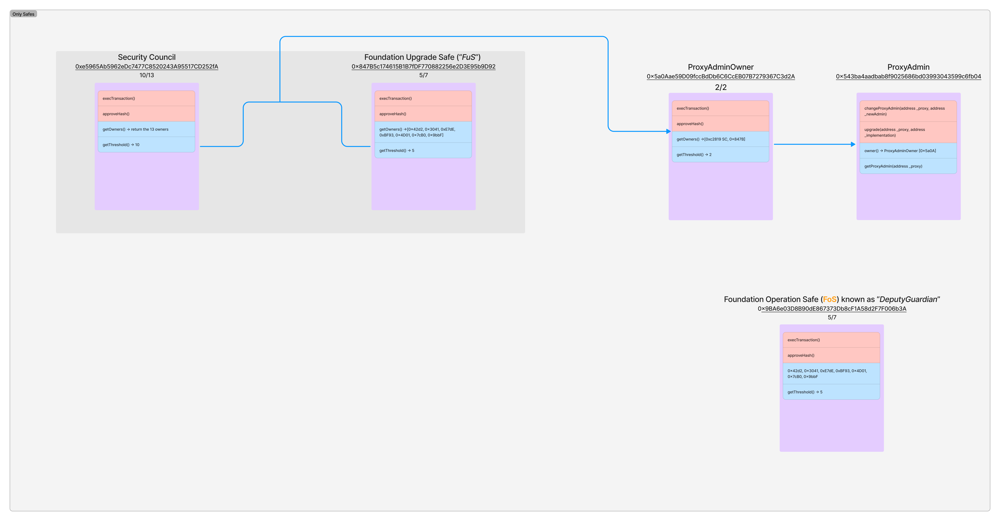
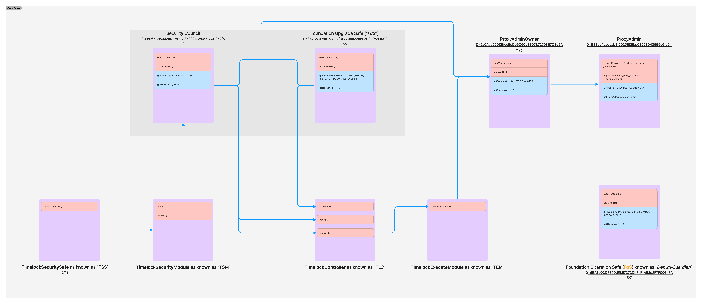

# [Project Name]: Design Doc

|                    |                                                    |
| ------------------ | -------------------------------------------------- |
| Author             | _Author Name_                                      |
| Created at         | _YYYY-MM-DD_                                       |
| Initial Reviewers  | _Reviewer Name 1, Reviewer Name 2_                 |
| Need Approval From | _Reviewer Name_                                    |
| Status             | _Draft / In Review / Implementing Actions / Final_ |

## Purpose

<!-- This section is also sometimes called “Motivations” or “Goals”. -->

<!-- It is fine to remove this section from the final document,
but understanding the purpose of the doc when writing is very helpful. -->

The primary purpose of this design document is to outline a refactor of the upgrade process aimed at reducing the likelihood of a catastrophic upgrade and reducing the burden on the Security Council. This document carefully considers the potential scenarios in which an attacker would be able to execute a malicious upgrade with the proposed process.

## Summary

<!-- Most (if not all) documents should have a summary.
While the length will likely be proportional to the length of the full document,
the summary should be as succinct as possible. -->

The proposed solution is to introduce a custom Timelock contract to the upgrade process. The Timelock is the owner for OP Stack contracts and maintains a set of controller addresses (typically Gnosis Safe multisigs). Any controller can approve a transaction: the first approval sets an ETA to now plus a long delay (e.g., ~7 days). Once all controllers have approved, the ETA is reduced to the minimum of the current ETA and now plus a short delay (e.g., ~1 hour). Any controller or any owner of a controller Gnosis Safe can permanently cancel an approved transaction before it is executed. Anyone can execute once the ETA is reached and the call has not been cancelled.

## Problem Statement + Context

<!-- Describe the specific problem that the document is seeking to address as well
as information needed to understand the problem and design space.
If more information is needed on the costs of the problem,
this is a good place to that information. -->

Our upgrade process faces two problems:

1. The **existential risk of a catastrophic upgrade** introduced by a malicious party. Despite being mitigated by the existing security measures, the risk remains and introducing a delay between approval and execution reduces the risk profile further.

2. A **rising pressure on our multisig members to verify upgrades**. Coordinating signers requires an enormous effort from Op Labs, which slows the speed at which we can ship safely. The rising requirements from our signers to sign more are in contradiction with our requirements for them to carefully verify each upgrade and pose a security risk.

## Proposed Solution

<!-- A high level overview of the proposed solution.
When there are multiple alternatives there should be an explanation
of why one solution was picked over other solutions.
As a rule of thumb, including code snippets (except for defining an external API)
is likely too low level. -->

EVM Safety proposes to solve these two problems in the following way:

1. We will add a new upgrade pipeline in which the **Foundation introduces upgrade proposals to a timelock**, where they would be automatically executed after a set delay (e.g. ~1 week).
2. Each member of the Security Council or the Foundation has the power to **remove proposals from the timelock**. The maximum impact from compromising a quorum of signers in **the new model is downgraded from catastrophic loss of assets to temporary denial of service**.
3. Execution of protocol upgrades with a short delay (e.g. ~1 hour) would it be possible by an approving quorum of each multisig.

The impact of this feature would be that:
- **The Security Council wouldn’t be required on signing ceremonies**. The Security Council will acquire a reactive role that reduces the effort required from them, while preserving their duty and power to protect our assets. This will in turn reduce the effort we require to ship each feature, and will enable us to ship smaller and safer features more often.
- **Instant execution of protocol upgrades wouldn't be possible any longer**. A malicious protocol upgrade could be detected and avoided before it is applied. 

### Upgrade Pipeline

1. An upgrade is prepared in the superchain-ops repository.
2. A third party audits the upgrade proposal **at a specific commit.**
3. The upgrade is proposed in [gov.optimism.io](http://gov.optimism.io), making it eligible for a bug bounty.
4. Once the proposal passes, the Foundation submits the upgrade into a timelock, using our current tooling to provide a degree of legitimacy.
5. EVM Safety, OP Stack partners, contracted auditing firms and bounty hunters have tooling and incentives to detect on the timelock any proposals with unintended effects.
6. If a malicious or erroneous upgrade is detected in the timelock, only one member of the Security Council or Foundation needs to be alerted to cancel it.

### Multisig and Smart Contract Architecture

The feature will be implemented as an addition to the current multisig architecture, with a custom contract.

Currently, upgrades flow through the ProxyAdminOwner, which is a Gnosis Safe with 2/2 threshold. The two owners of the ProxyAdminOwner are the Security Council Safe and the Foundation Upgrade Safe.

The new Timelock is a purpose-built contract with an approve/cancel/execute interface, designed to be the owner for OP Stack contracts and to coordinate time-delayed execution via controller approvals.

In practice:
- The Foundation and the Security Council multisigs are configured as controllers and can approve.
- Any owner of either controller Gnosis Safe can cancel pending calls on behalf of their Safe if needed.
- Anyone may execute a ready call after the ETA; typically EVM Safety will execute upgrades.

### Resource Usage

<!-- What is the resource usage of the proposed solution?
Does it consume a large amount of computational resources or time? -->

The only resource usage in consideration is time required to ship an upgrade.
- The use of a timelock adds to the time required for standard upgrades. Possibly 7 days. This can be eliminated for urgent upgrades by collecting a quorum of signatures from the Security Council, as done currently.
- Removing the need to obtain signatures from the Security Council subtracts to the time required. Possibly 3 days.

Depending on final implementation, the time required to ship an upgrade might be increased by a total of 4 days for regular protocol upgrades.

### Single Point of Failure and Multi Client Considerations

<!-- Details on how this change will impact multiple clients. Do we need to plan for changes to both op-geth and op-reth? -->

There is no impact on the clients.

## Alternatives Considered

<!-- List out a short summary of each possible solution that was considered.
Comparing the effort of each solution -->

The alternative is to do nothing. The effort required to coordinate and secure multisig members would remain the same.

## Risks & Uncertainties

<!-- An overview of what could go wrong.
Also any open questions that need more work to resolve. -->

In general, risks and uncertainties will be identified, along with their mitigations, using threat modelling.

The two main risks that can be identified a priori are:
1. Reviewing proposals is complex, and bounty hunters are not used to the task. A persistent marketing and devrel campaign can be used to maintain interest and facilitate this work. Third party auditors or partners could be contracted or encouraged to execute an external validation of the protocol upgrades.
2. Developing and deploying smart contract code has inherent risks. These are mitigated by our current development and deployment patterns.

