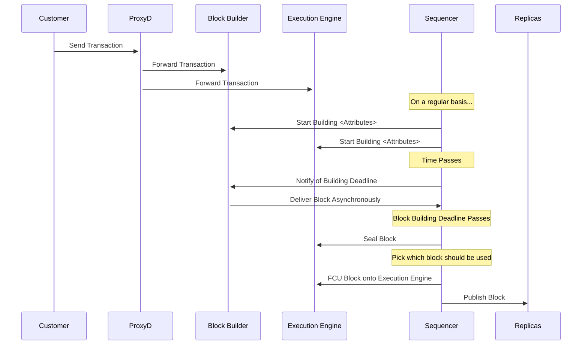

# Purpose
The purpose of this document is to lay out and ratify all major technical aspects of Publisher-Builder-Separation (PBS)
as it relates to the OP-Stack.

# Summary
# Problem Statement + Context
Today, Chain Operators on OP use a Sequencer to publish new blocks to the tip of the chain. The creation of blocks happens through the Execution Engine which is paired to the Sequencer. When a new block is needed, the Sequencer issues commands to the Execution Engine to Start building a block, and will seal that block at the end of the 2s block window. Once done, this completed block is used to update the Execution Engine's chain, and then is published outward onto the network via P2P Gossip.

Assigning the resposibility of block building to the Sequencer's Execution Engine makes sense. However, there are additional goals which can't be achieved in this arrangement. In particular, a customer who would like a *different* block building policy today must modify the behavior of the Execution Engine. This heavy lift is undesirable, and by Separating the Builder from the Publisher, we introduce a new dimension of modularity and extensibility which is desirable to the ecosystem.

Publisher Builder Separation (PBS) is an architectual feature of a Sequencer which allows for block building to happen in a location *other than* the Sequencer's Execution Engine. By introducing this separation, we can create novel opporunities for innovation in block building on OP Chains.

## What isn't PBS
Because PBS is somtimes used ambiguously, it should be made clear: PBS, and this project, are not concerned with the particular behavior of a block builder, or builder(s), beyond the mechanisms the Sequencer uses to interface with them. Builder designs can be as simple or as intricate as operators would like. This design is meant to be supportive of all block building systems, but does not enshrine or plan for a particular style.

PBS is *only* the abstraction of block-building as an activity, which *allows for* blocks to be used in the system when they originate from somewhere other than the Execution Engine. The "somewhere else" is considered opaque for the purposes of this document, except when the its properties inform the design of the interface.

# Properties of a Good Solution
The solution we design should feature the following attributes:

**Minimize Required `op-node` Diff by Block Builder Developers**. Developers of Block Builders should not have to modify `op-node` at all in order to integrate. They should be able to design their system at any level of complexity, from the outside.

**Deny DOS Vectors**.
The Sequencer should not be newly exposed to mechanisms which could be abused to reduce performance.

**Support Fallback**.
When Block Builders fail to deliver valid blocks, it should not impact the service liveness, and the "traditionally" built block should be usable in its place.

**Be Asynchronous**.
The Sequencer should not take Block Builders as a blocking source of latency.

# Proposed Solution
We should modify our Sequencing to support an event-driven, asyncrhonous mechanism for discovering and publishing blocks. These modifications should be codified as spec, and the API interfaces between the Sequencer and Builders should be especially defined.

Recently, the Derivation package has been refactored to use an event-driven architecture. This work was defined in the previous "Derivers" [design document](https://github.com/ethereum-optimism/design-docs/pull/1).

In this event-based architecture, the Sequencer regularly emits events to either:
* Begin block building
* Seal the block (end block building)
* FCU the block (to make it cannonical against the Execution Engine)

To support PBS, the Sequencer is newly responsible for managing the flow of a Block Builder as an outside agent. To accomplish this, it should emit timing-based calls which tell the block builder critical information needed to provide blocks, including block attributes and timing information.

## High Level Overview
Here is a diagram of the components and their interactions.

To break down the components of this diagram:

**Transactions are sent to the Execution Engine and Block Builder via Proxyd**.  Today, the Execution Engine is responsible for being informed of Transactions and maintaining a mempool. With PBS, the Block Builder would have the same responsibilities. The Sequencer *does not* forward Transactions. This is because the Sequencer is not involved in the block building activities directly, and does not benefit from acting as a pass-through

**Block Building Attributes Kick off Building**. The Sequencer is the authority on the Block Attributes which are required to build a block. As today, the Sequencer delivers this information to the Execution Engine, but it also sends this information to the Block Builder as an indication that a block should be built from this data.

**Block Builders are told of Impending Deadline**. The Sequencer currently waits for the block building deadline before calling `Seal` on the Execution Engine to complete the "local" block. Around the same time, the Sequencer should inform the Block Builder that the the deadline is coming, and the Block Builder should submit a block.

This is done to support an asynchronous model where the Block Builder pushes the block to the sequencer. This is to prevent Block Builders from adding delay into sequencing. If the impending deadline is not met, then there is no block to consider from the Builder.

**Block Builders submit Blocks as they wish**. A Block Builder may choose to submit blocks at any time to the Sequencer. The Sequencer should consider the blocks as follows:
* If the block is built off the wrong attributes, it is discarded
* If there is already a submitted PBS Block, the older one is discarded

This allows Block Builders to submit multiple iterations of a block if they have late-breaking updates or if they would simply like to iteratively improve their submitted block.

**At the Deadline, a Block is Selected**. If there is a valid block to be used from a Builder, it is used. Else, the sealed block from the Execution Engine is used. In either case, FCU is called on the Execution Engine with this block, extending the cannonical chain.

**Blocks are delivered via P2P**. As today, cannonical blocks are gossiped outward to Replicas, and implicitly to the builder.
    
## Additions to Spec
The Specifications of PBS on OP Stack should focus on the new APIs which are to be supported. Those APIs are:
### Block Builder API
* Start Building Command - includes the payload attributes to be used, everything required to begin building a valid block. When new Block Building commands are issued, old commands are assumed to be invalidated.
* Inform of Deadline - includes information of when the deadline will be imposed. Block Builders may use this information to optimally schedule their block submissions
* Recieve Transactions - Block Builders should support the same Tx submission API that the Execution Engine does. This way, transaction ingress can deliver identical payloads to both agents to build up mempools.

Block builders should have a way of building valid blocks, which means they need access to a cannonical chain. It is the typical advice that a Block Builder should pair with an `op-node` which has the chain. 

### Sequencer API
* Delivery of New Blocks. New blocks are assumed to come from a trusted source. If they are valid, they are stored for use.

## Rearchitecture of Sequencer Derivers
The currently design of the Sequencer Deriver uses the following Events:
* 

# Alternatives Considered
The possible alternatives to PBS are limited, because the solution space to "Separate the Builder from the Publisher" is narrow when looking at the `op-node`. However, there are some variations.
## Not Doing PBS
We could choose to simply not do this work. In doing so, we would continue to bind all chains to the default block building mechanism in their Execution Engines. Execution Engines typically run a Priority Gas Auction on their blocks, so chains would be implicitly bound to this.
## Adding Special Build Policies to `op-geth`
We could choose not to pursue PBS, and instead directly embed new block building policies into `op-geth` so that nodes could use those. This direction has several isuses, including expanding our minimal diff considerably.

# Risks & Uncertainties