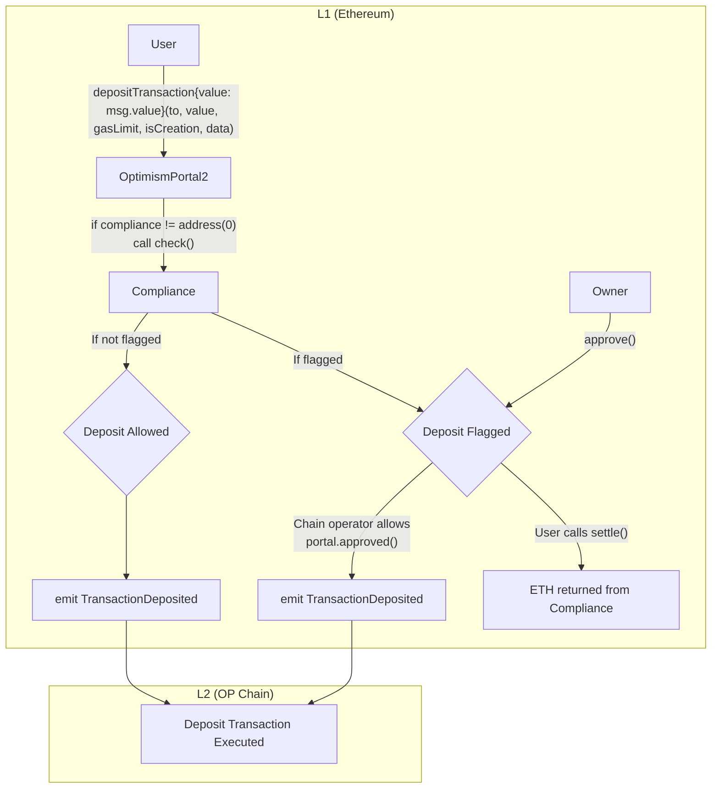
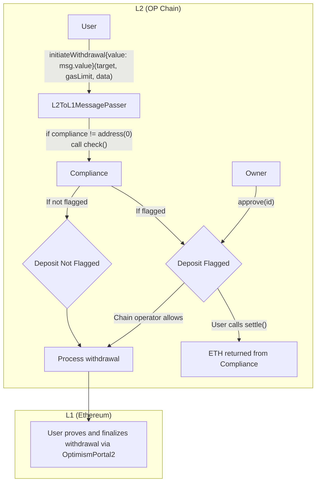

# Compliance Module: Design Doc

|                    |                                                    |
| ------------------ | -------------------------------------------------- |
| Author             | _TBD_                                              |
| Created at         | 2026-02-24                                         |
| Initial Reviewers  | _TBD_                                              |
| Need Approval From | _TBD_                                              |
| Status             | Draft                                              |

## Purpose

Introduce an optional compliance screening layer for cross-chain transactions in the Optimism bridge.
Chain operators need the ability to flag, review, and block deposits and withdrawals based on
configurable rules in order to meet regulatory obligations, reduce liability, and enforce compliance
policies. This design doc describes the smart contract changes required to support this capability.

## Summary

The compliance module adds an optional screening layer to `OptimismPortal2` (deposits) and
`L2ToL1MessagePasser` (withdrawals). When enabled, every cross-chain transaction passes through a
compliance check before execution. Compliant transactions proceed without delay. Flagged transactions
are held pending until chain operator defined rules are passed, in practice this can be a simple inspection
of the deposit.

Key design decisions:

- **Non-blocking for compliant transactions** — no latency added when the check passes.
- **Owner-controlled approval** for flagged transactions (contract inherits Solady `Ownable`).
- **User-initiated refunds** — anyone can call `settle()` on rejected transactions to return ETH.
- **Abstract/concrete split** — abstract `Compliance` contract in `src/universal/`, with
  `L1Compliance` and `L2Compliance` concrete implementations in `src/L1/` and `src/L2/` respectively.
- **L2 predeploy** — `L2Compliance` is deployed at predeploy address
  `0x420000000000000000000000000000000000002D` and set in genesis.
- **Contracts-only scope** — no changes to client software required.
- **Opt-in** — setting the compliance address to `address(0)` disables the module entirely. The
  L2 genesis generation script accepts a config option to set `L2Compliance` in the
  `L2ToL1MessagePasser` at genesis; by default it is not set (compliance is off).

## Problem Statement + Context

Chain operators deploying OP Stack chains may be subject to regulatory requirements that oblige them
to screen cross-chain transactions for sanctioned addresses, suspicious activity, or other compliance
criteria. Today there is no protocol-level mechanism for a chain operator to intercept, review, or
block a deposit or withdrawal before it executes.

Without such a mechanism, a chain operator's only options are off-chain monitoring after the fact,
which does not prevent the transaction from executing and does not reduce the operator's potential
liability. The compliance module fills this gap by giving chain operators a configurable, on-chain
screening hook that integrates directly into the bridge contracts.

## Proposed Solution

### Architecture

#### L1 → L2 Deposit Flow



#### L2 → L1 Withdrawal Flow



### New Contracts: `Compliance` (abstract), `L1Compliance`, `L2Compliance`

The compliance module is structured as an abstract base contract with two concrete implementations:

- **`Compliance`** (`src/universal/Compliance.sol`) — abstract contract containing all shared logic:
  check, settle, approve, reject, rule management, and status tracking. Inherits:
  - `ProxyAdminOwnedBase` — gates `initialize()` to the proxy admin or its owner
  - `ReinitializableBase` — supports versioned re-initialization for upgrades
  - Solady's [`Ownable`](https://github.com/Vectorized/solady/blob/main/src/auth/Ownable.sol) — owner-controlled functions
  - OpenZeppelin's `Initializable` — standard initializer pattern
  - Solady's `ReentrancyGuard` — protects `settle()` from reentrancy
  - `ISemver` — semantic versioning (`version()` returns `"1.0.0"`)
- **`L1Compliance`** (`src/L1/L1Compliance.sol`) — concrete implementation for L1 deposits. The
  `bridge` is `OptimismPortal2`. Deployed behind an upgradeable proxy on L1.
- **`L2Compliance`** (`src/L2/L2Compliance.sol`) — concrete implementation for L2 withdrawals. The
  `bridge` is `L2ToL1MessagePasser`. Deployed as a predeploy at address
  `0x420000000000000000000000000000000000002D` and set in the L2 genesis state.

Both concrete implementations are deployed behind upgradeable proxies. The abstract `Compliance`
contract receives compliance check requests from the bridge, stores a status entry keyed by the
transaction's hash, and provides mechanisms for the contract owner to approve or reject pending
transactions. No preimage data is stored on-chain — only the hash-to-status mapping is persisted.
The `settle()` function accepts the full preimage fields, recomputes the hash on-chain, and verifies
it against the stored status before executing. The contract holds user ETH in custody for flagged
transactions, making upgradeability essential for recovering from bugs in the settlement or refund
paths.

The `Compliance` contract can be configured with a set of Rules, configurable by the contract owner.
The set of active rules is tracked using Solady's
[`EnumerableSetLib.AddressSet`](https://github.com/Vectorized/solady/blob/main/src/utils/EnumerableSetLib.sol),
which provides O(1) add/remove/contains operations and prevents duplicate rule entries. Each
cross-chain message is tested against each of the rules. If a rule flags the transaction, it
can set the transaction as `Pending` or `Rejected` (see [Status Enum](#status-enum)). A pending
transaction can be approved by the owner, while a rejected transaction is blocked. A user
can call `settle()` on a rejected transaction to claim a refund of their ETH.

The status mapping encodes both the `Status` value and a single "owner override" bit in each
`uint256` entry. The layout is:

```
MSB                                                                    LSB
┌──────────┬──────────────────────────────────────────────────────────────┐
│ bit 255  │  bits 254 … 0                                              │
│ override │  Status enum value (Approved=0, Pending=1, Rejected=2, …)  │
└──────────┴──────────────────────────────────────────────────────────────┘
```

- **Bit 255 (most significant bit):** the owner-override flag. Set to `1` when the owner calls
  `approve` or `reject`, indicating an explicit owner decision that takes precedence over any
  rule re-evaluation.
- **Bits 254–0 (least significant bits):** the `Status` enum value cast to `uint256`.

When the owner calls `approve` or `reject`, the stored value is
`(1 << 255) | uint256(status)`. The public `status()` view function masks off bit 255 and
returns both a `bool isFinal_` flag and the `Status` enum portion. A status is final when:

- **Refunded** — always final, regardless of bit 255.
- **Pending or Rejected with bit 255 set** — the owner has made an explicit decision that
  takes precedence over any rule re-evaluation.

The `settle` function checks finality first: if the status is final, it uses the stored
status directly. If the status is not final, the rules are re-evaluated. Crucially, rule
re-evaluation must respect finality — a finalized status takes precedence even if rules
would return a stricter (higher-valued) result.

#### Security Considerations

- **Reentrancy protection:** The `settle()` function and the bridge's `approved()` callback MUST
  use a reentrancy guard (`nonReentrant` modifier or equivalent). External calls to `IRule`
  contracts are not a reentrancy concern because only the contract owner (an aligned chain
  operator) can add rules via `addRule`, so malicious rule implementations are out of scope.
- **Access control:** The `Compliance` contract inherits Solady's `Ownable`. The owner controls
  `addRule`/`removeRule` and `approve`/`reject`. Ownership transfer uses Solady's
  `transferOwnership`. The `check()` function is only callable by the `bridge` address. The
  `settle()` function is callable by anyone. If the owner key is lost, governance can recover
  by upgrading the `Compliance` proxy to set a new owner.

#### State Variables

The abstract `Compliance` contract inherits Solady's `Ownable`, so the `owner()` function is
available via the Solady interface. Solady's `Ownable` uses a custom storage slot
(`_OWNER_SLOT`), avoiding storage layout conflicts with other state variables.

The `initialize()` function lives on the abstract `Compliance` contract (not on the concrete
implementations). It is gated by `_assertOnlyProxyAdminOrProxyAdminOwner()` (from
`ProxyAdminOwnedBase`), which restricts callers to the proxy admin contract or its owner. This
prevents unauthorized re-initialization after deployment. The function accepts both the `_bridge`
address and the `_owner` address, calling `_initializeOwner(address)` internally. No custom owner
state variable is needed.

The set of active rules is stored using Solady's `EnumerableSetLib.AddressSet`, which provides
O(1) add, remove, and contains operations while preventing duplicate entries. The set is
enumerable, allowing the `check()` function to iterate all rules and external callers to query
the current rule set.

```solidity
using EnumerableSetLib for EnumerableSetLib.AddressSet;

/// @notice Reference to OptimismPortal2 (L1) or L2ToL1MessagePasser (L2).
///         Used to enforce the caller of the check function and to return ETH
///         via donateETH() when a transaction passes all rules.
address payable public bridge;

/// @notice Internal mapping of hashed cross chain messages to its encoded status.
///         Each uint256 value packs two fields:
///           - Bit 255 (MSB): owner-override flag (1 = owner has called approve or reject)
///           - Bits 254–0:    Status enum value (Approved=0, Pending=1, Rejected=2, Refunded=3)
///         Use the public status() function to read the Status enum and finality flag.
mapping(bytes32 => uint256) private _status;

/// @notice Set of active IRule contract addresses evaluated during check().
///         Uses Solady's EnumerableSetLib for O(1) add/remove/contains and enumeration.
EnumerableSetLib.AddressSet private _rules;

/// @notice Returns the Status of a cross chain message and whether it is final.
/// @dev    Masks off bit 255 (the owner-override flag) and returns the Status
///         enum value from the least significant bits. A status is considered
///         final when it is Refunded (always final) or when the owner-override
///         flag (bit 255) is set (Pending or Rejected with an explicit owner
///         decision). Rule re-evaluation in settle() must respect finality:
///         a finalized status takes precedence even if rules would return a
///         stricter result.
/// @param _id The hashed cross chain message identifier.
/// @return isFinal_ True if the status is final and cannot be changed by rule re-evaluation.
/// @return status_ The current Status of the message.
function status(bytes32 _id) public view returns (bool isFinal_, Status status_);

/// @notice Returns all active rule addresses.
function rules() public view returns (address[] memory);

/// @notice Returns whether a given address is an active rule.
/// @param _rule The address to check.
/// @return True if the address is in the active rule set.
function hasRule(address _rule) public view returns (bool);
```

#### Events

These events are used by the chain operator to maintain an audit log. Proper information should be
included in each event to make sure that tooling can identify which transaction the event
corresponds to, making it easy to audit and react.

Each event includes the `bytes32` hash as its first indexed parameter so that SDK tooling can
efficiently filter and correlate events. The `Pending` event includes the full preimage fields so
that off-chain tooling does not need to reconstruct them from calldata. The `Approved`, `Rejected`,
and `Refunded` events only include the hash — preimage fields are available in the transaction
calldata or in the `Pending` event (for transactions that were first flagged as pending).

```solidity
/// @notice Emitted when a transaction is flagged for review
event Pending(
    bytes32 indexed id,
    address indexed from,
    address indexed to,
    uint256 value,
    uint256 mint,
    uint64 gasLimit,
    uint256 nonce,
    bytes data
);

/// @notice Emitted when a transaction is rejected — either automatically during check()
///         or when the owner calls reject(). Preimage fields are available in the
///         transaction calldata for off-chain reconstruction.
event Rejected(bytes32 indexed id);

/// @notice Emitted exactly once when a transaction is approved and executed — either
///         automatically during check() or during settle() after owner approval.
event Approved(bytes32 indexed id);

/// @notice Emitted when settle() returns ETH to the user for a rejected transaction
event Refunded(bytes32 indexed id);
```

#### Functions

The `check` function uses a symmetrical signature on both L1 and L2 — both accept a `_nonce`
parameter. On L1, the caller always passes `0` since deposits do not use nonces. On L2, the caller
passes the reserved withdrawal nonce. This keeps the interface uniform across deployment contexts.

The `mint` value is not a parameter — it is derived from `msg.value` inside `check()`. For deposits
(L1), `msg.value` is included as the `mint` field in the hash and emitted in the `Pending` or
`Rejected` event. When `settle()` is called, the caller provides `mint` as part of the preimage,
and it is used as the `_mint` argument when calling `OptimismPortal2.approved()`. For withdrawals
(L2), `msg.value` is the ETH being withdrawn and is stored as the `mint` field in the hash.
Despite the name, `mint` does not represent L2 minting in the withdrawal context — it represents
the ETH amount held in custody by the Compliance contract. The `mint` field is included in the id
hash to prevent collisions between transactions with different `msg.value` but otherwise identical
parameters.

The function iterates through all rules in the `_rules` set and checks the transaction against each
one. If every rule returns `Approved`, the transaction proceeds. If any rule returns a status
stricter than `Approved`, the strictest returned status (`Rejected` > `Pending` > `Approved`) is
stored. On subsequent calls (e.g., during `settle()` re-evaluation), if the stored status is
finalized (i.e., the owner-override bit is set, or the status is `Refunded`), the finalized status
takes precedence over rule results — even if a rule now returns a stricter status than the
finalized one.

```solidity
/// @notice Called by OptimismPortal2 (L1) or L2ToL1MessagePasser (L2) to check compliance
/// @dev Returns false if flagged, true if allowed. If flagged, stores only the status
///      entry keyed by hash — no preimage data is persisted on-chain. Emits a Pending
///      or Rejected event with the full preimage fields for off-chain reconstruction.
///      Iterates all configured rules; the strictest non-Approved result is stored.
///      The contract owner controls which rules are configured via addRule/removeRule.
///      For deposits, msg.value is included as the mint field in the hash. For
///      withdrawals, msg.value is included as the mint field in the hash — despite
///      the name, mint represents the ETH held in custody, not L2 minting.
/// @param _from The depositor/withdrawer address
/// @param _to The recipient address on the remote chain
/// @param _value The ETH value
/// @param _gasLimit The gas limit for the remote transaction
/// @param _isCreation Whether this is a contract creation (always false for withdrawals)
/// @param _data The calldata
/// @param _nonce The reserved nonce (0 for deposits, withdrawal nonce for withdrawals)
/// @return allowed_ True if the transaction should proceed, false if flagged
function check(
    address _from,
    address _to,
    uint256 _value,
    uint64 _gasLimit,
    bool _isCreation,
    bytes calldata _data,
    uint256 _nonce
) external payable returns (bool allowed_);

/// @notice Called by the owner to approve a pending transaction.
/// @dev    Writes `(1 << 255) | uint256(Status.Approved)` into `_status[_id]`,
///         setting the owner-override flag (bit 255) and the Approved status in the
///         least significant bits. Reverts if the current status is not Pending.
///         This prevents double-execution: once a transaction is approved and settled,
///         it cannot be approved again.
/// @param _id The pending deposit ID
function approve(bytes32 _id) external;

/// @notice Called by the owner to reject a transaction.
/// @dev    Writes `(1 << 255) | uint256(Status.Rejected)` into `_status[_id]`,
///         setting the owner-override flag (bit 255) and the Rejected status in the
///         least significant bits. Callable when the current status is Pending or
///         Approved. Rejecting an Approved transaction allows the owner to reverse an
///         approval before settlement, or to proactively block a transaction. Reverts
///         if the status is Rejected or Refunded. Emits a `Rejected` event.
/// @param _id The pending deposit ID
function reject(bytes32 _id) external;

/// @notice Called by anybody to progress the state of the deposit.
/// @dev The caller provides the full preimage fields. The contract computes
///      the hash on-chain via keccak256(abi.encode(...)) and uses it to look
///      up the stored status. Reverts if the hash has no stored status entry
///      (i.e., _status[id] == 0), which covers both unknown transactions and
///      previously-settled approved transactions whose status was deleted.
///
///      Calls status(id) to obtain (isFinal_, currentStatus). If the status
///      is final (Refunded, or Pending/Rejected with the owner-override bit
///      set), the stored status is used directly — rule re-evaluation is
///      skipped. If the status is NOT final, all configured rules are
///      re-evaluated and the strictest outcome is applied. However, if
///      re-evaluation produces a status that is stricter than the stored
///      finalized status, the finalized status still takes precedence:
///      finality wins over rule escalation.
///
///      ETH flow per resolved status:
///      - Approved: deletes the status entry (_status[id] = 0) and calls
///        bridge.approved{value: _mint}(...) to execute the held transaction
///        using the caller-provided preimage fields (verified by hash). The
///        _mint field is the forwarded ETH for both deposits and withdrawals.
///        Deleting the status entry prevents double-execution (a subsequent
///        settle on the same preimage will find _status[id] == 0 and revert).
///      - Rejected: marks status as Refunded and sends the held ETH back to
///        the original sender (_from).
///      - Pending: no-op, the transaction remains held.
///      - Refunded: reverts (already settled, prevents double-claim).
///
/// @param _from The original depositor/withdrawer address
/// @param _to The recipient address on the remote chain
/// @param _value The ETH value
/// @param _mint The ETH held in custody (msg.value from the original check() call)
/// @param _gasLimit The gas limit for remote execution
/// @param _isCreation Whether this is a contract creation (always false for withdrawals)
/// @param _data The calldata
/// @param _nonce The reserved nonce (always 0 for deposits)
function settle(
    address _from,
    address _to,
    uint256 _value,
    uint256 _mint,
    uint64 _gasLimit,
    bool _isCreation,
    bytes calldata _data,
    uint256 _nonce
) external;

/// @notice Adds a rule to the active rule set.
///         Reverts if the rule is already in the set.
///         Any cross chain message is checked against all rules.
/// @param _rule The IRule contract to add
function addRule(address _rule) external;

/// @notice Removes a rule from the active rule set.
///         Reverts if the rule is not in the set.
/// @param _rule The IRule contract to remove
function removeRule(address _rule) external;
```

Ownership transfer is handled by Solady's `Ownable` via `transferOwnership(address)` — no custom
`setOperator` function is needed.

### New Contract: `IRule`

The `IRule` interface is passed information about the cross-chain transaction and can contain
arbitrary logic. A `Status` enum is returned to allow the check to approve, flag as pending, or
outright reject. This gives chain operators the ability to define a set of composable rules. Some
possible rules could block all transactions sent from an address, flag all transactions to an
address, or inspect the calldata. This design is flexible enough to implement a rate limit in the
bridge by tracking cross-chain message value and only allowing a certain amount per unit of time.

A rule's `check` function MUST only return `Approved`, `Pending`, or `Rejected`. It MUST NOT
return `Refunded`, as that status is managed exclusively by the `Compliance` contract's `settle`
function. The `Compliance` contract validates the return value from each rule and reverts if a rule
returns `Refunded`.

Because `IRule` implementations are external contracts, rule implementations should be audited
before deployment to production.

```solidity
/// @notice Evaluates a cross-chain transaction against this rule.
/// @param _from The depositor/withdrawer address
/// @param _to The recipient address on the remote chain
/// @param _value The ETH value
/// @param _gasLimit The gas limit for the remote transaction
/// @param _isCreation Whether this is a contract creation
/// @param _data The calldata
/// @param _nonce The reserved nonce (0 for deposits, withdrawal nonce for withdrawals)
/// @return The resulting Status (must be Approved, Pending, or Rejected)
function check(
    address _from,
    address _to,
    uint256 _value,
    uint64 _gasLimit,
    bool _isCreation,
    bytes calldata _data,
    uint256 _nonce
) external returns (Status);
```

Rule `check` calls are made without explicit gas bounds. The contract owner is assumed to be an
aligned chain operator who controls rule selection via `addRule`/`removeRule`, so a rule that
consumes excessive gas is equivalent to the owner denial-of-servicing their own chain. If a rule
does cause gas issues, the owner can remove it via `removeRule` or disable the compliance module
entirely via `setCompliance(address(0))`. Using `EnumerableSetLib.AddressSet` ensures that the
same rule cannot be added twice and that removal is O(1).

A simple initial implementation could allow the contract owner to block an arbitrary sender.
Additional rule types can be built based on product requirements. Example rule implementations
can be found at [tynes/rule-examples](https://github.com/tynes/rule-examples/tree/main).

### New Interface: `IDonatable`

When `check()` is called with `{value: msg.value}`, the ETH is transferred to the Compliance
contract. If all rules approve the transaction, the ETH must be returned to the bridge so that the
normal deposit or withdrawal logic can proceed. However, sending ETH to the bridge via a plain
transfer would trigger a deposit (on L1) or a withdrawal (on L2). To avoid this, both
`OptimismPortal2` and `L2ToL1MessagePasser` implement the `IDonatable` interface, which provides a
`donateETH()` function that accepts ETH without side effects.

```solidity
/// @title IDonatable
/// @notice Interface for contracts that accept ETH donations without triggering
///         side effects (deposits on L1, withdrawals on L2). Used by the Compliance
///         module to return ETH to the bridge when a transaction passes all rules
///         during check().
interface IDonatable {
    /// @notice Accepts ETH value without triggering a deposit or withdrawal.
    function donateETH() external payable;
}
```

When `check()` returns `true` (all rules approved), the Compliance contract calls
`IDonatable(bridge).donateETH{value: msg.value}()` to return the ETH to the bridge before the
bridge proceeds with the normal deposit or withdrawal logic.

### Changes to `OptimismPortal2`

`OptimismPortal2` gains a compliance module integration. When set, all deposits pass through a
compliance check. A new `approved()` function allows the compliance module to execute
previously-flagged deposits. The compliance address is set via the `initialize()` function and is
controlled by governance (L1 proxy admin owner). There is no explicit `setCompliance` setter on
`OptimismPortal2` — changing the compliance address requires a proxy upgrade or reinitialization
through governance. This is intentional: governance-gating the compliance address on L1 ensures
that stage 1 requirements are maintained by preventing the compliance contract from being changed
arbitrarily outside of a security council action.

#### New State Variables

```solidity
/// @notice Address of the compliance module (address(0) if disabled)
address public compliance;
```

#### New Functions

```solidity
/// @notice Executes a deposit that was previously flagged and approved by compliance
/// @dev Only callable by the compliance contract. The compliance module forwards
///      the mint value (the original msg.value from depositTransaction) as both
///      the call's msg.value and the _mint parameter.
/// @param _from The original depositor address (will be aliased for L2)
/// @param _to The recipient address on L2
/// @param _value The ETH value being deposited
/// @param _mint The ETH amount to mint on L2 (original msg.value from depositTransaction)
/// @param _gasLimit The gas limit for the L2 transaction
/// @param _isCreation Whether this creates a contract
/// @param _data The calldata for the deposit
function approved(
    address _from,
    address _to,
    uint256 _value,
    uint256 _mint,
    uint64 _gasLimit,
    bool _isCreation,
    bytes calldata _data
) external payable;
```

#### Modified Functions

The `initialize()` function is updated to accept a `_compliance` parameter:

```solidity
/// @notice Initializer
/// @param _compliance The compliance module address (address(0) to disable)
function initialize(/* existing params */, address _compliance) public initializer;
```

```solidity
/// @notice Modified depositTransaction to include compliance check
/// @dev If compliance is set and check() returns false, deposit is held pending
function depositTransaction(
    address _to,
    uint256 _value,
    uint64 _gasLimit,
    bool _isCreation,
    bytes calldata _data
) public payable {
    // ... existing validation ...

    // NEW: Compliance check
    if (compliance != address(0)) {
        bool allowed = IComplianceModule(compliance).check{value: msg.value}(
            msg.sender,
            _to,
            _value,
            _gasLimit,
            _isCreation,
            _data,
            0 // nonce is always 0 for deposits
        );
        if (!allowed) {
            return; // Deposit held in compliance module
        }
    }

    // ... existing deposit logic ...
}
```

### Changes to `L2ToL1MessagePasser`

`L2ToL1MessagePasser` gains compliance module integration. This solves the problem of flagging
transactions after the fact. There is no perfect solution because there are always ways to try to
get around on-chain compliance, but this allows the chain operator to reduce liability by blocking
withdrawals based on compliance. Unlike `OptimismPortal2`, the `L2ToL1MessagePasser` retains an
explicit `setCompliance` setter, callable only by the `L2ProxyAdmin` owner (governance-gated).
As with L1, governance control over the compliance address is required to maintain stage 1
requirements — the compliance contract cannot be set arbitrarily outside of a security council
action.

#### New State Variables

```solidity
/// @notice Address of the compliance module (address(0) if disabled)
address public compliance;
```

#### New Functions

```solidity
/// @notice Executes a withdrawal that was previously flagged and approved
/// @dev Only callable by the compliance contract. Uses reserved nonce.
/// @param _from The original withdrawer address
/// @param _target The recipient address on L1
/// @param _value The ETH value being withdrawn
/// @param _gasLimit The gas limit for the L1 transaction
/// @param _data The calldata for the withdrawal
/// @param _nonce The nonce that was reserved when flagged
function approved(
    address _from,
    address _target,
    uint256 _value,
    uint64 _gasLimit,
    bytes calldata _data,
    uint256 _nonce
) external;

/// @notice Sets the compliance module address
/// @dev Only callable by the L2ProxyAdmin owner (governance-gated).
/// @param _compliance The compliance module address (address(0) to disable)
function setCompliance(address _compliance) external;
```

#### Modified Functions

```solidity
/// @notice Modified initiateWithdrawal to include compliance check
/// @dev If compliance is set and check() returns false, nonce is reserved and withdrawal is held
function initiateWithdrawal(
    address _target,
    uint256 _gasLimit,
    bytes calldata _data
) public payable {
    // Reserve nonce before compliance check
    uint256 nonce = messageNonce();

    // The nonce must be reserved before the compliance check for two reasons:
    // 1. The nonce is included in the hash that uniquely identifies the pending
    //    transaction in the Compliance contract's status mapping. Without it,
    //    two identical withdrawals (same from, to, value, gasLimit, data) would
    //    produce the same bytes32 id and collide.
    // 2. When a flagged withdrawal is later approved and executed via approved(),
    //    the reserved nonce is used to emit the withdrawal message. This nonce
    //    must match what L1 expects during proving. If the nonce were assigned
    //    after approval, intervening withdrawals could shift the nonce, causing
    //    the proved withdrawal hash on L1 to mismatch.

    // NEW: Compliance check
    if (compliance != address(0)) {
        bool allowed = IComplianceModule(compliance).check{ value: msg.value }(
            msg.sender,
            _target,
            msg.value,
            uint64(_gasLimit),
            false, // isCreation is always false for withdrawals
            _data,
            nonce
        );
        if (!allowed) {
            // Nonce was reserved in check(), withdrawal held
            return;
        }
    }

    // ... existing withdrawal logic using nonce ...
}
```

### L2 Predeploy and Genesis Configuration

#### Predeploy Address

`L2Compliance` is a predeploy at address `0x420000000000000000000000000000000000002D`. It is
deployed behind a proxy at this address in the L2 genesis state, following the same pattern as
other L2 predeploys (e.g., `L2ToL1MessagePasser` at `0x4200000000000000000000000000000000000016`).

#### Genesis Configuration

The L2 genesis generation script accepts a configuration option that controls whether the
`L2Compliance` contract is wired into the `L2ToL1MessagePasser` at genesis. This is the
`compliance` field in the `L2ToL1MessagePasser`'s storage — when set to the `L2Compliance`
predeploy address, compliance checking is active from genesis.

**By default, the compliance address in `L2ToL1MessagePasser` is `address(0)` (compliance is
off).** The chain operator must explicitly opt in by setting the genesis config option to enable
compliance at chain launch.

When `l2ComplianceEnabled` is `true`, the genesis generation script sets the
`L2ToL1MessagePasser.compliance` storage slot to `0x420000000000000000000000000000000000002D`
(the `L2Compliance` predeploy address). When `false` (the default), the slot is left as
`address(0)` and the compliance module is inactive.

The `L2Compliance` predeploy contract is always present in the genesis state regardless of this
flag — the flag only controls whether `L2ToL1MessagePasser` is configured to call it.

### Data Types

#### Status Enum

Used in the `Compliance` contract to track the state of a flagged transaction.

```solidity
/// @notice Status of a pending transaction
enum Status {
    Approved,   // Owner approved, transaction executed
    Pending,    // Awaiting owner decision
    Rejected,   // Owner rejected
    Refunded    // User claimed refund
}
```

#### Transaction Preimage Fields

The `check` function uses a symmetrical signature on both L1 and L2. The following fields compose
the preimage that is hashed to produce the `bytes32` identifier used in the `_status` mapping:

| Field          | Type      | Deposits                              | Withdrawals                     |
| -------------- | --------- | ------------------------------------- | ------------------------------- |
| `from`         | `address` | Original depositor                    | Original withdrawer             |
| `to`           | `address` | Recipient on L2                       | Recipient on L1                 |
| `value`        | `uint256` | ETH value                             | ETH value                       |
| `mint`         | `uint256` | `msg.value` from `depositTransaction` | `msg.value` (ETH held in custody) |
| `gasLimit`     | `uint64`  | Gas limit for L2 execution            | Gas limit for L1 execution      |
| `isCreation`   | `bool`    | Contract creation flag                | Always `false`                  |
| `data`         | `bytes`   | Calldata                              | Calldata                        |
| `nonce`        | `uint256` | Always `0`                            | Reserved withdrawal nonce       |

These fields are **not stored on-chain**. They are emitted in `Pending` and `Rejected` events for
off-chain reconstruction and must be supplied by the caller when invoking `settle()`. The hash
verification in `settle()` guarantees that the provided preimage matches the stored status entry.

#### Hashing Scheme

The `bytes32` identifier used as the key in the `status` mapping and in all events is computed as:

```solidity
bytes32 id = keccak256(abi.encode(
    _from,
    _to,
    _value,
    _mint,
    _gasLimit,
    _isCreation,
    _data,
    _nonce
));
```

The hash includes all `check` function parameters plus the `mint` value derived from `msg.value`
(for both deposits and withdrawals). Including `mint` in the hash prevents collisions between
transactions with different `msg.value` but otherwise identical parameters. The use of `abi.encode`
(not `abi.encodePacked`) ensures unambiguous decoding and avoids collisions from variable-length
fields.

### Resource Usage

No significant resource impact. The compliance module is contracts-only and adds a single external
call to the deposit/withdrawal hot path when enabled. When disabled (`compliance == address(0)`),
the overhead is a single `SLOAD` and branch.

### Single Point of Failure and Multi Client Considerations

This change is scoped entirely to smart contracts and requires no changes to client software
(`op-geth`, `op-reth`, `op-node`, etc.). There is no multi-client impact.

The owner key is a single point of failure for approving flagged transactions. If the owner key is
lost or compromised, flagged transactions cannot be approved (users can still claim refunds by
calling `settle()` on rejected transactions). The `settle()` function can also re-evaluate rules
when the status is not finalized (owner-override bit is not set and status is not `Refunded`),
providing limited recovery for pending transactions. Once the owner sets an override, the status
is final and rule re-evaluation cannot change it.

Key management practices for the owner address should be considered during deployment. A multisig
or governance-gated address is recommended. If the owner key is lost, governance can recover by
upgrading the `Compliance` proxy to set a new owner.

## Failure Mode Analysis

See [fma-compliance.md](../security/fma-compliance.md) for the full failure mode analysis. Key
failure modes include owner key compromise (FM1), compliance contract bugs blocking all
transactions (FM2), buggy IRule implementations (FM3), ETH locked in the compliance contract (FM4),
nonce reservation issues (FM5), and interaction with the dispute game / withdrawal proving flow
(FM10).

## Impact on Developer Experience

The compliance module is fully opt-in. When `compliance` is set to `address(0)` (the default), the
deposit and withdrawal flows are unchanged. Application developers interacting with chains that have
not enabled the compliance module will see no difference.

For chains that enable the module, developers should be aware that deposits and withdrawals may be
held pending if flagged by the configured rules. This affects the timing guarantees of cross-chain
message delivery but does not change the API surface.

## Alternatives Considered

### Modify the TO on deposits to send to a "pending lockbox" on L2

Refunding isn't clean with this approach — the ETH ends up on the remote chain rather than being
returned to the depositor on L1.

### StandardBridge integration

Adds significant complexity. A L2-native ERC20 token with blacklist functionality would likely be a
better fit for token-level compliance.

### Compliance only on L1

It is possible to cut scope to L1-only, but the L2 portion may be necessary if the chain operator
believes that withdrawal screening is required to reduce their liability.

## Risks & Uncertainties

- **Flagged withdrawal timing and the dispute game / proving flow:** When a withdrawal is flagged,
  the nonce is reserved immediately in `initiateWithdrawal()` (incrementing the message nonce
  counter), but no `MessagePassed` event is emitted and no message hash is stored in
  `sentMessages`. The withdrawal message is only emitted later when `settle()` approves it via
  `L2ToL1MessagePasser.approved()`. This creates the following lifecycle:
  1. **Flag time:** Nonce N is reserved. The nonce counter advances to N+1 for subsequent
     withdrawals. No message hash is stored.
  2. **Hold period:** The withdrawal is held in the Compliance contract. Other withdrawals (with
     nonces N+1, N+2, ...) may proceed normally during this time and be included in output roots.
  3. **Settle time:** `settle()` calls `approved()`, which emits the `MessagePassed` event with
     nonce N and stores the message hash in `sentMessages`. The withdrawal is now part of L2 state.
  4. **Output root inclusion:** The withdrawal's message hash is included in the next output root
     proposed after the settle transaction. Any output root proposed before settle will NOT contain
     this withdrawal.
  5. **Prove and finalize:** The user proves the withdrawal against an output root from step 4 (or
     later), then finalizes after the dispute game window.

  The total withdrawal time is extended by the hold duration (step 2). The dispute game window
  begins when the output root containing the settled withdrawal is proposed, not when the withdrawal
  was originally initiated. Nonce ordering is preserved — nonce N is deterministic from flag time —
  so the withdrawal hash computed on L1 during proving matches the one emitted at settle time.
- The compliance module holds user ETH in custody for flagged transactions, making it a high-value
  target. The amount of ETH at risk scales with the number and size of flagged transactions.
  Invariant testing should verify that the ETH balance of the Compliance contract equals the sum of
  all pending/rejected transaction values.
