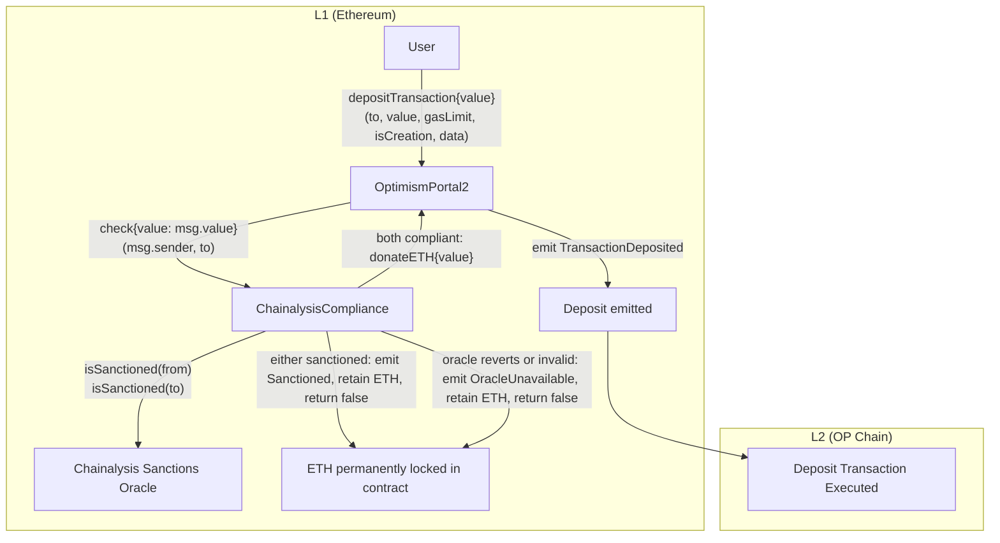
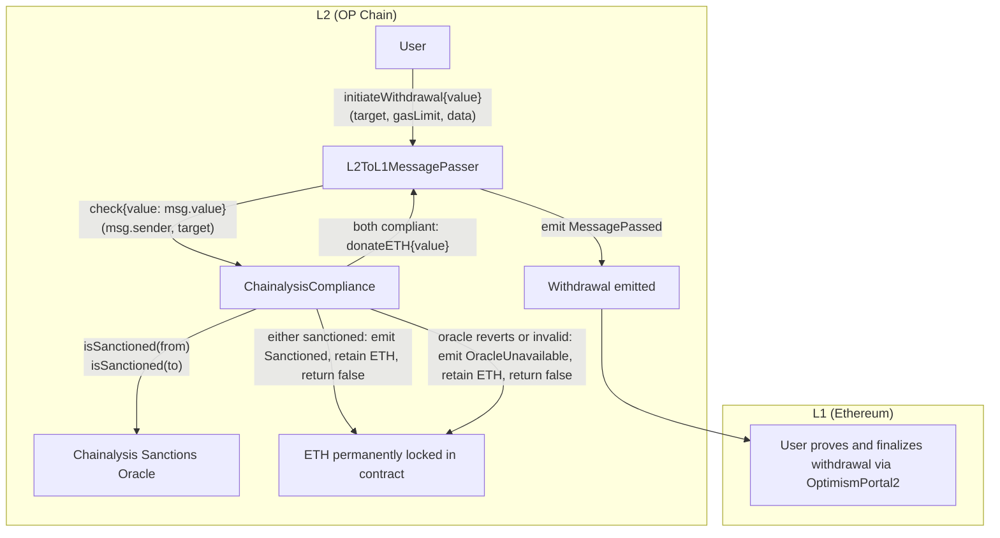

# Compliance Module: Design Doc

|                    |                                                    |
| ------------------ | -------------------------------------------------- |
| Author             | _TBD_                                              |
| Created at         | 2026-02-24                                         |
| Initial Reviewers  | _TBD_                                              |
| Need Approval From | _TBD_                                              |
| Status             | Draft                                              |

## Purpose

Introduce an optional compliance screening layer for cross-chain transactions in the Optimism
bridge. Chain operators need the ability to block deposits and withdrawals against an on-chain
sanctions list in order to meet regulatory obligations and reduce liability. This design doc
describes the smart contract changes required to support this capability, with a focus on a
minimal first iteration that integrates with the on-chain Chainalysis Sanctions Oracle.

## Summary

The compliance module adds an optional screening layer to `OptimismPortal2` (deposits) and
`L2ToL1MessagePasser` (withdrawals). When enabled, every cross-chain transaction is screened by
calling a single `ICompliance.check(from, to)` function. Compliant transactions proceed without
delay. Sanctioned transactions and oracle failures are not allowed to proceed: the bridge call
returns successfully without emitting a `TransactionDeposited` / `MessagePassed` event, and the
ETH `msg.value` is retained by the compliance contract for the chain operator to handle off-chain.

Key design decisions:

- **Single `ICompliance` interface** with one minimal function: `check(address from, address to)`
  returning `bool`. There is one concrete implementation, `ChainalysisCompliance`, which wraps the
  Chainalysis Sanctions Oracle. Operators with different requirements can ship a different
  `ICompliance` implementation without touching the bridges.
- **Forward-compatible interface.** The `check(address,address)` selector is preserved
  indefinitely. Richer signatures (passing value, gas limit, calldata, etc.) can be added later
  as additional overloads; bridges adopt the richer call when the richer screening is needed.
- **Non-blocking for compliant transactions** — no latency added when both `from` and `to` pass
  the sanctions screen.
- **Bridge never reverts on compliance grounds.** Sanctioned transactions and oracle failures
  cause `check` to return `false`; the bridge returns successfully and the compliance contract
  retains custody of the ETH. A distinct event is emitted for each non-compliant outcome so
  off-chain tooling can react.
- **Held ETH is permanently locked.** The compliance contract has no recovery path. ETH that
  arrives with a screened-out transaction stays in the contract forever — there is no
  `recover`, no `settle`, no `refund`, and no admin role with the authority to move it. This is
  a deliberate trade-off in favour of contract simplicity: the screening contract has no ETH
  egress surface, and therefore no one to compromise to drain held funds. Alternatives
  considered (auto-bounce to sender, burn to `address(0)`) are documented in the Alternatives
  section.
- **No state machine on flagged transactions.** The earlier draft's `Pending` / `Rejected` /
  `Refunded` enum, `IRule` plugin set, owner-override bit, and `settle()` / `approved()` callback
  are all removed. The bridges no longer expose an `approved()` function.
- **No owner role.** `ChainalysisCompliance` does not inherit `Ownable`. There are no admin
  functions on the deployed contract. The proxy admin (governance) retains the ability to
  upgrade the implementation, which is the only escape hatch.
- **Contracts-only scope** — no changes to client software required.
- **Opt-in** — setting the `compliance` address to `address(0)` disables the module entirely. The
  L2 genesis generation script accepts a config option to set the compliance contract in the
  `L2ToL1MessagePasser` at genesis; by default it is not set (compliance is off).
- **L2 predeploy** — the L2 compliance contract is deployed at predeploy address
  `0x420000000000000000000000000000000000002D` and set in genesis.

## Problem Statement + Context

Chain operators deploying OP Stack chains may be subject to regulatory requirements that oblige
them to screen cross-chain transactions for sanctioned addresses. Today there is no protocol-level
mechanism for a chain operator to intercept, hold, or refund a deposit or withdrawal that involves
a sanctioned counterparty. Off-chain monitoring after the fact does not prevent the transaction
from executing and does not reduce the operator's potential liability.

The Chainalysis Sanctions Oracle (`isSanctioned(address)(bool)`) is the de-facto on-chain
sanctions list — it is consumed by USDC, Tether, and other major issuers, and is published on
multiple EVM chains including Ethereum, OP Mainnet, Base, Arbitrum, Polygon, BNB and Avalanche.
Outsourcing the sanctions list to Chainalysis lets the chain operator inherit a maintained,
audited list rather than ship and curate one themselves. The compliance module described here
makes that integration the minimum viable shape, while leaving the door open for chain operators
to ship richer `ICompliance` implementations later.

## Proposed Solution

### Architecture

#### L1 → L2 Deposit Flow



#### L2 → L1 Withdrawal Flow



When `check` returns `false` on a withdrawal, the L2 nonce that would have been assigned to the
withdrawal is effectively unused: no `MessagePassed` event is emitted and no entry is added to
`sentMessages`. The `messageNonce()` counter still advances for any subsequent withdrawal. This
is acceptable because L1 does not enumerate L2 nonces during proving — proofs target a specific
message hash — so a "skipped" nonce is not observable on L1. The ETH `msg.value` is retained by
the compliance contract and is unrecoverable; the user does not get it back, and there is no
admin path to release it.

### New Interface: `ICompliance`

The bridges depend only on this minimal interface:

```solidity
/// @title ICompliance
/// @notice Compliance hook called by OptimismPortal2 (deposits) and
///         L2ToL1MessagePasser (withdrawals). Implementations are expected
///         to consult an external sanctions oracle.
///
///         When `check` returns true, the implementation MUST have already
///         returned `msg.value` to the bridge via `IDonatable.donateETH`.
///         When `check` returns false, the implementation retains custody
///         of `msg.value` and the bridge MUST NOT emit a deposit/withdrawal
///         event for this transaction.
interface ICompliance {
    function check(address from, address to)
        external
        payable
        returns (bool allowed);
}
```

**Forward compatibility.** The 4-byte selector `check(address,address)` is preserved indefinitely.
When future iterations need richer screening (passing the cross-chain value, calldata, gas limit,
nonce, or other context), a new selector is added — for example
`check(address,address,uint256,uint64,bool,bytes,uint256)` — and the bridge integration is
upgraded to call the richer signature. Old `ICompliance` implementations that only support the
minimal selector remain valid for the deployments that use them.

### New Contract: `ChainalysisCompliance`

A single concrete `ICompliance` implementation that wraps Chainalysis' Sanctions Oracle. The same
contract is used on both L1 and L2; each deployment is configured with the address of the
Chainalysis Sanctions Oracle for the chain it lives on. Operators on chains without a Chainalysis
oracle can either ship their own `ICompliance` implementation or leave compliance disabled.

The contract inherits:

- `ProxyAdminOwnedBase` — gates `initialize()` to the proxy admin or its owner.
- `ReinitializableBase` — supports versioned re-initialization for upgrades.
- OpenZeppelin's `Initializable` — standard initializer pattern.
- `ISemver` — semantic versioning (`version()` returns `"1.0.0"`).

It does **not** inherit `Ownable`. There is no admin role on the live contract; once deployed,
the only privileged action is a proxy upgrade through governance. There is also no
`ReentrancyGuard` because there is no externally callable function that performs an ETH
transfer — `check` either calls `bridge.donateETH` (compliant) or retains the value (screened
out), and the screened-out path performs no further external calls.

The contract is deployed behind an upgradeable proxy on L1 and as a predeploy on L2.
Upgradeability matters here for fixing bugs in `check` (e.g. a misconfigured oracle address or a
bad `try/catch` predicate) — not for moving held ETH, which is intentionally unrecoverable.

#### State Variables

```solidity
/// @notice Reference to OptimismPortal2 (L1) or L2ToL1MessagePasser (L2).
///         Used to enforce the caller of `check` and to route ETH back via
///         `donateETH` when both addresses pass the screen.
address payable public bridge;

/// @notice The Chainalysis Sanctions Oracle for this chain.
ISanctionsList public sanctionsOracle;

/// @notice Monotonic counter used to give each `check` call a unique id for
///         off-chain event correlation. Not used for any on-chain lookup.
uint256 private _nextId;
```

The contract intentionally has no per-transaction state mapping — it only emits events on every
non-trivial transition. Total locked ETH equals the sum of `Sanctioned.value` and
`OracleUnavailable.value` event amounts. There is no on-chain reconciliation account because
nothing ever decreases the held balance.

`initialize()` lives directly on `ChainalysisCompliance` (there is no abstract base) and is gated
by `_assertOnlyProxyAdminOrProxyAdminOwner()` from `ProxyAdminOwnedBase`. It accepts `_bridge`
and `_sanctionsOracle` only — there is no owner parameter.

#### Sanctions Oracle Interface

```solidity
/// @notice Subset of Chainalysis' Sanctions Oracle interface that this
///         contract relies on.
interface ISanctionsList {
    function isSanctioned(address) external view returns (bool);
}
```

#### Events

Each event includes an `id` for indexed correlation with the on-chain log; the id is a sequential
counter assigned at the time of the `check` call. The `Sanctioned` and `OracleUnavailable` events
include the full transaction context so off-chain tooling can audit screened-out transactions
without reconstructing them from calldata.

```solidity
/// @notice Emitted when both `from` and `to` passed the sanctions screen
///         and ETH was donated back to the bridge.
event Allowed(uint256 indexed id, address indexed from, address indexed to, uint256 value);

/// @notice Emitted when the sanctions oracle flagged either `from` or `to`.
///         The associated ETH is permanently locked in this contract.
event Sanctioned(
    uint256 indexed id,
    address indexed from,
    address indexed to,
    uint256 value,
    bool fromSanctioned,
    bool toSanctioned
);

/// @notice Emitted when the sanctions oracle reverted, ran out of gas, or
///         returned non-bool data. The associated ETH is permanently locked
///         in this contract.
event OracleUnavailable(
    uint256 indexed id,
    address indexed from,
    address indexed to,
    uint256 value
);
```

#### Functions

```solidity
/// @notice Screens a cross-chain transaction against the Chainalysis Sanctions Oracle.
/// @dev Only callable by `bridge`. Calls `isSanctioned(from)` and `isSanctioned(to)`
///      using `try/catch` so a reverting or returndata-mangling oracle is treated
///      as `OracleUnavailable` rather than propagating the revert. Branches:
///        - both compliant: forwards `msg.value` to the bridge via
///          `IDonatable.donateETH` and returns true.
///        - either sanctioned: retains `msg.value`, emits `Sanctioned`, returns false.
///        - oracle reverts/invalid: retains `msg.value`, emits `OracleUnavailable`,
///          returns false.
///      ETH retained on the screened-out paths is permanently locked.
/// @return allowed_ True if the bridge should proceed with the deposit/withdrawal.
function check(address _from, address _to)
    external
    payable
    returns (bool allowed_);
```

This is the entire externally-callable API. There is no `recover`, `withdraw`, `settle`,
`approve`, `reject`, `override`, `addRule`, `removeRule`, `transferOwnership`, or any other
function that moves ETH out of the contract. Once a `Sanctioned` or `OracleUnavailable` event
has been emitted, the associated ETH cannot be retrieved.

#### Security Considerations

- **No ETH egress surface.** The contract has only one externally callable function (`check`),
  and the only ETH transfer it ever performs is `bridge.donateETH` on the compliant path. There
  is no admin function, no settlement function, and no fallback / receive that releases ETH.
  This is the central security property: there is no key, role, or signer whose compromise
  drains held funds, because there is no code path that can drain held funds at all.
- **Reentrancy.** `check` is callable only by `bridge`, so the only reentrancy vector is a
  malicious bridge — out of scope. The external call to the Sanctions Oracle is wrapped in
  `try/catch`, isolating it from any state mutation in `check`. No `ReentrancyGuard` is needed.
- **Access control.** `check` is gated to `bridge`. There are no other gated functions because
  there are no other functions.
- **Oracle trust.** A compromised or stale oracle can produce false positives (sanctioning a
  legitimate user) or false negatives (allowing a sanctioned user). With no recovery path,
  false positives result in permanent ETH loss for the affected user. This is the most
  significant trade-off of removing the recovery path; see Risks & Uncertainties for further
  discussion. False negatives are not detectable on-chain.

### Existing Interface: `IDonatable`

When `check` is called with `{value: msg.value}`, the ETH is transferred to the compliance
contract. If both addresses pass the screen, the compliance contract returns the ETH to the
bridge so that the normal deposit or withdrawal logic can proceed. Sending ETH to the bridge via
a plain transfer would re-trigger a deposit (on L1) or a withdrawal (on L2). To avoid this, both
`OptimismPortal2` and `L2ToL1MessagePasser` implement an `IDonatable` interface.

```solidity
/// @title IDonatable
/// @notice Interface for contracts that accept ETH donations without
///         triggering side effects (deposits on L1, withdrawals on L2).
interface IDonatable {
    /// @notice Accepts ETH value without triggering a deposit or withdrawal.
    function donateETH() external payable;
}
```

### Changes to `OptimismPortal2`

`OptimismPortal2` gains a single configuration variable, `compliance`, and a single new branch in
`depositTransaction`. There is no `approved()` function and no settlement callback. The
`compliance` address is set via the `initialize()` function and is controlled by governance (L1
proxy admin owner). There is no `setCompliance` setter on `OptimismPortal2` — changing the
compliance address requires a proxy upgrade or reinitialization through governance, ensuring
stage 1 requirements are maintained.

#### New State Variables

```solidity
/// @notice Address of the compliance module (address(0) if disabled).
address public compliance;
```

#### Modified Functions

```solidity
/// @notice Initializer
/// @param _compliance The compliance module address (address(0) to disable)
function initialize(/* existing params */, address _compliance) public initializer;

/// @notice Modified depositTransaction to include compliance check
/// @dev If compliance is set and check() returns false, deposit is held
///      in the compliance module and no event is emitted.
function depositTransaction(
    address _to,
    uint256 _value,
    uint64 _gasLimit,
    bool _isCreation,
    bytes calldata _data
) public payable {
    // ... existing validation ...

    if (compliance != address(0)) {
        bool allowed = ICompliance(compliance).check{value: msg.value}(msg.sender, _to);
        if (!allowed) {
            return; // ETH custody handled by compliance module
        }
    }

    // ... existing deposit logic ...
}
```

### Changes to `L2ToL1MessagePasser`

`L2ToL1MessagePasser` gains the same single configuration variable and the same single new branch.
Unlike `OptimismPortal2`, it retains an explicit `setCompliance` setter, callable only by the
`L2ProxyAdmin` owner (governance-gated). As on L1, governance control over the compliance address
is required to maintain stage 1 requirements.

#### New State Variables

```solidity
/// @notice Address of the compliance module (address(0) if disabled).
address public compliance;
```

#### New Functions

```solidity
/// @notice Sets the compliance module address.
/// @dev Only callable by the L2ProxyAdmin owner (governance-gated).
/// @param _compliance The compliance module address (address(0) to disable).
function setCompliance(address _compliance) external;
```

#### Modified Functions

```solidity
/// @notice Modified initiateWithdrawal to include compliance check
/// @dev If compliance is set and check() returns false, the withdrawal is
///      held in the compliance module and no event is emitted. The L2
///      message nonce counter is unaffected by held withdrawals — the next
///      successful withdrawal uses the next nonce, and any nonce that
///      "would have been" assigned to a held withdrawal is simply skipped.
function initiateWithdrawal(
    address _target,
    uint256 _gasLimit,
    bytes calldata _data
) public payable {
    if (compliance != address(0)) {
        bool allowed = ICompliance(compliance).check{value: msg.value}(msg.sender, _target);
        if (!allowed) {
            return; // ETH custody handled by compliance module
        }
    }

    // ... existing withdrawal logic ...
}
```

### L2 Predeploy and Genesis Configuration

#### Predeploy Address

The L2 compliance contract is a predeploy at address `0x420000000000000000000000000000000000002D`,
deployed behind a proxy at this address in the L2 genesis state, following the same pattern as
other L2 predeploys (e.g. `L2ToL1MessagePasser` at `0x4200000000000000000000000000000000000016`).

#### Genesis Configuration

The L2 genesis generation script accepts configuration to set:

1. The Sanctions Oracle address used by `ChainalysisCompliance` on L2.
2. Whether `L2ToL1MessagePasser.compliance` is wired to the predeploy address at genesis.

By default, `L2ToL1MessagePasser.compliance` is `address(0)` (compliance off). The chain operator
must explicitly opt in. The compliance predeploy contract is always present in genesis state
regardless of this flag — the flag only controls whether `L2ToL1MessagePasser` is configured to
call it.

### Resource Usage

No significant resource impact. When enabled, the compliance module adds two `staticcall`s to the
Sanctions Oracle on the deposit/withdrawal hot path. When disabled (`compliance == address(0)`),
the overhead is a single `SLOAD` and branch.

### Single Point of Failure and Multi Client Considerations

This change is scoped entirely to smart contracts and requires no changes to client software
(`op-geth`, `op-reth`, `op-node`, etc.). There is no multi-client impact.

The Chainalysis Sanctions Oracle is a dependency on the deposit/withdrawal hot path when
compliance is enabled. If the oracle is unreachable or returns malformed data, the affected
bridge transactions are screened out and the associated ETH is permanently locked. If the chain
operator decides the oracle has been compromised, disabling compliance via
`setCompliance(address(0))` (governance-gated) restores normal bridge operation for new
transactions, but does not unlock ETH already locked by prior screened-out calls.

There is no owner key. The proxy admin (governance) is the only authority over the contract,
and its only power is to upgrade the implementation. Even via a proxy upgrade, governance
should not introduce an ETH-egress function: the absence of such a function is what makes the
contract safe to leave unattended, and reintroducing one would effectively concentrate
control of all historical locked funds in whoever holds the upgrade authority.

## Failure Mode Analysis

See [fma-compliance.md](../security/fma-compliance.md) for the full failure mode analysis. Key
failure modes include compliance-contract bugs in the bridge hot path (FM1), permanent locking
of compliant ETH from `check()` bugs or oracle false positives (FM2), access-control
misconfiguration (FM3), and Chainalysis Sanctions Oracle dependency (FM4).

## Impact on Developer Experience

The compliance module is fully opt-in. When `compliance` is set to `address(0)` (the default),
the deposit and withdrawal flows are unchanged. Application developers interacting with chains
that have not enabled the compliance module see no difference.

For chains that enable the module, developers should be aware that deposits and withdrawals
involving sanctioned addresses do not produce a `TransactionDeposited` or `MessagePassed` event;
the bridge call returns successfully but the `msg.value` is permanently locked in the compliance
contract. There is no refund path. SDK tooling should listen for `Sanctioned` and
`OracleUnavailable` events on the compliance contract and surface clear, unambiguous warnings
to users before they sign a transaction that may be screened out — the user-visible loss makes
this UX guidance more important here than under designs with a refund path.

## Alternatives Considered

### Composable `IRule` plugin system with per-transaction state machine

An earlier draft proposed a composable `IRule` plugin set, an abstract `Compliance` contract with
`L1Compliance` / `L2Compliance` concrete implementations, a four-state status enum
(`Approved` / `Pending` / `Rejected` / `Refunded`), bit-packed owner-override semantics, and a
`settle()` flow with `bridge.approved()` callbacks for held transactions. The richer design
supported manual review of "Pending" transactions, multiple composable rules (rate limits,
allowlists, calldata inspection), and per-transaction state to track each held tx through to
settlement.

It was rejected for this iteration as overscoped relative to the actual MVP requirement
(sanctions screening). The on-chain Chainalysis list answers the only question the MVP needs to
answer (`isSanctioned(address)`), and the audit surface introduced by `IRule` plugins, rule
iteration, multi-status logic, and the settle/approved callback pair was not justified by a
concrete second use case. Operators with non-sanctions screening needs can ship a custom
`ICompliance` implementation without changing the bridge integration.

### Modify the `to` on deposits to send to a "pending lockbox" on L2

Refunding isn't clean with this approach — the ETH ends up on the remote chain rather than being
returned to the depositor on L1.

### `StandardBridge` integration

Adds significant complexity. A L2-native ERC20 token with blacklist functionality would likely be
a better fit for token-level compliance.

### Compliance only on L1

It is possible to cut scope to L1-only, but the L2 portion may be necessary if the chain operator
believes that withdrawal screening is required to reduce their liability.

### Per-transaction held-status mapping with user-callable `settle`

A middle-ground design where the compliance contract tracks each screened-out transaction by
hash and exposes a `settle(preimage)` function that anyone can call to refund the original
sender or forward to the bridge after manual review. This was rejected for the same reason as
the full `IRule` design: the additional state, replay-protection logic, and `bridge.approved()`
callback surface are not justified at MVP. If user-self-refund becomes a hard requirement, this
intermediate design is the natural next step.

### Disposition of `msg.value` on screened-out transactions

Three options were considered for what to do with the ETH `msg.value` that arrives at `check`
on a sanctioned or oracle-unavailable transaction:

1. **Permanently lock in the compliance contract (chosen).** The contract has no ETH-egress
   function. ETH stays in the contract forever. *Pros:* simplest possible contract; no admin
   role; no key whose compromise drains held funds; no governance ambiguity over what to do
   with held funds. *Cons:* harsh on false positives (legitimate users incorrectly flagged
   lose their funds); harsh on transient oracle outages (legitimate users transacting during
   an outage lose their funds); no remediation if the oracle is later proven to have been
   wrong.

2. **Auto-bounce to the original sender.** On a screened-out call, the contract immediately
   `call{value: msg.value}`s the `from` address (the original `msg.sender` of the bridge
   call). *Pros:* false positives and oracle outages don't cost the user anything beyond gas;
   no funds accumulate in the compliance contract; no recovery path needed. *Cons:* the
   sender may be a contract that reverts on receipt of ETH (e.g. a contract without `receive`
   or `fallback payable`), in which case the bounce reverts and either (a) the bridge call
   reverts overall — undoing the user-visible "compliance check returned false, bridge
   returned successfully" property — or (b) the contract has to fall through to one of the
   other options as a backup, reintroducing the complexity. It also gives a sanctioned user a
   guaranteed gas-only refund channel through the bridge, which a regulator may view as
   undesirable.

3. **Burn to `address(0)`.** On a screened-out call, the contract sends `msg.value` to the
   zero address. *Pros:* eliminates the locked-ETH balance on the compliance contract
   itself, so the contract has no growing honey-pot character. *Cons:* still permanent loss
   from the user's perspective, with the additional property that the funds are removed from
   the supply. On L1 this destroys real ETH; on L2 it destroys L2 ETH (which has a
   corresponding L1 representation through the `OptimismPortal2`'s ETH balance, so burning
   on L2 does not unlock the L1 ETH). Functionally equivalent to option 1 from the user's
   perspective; differs only in where the ETH ends up.

Option 1 was chosen for MVP because it minimises contract surface and preserves auditability
(events fully document where every locked wei came from). Options 2 and 3 are reasonable
follow-ups; option 2 in particular could be added in a future revision once the failure-mode
profile of the screened-out path is better understood, with the bounce wrapped in `try/catch`
so a bouncing-fails fallback path is explicit.

## Risks & Uncertainties

- **Permanent ETH loss on false positives.** The chosen disposition for screened-out
  transactions is to permanently lock the `msg.value` in the compliance contract. A user
  incorrectly flagged by the Chainalysis Sanctions Oracle therefore loses their funds with no
  on-chain remediation. Operators must weigh this against the Chainalysis list's historical
  false-positive rate and against their tolerance for user harm. The Alternatives section
  documents auto-bounce-to-sender and burn-to-zero as alternative dispositions; either could be
  adopted in a future revision.
- **Permanent ETH loss during oracle outages.** A transient Chainalysis outage during the
  bridge call results in permanent locking of any in-flight `msg.value`. Unlike a
  recoverable-funds design, there is no after-the-fact remediation once the oracle returns.
  The hot-path nature of the dependency makes this a sustained concern.
- **Sanctions list update lag.** Chainalysis updates the on-chain list on a delay relative to
  OFAC announcements. This is unavoidable with any on-chain sanctions list and should be
  documented to chain operators.
- **L2 oracle coverage.** OP Stack chains other than those where Chainalysis publishes a
  Sanctions Oracle cannot use `ChainalysisCompliance` on L2 directly. Operators on those chains
  must either ship a custom `ICompliance` implementation or leave L2 compliance disabled.
- **Locked balance grows monotonically.** The `ChainalysisCompliance` contract's ETH balance
  only ever increases. Off-chain monitoring should track this against the cumulative sum of
  `Sanctioned` and `OracleUnavailable` event values to verify the invariant. An unexplained
  delta in either direction is a red flag.
- **L2 nonce gaps for held withdrawals.** When `check` returns false on a withdrawal, the L2
  message nonce that would have been assigned is skipped. L1 proving does not enumerate L2
  nonces, so this is invisible from the L1 side, but tooling that assumes contiguous nonces
  should be updated.
- **Upgrade authority concentration.** The proxy admin (governance) is the only authority that
  can change the contract. A governance proposal to introduce an ETH-egress function could
  unilaterally release accumulated locked funds. Operators choosing this design should
  treat that as a deliberate, scrutinized governance decision — not a routine upgrade — and
  the upgrade authority should reflect that.
