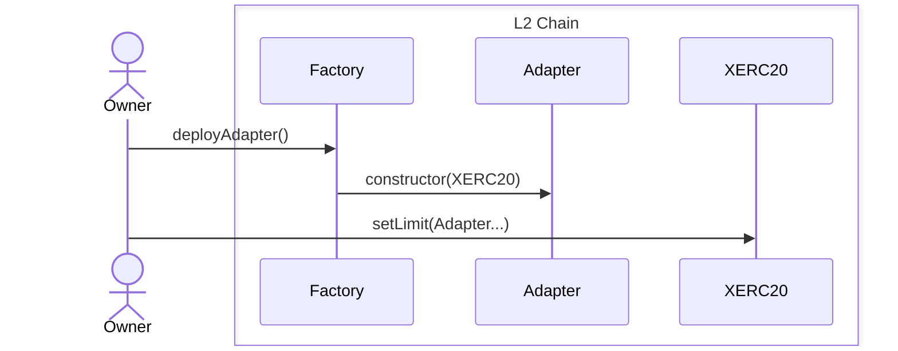
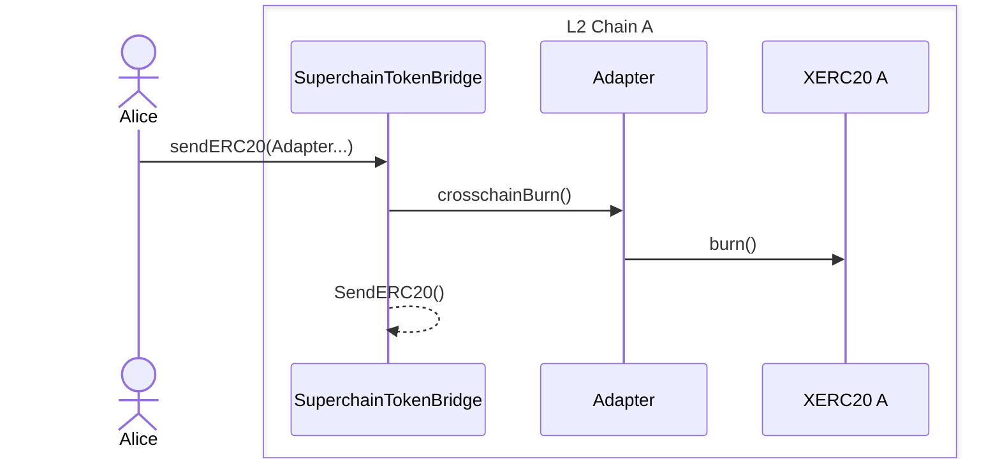
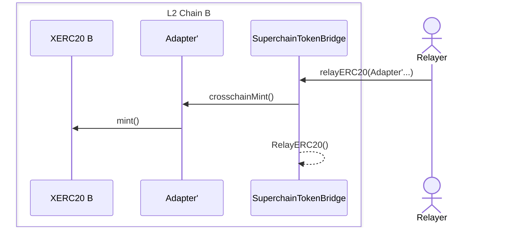
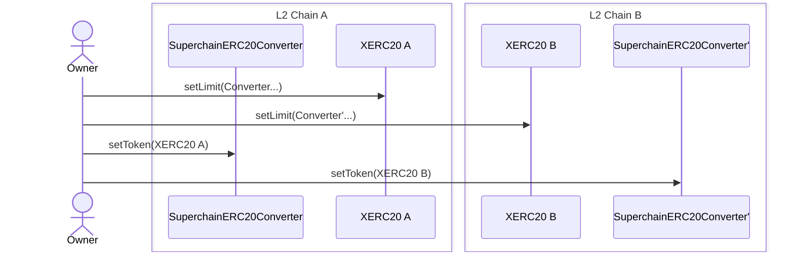
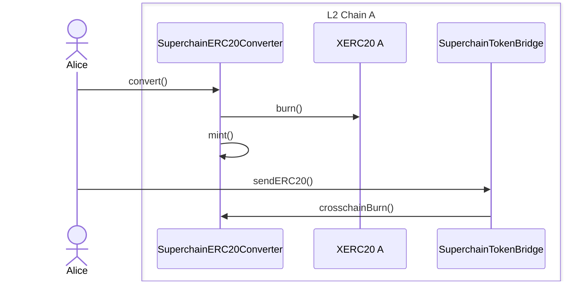
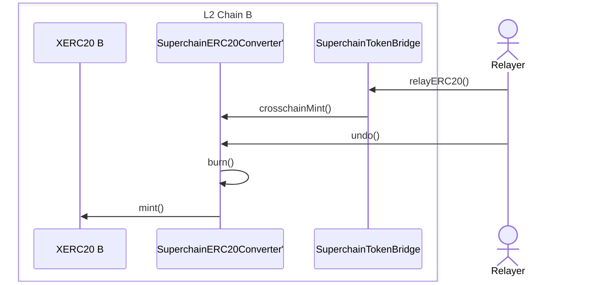
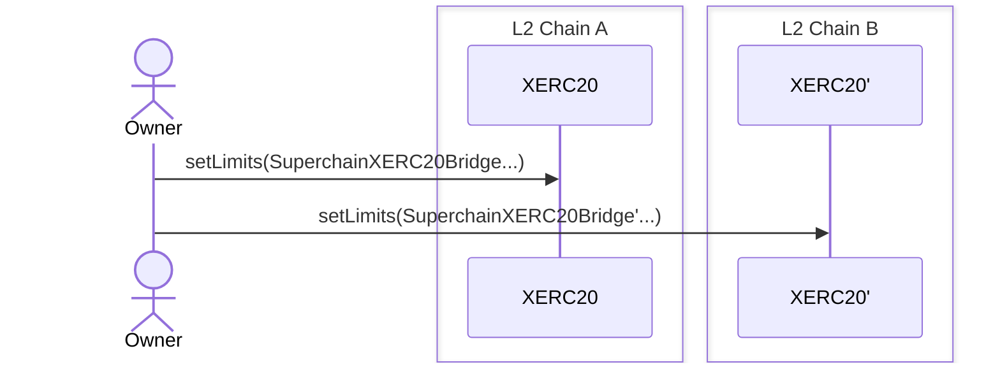
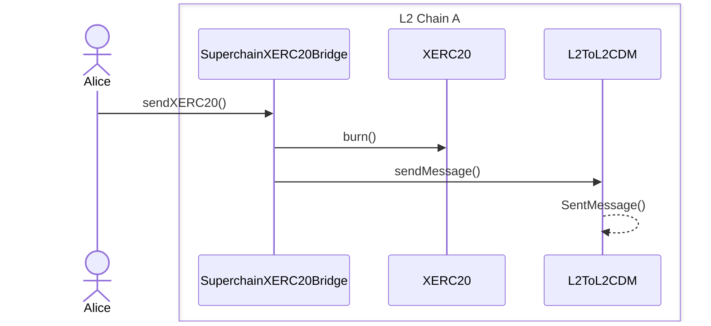
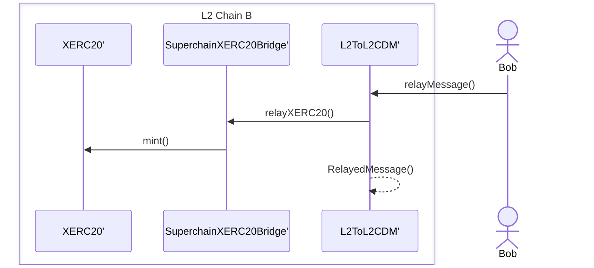

# **Purpose**

This design document aims to provide a clear implementation path for token issuers who want to make their tokens interoperable across both the Superchain and other ecosystems, while maintaining compatibility with existing bridge infrastructure.

# **Summary**

`CrosschainERC20` is a token implementation that combines [`ERC-7281`](https://ethereum-magicians.org/t/erc-7281-sovereign-bridged-tokens/14979) and [`ERC-7802`](https://ethereum-magicians.org/t/erc-7802-crosschain-token-interface/21508) functionality. This allows tokens to be immediately usable with existing bridge infrastructure while being compatible with the Superchain interop cluster.

# **Proposed Solutions**

If the asset issuer wants to make their token cross-chain interoperable today or wants their token to be available inside/outside the Superchain interop cluster, there are three approaches the asset issuer could take to make their token ready.

## **A. Non-deployed or upgradable tokens**

For tokens that have not yet been deployed, or can be upgraded, implement `CrosschainERC20` - a token that combines both `ERC-7281` (`xERC20`) and `ERC-7802` standards. This solution is ideal when:

- The token MUST work both within the Superchain or any bridge that implements `ERC-7802`.
- The token MUST work outside the Superchain using third-party bridges via `ERC-7281`.

This approach provides maximum flexibility as:

1. Within the Superchain: Uses the SuperchainTokenBridge for fast (1-block) and secure transfers
2. Outside the Superchain: Allows configuration of any EVM-compatible third-party bridge through xERC20's mint/burn permissions

## **B. Deployed, non-upgradable tokens (Non-xERC20)**

For tokens that are already deployed and cannot be upgraded, use a Lockbox mechanism:

1. Deploy a `CrosschainERC20` contract that will be the wrapped version of the original token
2. Deploy a `Lockbox` contract that:
   - Locks the original `ERC20` tokens
   - Mints `CrosschainERC20` tokens at a 1:1 ratio

Properties:

- Maintains the original token's supply while enabling Superchain functionality
- The deterministic deployment ensures the wrapped token has the same address on all chains
- Enables usage of the `SuperchainTokenBridge` since the wrapped token's address is consistent across the network
- Users can always unwrap their tokens to return to the original `ERC20`

## **C. Deployed, non-upgradable `xERC20`**

For tokens already deployed as non-upgradable `xERC20`, upgrading to implement ERC-7802 is not an option. To integrate with the Superchain while maintaining existing bridge infrastructure, an `ERC7802Adapter` can be used. This contract implements `ERC-7802`’s crosschainBurn and crosschainMint functions, translating them into the corresponding `xERC20` mint/burn operations.

Since bridges will interact with the adapter instead of the token contract, the adapter must be deployed deterministically to ensure the same address across all chains.

#### Raw Example:

```solidity
function crosschainMint(address _to, uint256 _amount) onlyBridge external {
    XERC20.mint(_to, _amount);

    emit CrosschainMint(_to, _amount, msg.sender);
}
```

#### Properties:

- Uses `SuperchainTokenBridge` or any other bridge that implements `ERC-7802`.
- Token owner has to deploy one adapter for each chain using the same address.

#### Setup Diagram:



#### Usage Diagrams:





## CrosschainERC20Factory

The Factory contract serves as a central deployment mechanism for all the components in our system. It provides methods to:

1. Deploy new `CrosschainERC20` tokens and grant mint/burn permissions to the `SuperchainTokenBridge` or any other bridge that implements `ERC-7802`.
2. Deploy Lockboxes for existing tokens that support `ERC20` interfaces
3. Deploy Adapters for existing `xERC20` tokens

**Key Features:**

- Deterministic deployments using CREATE3
- Registry of deployed contracts
- Permission management for deployments
- Single entry point for all deployments

---

## Alternatives Considered for Scenario C

_Worth mentioning that the Lockbox solution described in section B is also compatible with this scenario, providing an alternative option if the token issuer prefers to wrap their `xERC20` into a new `CrosschainERC20` token_

### **CrosschainERC20Converter**

It is a `CrosschainERC20` contract that can mint/burn `xERC20` tokens. Similar to the Lockbox mechanism, but instead of locking tokens, it performs a direct conversion.

_It would be good to add a `pause` modifier on the convert functions to force the liquidity to be moved to one direction._

Pre-requisite:

- Give mint/burn permissions to the converter.
- Token owner has to deploy the contract and set it up.

Key benefits:

- Same approach that for non `xERC20` migration, reduced complexity on development process. Allows native usage of `CrosschainERC20`/`ERC-7802`

Cons:

- Fragmented liquidity if the `xERC20` coexists with the `CrosschainERC20`
- User needs two transactions to cross-transfer

Setup Diagram:



Usage Diagrams:





### **SuperchainXERC20Bridge**

This approach introduces a new predeploy contract that acts as a bridge between `xERC20` tokens across the Superchain. The implementation requires:

Pre-requisite:

- `xERC20` addresses MUST be the same in both chains
- Configuring the `xERC20` token to grant mint/burn permissions to this predeploy

Key benefits:

- Single contract for every token
- Utilizing the `L2ToL2CrossDomainMessenger` for secure cross-chain communication

Cons:

- Discourages the adoption, prioritizing `xERC20` over `SuperchainERC20`
- Build and maintain a new predeploy.

Setup Diagram:



Usage Diagrams:




