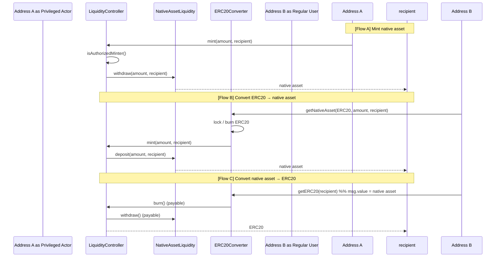
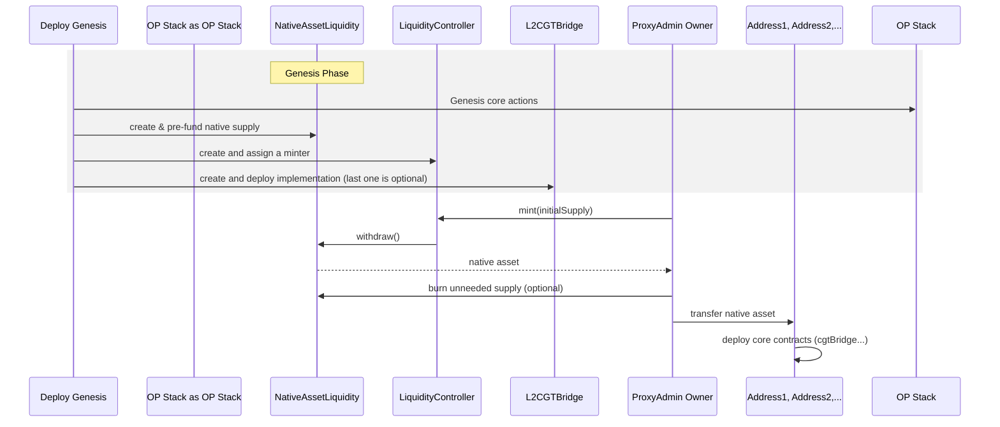
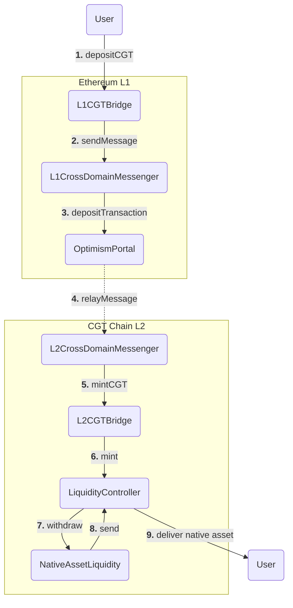

# Custom Gas Token: Design Doc

| Author | *AgusDuha, Joxes, Skeletor* |
| --- | --- |
| Created at | *2025-07-24* |
| Initial Reviewers | *Mark Tyneway, TBD* |
| Need Approval From | *TBD* |
| Status | *In Review* |

## Purpose

Enable OP Stack chains to use an asset other than ETH as their native fee currency by introducing a minimal, flexible, and standardizable Custom Gas Token (CGT) architecture. 

## Summary

The proposed Custom Gas Token upgrade lets any OP Stack chain introduce its native asset as the gas currency with almost no core-code intrusion: a single `isCustomGasToken()` flag turns off ETH transfer flows in all bridging methods, while three new pre-deploys, `NativeAssetLiquidity`, a contract with pre-minted assets, `LiquidityController`, an owner-governed mint/burn router, and `L2CGTBridge`, an reserved address that contains a contract with the API calls, hand supply control to chain governors or authorized “minter” contracts that can plug in anything from ERC-20 converters to third-party bridgind models or emission schedules. Wrapped-asset compatibility is preserved, and the entire system launches at genesis by funding the vault and letting the governor release an initial working balance. Overall, the design keeps the OP Stack lean, token-agnostic, and future-proof while unlocking custom economics and flexibility to make the native asset expressive in its manner.

## Problem Statement + Context

The prior CGT design anchored the gas token to an L1 ERC‑20, hard‑coding bridge paths, and cluttering core contracts with token metadata. These restrictions make it hard to handle the following scenarios properly:

- Integrates with a token that doesn’t live on L1.
- Launch chains whose native asset does not yet exist or have an ERC20 representation somewhere.
- Experiment with custom supply management or economics.
- Implement any novel or non-conventional bridging mechanisms.

Additionally, this design is interested in feasibly becoming a standard version for future compatibility, such as interoperability. The new design needs to keep the OP Stack lean and become future-proof.

## Proposed Solution

### Design Principles

The presented design has been thought out based on the following principles:

- Stick with a minimal set of changes.
- Remain token-agnostic and completely flexible for any use cases.
- Preserve OP Stack [foundational properties](https://specs.optimism.io/background.html#foundations), which also make Stage 2 requirements achievable.

### Architecture

**`isCustomGasToken()` in L1 and L2**

The `isCustomGasToken()` view function becomes the unique one that brings awareness to the system about whether or not the CGT mode is being used. It is a boolean flag that other functions in other contracts use to check if they can receive ETH values or not.

In L1 placed in `SystemConfig`, it will block `depositTransaction` calls that contain `msg.value`. The same will occur in their pair functions `sendMessage` in `L1CrossDomainMessenger` and ETH bridging in `L1StandardBridge`.

In L2 placed in `L1Block`, it will block `initiateWithdrawal` call, which contains `msg.value` in `L2ToL1MessagePasser`. The same will happen in `sendMessage` in `L2CrossDomainMessenger` and ETH bridging methods in `L2StandardBridge` and `FeeVaults`.

As a consequence, native asset mints and burns are decoupled from system transactions (deposits) in normal operations, and those are moved into the application layer with the new introduced predeploys.

**`NativeAssetLiquidity`, `LiquidityController` and `L2CGTBridge` Predeploys**

A very large amount of native assets is pre-minted and stored in `NativeAssetLiquidity`, which is managed through the `LiquidityController`, which has the rights to withdraw and deposit to this contract.

A code example of both contracts would look like this:

```solidity
contract NativeAssetLiquidity {
	
	// Reduce native supply
	function deposit() external payable {
	  if (msg.sender != Predeploys.LIQUIDITY_CONTROLLER) revert Unauthorized();
	}
	
	// Increase native supply
	function withdraw(uint256 _amount) external {
	  if (msg.sender != Predeploys.LIQUIDITY_CONTROLLER) revert Unauthorized();
	  new SafeSend{ value: _amount }(payable(msg.sender));
	}

	// Burn an arbitrary amount of native supply forever, ideally to be called only once
	function burn(uint256 _amount) external {
	  if (msg.sender != IProxyAdmin(Predeploys.PROXY_ADMIN).owner()) revert Unauthorized();

	  // Add burn logic here, similar to L2ToL1MessagePasser
	  Burn.eth(_amount);
}
```

```solidity
contract LiquidityController {

	mapping(address => bool) minters;

	function authorizeMinter(address _minter) external onlyOwner {
		minters[_minter] = true;
	}
	// Authorized minter can unlock native asset
	function mint(address _to, uint256 _amount) external onlyMinter {
		NALiquidity.withdraw(uint256 _amount);
		...
	}
	
	// Authorized minter can lock native asset 
	function burn() external payable onlyMinter {
		NALiquidity.deposit{value: msg.value}();
		...
	}
	
	function gasPayingAssetName() external view returns (string name) {}
	
	function gasPayingAssetSymbol() external view returns (string symbol) {}
	
}
```

Chain Governors will be responsible for giving rights to any minter into the `LiquidityController`, which has the total flexibility to decide to couple into any new or existing ERC20, bridges, or novel tokenomics mechanisms. For example, Chain governors might allow 1:1 exchanges between the native asset and a desired ERC20 representation:

```solidity
contract ERC20Converter {

  // Lock or burn the appointed ERC20 and get msg.value
	function getNativeAsset(address _to, uint256 amount) external {}

	// Send msg.value and unlock or mint the ERC20
	function getERC20(address _to) external payable {}
}
```

The flow would look like this:



To simplify the deployment process, the `L2CGTBridge` is a reserved address that contains a proxy contract, which the chain governor can point to the implementation of their conversion or bridging logic. For example, `L2CGTBridge` could point to the `ERC20Converter` implementation or to the bridge implementation if the asset is being bridged from L1 or another chain.

### Native Asset Value

Since native assets are pre-minted from genesis, the chain governor can decide how to assign value or give it meaning. This is done by understanding where the supply originates and how it reflects in `NativeAssetLiquidity` and `LiquidityController` management. There are at least three main cases:

- The simplest is to make an existing L1 ERC20 be the native asset.
- Introduce an ERC20 in L2 that contains utility functions (governance, DeFi); meanwhile, their native asset version serves as the medium to pay for gas.
- Do not depend on an existing asset, emulating how some L1 currently works.

The design allows for the inclusion of any desired features, such as rate limits, emission schedules, and a max. cap the supply, coupled with any bridge mechanism, etc. The architecture also doesn’t restrict the use of any token framework (e.g., OFT, xERC20, SuperchainERC20, etc.) to be coupled with the native asset eventually. Note that the `burn` function in `NativeAssetLiquidity` allows the chain governor to burn any extra supply during the chain’s deployment, enabling them to maintain only the desired supply of the native asset on the chain.

Existing CGT chains using the old design can perform a hard fork to set such contracts and seed the native asset liquidity.

### Wrapped Native Asset

The `WETH` (now `WNA`) predeploy would stay the same as their old version, to preserve backward compatibility with existing chains.

To align with the new design, the metadata, specifically the `name()` and `symbol()` functions, will now be sourced from the `LiquidityController` instead of the `SystemConfig` contract used in the previous design. These functions will return the name and symbol of the wrapped native asset, prefixed with "W" and "Wrapped".

### Gas-related Components

The CGT sets `Types.WithdrawalNetwork.L2` as chain type in each `FeeVaults` contracts on the constructor, without requiring contract changes. Funds are going to be sent to a desired L2 address.

To accurately charge the fees for execution and data availability, chain governors may now adjust a `minBaseFee` and `operatorFee`. In the future, other parameters or mechanisms might be included to properly account for the cost for each activity, such as adding a price oracle that converts data cost expressed in ETH into the ASSET.

### Chain Deployment

During the deployment in genesis, the CGT version comes up with the `isCustomGasToken()` flag activated, adding the new `NativeAssetLiquidity`, `LiquidityController` and `L2CGTBridge` predeploy contracts.

The deployment flow should look like this:



By default, the `ProxyAdmin` owner can release the supply at the beginning and distribute the minimal supply needed to ensure the CGT-specific contracts related to their use case are deployed.

Chain Governors must define the `SYMBOL` and `NAME` of the `WNA` in `LiquidityController`.

### ERC20 Coupling and Bridging

As the native asset isn’t enshrined to a bridge from the start, respective asset representation in L2 and LX becomes possible as the Chain governors’ discretion.

For example, if the ERC20 already lives in L1, a `CGTBridge` set of contracts might allow depositing the ERC20 and releasing native assets to the user. This design makes any other kind of bridging (from any blockchain and security model) possible.



### Resource Usage

No major changes are expected. However, the resource pricing needs to be adjusted to cover the expected costs on execution and data availability properly.

### Single Point of Failure and Multi Client Considerations

Since the `NativeAssetLiquidity` contains a large amount of pre-minted native assets, managing the supply properly becomes fundamental. Failures would affect the value of the native asset, ruining their economics and severely affecting the user-experience.

Regarding existing clients, there is no major impact expected for this design.

## Failure Mode Analysis

TBD.

## Impact on Developer Experience

The developers will present several changes with respect to an OP Stack chain that uses ETH as native asset:

- Since native asset management is decoupled from core components, obtaining native assets might vary chain-by-chain. That means that bridging, conversions, and features utilized would be different. It’s suggested to create some library or templates that cover basic uses cases (e.g., L2-native, bridging from L1) to standardize most implementations.
    - Chain Governors are encouraged to audit their implementations.
    - Developers would need to look at the chain’s docs to understand how to obtain native assets.
- `OptimismPortal` and `L2ToL1MessagePasser` don’t contain the API anymore to bridge native assets.
- Native ETH bridging is disabled, now enabled through L1-WETH, minting an `OptimismMintableERC20` representation.
- Supersim needs to be aware when CGT is being used.

## Alternatives Considered

**Maintain the old design.**

The old design required a token to exist in L1 previously. This also needed to introduce a `depositERC20Transaction` as well as the `GasToken` library that contains the relevant gas token functions to derive in L2. This design restricts native asset management by only minting new assets through a `depositTransaction`, digested by the `op-node` through a system transaction (type 126).

**Modify derivation rules to allow custom minting rules.**

Since tx type 126 only allows native assets mints through a `depositTransaction`, customizing this feature to be flexible enough would require major changes on derivation rules, `op-node`, and execution clients to permit new supply creation. Adding new tx types or new precompiles would cause issues such as divergence in current software, unnecessary breaking of existing tooling, and additional maintenance.

**Modify the execution environment and client software.**

EVM-equivalence means the native asset doesn’t have any custom feature other than the described in the EVM specs. It could be possible for the native asset to be modified to allow features such as blacklisting, whitelisting, staking, and voting at the cost of losing EVM equivalence. This would likely affect the current proof systems and fundamental APIs such as `depositTransaction`. This alternative would case similar issues on software maintenance and existing toolings, as stated above.

**Merge `NativeAssetLiquidity` and `LiquidityController`.**

As an alternative to the proposed architecture, both predeploys might be merged into a single one. 

## Risks & Uncertainties

- Any minters granted to interact with the `LiquidityController` require proper audits to ensure native asset logic can’t be broken in production, as the recovery would be costly.
    - There are two potential paths to minimize the impact: adding rate limits, and burn the unneeded supply during chain's deployment.
- There is an open discussion on how to support tokens that have other than 18 decimals. This is a concern for the minter that is placed on top of the `LiquidityController`.
    - One possible solution might be adding `decimals()` in the `LiquidityController`, or fully handling it through the minters.
- Existing OP Stack chains using old designs would need to upgrade to the new version, the solution of which is actively being architected.
- The design is proposed to facilitate its standardization, but the discussion regarding enabling interoperability is still open.
    - For example, `ETHLiquidity` and `NativeAssetLiquidity` might share the same address, and the ERC20 version of the native asset might be created with a deterministic method to enable interoperability through a `SuperchainERC20` version.
    - A new `SuperchainWETH` version might be introduced to enable interoperability for the ETH transfer.
- `L1FeeVault` might not receive the amount in value to pay for data availability, since the mismatch is corrected via `minBaseFee` and `operatorFees`. The introduction of parameters or oracles is actively being discussed.
- Native asset custom features are in early research phase, but the design is minimal enough not to block a future upgrade of this kind.

## Appendix

### Appendix A: Old vs. New CGT design

Since this design aims to be a better, minimal —yet-flexible— version of the previous CGT design, it is worth comparing the two to understand the trade-offs involved in each. Below is a quick comparative table that contrasts both approaches:

| Item | Old Design | New Design |
| --- | --- | --- |
| Approach | L1 token is used as gas asset. | The native asset exists in its own and may be convertible into an ERC20. |
| Native asset is bridgeable? | Yes, through `depositERC20Transaction` and native withdrawals. | Yes, but not enshrined in core contracts, and instead offer the reserved address for a `L2CGTBridge`. The chain governor must implement custom logic to enable it, e.g., coupling bridging with the `LiquidityController`. |
| Token Implementation Flexibility | Restricted to 18 decimals and transfer properties. | There are potentially no limitations, as long as it is coupled adequately with `NativeAssetLiquidity`. |
| WETH predeploy | Reserved for the wrapped version of the custom gas token, taking metadata from `L1Block` (`SystemConfig`). | Reserved for the wrapped version of the custom gas token. Metadata is taken from `L1Block` (`LiquidityController`). |
| Native Asset Supply | Held in `OptimismPortal`, originating from the original L1 token contract. | Minted at genesis via `NativeAssetLiquidity`. Manageable under any rules, through the controller, which may depend on an existing ERC20. |
| LX-LY/Deposit and Withdrawal Experience | Simple, via `OptimismPortal` and `L2ToL1MessagePasser`, respectively, analogous to ETH in standard chains. | Depending on the specific implementation, it could rely on a custom bridge built on top of OP Stack, a third-party bridge, or no bridge at all. |
| Token Upgradability / Chain Adaptability | No changes are recommended after chain deployment. | Allows upgrades and adaptability, since the native asset is not tied to an L1 token or specific bridge mechanism. |
| Ease of Deployment | Choose a L1 Token and deploy the chain as usual. | Deploy the chain as usual, and chain governors must deploy the relevant contracts to manage the native asset. |
