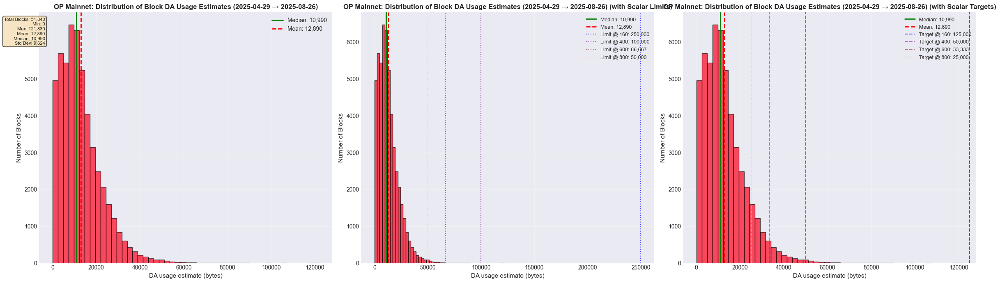
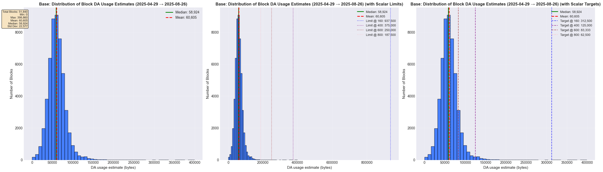

# Jovian: DA Footprint Block Limit

|                    |                                                    |
| ------------------ | -------------------------------------------------- |
| Author             | _Sebastian Stammler_                                 |
| Created at         | _2025-08-12_                                         |
| Reviewers          | _@niran @geoknee_                 |
| Status             | _In Development<!--/ In Review / Implementing Actions / Final-->_ |

## Purpose

Evaluate proposal to add a DA footprint block limit to mitigate DA spam and prevent priority fee auctions from occurring.
This proposal is an alternative to [Custom Calldata Floor Gas](https://github.com/ethereum-optimism/design-docs/pull/294),
avoiding the need to change individual transaction gas mechanics at all.

## Summary

A DA footprint block limit is introduced to mitigate DA spam and prevent priority fee auctions. By tracking DA footprint
of transactions alongside gas, this approach adjusts the block gas limit to account for high estimated DA usage without
altering individual transaction gas mechanics. Preliminary analysis shows minimal impact on most blocks on production
networks like Base or OP Mainnet.

## Problem Statement + Context

<!-- Describe the specific problem that the document is seeking to address as well
as information needed to understand the problem and design space.
If more information is needed on the costs of the problem,
this is a good place to that information. -->

The current L1 cost model doesn't account for *limited L1 data availability (DA) throughput*. 
This can lead to network congestion for batchers if the throughput on L2s surpasses that of L1 blob space, or if blob
space is congested for other reasons.

Current L1 throughput is 6 blobs per block at target with a max of 9 blobs per block. This is approx. `128 kB * 6 / 12 s
= 64 kB/s` or `96 kB/s`, resp. But Most OP Stack chains have gas targets (and limits) high enough to accept far more
than 128kb of calldata per (2s) block. So throughput has to be throttled by means other than the gas limit to prevent an
ever growing backlog of batcher data to build up. The current measure to counter high DA throughput that's being
deployed on production networks is batcher throttling. When a network is throttled at the builder policy-level, however,
its base fee can dive and lead to priority fee auctions and other unwanted user experience issues.

Also see the design doc [Custom Calldata Floor Gas](https://github.com/ethereum-optimism/design-docs/pull/294) for a
more detailed analysis of the same problem and context and a similar solution.

## Proposed Solution

A _DA footprint block limit_ is introduced to limit the total amount of estimated compressed transaction data that can
fit into a block. The base fee update rules take this new total DA footprint into account, so the base fee market isn't
broken like for policy-level throttling solutions.

The main idea is to introduce a new _DA footprint_ resource that is tracked next to gas, and limit it by the same
block gas limit. This is inspired by the
[Multidimensional Gas Metering](https://ethresear.ch/t/a-practical-proposal-for-multidimensional-gas-metering/22668)
design, but the regular gas isn't touched, like in this design for L1 Ethereum.

Similarly to the regular gas usage of transaction calldata, we calculate a transaction’s _DA footprint_ by taking
its RLP-encoding, calculate the compressed transaction DA usage estimation from
[Fjord](https://specs.optimism.io/protocol/fjord/exec-engine.html#fjord-l1-cost-fee-changes-fastlz-estimator)
and multiply it by a factor, the _DA footprint gas scalar_, to get to the transaction’s DA footprint. 

```python
da_usage_estimate = max(minTransactionSize, (intercept + fastlzCoef*fastlzSize) / 1e6)
da_footprint = da_usage_estimate * da_footprint_gas_scalar
```

Here, `fastlzSize` is the length of the FastLZ-compressed RLP-encoding of a transaction.

Now when evaluating whether a transactions still fits into a block, we take the maximum over the two resources, regular
total gas use of all transactions, and new total DA footprint, and see if this max is still below the block gas limit.
The Multidimensional Gas Metering design introduces a new block field `gas_metered` to differentiate it from `gas_used`
as the sum total of all transaction's gas used. However, it is proposed to just repurpose a block's `gas_used` field to
hold the maximum over both resources' totals:


```python
block.gas_used = max(sum(tx.gas_used), sum(tx.da_footprint if tx.type != DepositTxType))
```

A block's total DA footprint only takes non-Deposit transactions into account, because Deposit transactions aren't part
of batches, so they don't contribute to a block's DA usage.

This definition has the advantage that the base fee update mechanics just keep working, now taking into account high
total block DA footprint.

The DA footprint gas scalar is comparable to the calldata floor cost. If it's set to a higher value, say 400, you
can expect _roughly_ a 1/10 of incompressible calldata to fit into a block compared to only limiting it by
transaction gas usage alone. If the block is mostly low-calldata transactions that use much more regular gas than DA
footprint, this new mechanism wouldn’t have any effect. This is the case for the vast majority of blocks.

### DA footprint gas scalar

I propose to make the DA footprint gas scalar parameter configurable via the `SystemConfig` (as usual, by the
`SystemConfig` owner). The next Ethereum hardfork [Fusaka](https://eips.ethereum.org/EIPS/eip-7607) introduces
[Blob Parameter Only Hardforks (EIP-7892)](https://eips.ethereum.org/EIPS/eip-7892) and it is hard to estimate how
quickly blob parameters and the number and throughput of OP Stack chains will evolve over the next months, so it is hard
to set a well-informed constant now that will keep being a good constant for the foreseeable future.

However, I propose to set a DA footprint gas scalar value of `400` as a sane default that should have minimal impact on
existing and future chains, while protecting the OP Stack ecosystem from DA spam attacks because throughput of random
data would be reduced by roughly a factor of 10 compared to what is currently allowed by a block's calldata floor gas limit
alone. See also the next section for an analysis of the impact of different gas scalars on various OP Stack chains.

To get the gas scalar into the execution layer, we add a new field to the `L1Block` contract and update it during
derivation, as usual when the L1 attributes transaction is generated. Derivation also takes care of setting the default
value. A SystemConfig update with the zero value codes for the default value. So in order to _disable_ the feature, a
scalar of `1` could be used.

It should be sufficient to use a `uint16` type for the gas scalar. The maximum value would be `65,535`, which seems more
than sufficient for all use cases that we currently foresee for this feature. For a chain with 100M gas, the
implied DA usage limit with this scalar would be `1e8 / (2^16-1) ≈ 1,526` bytes. It seems very unrealistic to ever want
to set such a low DA bytes usage limit for a 100M gas chain.

### Impact on OP Stack Chains

We back-tested the estimated impact of a DA footprint block limit on Base, OP Mainnet, WorldChain, Unichain, Ink, Soneium,
Mode with various gas scalars and found that the vast majority of blocks wouldn't be affected, even with a high gas scalar
value of 800. The full analysis can be found in our
[op-analytics](https://github.com/ethereum-optimism/op-analytics/tree/main/notebooks/adhoc/jovian_analysis) repository.

For each chain, the analysis took the following approach. A random 1% of blocks were sampled from a recent 120 day
period (4/29 - 8/26). Then for each block, the DA footprint was estimated by calculating the FastLZ-based DA usage
estimation for each transaction, and then taking the total sum. This was then compared to the block's gas limit and gas
usage to see if the block would have been impacted by a DA footprint limit. If the DA footprint was below the block's gas
usage, then there wouldn't have been any impact, since the new block gas usage would be defined as the max over the
total transaction gas usages and DA footprints. If it went over the gas usage, but not gas limit, then the impact would
only have been that the new block gas usage would have been set higher (so the base fee may have potentially increased
faster), but the block still wouldn't have been limited. Only if the DA footprint also went over the gas limit, would it
have limited that block's transactions to a smaller DA footprint. For those blocks, we also looked at the
distribution of the excess DA footprint as an indicator of how much those blocks would have been limited.

The following tables show, for each analyzed chain, the resulting statistics.
* *Scalar*: DA footprint gas scalar value.
* *Effective Limit*: The DA usage limit that the given gas scalar would imply (`block_gas_limit /
  da_footprint_gas_scalar`), in estimated compressed bytes.
* *DA Usage Target*: The DA usage target that the given gas scalar would imply (`block_gas_limit / elasticity /
  da_footprint_gas_scalar`), in estimated compressed bytes. It's the effective limit divided by the elasticity.
* *Exceeding Limit*: Number and percent of blocks for which the total DA footprint exceeds the gas limit. Those blocks
  would have been limited to include fewer transactions.
* *Exc. Target*: Number and percent of blocks for which the total DA footprint exceeds the gas target. Those blocks
  would have seen a rise in base fee (possibly already because of gas usage being over the target).
* *Exc. Gas Usage*: Number and percent of blocks for which the total DA footprint exceeds the total gas usage. For those
  blocks, the `block.gas_used` field would equal the total block DA footprint instead of the total transaction gas used.
* *Avg. Utilization*: Average utilization of DA footprint resource.
* *Max Utilization*: Maximum utilization of DA footprint resource.

#### OP Mainnet

**[Random Sampling](https://htmlpreview.github.io/?https://github.com/ethereum-optimism/op-analytics/blob/main/notebooks/adhoc/jovian_analysis/notebooks/saved_output_html/op_random_2025-04-29_2025-08-26.html):**
**Chain:** `op` • **Sample Size:** `51840` blocks
**Mean DA Usage / block:** `12,890` • **Max DA Usage / block:** `121,830`

| Scalar | Effective Limit | DA Usage Target | Exceeding Limit | Exc. Target | Exc. Gas Usage | Avg. Utilization | Max Utilization |
|--------|-----------------|-----------------|-----------------|-------------|----------------|------------------|-----------------|
| 160 | 250,000 | 125,000 | 0 | 0 | 0 (0.0%) | 5.0% | 48.7% |
| 400 | 100,000 | 50,000 | 4 (0.01%) | 289 (0.56%) | 535 (1.0%) | 12.4% | 121.8% |
| 600 | 66,666 | 33,333 | 50 (0.10%) | 1865 (3.60%) | 4623 (8.9%) | 18.6% | 182.7% |
| 800 | 50,000 | 25,000 | 289 (0.56%) | 5439 (10.49%) | 12440 (24.0%) | 24.8% | 243.7% |



**[Top 1 Percentile Calldata Usage](https://htmlpreview.github.io/?https://github.com/ethereum-optimism/op-analytics/blob/main/notebooks/adhoc/jovian_analysis/notebooks/saved_output_html/op_top_percentile_2025-04-29_2025-08-26.html):**
**Chain:** `op` • **Sample Size:** `51996` blocks
**Mean DA Usage / block:** `37,625` • **Max DA Usage / block:** `130,178`

| Scalar | Effective Limit | DA Usage Target | Exceeding Limit | Exc. Target | Exc. Gas Usage | Avg. Utilization | Max Utilization |
|--------|-----------------|-----------------|-----------------|-------------|----------------|------------------|-----------------|
| 160 | 250,000 | 125,000 | 0 | 10 (0.02%) | 0 (0.0%) | 14.5% | 52.0% |
| 400 | 100,000 | 50,000 | 299 (0.58%) | 10091 (19.41%) | 5324 (10.2%) | 36.2% | 130.0% |
| 600 | 66,666 | 33,333 | 4001 (7.69%) | 26107 (50.21%) | 17993 (34.6%) | 54.2% | 195.1% |
| 800 | 50,000 | 25,000 | 10091 (19.41%) | 35954 (69.15%) | 30271 (58.2%) | 72.3% | 260.1% |

#### Base

**[Random Sampling](https://htmlpreview.github.io/?https://github.com/ethereum-optimism/op-analytics/blob/main/notebooks/adhoc/jovian_analysis/notebooks/saved_output_html/base_random_2025-04-29_2025-08-26.html):**
**Chain:** `base` • **Sample Size:** `51840` blocks
**Mean DA Usage / block:** `60,605` • **Max DA Usage / block:** `398,860`

| Scalar | Effective Limit | DA Usage Target | Exceeding Limit | Exc. Target | Exc. Gas Usage | Avg. Utilization | Max Utilization |
|--------|-----------------|-----------------|-----------------|-------------|----------------|------------------|-----------------|
| 160 | 937,500 | 312,500 | 0 | 21 (0.04%) | 0 (0.0%) | 6.7% | 45.6% |
| 400 | 375,000 | 125,000 | 7 (0.01%) | 810 (1.56%) | 52 (0.1%) | 16.7% | 114.0% |
| 600 | 250,000 | 83,333 | 45 (0.09%) | 7054 (13.61%) | 2784 (5.4%) | 25.1% | 170.9% |
| 800 | 187,500 | 62,500 | 129 (0.25%) | 23702 (45.72%) | 17400 (33.6%) | 33.5% | 227.9% |




**[Top 1 Percentile Calldata Usage](https://htmlpreview.github.io/?https://github.com/ethereum-optimism/op-analytics/blob/main/notebooks/adhoc/jovian_analysis/notebooks/saved_output_html/base_top_percentile_2025-04-29_2025-08-26.html):**
**Chain:** `base` • **Sample Size:** `52324` blocks
**Mean DA Usage / block:** `139,942` • **Max DA Usage / block:** `406,286`

| Scalar | Effective Limit | DA Usage Target | Exceeding Limit | Exc. Target | Exc. Gas Usage | Avg. Utilization | Max Utilization |
|--------|-----------------|-----------------|-----------------|-------------|----------------|------------------|-----------------|
| 160 | 937,500 | 312,500 | 0 | 1066 (2.04%) | 11 (0.0%) | 15.5% | 46.0% |
| 400 | 375,000 | 125,000 | 451 (0.86%) | 29878 (57.10%) | 2306 (4.4%) | 38.7% | 115.0% |
| 600 | 250,000 | 83,333 | 3394 (6.49%) | 49775 (95.13%) | 13540 (25.9%) | 58.0% | 172.5% |
| 800 | 187,500 | 62,500 | 8315 (15.89%) | 52159 (99.68%) | 29715 (56.8%) | 77.4% | 230.0% |

#### Ink

**[Random Sampling](https://htmlpreview.github.io/?https://github.com/ethereum-optimism/op-analytics/blob/main/notebooks/adhoc/jovian_analysis/notebooks/saved_output_html/ink_random_2025-04-29_2025-08-26.html):**
**Chain:** `ink` • **Sample Size:** `103680` blocks
**Mean DA Usage / block:** `1,232` • **Max DA Usage / block:** `114,022`

| Scalar | Effective Limit | DA Usage Target | Exceeding Limit | Exc. Target | Exc. Gas Usage | Avg. Utilization | Max Utilization |
|--------|-----------------|-----------------|-----------------|-------------|----------------|------------------|-----------------|
| 160 | 187,500 | 31,250 | 0 | 20 (0.02%) | 9 (0.0%) | 0.7% | 60.8% |
| 400 | 75,000 | 12,500 | 3 (0.00%) | 29 (0.03%) | 965 (0.9%) | 1.6% | 152.0% |
| 600 | 50,000 | 8,333 | 3 (0.00%) | 51 (0.05%) | 8705 (8.4%) | 2.5% | 228.0% |
| 800 | 37,500 | 6,250 | 20 (0.02%) | 108 (0.10%) | 12585 (12.1%) | 3.3% | 304.1% |

#### Unichain

**[Random Sampling](https://htmlpreview.github.io/?https://github.com/ethereum-optimism/op-analytics/blob/main/notebooks/adhoc/jovian_analysis/notebooks/saved_output_html/unichain_random_2025-04-29_2025-08-26.html):**
**Chain:** `unichain` • **Sample Size:** `103680` blocks
**Mean DA Usage / block:** `3,951` • **Max DA Usage / block:** `129,900`

| Scalar | Effective Limit | DA Usage Target | Exceeding Limit | Exc. Target | Exc. Gas Usage | Avg. Utilization | Max Utilization |
|--------|-----------------|-----------------|-----------------|-------------|----------------|------------------|-----------------|
| 160 | 187,500 | 31,250 | 0 | 13 (0.01%) | 1 (0.0%) | 2.1% | 69.3% |
| 400 | 75,000 | 12,500 | 4 (0.00%) | 601 (0.58%) | 4897 (4.7%) | 5.3% | 173.2% |
| 600 | 50,000 | 8,333 | 5 (0.00%) | 4884 (4.71%) | 34185 (33.0%) | 7.9% | 259.8% |
| 800 | 37,500 | 6,250 | 9 (0.01%) | 14606 (14.09%) | 51142 (49.3%) | 10.5% | 346.4% |

#### Soneium

**[Random Sampling](https://htmlpreview.github.io/?https://github.com/ethereum-optimism/op-analytics/blob/main/notebooks/adhoc/jovian_analysis/notebooks/saved_output_html/soneium_random_2025-04-29_2025-08-26.html):**
**Chain:** `soneium` • **Sample Size:** `51840` blocks
**Mean DA Usage / block:** `4,110` • **Max DA Usage / block:** `37,609`

| Scalar | Effective Limit | DA Usage Target | Exceeding Limit | Exc. Target | Exc. Gas Usage | Avg. Utilization | Max Utilization |
|--------|-----------------|-----------------|-----------------|-------------|----------------|------------------|-----------------|
| 160 | 250,000 | 31,250 | 0 | 2 (0.00%) | 0 (0.0%) | 1.6% | 15.0% |
| 400 | 100,000 | 12,500 | 0 | 1006 (1.94%) | 288 (0.6%) | 4.1% | 37.6% |
| 600 | 66,666 | 8,333 | 0 | 4708 (9.08%) | 3361 (6.5%) | 6.2% | 56.4% |
| 800 | 50,000 | 6,250 | 0 | 8805 (16.98%) | 9645 (18.6%) | 8.2% | 75.2% |

#### Mode

**[Random Sampling](https://htmlpreview.github.io/?https://github.com/ethereum-optimism/op-analytics/blob/main/notebooks/adhoc/jovian_analysis/notebooks/saved_output_html/mode_random_2025-04-29_2025-08-26.html):**
**Chain:** `mode` • **Sample Size:** `51840` blocks
**Mean DA Usage / block:** `834` • **Max DA Usage / block:** `12,973`

| Scalar | Effective Limit | DA Usage Target | Exceeding Limit | Exc. Target | Exc. Gas Usage | Avg. Utilization | Max Utilization |
|--------|-----------------|-----------------|-----------------|-------------|----------------|------------------|-----------------|
| 160 | 187,500 | 31,250 | 0 | 0 | 0 (0.0%) | 0.4% | 6.9% |
| 400 | 75,000 | 12,500 | 0 | 1 (0.00%) | 12 (0.0%) | 1.1% | 17.3% |
| 600 | 50,000 | 8,333 | 0 | 3 (0.01%) | 54 (0.1%) | 1.7% | 25.9% |
| 800 | 37,500 | 6,250 | 0 | 8 (0.02%) | 190 (0.4%) | 2.2% | 34.6% |

#### WorldChain

**[Random Sampling](https://htmlpreview.github.io/?https://github.com/ethereum-optimism/op-analytics/blob/main/notebooks/adhoc/jovian_analysis/notebooks/saved_output_html/worldchain_random_2025-04-29_2025-08-26.html):**
**Chain:** `worldchain` • **Sample Size:** `51840` blocks
**Mean DA Usage / block:** `23,774` • **Max DA Usage / block:** `74,313`

| Scalar | Effective Limit | DA Usage Target | Exceeding Limit | Exc. Target | Exc. Gas Usage | Avg. Utilization | Max Utilization |
|--------|-----------------|-----------------|-----------------|-------------|----------------|------------------|-----------------|
| 160 | 287,500 | 143,750 | 0 | 0 | 0 (0.0%) | 10.3% | 26.6% |
| 400 | 115,000 | 57,500 | 0 | 130 (0.25%) | 14 (0.0%) | 25.7% | 66.5% |
| 600 | 76,666 | 38,333 | 0 | 6771 (13.06%) | 12756 (24.6%) | 38.6% | 99.7% |
| 800 | 57,500 | 28,750 | 130 (0.25%) | 27803 (53.63%) | 40067 (77.3%) | 51.4% | 133.0% |

#### Conclusion

It can be seen that, for all chains and a scalar of `400`, for the vast majority of blocks there would have been
negligible impact since the DA footprint was smaller than even the gas target or usage. This is good, because it means
that a DA footprint would only impact a small minority of blocks, and therefore be nearly imperceptible to most users.
But since the limit is in place for every block, it would still protect against worst-case high-throughput
incompressible DA spam, which is the objective of this feature.

It can furthermore be seen that even a smaller fraction of blocks would have been limited by a DA footprint limit,
showing that under normal usage scenarios (no incompressible DA spam), a DA footprint limit has a neglegible impact on
chains.

### Resource Usage

<!-- What is the resource usage of the proposed solution?
Does it consume a large amount of computational resources or time? -->

Additional resource usage for block builders or verifiers is considered negligible, because the estimated DA usage of
transactions are already calculated since Fjord and the other calculations are trivial, only involving basic arithmetic.

### Single Point of Failure and Multi Client Considerations

<!-- Details on how this change will impact multiple clients. Do we need to plan for changes to both op-geth and op-reth? -->

## Failure Mode Analysis

<!-- Link to the failure mode analysis document, created from the fma-template.md file. -->

## Impact on Developer Experience
<!-- Does this proposed design change the way application developers interact with the protocol?
Will any Superchain developer tools (like Supersim, templates, etc.) break as a result of this change? -->

* No impact expected on users or tooling simulating individual transactions. In particular, no impact on wallets
  expected.
* The invariant is broken that the sum total of all transactions' _gas used_ is the block's _gas used_.
  If a block's total DA footprint is larger than the total transaction gas usage, the block's gas used field will be set
  to the larger total DA footprint instead. This may impact some analytics-based services like block explorers and those
  services need to be educated about the necessary steps to adapt their services to this new calculation of the block gas
  used.

## Alternatives Considered

### Alternatives to repurposing `block.gasUsed`

It is proposed to repurpose the `block.gasUsed` field to hold the new metered value of the max of a block's total
transaction gas used and DA footprint. Alternatively:
* We could introduce a new header field, say `block.gasMetered` (as proposed in the ethresearch post) to store this new
value, and then use this new field from Jovian onwards when updating the base fee. This field could either be made part
of the total block hash, by including it in the RLP-encoding, or not. It may not be necessary since the value can be
recomputed from block execution.
* We could use the existing but unused `block.blobGasUsed` field to store either the max value, or just the total DA
footprint value. This would have the advantage that no new field is introduced, and it would automatically be part of
the block hash. However, it would change the semantic meaning of the field, since OP Stack chains don't support blobs,
and if we ever want to support blobs (whatever that would mean), we'd need to change again. On the other hand, the DA footprint, being a value in
the gas dimension and a measure of a block's impact on DA storage (which is usually blobs on L1), is semantically
already close to _blob gas_, so it would make intuitive use of this unused field. The _excess blob gas_ field would still
be left unused. Implementations would need to ensure that the new use of the _blob gas used_ field wouldn't cause
unintended side effects, like updates of the blob base fee (which should still be a constant 1 for OP Stack chains).

Both alternatives would have the advantage that the meaning of the `gasUsed` field is not changed, retaining the
invariance that a block's gas used field stores the total sum of its transactions' gas used. But they would require
additional changes to the base fee update logic.

### Different designs

* [Custom Calldata Floor Gas](https://github.com/ethereum-optimism/design-docs/pull/294) - introduces customization of
  the calldata floor cost. Comparable effects, but changes gas mechanics of individual transactions.
* [L1 congestion fee](https://github.com/ethereum-optimism/design-docs/pull/312) - only proposal that could partially
  mitigate the L1 inclusion lag but is more complex to implement and harder to model and forecast the impact on
  production networks. It also doesn't set a hard cap on DA footprint throughput, but relies on market incentives
  to drive down calldata use during (modeled) congestion.

## Risks & Uncertainties

<!-- An overview of what could go wrong.
Also any open questions that need more work to resolve. -->
