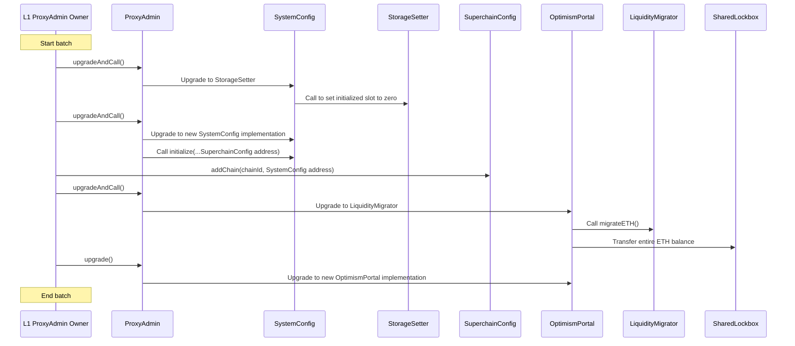

# Purpose

*The document presented below is part of the [Interoperability project](https://github.com/orgs/ethereum-optimism/projects/71/views/1?sliceBy%5Bvalue%5D=skeletor-spaceman).*

This document discusses possible solutions to address the constraints on ETH withdrawals resulting from the introduction of interop and `SuperchainWETH` that share ETH liquidity across a set of interoperable OP Chains.

# Summary

With interoperable ETH, withdrawals may fail if the referenced `OptimismPortal` lacks sufficient ETH—especially for large amounts or on OP Chains with low liquidity—since ETH liquidity isn't shared at the L1 level. To prevent users from being stuck, several solutions have been explored. Currently, the Superchain design favors the `SharedLockbox` and extends the `SuperchainConfig` as a *dependency set manager*, which is considered the most effective solution.

# Problem Statement + Context

With the introduction of interop, `SuperchainWETH` is created as a medium to move ETH across a set of interoperable chains, instead of using native ETH. To enable users to convert `SuperchainWETH` into native ETH, `ETHLiquidity` is also introduced, containing a sufficiently large virtual pool of native ETH, which can only be used for this purpose. As a result, ETH can be shared through all interconnected chains.

However, one remaining problem to solve relates to [ETH withdrawals](https://github.com/ethereum-optimism/specs/issues/362). Currently, with Interop, the amount of ETH on an L2 can differ from what is deposited in the respective `OptimismPortal`. This mismatch can interfere with the finalization of withdrawals, especially if a request requires more ETH than is actually deposited at a given time.

This means a solution is needed to achieve a truly shared `SuperchainWETH` via shared ETH liquidity given an interoperable set of chains.

# Prior considerations

Before explaining the proposed solution, it is important to note that there are essential assumptions that underpin the whole design: the Shared Security Model, Unified Chain Governance and Superchain WETH activation.

### Shared Security Model

The security model for the set of interoperable chains (commonly called a "cluster") is shared across all involved chains, ensuring that all state transitions are secured. For example, the shared security model allows for defending against any maliciously claimed state transition for any chain within the cluster. This is accomplished through a set of security features at the proof level, such as permissionless proposing, interop-provable proofs (also called shared proofs), and the presence of a single Guardian role across the entire system. This model is independent of the proof system used (e.g., ZK, fault proofs, etc.).

### Unified Chain Governance

OP Chains will be governed within a common Chain Cluster governance entity (the Collective). Currently, this entity is responsible for:

- **Ensuring chains are consistent at the implementation side**, achieved either through trusted deployment methods (e.g., OP Contracts Manager) or by approval after security checks are performed.
- **Approving protocol upgrades** for all chains involved.
- **Adding new chains** to the interoperable set, and managing the `dependencyManager` role. The final decision is up to governance and chains cannot be removed afterwards.
- **Replacing chain servicers** for existing chains if they fail to satisfy technical requirements.

### Shared Bridging and SuperchainWETH usage

In any OP Chain that joins the cluster, it is assumed that `SuperchainWETH` has been deployed in advance prior to being added to the interoperable graph. As a result, the equivalence between ETH deposits and withdrawal history and the actual ETH supply will vary from the outset. In a world with freedom of movement, all real ETH liquidity is theoretically shared across the entire cluster eventually, regardless of how deposits are handled.

# Solution

The existing problem and considerations motivate us to propose an L1 shared liquidity design through the introduction of a new `SharedLockbox` on L1, which serves as a singleton contract for ETH, given a defined set of interoperable chains. To ensure consistency, the `SuperchainConfig` is extended to act as the *dependency set manager*, controlling the op-governed dependency set that the lockbox uses as a source of truth. New ETH deposits will be directed to the lockbox, with the same process applied to ETH withdrawals.

### Spec changes
The core proposed changes are as follows:
- **Modify the `SuperchainConfig` contract**: Extend this contract to manage the dependency set of each chain, taking ownership of the `dependencyManager` role for each `SystemConfig`.
- **Introduce the `SharedLockbox` contract**: This contract acts as an escrow for ETH, receiving deposits and allowing withdrawals from approved `OptimismPortal` contracts. The `SuperchainConfig` contract serves as the source of truth of the lockbox.
- **Modify the `OptimismPortal`**: To forward ETH into the `SharedLockbox` when `depositTransaction` is called, with the inverse process applying when `finalizeWithdrawal` is called.

### Managing op-governed dependency set through `SuperchainConfig`

The `SuperchainConfig` contract will serve as the single point for managing the dependency set of a cluster and will be managed by the admin as occurs in other L1 OP contracts. This contract assumes the role of `dependencyManager` for every `SystemConfig` contract involved. Since the dependency graph follows a simple dependency, it only stores a mapping (or array) of chains added, e.g. given a `chainId`.

```solidity
// Mapping from chainId to SystemConfig address
mapping(uint256 _chainId => ISystemConfig) public systemConfigs;

// Current dependency set list
EnumerableSet.UintSet private _dependencySet;
```

Adding a new chain can be done by introducing a new function called `addChain`. The process would look as follows:

1. The `updater` calls the function with `chainId` and `SystemConfig`.
2. An external call is made to each `SystemConfig` from already added chains with the new `chainId`.
3. The new `SystemConfig` is called to add all previously existing `chainId` from `SuperchainConfig` to itself.
4. Each call concludes by emitting a `DepositedTransaction` event.
5. The `OptimismPortal` address is stored in the `Sharedlockbox` mapping.
6. Each chain asynchronously includes each new deposit and updates `dependencySet` in `L1Block`.

The [Superchain Registry](https://github.com/ethereum-optimism/superchain-registry) or the [OP Contracts Manager](https://specs.optimism.io/experimental/op-contracts-manager.html?highlight=chain#chain-id-source-of-truth) can be used as the source of truth to add chains that have been verified beforehand as compatible.

A code example would look like this:

```solidity
function addChain(uint256 _chainId, address _systemConfig) external {
  require(msg.sender == updater(), "Unauthorized");
  // Add to the dependency set and check it is not already added (`add()` returns false if it already exists)
  require(_dependencySet.add(_chainId), "Chain already added");

  // Store the system config
  systemConfigs[_chainId] = _systemConfig;

  // Loop through the dependency set and update the dependency for each chain
  for (uint256 i; i < _dependencySet.length() - 1; i++) {

    uint256 currentId = _dependencySet.at(i);

    // Skip recently added chain
    if (_chainId == currentId) continue;

    systemConfigs[currentId].addDependency(_chainId);

    systemConfigs[_chainId].addDependency(currentId);
  }

  address portal = _systemConfig.optimismPortal();

  // Authorize the portal on the shared lockbox
  SHARED_LOCKBOX.authorizePortal(portal);

  emit ChainAdded(_chainId, _systemConfig, portal);
}
```

Note that, under the specified flow, the dependency set consistently maintains the form of a [complete graph](https://en.wikipedia.org/wiki/Complete_graph) at all times.

### `SharedLockbox` implementation

A minimal set of functions should include:

- `lockETH`: Accepts ETH from the `depositTransaction` originating from a valid `OptimismPortal`.
- `unlockETH`: Releases ETH from the `finalizeWithdrawalTransaction` originating from a valid `OptimismPortal`.

Access control for `lockETH` and `unlockETH` is validated against the mapping of authorized `OptimismPortal` addresses.

### `OptimismPortal` upgrade process

A one-time L1 liquidity migration is required for each approved chain. By using an intermediate contract denominated `LiquidityMigrator` during the upgrade, all ETH held by the `OptimismPortal` can be transferred to the `SharedLockbox`. This intermediate contract functions similarly to `StorageSetter` and is used for the sole purpose of transferring the ETH balance. After this migration, the `OptimismPortal` is upgraded to the new version with the desired functionality.

Importantly, the entire upgrade process—including migrating the ETH to the `SharedLockbox` and updating the `OptimismPortal` to the latest version—can be executed in a single batched transaction. This approach ensures migration without the necessity of maintaining a persistent migration function in the final contract.

Note that migration processes may not be uniform and may vary according to the status of the chain seeking to join the OP-governed interoperable set. As stated in the previous section, chains are expected to ensure they reach the approved, OP Stack version. In practice, different migration paths could be implemented, for example, to allow chains to use the `SharedLockbox` from inception or migrate from a previous one, for example.



## Impact

The following components require an audit of the new and modified contracts: `OptimismPortal`, `SharedLockbox`, and `SuperchainConfig`. This also includes the scripts necessary to perform the migration.

# Alternatives Considered

### Reverts on L2

One alternative is not to share liquidity at the L1 level and instead prevent withdrawals from being stuck by reverting them on L2. This approach requires tracking the exact ETH balance in L2 via deposits and withdrawals. An `ETHBalance` counter would increment with new mints from deposits and decrease with successful `initiateWithdrawal` calls.

This method would require minimal changes to `L1Block` and adjustments to how `TransactionDeposited` is processed to validate new ETH counts. Additionally, it necessitates porting the initial balance as part of an upgrade transaction.

The problem with L2 reverts is that it breaks the ETH withdrawal guarantee invariant and still exposes the system to solvency issues. Based on previous feedback, this would affect existing applications and pre-deployed contracts such as the current `FeeVault` withdrawal contract logic.

### **Permission to withdraw ETH from a different Portal**

[Another solution](https://github.com/ethereum-optimism/specs/issues/362#issuecomment-2332481041) involves allowing ETH withdrawals to be finalized by taking ETH from one or more `OptimismPortal` contracts. In a cluster, this is done by authorizing withdrawals across the set of chains. For example, if  we have a dependency set composed by Chain A, B and C, a withdrawal initiated from A could be finalized by using funds from B and C if needed.

The implementation would require iterating through the dependency set, determined on L1 to find the next `OptimismPortal` with available funds. This also means `OptimismPortal` would need to have authorization and validation logic to allow to extraction ETH given an arbitrary request dictated by the loop.
**Implementation and security considerations**
Since both approaches rely on multiple `OptimismPortal` contracts and access controls, the Shared Lockbox design stays as the minimal way to implement a shared liquidity approach. Instead, allowing a looping withdrawal into each `OptimismPortal` increases the code complexity and surface of bugs during the iterative checking.


# Risks & Uncertainties

- **Scalable security**: With interop, withdrawals are a critical flow to protect, especially for ETH, since it tentatively becomes the most bridged asset across the Superchain. This means proof systems, dedicated monitoring services, the Security Council, and the Guardian need to be proven to tolerate the growing number of chains.
- **Necessity of gas optimizations**: the `addChain` function calls every `SystemConfig`, which will increase in number over time. This could lead to significant gas expenditure as the number of chains continues to grow. One possible solution could be to extend the current `addDependency`/`removeDependency` to accept an array of `chainId` values in a single deposit call. The same reasoning could apply to `L1Block`.
- **Chain list consistency around OP contracts**: OP Chains can have different statuses over time, being potentially reflected under the presence of several lists, such as those in the `OPCM`, the `SuperchainConfig` and other registries. It would make sense to coordinate on implementing the most ideal chain registry for all expected use cases, including those described in this doc.
- **`chainId` authenticity**: As mentioned above, dependency set management relies on the `chainId` value. This necessitates ensuring that each `chainId` is unique within the chain list and correctly references a `SystemConfig`. This also raises the question of whether `chainId` should be stored directly within the `SystemConfig` for added verification.
