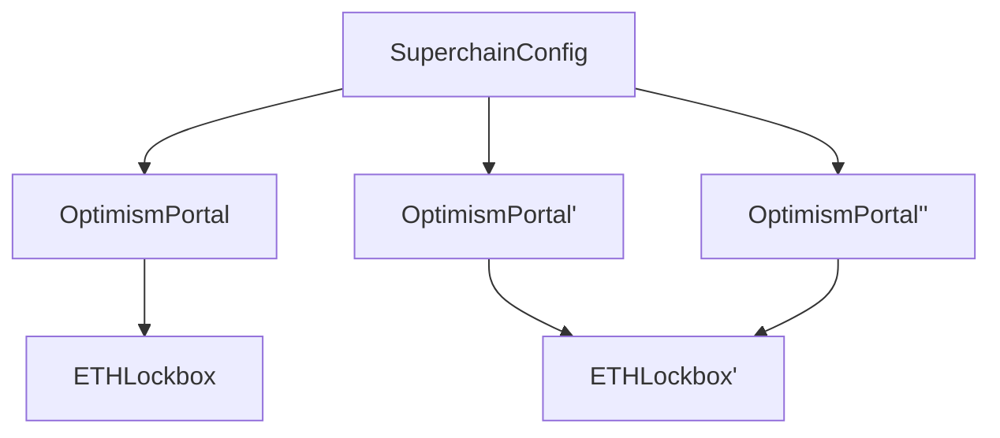

# Purpose

_The document presented below is part of the [Interoperability project](https://github.com/orgs/ethereum-optimism/projects/71/views/1?sliceBy%5Bvalue%5D=skeletor-spaceman)._

This document discusses possible solutions to address the constraints on ETH withdrawals resulting from the introduction of interop and `SuperchainWETH` that share ETH liquidity across a set of interoperable OP Chains.

# Summary

With interoperable ETH, withdrawals may fail if the referenced `OptimismPortal` lacks sufficient ETH—especially for large amounts or on OP Chains with low liquidity—since ETH liquidity isn't shared at the L1 level. To prevent users from being stuck, several solutions have been explored. Currently, the Superchain design favors the `SharedLockbox`, which is considered the most effective solution.

# Problem Statement + Context

With the introduction of interop, `SuperchainWETH` is created as a medium to move ETH across a set of interoperable chains, instead of using native ETH. To enable users to convert `SuperchainWETH` into native ETH, `ETHLiquidity` is also introduced, containing a sufficiently large virtual pool of native ETH, which can only be used for this purpose. As a result, ETH can be shared through all interconnected chains.

However, one remaining problem to solve relates to [ETH withdrawals](https://github.com/ethereum-optimism/specs/issues/362). Currently, with Interop, the amount of ETH on an L2 can differ from what is deposited in the respective `OptimismPortal`. This mismatch can interfere with the finalization of withdrawals, especially if a request requires more ETH than is actually deposited at a given time.

This means a solution is needed to achieve a truly shared `SuperchainWETH` via shared ETH liquidity given an interoperable set of chains.

# Prior considerations

Before explaining the proposed solution, it is important to note that there are essential assumptions that underpin the whole design: the Shared Security Model, Unified Chain Governance and Superchain WETH activation.

### Shared Security Model

The security model for the set of interoperable chains (commonly called a "cluster") is shared across all involved chains, ensuring that all state transitions are secured. For example, the shared security model allows for defending against any maliciously claimed state transition for any chain within the cluster. This is accomplished through a set of security features at the proof level, such as permissionless proposing, interop-provable proofs (also called shared proofs), and the presence of a single Guardian role across the entire system. This model is independent of the proof system used (e.g., ZK, fault proofs, etc.).

### Unified Chain Governance

OP Chains will be governed within a common Chain Cluster governance entity (the Collective). Currently, this entity is responsible for:

- **Ensuring chains are consistent at the implementation side**, achieved either through trusted deployment methods (e.g., OP Contracts Manager) or by approval after security checks are performed.
- **Approving protocol upgrades** for all chains involved.
- **Adding new chains** to the interoperable set. The final decision is up to governance and chains cannot be removed afterwards.
- **Replacing chain servicers** for existing chains if they fail to satisfy technical requirements.

### Shared Bridging and SuperchainWETH usage

In any OP Chain that joins the cluster, it is assumed that `SuperchainWETH` has been deployed in advance prior to being added to the interoperable graph. As a result, the equivalence between ETH deposits and withdrawal history and the actual ETH supply will vary from the outset. In a world with freedom of movement, all real ETH liquidity is theoretically shared across the entire cluster eventually, regardless of how deposits are handled.

# Solution

The existing problem and considerations motivate us to propose an L1 shared liquidity design through the introduction of a new `SharedLockbox` on L1, which serves as a singleton contract for ETH, given a defined set of interoperable chains. New ETH deposits will be directed to the lockbox, with the same process applied to ETH withdrawals.

### Spec changes

The core proposed changes are as follows:

- **Introduce the `SharedLockbox` contract**: This contract acts as an escrow for ETH, receiving deposits and allowing withdrawals from approved `OptimismPortal` contracts.
- **Modify the `OptimismPortal`**: To forward ETH into the `SharedLockbox` when `depositTransaction` is called, with the inverse process applying when `finalizeWithdrawal` is called.

### `SharedLockbox` implementation

A minimal set of functions should include:

- `lockETH`: Accepts ETH from the `depositTransaction` originating from a valid `OptimismPortal`.
- `unlockETH`: Releases ETH from the `finalizeWithdrawalTransaction` originating from a valid `OptimismPortal`.

Access control for `lockETH` and `unlockETH` is validated against the mapping of authorized `OptimismPortal` addresses.

The upgrade controller role can add `OptimismPortal` addresses to the `SharedLockbox` contract.

### `OptimismPortal` upgrade process

A permissionless ETH migration function can be added to the `OptimismPortal` to allow transferring all ETH to the `SharedLockbox` at any time. The `SharedLockbox` address is set during initialization of the `OptimismPortal` and cannot be changed afterwards.

The migration process would:

- Allow any caller to trigger the migration
- Transfer the entire ETH balance of the `OptimismPortal` to the pre-configured `SharedLockbox`

### `SharedLockbox` merge process

The `SharedLockbox` includes a migration function to allow transferring all ETH to another existing lockbox. This enables merging liquidity pools by migrating ETH from one lockbox to another, allowing multiple portals to use the same shared liquidity.

The merge process has two parts:

1. Destination lockbox preparation:

- Only the upgrade controller role can approve a specific source lockbox to send ETH
- This prevents receiving ETH from unauthorized or incorrect lockboxes

2. Source lockbox migration:

- Only the upgrade controller role can trigger the migration
- The destination lockbox is provided as a parameter during migration
- Transfer the entire ETH balance to the specified destination lockbox
- Permanently disable the current lockbox after migration

This ensures a secure way to consolidate ETH liquidity from multiple lockboxes into a single one. After migration, the portal previously using the source lockbox would need to be updated to point to the destination lockbox.

## Diagram

## Impact

The following components require an audit of the new and modified contracts: `OptimismPortal` and `SharedLockbox`.

# Alternatives Considered

### Reverts on L2

One alternative is not to share liquidity at the L1 level and instead prevent withdrawals from being stuck by reverting them on L2. This approach requires tracking the exact ETH balance in L2 via deposits and withdrawals. An `ETHBalance` counter would increment with new mints from deposits and decrease with successful `initiateWithdrawal` calls.

This method would require minimal changes to `L1Block` and adjustments to how `TransactionDeposited` is processed to validate new ETH counts. Additionally, it necessitates porting the initial balance as part of an upgrade transaction.

The problem with L2 reverts is that it breaks the ETH withdrawal guarantee invariant and still exposes the system to solvency issues. Based on previous feedback, this would affect existing applications and pre-deployed contracts such as the current `FeeVault` withdrawal contract logic.

### **Permission to withdraw ETH from a different Portal**

[Another solution](https://github.com/ethereum-optimism/specs/issues/362#issuecomment-2332481041) involves allowing ETH withdrawals to be finalized by taking ETH from one or more `OptimismPortal` contracts. In a cluster, this is done by authorizing withdrawals across the set of chains. For example, if we have a dependency set composed by Chain A, B and C, a withdrawal initiated from A could be finalized by using funds from B and C if needed.

The implementation would require iterating through the dependency set, determined on L1 to find the next `OptimismPortal` with available funds. This also means `OptimismPortal` would need to have authorization and validation logic to allow to extraction ETH given an arbitrary request dictated by the loop.
**Implementation and security considerations**
Since both approaches rely on multiple `OptimismPortal` contracts and access controls, the Shared Lockbox design stays as the minimal way to implement a shared liquidity approach. Instead, allowing a looping withdrawal into each `OptimismPortal` increases the code complexity and surface of bugs during the iterative checking.

# Risks & Uncertainties

- **Scalable security**: With interop, withdrawals are a critical flow to protect, especially for ETH, since it tentatively becomes the most bridged asset across the Superchain. This means proof systems, dedicated monitoring services, the Security Council, and the Guardian need to be proven to tolerate the growing number of chains.
