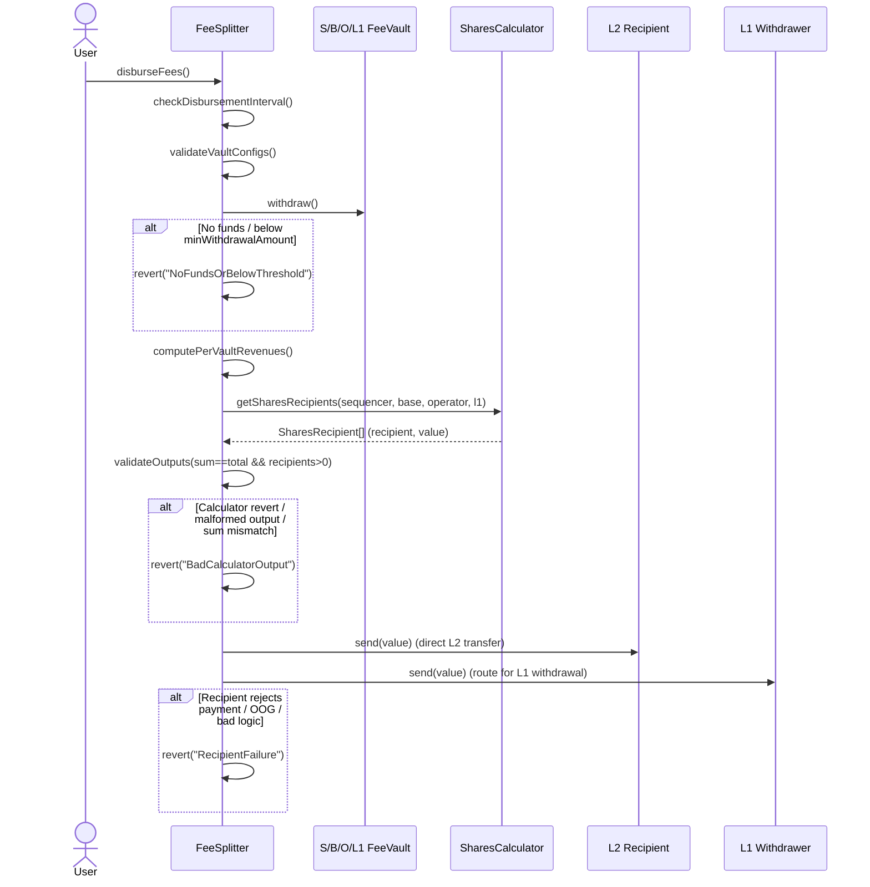

# Fee splitter

|                    |                      |
| ------------------ | -------------------- |
| Author             | _0xDiscotech_        |
| Created at         | _2025-08-21_         |
| Initial Reviewers  | _Tynes, Agus, Joxes_ |
| Need Approval From | _Tynes, Agus, Joxes_ |
| Status             | _Draft_              |

## Purpose

Enabling both Superchain and OP Stack chain operators to manage their revenue in a simple, transparent, and easily configurable way will support the development of sustainable onchain businesses. This design aims to enshrine fee split contracts as predeploys, ensuring that any existing or future OP Stack chain can benefit from battle-tested fee-split logic.

## Summary

`FeeSplitter` aggregates fees from all the `FeeVault`s on L2, enforces the configured checks, and then disburses funds to recipients based on shares computed by a pluggable `SharesCalculator`.

The calculator returns an array of disbursements—each with a `recipient`, `amount`—and `FeeSplitter` iterates through this list to execute each payout as a direct transfer to each recipient.

## Problem Statement + Context

Fixed fee shares are too rigid: chains want custom splits, L1/L2 destinations, and more complex policies. We need:

- A safe, permissioned way to plug in chain‑specific logic for revenue share calculation.
- A stable, minimal surface in `FeeSplitter` to keep operations simple.
- Compatible with existing `FeeVault`s ABI.

## Proposed Solution


The `FeeSplitter` will be a predeploy with a modular config. The `SharesCalculator` and each `Recipient` are external entities that integrate into the system.

High‑level flow:

1. Anyone can call `FeeSplitter.disburseFees()`. The `FeeSpliter` checks the disbursement interval has elapsed.
2. For each `FeeVault`, the `FeeSplitter`: 
    - Verifies vaults configs.
    - If valid, it calls `withdraw` from vaults (if they reached the min withdrawal amount threshold), pulling the funds.
    - Computes a per‑vault collected fees for granularity.
3. The `FeeSplitter` calls the chain‑configured `SharesCalculator` with:
    - The revenue per vault as input to compute disbursements.
    - Receives data from `SharedCalculator` (amounts and outputs).
4. Finally, the `FeeSplitter` transfers the respective amount to each recipient and emit `FeesDisbursed`. One possible subsequent flow is for the `L1Withdrawer` to withdraw to the `FeesDepositor`, which automatically triggers a deposit on the `OptimismPortal` on L1.

**Invariants:**

- On misconfigured vaults, `disbursementFees()` MUST revert
- On `SharesCalculator` returning either a wrong (e.g. sum mismatch) or malformed output, `disburseFees` MUST revert.
- On a recipient's payout failure, `disburseFees` MUST revert the entire transaction.
- On no funds, `disburseFees` MUST revert and MUST NOT consume the disbursement interval.
- When not on a disbursement context, `receive` MUST revert (`FeeVault.withdraw()` MUST revert if not call from the `FeeSplitter` when configured as its recipient).

## `SuperchainRevShareCalculator`

The `SuperchainRevShareCalculator` will be a `SharesCalculator` following the interface. Any contract that complies with the `ISharesCalculator` interface can be used to calculate the splits. Only the proxy admin owner will be able to set it.

```solidity
interface ISharesCalculator {
    function getSharesRecipients(
        uint256 _sequencerFeeVaultRevenue,
        uint256 _baseFeeVaultRevenue,
        uint256 _operatorFeeVaultRevenue,
        uint256 _l1FeeVaultRevenue
    )
        external
        view
        returns (SharesRecipient[] memory recipients);
}

struct SharesRecipient {
	address payable recipient;
	uint256 value;
}
```

It will split the fees between 2 recipients: `revenueShareRecipient` and `remainderRecipient`.

To calculate the share to send to the `revenueShareRecpient`, it will get the `grossRevenue` (the sum of all vaults revenue) and the `netRevenue` (fees collected only from `SequencerFeeVault`, `OperatorFeeVault`, and `BaseFeeVault`). Then, the amount to transfer to it will be the higher value between 2.5% of the `grossRevenue` and 15% of the `netRevenue` — setting the remaining balance as the amount to transfer to `remainderRecipient`.

### Resource Usage

- Compared to current “vault → L1 withdrawal” flows, this adds an extra step at disbursement time with the `FeeSplitter` as intermediate, which incurs higher gas consumption.
- The `FeeSplitter` withdraw from the four vaults in the same transaction but it also add external calls from each of them to check their correct configuration.
- Admin setter `setShareCalculator` is trivial (single storage write + event) but adds some deployment size cost.

### Single Point of Failure and Multi-Client Considerations

- No client (op‑geth/op‑reth) changes needed.
- Opt‑in and per‑chain selectable calculator. The `FeeSplitter` surface remains stable and has an impact only on the app layer.

## Failure Mode Analysis

- DoS on a very big recipients array returned by the calculator, leading to a large number of disbursements and OOG
- DoS due to very high gas consumption by a recipient ending in OOG
- Misconfigured recipients that don't allow receiving the fees from the splitter, leading to a failed disbursement.
- Buggy `SharesCalculator` that returns incorrect or malformed outputs, leading to a failed disbursement.

## Impact on Developer Experience

- Chains get a clean plug‑in point to customize revshare without forking `FeeSplitter`.
- Recipients don’t need to implement a new interface; we continue using `SafeCall.send()`.

## Alternatives Considered

- Not tracking per vault revenue, but keep using the gross and net revenue approach to keep consistent with the previous version, but losing granularity that could be useful on more complex revenue share calculations.
- Supporting a `_metadata` return value from the `SharesCalculator` and storing it so it can be externally accessed by the recipients on a disbursement context. It can help make the solution more generic and future-proof, but it adds complexity, and we see no clear use case for now.
- Transfer to L2 or withdraw to L1 based on a `withdrawalNetwork` value received from the `SharesCalculator` per recipient on the `FeeSplitter`.

## Risks & Uncertainties

- If a calculator misbehaves (sum mismatch or downstream recipients revert), disbursements will revert. We’ll validate outputs and keep calculator swaps gated by `ProxyAdmin.owner()`.

## Appendix

### Appendix A: Disbursement Flow

When `disburseFees()` is called, its sole responsibility is to handle the successive steps required to distribute funds to the recipients defined in the `SharesCalculator`. The flow depends on the configuration of each participant, and the entire call may revert if the required conditions are not met.


