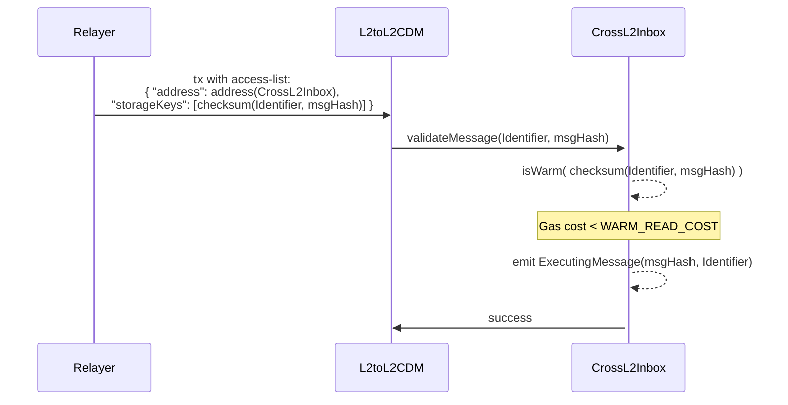
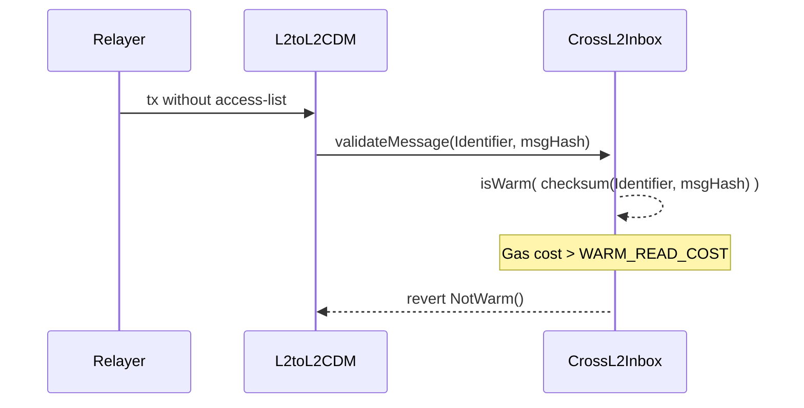

# Interop Access List - Design doc

## Purpose

This document outlines the changes required for the `CrossL2Inbox` contract and client implementations to enhance security and prevent denial of service (DoS) attacks in cross-chain message processing.

## Summary

This design introduces a new validation mechanism for cross-chain message execution using transaction access-lists. The `CrossL2Inbox` contract will implement gas introspection to validate `ExecutingMessage` transactions. Each cross-chain message must be pre-declared in the transaction's access list.

## Problem Statement + Context

Interop introduces a property where transactions can't be validated without execution, conflicting with Ethereum's goal of cheap pre-validation to prevent spam. This creates a risk where invalid interop transactions are dropped and therefore never included in the chain, causing sequencers to lose fees. MEV searchers can exploit this by attempting extraction and, if unsuccessful, rendering transactions unprocessable, paradoxically increasing spam. We need a way to cheaply validate cross-chain messages while ensuring spam incurs a cost.

## Proposed Solution

### Overview

The solution requires cross-chain messages to be statically declared in the transaction's access-list. This list is inferable in the EVM through gas introspection, and smart contracts revert if a message isn't declared. This allows sequencers to analyze transactions beforehand, minimizing resource waste from invalid ones. EVM-level reverts guarantee that a transaction can be included with no additional resource assumptions as today (nonce check, balance check).

### Static Declaration

Ethereum transactions can use access lists to specify storage slots accessed during execution, helping clients prefetch data and reduce runtime costs. While rarely used today, cross-chain message relayers will need to adopt new patterns. However, this only affects the execution of a cross-chain transaction, not the initiation, and most users will rely on relayers with the necessary tooling.

Static declaration also enables on-chain reverts per message, requiring updates to the Supervisor and `CrossL2Inbox` (detailed in [the specs](https://github.com/ethereum-optimism/specs/pull/612)). Access lists will warm a checksum slot tied to an `Identifier` and `msgHash` commitment. If warm, the commitment is valid; otherwise, the transaction reverts.

The access list will also include other types of `storageKeys` that warm slots on the `CrossL2Inbox` contract. While these slots won’t be used by the implementation, they are important for security considerations. These types, detailed in the specs, are necessary for the client to perform correct lookups. Our primary focus is the checksum key, as it’s the one we check for warmth on-chain.

### Gas introspection

Gas introspection lets contracts check if a storage slot was warmed by measuring its access cost. Warmed slots are cheaper to read, so contracts can verify if a cross-chain message was properly declared in the access list. If not, the `validateMessage` call reverts. This ensures efficient enforcement of access list rules with minimal overhead.

The main downside with this approach is that it couples key security properties to the resource schedule, which is subject to change over time. Keeping the cognitive overhead of having to test a codepath every time that the gas schedule changes can create pain.

### Implementation example

The `WARM_READ_THRESHOLD` value is up for debate, the cost difference between hot and cold is very large, but it would be good to have a consensus over it. The `calculateChecksum` will be expanded on the specs doc.

```solidity
uint256 internal constant WARM_READ_THRESHOLD = 150;

function _isWarm(bytes32 _slot) internal view returns (bool isWarm, uint256 result) {
    assembly {
        let startGas := gas()
        result := sload(_slot)
        let endGas := gas()
        isWarm := iszero(gt(sub(startGas, endGas), WARM_READ_COST))
    }
 }

function validateMessage(Identifier calldata _id, bytes32 _msgHash) external {
    bytes32 checksum = calculateChecksum(_id, _msgHash);

    (bool _isSlotWarm,) = _isWarm(checksum);

    if (!_isSlotWarm) revert NotWarm();

    emit ExecutingMessage(_msgHash, _id);
}
```

### Diagram

Example using the `L2toL2CDM` with access-list in the transaction. The `L2toL2CDM` is not needed, it is being used for diagram clarity, any contract can call the `validateMessage` function.

> Off-chain parts were skipped for simplification. The actual storage keys include more data not only the checksum. More info can be found on the specs doc.



Example using the `L2toL2CDM` without access-list in the transaction. The `L2toL2CDM` is not needed, it is being used for diagram clarity, any contract can call the `validateMessage` function.



### Alternatives considered

Alternative solutions that kept the current dynamic declaration approach were explored. The most prominent one involved adding locking and unlocking functionality to the `CrossL2Inbox`. If the transaction referenced an invalid message, then that transaction would be included at the top of the next block when the `CrossL2Inbox` was locked. Because it was locked, the invalid transaction would revert. If it referenced an valid transaction, then it would be included when the `CrossL2Inbox` was unlocked. A special transaction took care of locking and unlocking the `CrossL2Inbox`.

### Security considerations

- Future changes in gas cost can affect this solution

- Every message requires at most 3 entries in the access list and at least 2, therefore it will warms at most 3 and at least 2 storage slots, of which we only care about one. It's important that the checksum of the `Identifier` and `messageHash` data parameters provided to the `validateMessage` function doesn't result in one of these slots. We should ensure this scenario is statistically infeasible.

- There should be no combination of invalid `Identifier` and `messageHash` being considered valid when they don't reference a valid message

### Future considerations

- This design does not resolve the censorship resistance problem, it will have to be solved in another solution.
