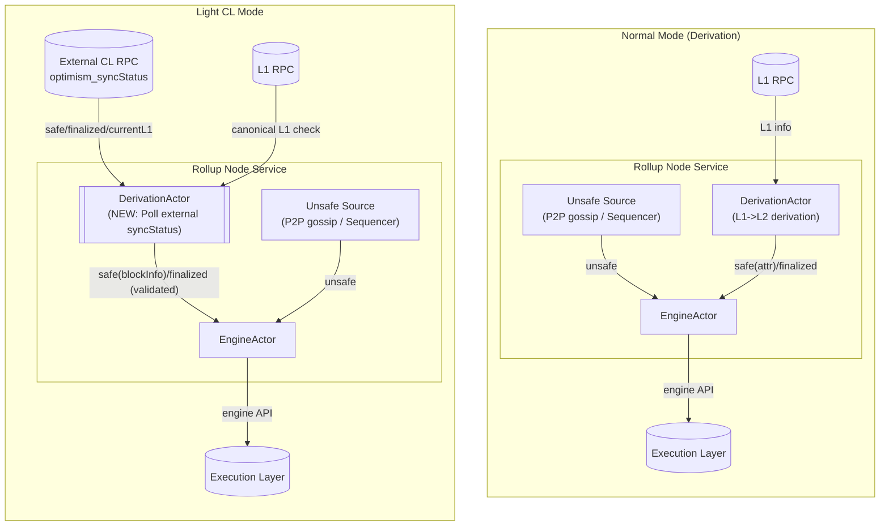

# kona-node: Light CL

|                    |                                       |
| ------------------ |---------------------------------------|
| Author             | _@pcw109550_                          |
| Created at         | _2026-01-06_                          |

## Summary

This document describes the design and implementation of a Light CL configuration of kona-node. In this mode, L1->L2 derivation is executed by an external OP Stack Consensus Layer (CL) node rather than locally. The Light CL fetches safe, finalized, and currentL1 views via RPC call, while continuing to execute the local Execution Layer (EL) and maintain unsafe chain progression.

Light CL reduces responsibility coupling within the consensus layer by separating derivation from execution and synchronization. Rather than producing safe and finalized blocks locally, kona-node ingests externally derived consensus data, validates it against canonical L1, and injects it into the local engine using well-defined rules that preserve existing OP Stack behavior, including unsafe consolidation and reorganization semantics.

This document is descriptive of the kona-node implementation, but normative with respect to Light CL invariants and behavior. It focuses on *how* light CL is realized in kona-node, including architectural changes, actor interactions / updates, and failure modes.

## Problem Statement + Context

In normal operation, an OP Stack consensus layer (CL) node is responsible for multiple tightly coupled tasks:

- Tracking unsafe, safe, and finalized views of the L2 chain
- Driving the Execution Layer (EL) to match those views
- Deriving safe and finalized L2 blocks from L1 data
- Maintaining the L1 derivation cursor (`currentL1`)

This coupling increases complexity, makes failure isolation harder, and prevents certain deployment and interoperability patterns. In particular, it is difficult to operate a CL node that executes and synchronizes L2 state without also deriving L2 state from L1.

Derivation is an expensive process, both computationally and I/O bound, and today each isolated node typically performs this work independently. As OP Stack deployments move toward interoperability scenarios, this cost becomes more pronounced: verification may require additional sanity checks across multiple L2 chains, increasing resource contention and operational overhead. In such environments, it can be desirable to delegate derivation and cross-chain sanity checking to a specialized node and have execution-focused nodes consume the resulting [`DerivationState`](#derivationstate-contract) views, rather than re-deriving them locally.

## Design Goals

Light CL is designed to:

- Fully disable local derivation logic
- Preserve unsafe chain progression semantics
- Mirror externally derived safe/finalized/currentL1 data
- Validate external data against canonical L1
- Preserve existing unsafe consolidation and reorg behavior
- Minimize changes to existing execution and networking logic

Non-goals include re-deriving or re-verifying derivation correctness locally, or providing recovery mechanisms beyond those already inherent in following an external source.

## Light CL Semantics

### Responsibilities Dropped

When Light CL is enabled, kona-node does not:

- Run any L1->L2 derivation pipeline
- Emit safe attributes
- Schedule derivation stages

### Responsibilities Retained

In light CL, kona-node continues to:

- Track and advance the unsafe L2 head
- Execute L2 blocks via the Execution Layer
- Maintain P2P networking and receive unsafe blocks
- Produce unsafe blocks when operating as a sequencer
- Track canonical L1

### `DerivationState` Contract

At the core of Light CL is the `DerivationState`(`{safeL2, finalizedL2, currentL1}`), a data structure that replaces the output of the local derivation pipeline. It is defined as:
- [`safeL2`](https://github.com/ethereum-optimism/specs/blob/349724453ffa22dd0a5c624d17a27b84602c8192/specs/glossary.md#safe-l2-head): `L2BlockInfo`
- [`finalizedL2`](https://github.com/ethereum-optimism/specs/blob/349724453ffa22dd0a5c624d17a27b84602c8192/specs/glossary.md#finalized-l2-head): `L2BlockInfo`
- [`currentL1`](https://github.com/ethereum-optimism/specs/blob/b2397eb45b77f882ccffe74bc03f87cddd3f4e26/specs/protocol/derivation.md?plain=1#L552): `L1BlockInfo`

### Authority and Trust Model

- Canonical L1 is the ultimate source of truth.
- External CL data ([`DerivationState`](#derivationstate-contract)) is assumed to be correctly derived, subject to L1 consistency checks.

### Bidirectional Messaging and Unidirectional Authority

In deployments where a Light CL sequencer delegates derivation to a normal verifier, there is a bidirectional interaction at the network (or RPC) level. The Light CL sequencer gossips unsafe blocks that the verifier may consume as candidates, while the verifier exposes [`DerivationState`](#derivationstate-contract) that the Light CL sequencer follows.

Despite this bidirectional messaging, authority remains strictly unidirectional. Unsafe blocks are proposal-only and never advance safe state. The verifier safe chain is derived from canonical L1, and the Light CL sequencer safe chain follows the verifier safe chain, not the other way around.

As a result, this interaction does not introduce circular control dependencies or correctness-level race conditions.

### External Source Contract: Derivation Delegation

Light CL requires an external CL endpoint `L2_CL_RPC` exposing the `optimism_syncStatus` RPC API. This API response [`syncStatus`](https://github.com/ethereum-optimism/specs/blob/b2397eb45b77f882ccffe74bc03f87cddd3f4e26/specs/protocol/rollup-node.md#syncstatus) provides [`DerivationState`](#derivationstate-contract). These fields are sufficient to replace local derivation output and **delegating derivation** to an external source. No additional APIs are required.

The external source is trusted to have performed derivation correctly. The light CL does not check derivation correctness; it only validates consistency with canonical L1.

#### Cycles and Authority Graph Constraints

While it is technically possible for a Light CL to follow another Light CL, operators must avoid cycles in the light CL dependency graph.

Circular dependencies in [`DerivationState`](#derivationstate-contract) authority can lead to undefined behavior and circular trust assumptions.

Operational guidance:
- The light CL dependency graph must be acyclic
- At least one node in the graph must terminate in a deriving rollup node that directly consumes L1 data

### L1 Canonicality Tracking and Validation

Although local derivation is disabled, kona-node still requires an L1 RPC endpoint. This is necessary for(non-exhaustive):

- Tracking [L1 System Config](https://github.com/ethereum-optimism/specs/blob/b2397eb45b77f882ccffe74bc03f87cddd3f4e26/specs/protocol/system-config.md) Updates
- Tracking [L1 origin](https://github.com/ethereum-optimism/specs/blob/b2397eb45b77f882ccffe74bc03f87cddd3f4e26/specs/glossary.md#l1-origin) for sequencer operation
- Validating external consensus data

Before external data is injected, kona-node validates that:

- L1 origins referenced by external safe/finalized blocks are canonical
- The external `currentL1` corresponds to a canonical L1 block

If validation fails, the external data is dropped and not applied. This validation is necessary but not sufficient for correctness; it acts as a safety gate rather than full verification.

### Finalization Source in Light CL

In light CL, kona-node no longer carries full derivation metadata and instead ingests only lightweight L2 block information(`L2BlockInfo`). Without reliable L1->L2 mapping data, the node cannot determine locally when a safe L2 block is eligible for finalization without reintroducing derivation-like tracking. To avoid this coupling, finalized state is treated as externally derived and injected directly from the external CL.

## Proposed Solution

### Overview

Kona-node updates the existing DerivationActor and EngineActor without introducing new actors. DerivationActor and EngineActor are tweaked for obtaining clear responsibility separation:

- Target Determination : Determining which L2 block should become the next safe or finalized head.
- Fork Choice Update : Applying that target to local state and performing any required reorganization.

The following diagram illustrates the difference between normal operation and light CL.

#### Unifying Safe and Finalized Target Selection

To cleanly separate the responsibility, the logic for selecting the finalized target is moved from the EngineActor to the DerivationActor. The EngineActor still executes finalization through `FinalizeTask`, but it no longer determines which block becomes finalized; it applies the finalized head selected by the DerivationActor. This change enables externally determined safe/finalized information to integrate cleanly.

#### DerivationActor - Target Determination

In normal mode:
- Derives `safeL2` as safe attributes through the local L1->L2 derivation pipeline.
- Determines `finalizedL2` by monitoring the L1 finalized head.
- Maintains derivation cursor as `currentL1`

In light CL mode:
- Uses external CL output (`safeL2` and `finalizedL2` provided as `L2BlockInfo`, `currentL1` as `L1BlockInfo`).
- Performs canonical L1 checks.

In both modes, the DerivationActor is the single authority for deciding the next safe and finalized heads, and starts determining after the initial EL sync is done.

#### EngineActor - Fork Choice Update

The EngineActor:
- Applies the safe target via `ConsolidateTask`.
- Applies the finalized target via `FinalizeTask`.
- Performs any required reorganization using existing forkchoice mechanics.
- Drives EL state transitions for promoted blocks.

`ConsolidateTask` is extended to support two input types:
- Normal mode: safe attributes (`OpAttributesWithParent`)
- Light CL mode: external `L2BlockInfo`.

During `ConsolidateTask`, In light CL mode:
- Attribute validity is assumed, rather than checked, for the provided `L2BlockInfo`.
- If the unsafe chain disagrees with the target, reorg is performed using fork choice.

`FinalizeTask` is reused unchanged.

Unsafe blocks continue to be ingested from P2P gossip or local sequencing.

## Sequencer Compatibility

Light CL is compatible with sequencer operation:

- Unsafe block production continues normally
- Safe/finalized views are externally sourced
- Unsafe blocks may be reorged to match external safe data

Sequencer logic does not assume local derivation and remains valid under these constraints.

## Failure Mode Analysis

- External CL stalls: Safe and finalized progression stalls; the node remains operational.
- External CL reorgs: The node follows and reorgs accordingly.
- L1 RPC failure: Identical to failure modes in normal operation.
- External data invalid vs L1: Data is dropped and not applied.

Light CL intentionally trades autonomy for simplicity; recovery depends on external availability.

## Risks & Uncertainties

- Reliance on external CL correctness
- Assumes long-term stability of `optimism_syncStatus` semantics

## Alternatives Considered

### Follow Actor and Follow Task

An earlier design introduced a dedicated FollowActor responsible for polling an external CL and injecting safe and finalized updates into the EngineActor via a new FollowTask. This approach treated externally derived consensus data as a parallel input path distinct from the normal derivation pipeline.

This design was ultimately rejected for the following reasons:
- It introduced an additional actor and task type without creating a clear new responsibility boundary.
- It duplicated scheduling, prioritization, and consolidation logic that already exists in the EngineActor task pipeline.
- It required custom consolidation and reorganization logic for followed updates.

