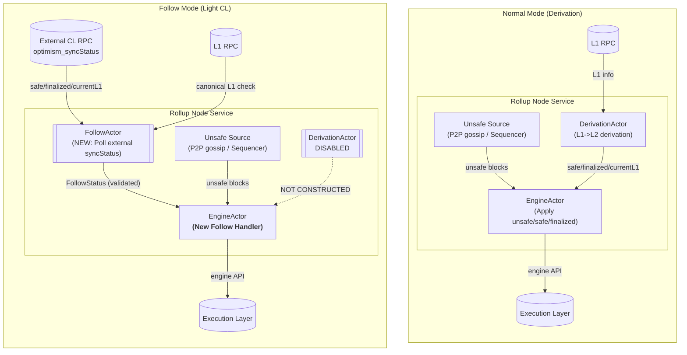

# kona-node: Light CL (Follow Mode)

|                    |                                   |
| ------------------ |-----------------------------------|
| Author             | _@pcw109550_                      |
| Created at         | _2026-01-06_                      |
| Initial Reviewers  | _@theochap_                       |
| Need Approval From |                                   |
| Status             | _Draft_                           |

## Summary

This document describes the design and implementation of Light CL (follow mode) as implemented in kona-node. In this mode, the node disables local L1->L2 derivation and instead mirrors the safe, finalized, and currentL1 views from an external OP Stack Consensus Layer (CL) node, while continuing to execute the local Execution Layer (EL) and maintain unsafe chain progression.

Light CL follow mode reduces responsibility coupling within the consensus layer by separating derivation from execution and synchronization. Rather than producing safe and finalized blocks locally, kona-node ingests externally derived consensus data, validates it against canonical L1, and injects it into the local engine using well-defined rules that preserve existing OP Stack behavior, including unsafe consolidation and reorganization semantics.

This document is descriptive of the kona-node implementation, but normative with respect to Light CL invariants and behavior. It focuses on *how* follow mode is realized in kona-node, including architectural changes, core algorithms, actor interactions, and failure modes.

## Problem Statement + Context

In normal operation, an OP Stack consensus layer (CL) node is responsible for multiple tightly coupled tasks:

- Tracking unsafe, safe, and finalized views of the L2 chain
- Driving the Execution Layer (EL) to match those views
- Deriving safe and finalized L2 blocks from L1 data
- Maintaining the L1 derivation cursor (`currentL1`)

This coupling increases complexity, makes failure isolation harder, and prevents certain deployment and interoperability patterns. In particular, it is difficult to operate a CL node that executes and synchronizes L2 state without also deriving L2 state from L1.

Derivation is an expensive process, both computationally and I/O bound, and today each isolated node typically performs this work independently. As OP Stack deployments move toward interoperability scenarios, this cost becomes more pronounced: verification may require additional sanity checks across multiple L2 chains, increasing resource contention and operational overhead. In such environments, it can be desirable to delegate derivation and cross-chain sanity checking to a specialized node and have execution-focused nodes consume the resulting `{safe, finalized, currentL1}` views, rather than re-deriving them locally.

Light CL follow mode addresses this by explicitly removing derivation responsibilities from the node. Safe, finalized, and currentL1 information is sourced from an external CL that performs derivation, while kona-node focuses on validation, execution, and synchronization.

## Design Goals

Light CL follow mode is designed to:

- Fully disable local derivation logic
- Preserve unsafe chain progression semantics
- Mirror externally derived safe/finalized/currentL1 data
- Validate external data against canonical L1
- Preserve existing unsafe consolidation and reorg behavior
- Minimize changes to existing execution and networking logic

Non-goals include re-deriving or re-verifying derivation correctness locally, or providing recovery mechanisms beyond those already inherent in following an external source.

## Light CL Core Semantics

### Responsibilities Dropped

When follow mode is enabled, kona-node does not:

- Run any L1->L2 derivation pipeline
- Emit safe attributes
- Schedule derivation stages
- Advance safe or finalized heads based on local derivation

### Responsibilities Retained

In follow mode, kona-node continues to:

- Track and advance the unsafe L2 head
- Execute L2 blocks via the Execution Layer
- Maintain P2P networking and receive unsafe blocks
- Produce unsafe blocks when operating as a sequencer
- Track canonical L1 and system configuration updates

### Authority and Trust Model

- Canonical L1 is the ultimate source of truth.
- External CL data (safe, finalized, currentL1) is assumed to be correctly derived, subject to L1 consistency checks.
- Local unsafe state is authoritative only until overridden by validated external safe data.

A hard invariant in follow mode is: The node must never emit safe attributes locally.

## External Source Contract

Follow mode requires an external CL endpoint exposing the `optimism_syncStatus` RPC API. This API provides:

- `safeL2`
- `finalizedL2`
- `currentL1`

These fields are sufficient to replace local derivation output. No additional APIs are required.

The external source is trusted to have performed derivation correctly. Kona-node does not re-derive or re-verify derivation correctness; it only validates consistency with canonical L1.

## L1 Canonicality Validation

Although derivation is disabled, kona-node still requires an L1 RPC endpoint. This is necessary for:

- Tracking system configuration updates
- Tracking L1 origin for sequencer operation
- Validating external consensus data

Before external data is injected, kona-node validates that:

- L1 origins referenced by external safe/finalized blocks are canonical
- The external `currentL1` corresponds to a canonical L1 block

If validation fails, the external data is dropped and not applied. This validation is necessary but not sufficient for correctness; it acts as a safety gate rather than full verification.

## Proposed Solution

### Follow Mode Architecture

When follow mode is enabled (`--l2.follow.source=[L2_CL_RPC]` provided):

1. The Rollup Node Service spawns a FollowActor and does not construct a DerivationActor.
2. The EngineActor completes initial EL synchronization.
3. The EngineActor signals the FollowActor that initial EL sync has completed.
4. The FollowActor polls the external CL's `optimism_syncStatus` endpoint at a fixed interval.
5. External data is validated against canonical L1.
6. Validated follow data is sent to the EngineActor.
7. Unsafe blocks continue to arrive via P2P gossip or local sequencing.

The following diagram illustrates the difference between normal operation and follow mode.
In follow mode, the DerivationActor is not constructed, and a FollowActor is introduced to
ingest and validate external consensus data before applying it to the EngineActor.

## Follow Mode Core Algorithm

The follow algorithm determines how external safe/finalized data is applied relative to local unsafe state. It consists of the following cases:

### Case 1: External Safe Ahead of Local Unsafe
The unsafe head is reset to the external safe head, and the EL is synchronized accordingly. This mirrors existing behavior where derivation advances safe beyond unsafe.

### Case 2a: External Block Not Found Locally
This indicates that EL synchronization is still in progress. The safe head is updated, but unsafe is left unchanged to avoid interrupting block insertion.

### Case 2b: External Query Error
The error is treated as transient and the update is skipped.

### Case 3: Hashes Match
Unsafe is consolidated into safe. This is equivalent to consolidation when derivation is enabled.

### Case 4: Hash Mismatch
A reorganization is detected. Unsafe is reset to the external safe head, mirroring reorg behavior under derivation.

This algorithm preserves existing OP Stack semantics for consolidation and reorganization.

## kona-node Implementation

### FollowActor

Following kona-node's actor-based architecture, external data ingestion and validation is isolated into a dedicated FollowActor.

The FollowActor is responsible for:

- Waiting for initial EL synchronization
- Polling the external CL
- Validating external data against L1
- Emitting validated follow status to the EngineActor

This actor isolates external interaction and validation logic, keeping EngineActor focused on state application and invariant preservation.

### EngineActor Integration

In follow mode, the EngineActor applies externally sourced consensus updates by enqueueing a new engine task type, `FollowTask`.

`FollowTask` is intentionally implemented as a thin wrapper over `SynchronizeTask`. Its purpose is to represent an external follow update as a first-class engine event with explicit scheduling priority, logging, and error semantics. This mirrors existing engine patterns where `InsertTask`, `ConsolidateTask`, and `FinalizeTask` are queueable events that ultimately drive engine state transitions through shared synchronization logic.

Task priority is chosen to preserve existing behavior and invariants:

- `InsertTask` (unsafe block insertion) remains the highest-priority path to avoid starving unsafe progression from P2P gossip or local sequencing.
- `FollowTask` is prioritized above `FinalizeTask` and `ConsolidateTask` to ensure externally authoritative safe/finalized updates are applied promptly.
- In follow mode, `FinalizeTask` and `ConsolidateTask` are not expected to be scheduled, as no derived attributes are produced and follow updates replace derivation-driven safe/finalized advancement.

### DerivationActor Omission

DerivationActor is not constructed in follow mode. This is intentional:

- DerivationActor owns logic that must never execute in follow mode
- Not constructing it is safer than conditionally disabling behavior

### L2Finalizer Behavior

L2Finalizer remains enabled but becomes effectively inactive:

- No derived blocks are enqueued for finalization
- L1 finality continues to be tracked
- Finality injection is handled via follow updates

This preserves L1-priority semantics without introducing special-case removal.

## Sequencer Compatibility

Follow mode is compatible with sequencer operation:

- Unsafe block production continues normally
- Safe/finalized views are externally sourced
- Unsafe blocks may be reorged to match external safe data

Sequencer logic does not assume local derivation and remains valid under these constraints.

## Failure Mode Analysis

- External CL stalls: Safe and finalized progression stalls; the node remains operational.
- External CL reorgs: The node follows and reorgs accordingly.
- L1 RPC failure: Identical to failure modes in normal operation.
- External data invalid vs L1: Data is dropped and not applied.

Follow mode intentionally trades autonomy for simplicity; recovery depends on external availability.

## Risks & Uncertainties

- Reliance on external CL correctness
- Assumes long-term stability of `optimism_syncStatus` semantics

