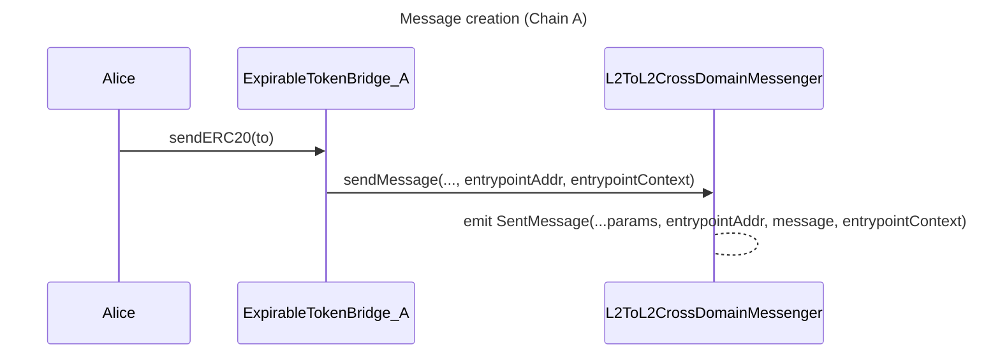
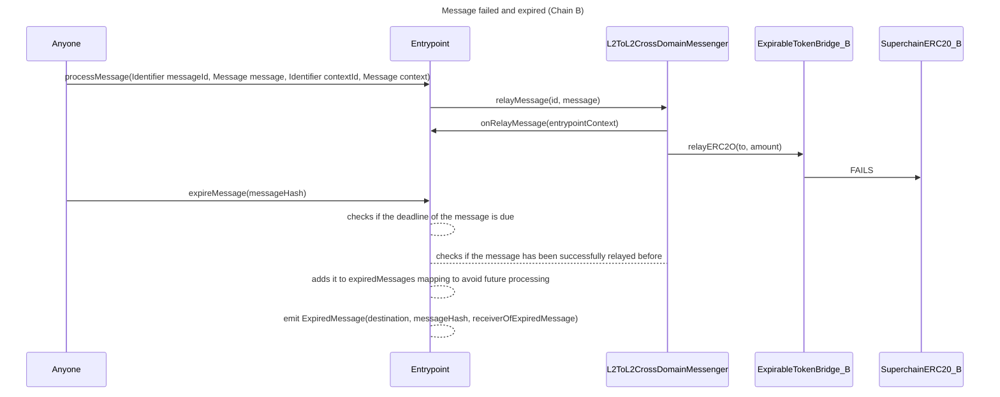
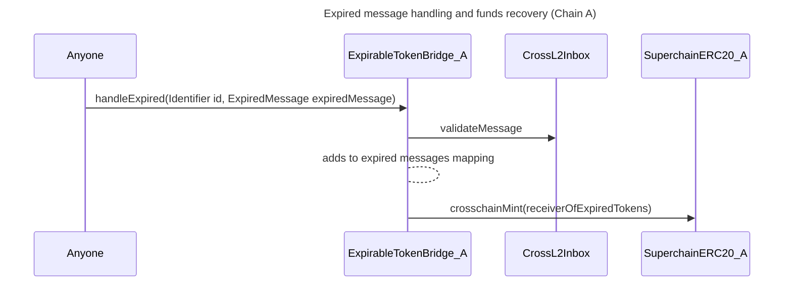

## Summary

This design document introduces `Entrypoint` contracts as a new primitive that allows anyone to add custom logic on top of the `L2ToL2CrossDomainMessenger`.
It generalizes the `L2ToL2CrossDomainMessenger` design and unlocks other interop primitives such as message batching and expiring.
To do so, the `L2ToL2CrossDomainMessenger` will allow to authorize a single address to relay a message. The authorized address can then add custom logic before executing the call.

## Problem Statement + Context

Building functionality on top of the `L2ToL2CrossDomainMessenger` is not simple. For example, to allow message recovery, the contract would need to track expired/failed messages to prevent someone from relaying them after recovery. This would require adding code on the `L2ToL2CrossDomainMessenger`. If another feature were required, we would need to add more code, which doesn’t scale.

The `Entrypoint` contract primitive solves this issue and unlocks new powerful cross-chain actions. The integration with `Entrypoint` contracts is simple, and the code difference is small.

## `Entrypoint` Contracts

### Main idea

Anyone can deploy `Entrypoint` contracts with any logic. Users can indicate, explicitly or through a contract, which `Entrypoint` contract can process their messages in the destination chain. `relayMessage` will check if the message has an `Entrypoint` associated, and if it does, it will validate that this contract is the `msg.sender`; otherwise, it will revert.

The key modification is the `msg.sender` binding feature on the `relayMessage` call. If `msg.sender` has logic, the design is equivalent to binding `relayMessage` to include a pre-hook with that logic.

Notice that post-hook design is already possible with the current design using logic on `target`.

The single authorized address design can also work to permission relaying for an EOA. There is no check that the calling address is a contract or not.

### Intuition Example

This section will describe a simple example to showcase the power of `Entrypoint` contracts. Let’s consider the situation where Alice wants to send `AliceSuperToken` from Chain A to Chain B and then swap them.

1. Alice (or anyone) deploys a `SwapperEntrypoint` as an `Entrypoint` contract in Chain B that can:
    - Receive `AliceSuperToken` tokens.
    - Swap for a target token.
2. Alice (or anyone) deploys a `CrosschainSwapper` contract in chain A that will have a `sendAndSwap()` function.
    - We assume the `CrosschainSwapper` is allowed to call `crosschainBurn()` on `AliceSuperToken`.
3. Alice calls `sendAndSwap()` . The `CrosschainSwapper` burns tokens on behalf of Alice, and calls `sendMessage()` in `L2ToL2CrossDomainMessenger` with the `SwapperEntrypoint` in destination as `entrypoint`.
4. `Alice` (or anyone) goes to the `SwapperEntrypoint` in Chain B, and calls `relaySendAndSwap()` with her message. The contract will a. Call `relayMessage()` in the `L2ToL2CrossDomainMessenger` and process her message, which relays the `AliceSuperToken` to the `SwapperEntrypoint` contract. b. Perform a swap in a Uniswap pool, for a target token. c. Optionally, the `SwapperEntrypoint` could bridge the target token back to Alice on chain A.

The message cannot be relayed by any other `msg.sender` besides the `SwapperEntrypoint`, or it will revert. This is what we mean by binding.

This will allow Alice to perform complex but safe cross-chain actions with a simple interaction in the source chain.

## `entrypointContext`

### Main idea

Following the intuition example above, we could notice a problem in 4b: the `SwapperEntrypoint` doesn’t know what pool to use, how much of the total tokens given to it to swap, or who to give the tokens to after the swap. Information is missing. `SwapperEntrypoint` could ask for these values in the `swapTokens` function, but anyone could call it with Alice’s event and provide bad values.

To solve this, `Entrypoint` contracts can define a decoding method and expect a second set of data. We will call this additional data `entrypointContext`. The context is binded into the message, meaning that its not possible to frontrun the `SentMessage` event with a different context.

`Entrypoint` can use the context however they want. It’s important to notice the `relayMessage()` is non reentrant, so the callback cannot call it back. Some possible ways to use the context are the following:

**Optimistic**

Context is assumed to be true, but revert on callback if not. 

1. In origin, Alice will encode the `entrypointContext` as a single `bytes` parameter into the `sendMessage` call. 
2. On destination, the `Entrypoint` will ask for the context as a user input, in addition to the message and id. `Entrypoint` will assume this input context is true (optimistic).
    1. `Entrypoint` will include an `onRelayMessage` callback.
3. The `Entrypoint` will check that the context is valid.
4. If so, it will call `relayMessage`, which will 
    1. validate usual properties of the message (domain binding, non-replayability).
    2. check `entrypoint == msg.sender`.
    3. do a callback to the `Entrypoint` for `onRelayMessage`, passing the encoded `entrypointContext`. `onRelayMessage` will check that the context that was inputed matches the `entrypointContext`, and revert if not.
    4. finally, call `target` with the `message`.

**Store and use later**

Some applications might not require the context at the time of the message (expire messages for instance). In that case, the `Entrypoint` can ignore the context parameter and just store it on the callback for later use.

1. In origin, Alice will encode the `entrypointContext` as a single `bytes` parameter into the `sendMessage` call.
2. On destination, the `Entrypoint` will ask for the message and id.
    1. `Entrypoint` will include an `onRelayMessage` callback.
3. `Entrypoint` will call `relayMessage`, which will
    1. validate usual properties of the message (domain binding, non-replayability).
    2. check `entrypoint == msg.sender`.
    3. do a callback to the `Entrypoint` for `onRelayMessage`, passing the encoded `entrypointContext`. `onRelayMessage` the `Entrypoint` will store the context for later use.
    4. finally, call `target` with the `message`.

### Summary of required changes

The following changes are required:

- Overload `sendMessage` to
    - include `address entrypoint` and `bytes entrypointContext`.
    - modify `SentMessage` event to include `address entrypoint` and `bytes entrypointContext`.
- Overload `relayMessage` to
    - check if `msg.sender == entrypoint` and reverts if not.
    - checks if `entrypointContext.length > 0` , and if so, it performs a callback to the `entrypoint` address with `entrypointContext` data.
- `_decodeSentMessagePayload` will decode the `entrypoint` and `entrypointContext`.
- `hashL2toL2CrossDomainMessage` will include `entrypoint` and `entrypointContext`.

## Full example: Expire messages

Here’s an example of how `Entrypoint` contracts with `entrypointContext` can enable powerful features like the expiration of messages:

Suppose an `ExpirableTokenBridge` contract exists, that uses an `Entrypoint` with the added functionality of expiring a failed message in destination. `ExpirableTokenBridge` has minting and burning rights over `SuperchainERC20`.

- Alice will transfer `AliceSuperToken` from Chain A to Chain B through the `ExpirableTokenBridge`, alongside some optional expiring parameters (that will get encoded in the `entrypointContext`).
- If `AliceSuperToken` has not yet been deployed, relaying the message from the `Entrypoint` will fail. The `Entrypoint` can optionally store the `entrypointContext`.
- The user will then use the `Entrypoint` functionality to expire the message in chain B, making it non-processable by adding it to a mapping.  This will emit a message that the contract in Chain A can consume to handle the expired message. This call might optionally check the stored context as well for time windows or allowed senders.
Any call to the `Entrypoint` to relay the expired message will revert. As the `Entrypoint` is the only contract that can process this message in the `L2ToL2CrossDomainMessenger`, the expired message is effectively non-processable in Chain B.

The sequence diagrams will be divided in three:

1. Shows the initiating interaction of the user with the `ExpirableTokenBridge` to send the message to Chain B.
2. Shows the interaction of the user in Chain B with the `Entrypoint` to process the expirable message, and shows how it fails to be relayed, and how the `Entrypoint` expires it.
3. Shows the interaction of the user back with the `ExpirableTokenBridge` in Chain A to recover the lost tokens.

## Notes and Open Questions

- Notice the modifications basically unlock permissioned relaying. `Entrypoints` are the most clear and useful way to take benefit of this permission control, but it could potentially be used for other actions.
- Names are all up for debate and change.
- For `EntrypointContext`, should we emit the full struct, an encoded bytes or a hash?