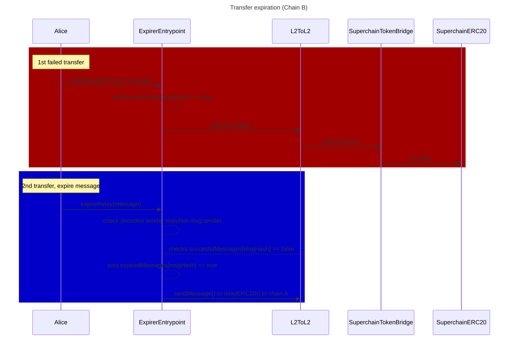
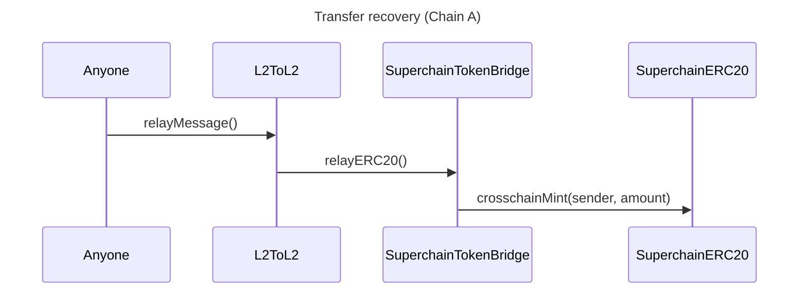

## Summary

This design document introduces a new primitive called `entrypoint` that enables users to specify a custom relaying address on the destination chain when sending cross-chain messages. 
By allowing users to choose a contract as their `entrypoint`, they can incorporate custom logic before and after the message is relayed. This generalizes the functionality of the `L2ToL2CrossDomainMessenger` and unlocks advanced interoperability features such as message batching and message expiration handling.

Integrating the entrypoint primitive requires minimal changes to the existing `L2ToL2CrossDomainMessenger`. Specifically, the `sendMessage` function is extended to include an optional `address entrypoint` parameter, which is emitted in the `SentMessage `event. On the destination chain, the `relayMessage` function is modified to permit only the specified `entrypoint` address to process the message, if one is assigned.

## Problem Statement + Context

Building functionality on top of the `L2ToL2CrossDomainMessenger` is not simple. For example, to allow message recovery, the contract would need to track expired/failed messages to prevent someone from relaying them after recovery. This would require adding code on the `L2ToL2CrossDomainMessenger`. If another feature were required, we would need to add more code, which doesn’t scale.

The `entrypoint` primitive solves this issue and unlocks new powerful cross-chain actions. The integration with `entrypoint` is simple, and the code difference is small.

## `entrypoint`

### Main idea

When sending a message through the `L2ToL2CrossDomainMessenger`, users can indicate which `entrypoint` address can process their messages in the destination chain. `relayMessage` will check if the message has an `entrypoint` associated, and if it does, it will validate that this contract is the `msg.sender`; otherwise, it will revert.

The key modification is the `msg.sender` binding feature on the `relayMessage` call. If `msg.sender` has logic, the design is equivalent to binding `relayMessage` to include a pre-hook with that logic.
Notice that post-hook design is already possible with the current design using logic on `target`.

The integration to the `L2ToL2CrossDomainMessenger` will not require any specific interface for the `entrypoint` address. As a matter of fact, the `entrypoint` can be a custom contract (that we will call `Entrypoint`) or an EOA. Anyone can deploy `Entrypoint` contracts.

### Use cases

The `entrypoint` primitive simplifies cross-chain interactions and enables powerful new functionalities by allowing custom logic during message relaying. Below are some key use cases illustrating its potential:

**Additional Validation Checks**

Alice wants to enforce certain conditions before her message is relayed on the destination chain. For example, she might require the message to be relayable only within a specific time window since its origination, or only if a certain asset's price is below a target threshold.

Instead of embedding complex conditions into the message or the `target` contract, Alice can delegate this logic to the `entrypoint`. Separating validation logic from the message payload and target contract makes it easier to compose and reuse components. The `target` contract and the initiating message remain simple and focused on its core functionality.

**Storage**

Alice might want to register every cross-chain transfer it performs. The `target` might be EOAs or might not include logic to store these transfers. 

If this logic was made on an intermediate `target`  instead (kind of an aggregator), Alice would need to be aware of this flow every time she does a cross-chain transfer and encode the final `to` into the message, for the intermediate contract to decode.

An entrypoint can allow Alice to store each in a centralized place without adding additional trust or logic on `origin`. 

This type of flow will be fundamental for expired messages, where storing the `msgHash` is necessary to prevent anyone from relaying recovered messages (see [here](#full-example-expire-messages)).

**Paymasters**

A regular cross-chain message requires two actions to be completed: the initiating message and the execution. It is very likely that the execution can be sold as a service, akin to the concept of Paymasters. With an `entrypoint`, and a user approval on destination, this can easily be built.

With the user's prior approval on the destination chain, the entrypoint can automatically deduct a precomputed service fee or receive compensation through predefined mechanisms upon successful execution.

**Ordered relays**

Entrypoints allow multiple messages to be executed in a specific order on the destination chain. By binding messages together, users can ensure that two initiating messages get executed in the correct order only.

This flow is the key to enabling message batching.

**Composable**

By moving the extra logic to the `entrypoint` instead of the targets, developers can create modular cross-chain interactions without deploying complex target contracts. 

### Summary of required changes

The following changes are required:

- `sendMessage` includes `address entrypoint`.
- `SentMessage` event includes `address entrypoint`.
- `relayMessage` checks if `entrypoint!=0`. If so, it checks if `msg.sender == entrypoint` and reverts if not.
- `_decodeSentMessagePayload` will decode the `entrypoint`.
- `hashL2toL2CrossDomainMessage` will include `entrypoint`.

## Full example: Expire messages

You can check the full example and rationale in the dedicated [design doc](https://github.com/ethereum-optimism/design-docs/pull/170)

Suppose an `ExpirableTokenBridge` contract exists, that uses an `Entrypoint` with the added functionality of expiring a failed message in destination. Let's suppose that `ExpirableTokenBridge` has minting and burning rights over `SuperchainERC20` and that only the original sender can expire a message.

- Alice will transfer `AliceSuperToken` from Chain A to Chain B through the `ExpirableTokenBridge`.
- If `AliceSuperToken` has not yet been deployed, relaying the message will fail.
- Alice (and only her) can use the `Entrypoint` functionality to expire the message, making it non-processable by adding it to a mapping. Any call to the `Entrypoint` to relay the expired message after this will revert. As the `Entrypoint` is the only contract that can process this message in the `L2ToL2CrossDomainMessenger`, the expired message is effectively non-processable in Chain B.
- On the same call, the `Entrypoint` will emit a message that the contract in Chain A can consume to handle the expired message (mint the tokens back).

The first diagram shows a failed transfer (in red), and then the expiry flow (in blue), all happening in Chain B.
The second diagram corresponds to the funds recovery on Chain A.

