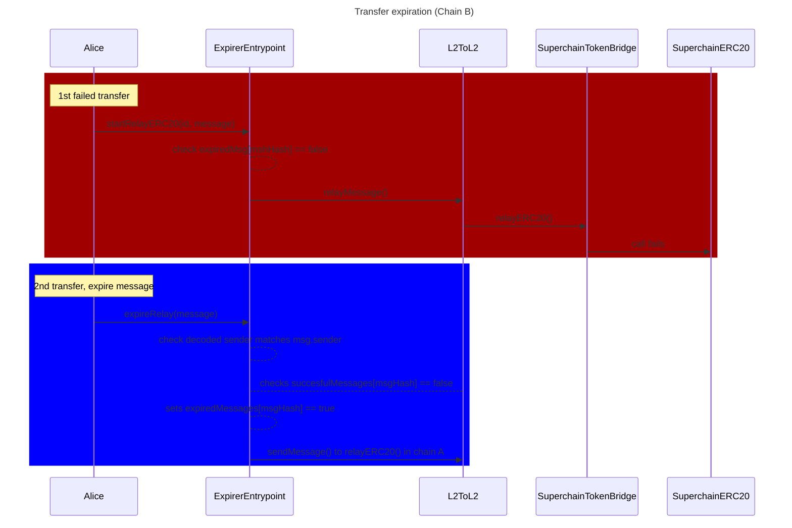
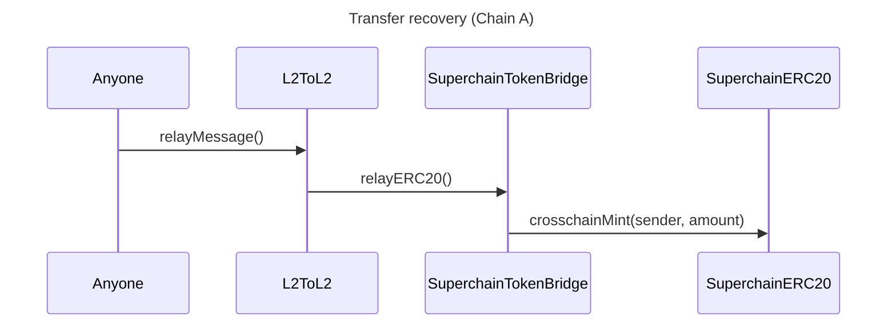

## Summary

This design document introduces a new primitive called `entrypoint` that enables users to specify a custom relaying address on the destination chain when sending cross-chain messages. 
By allowing users to choose a contract as their `entrypoint`, they can incorporate custom logic before and after the message is relayed. This generalizes the functionality of the `L2ToL2CrossDomainMessenger` and unlocks advanced interoperability features such as message batching and message expiration handling.

Integrating the entrypoint primitive requires minimal changes to the existing `L2ToL2CrossDomainMessenger`. Specifically, the `sendMessage` function is extended to include an optional `address entrypoint` parameter, which is emitted in the `SentMessage `event. On the destination chain, the `relayMessage` function is modified to permit only the specified `entrypoint` address to process the message, if one is assigned.

## Problem Statement + Context

Building functionality on top of the `L2ToL2CrossDomainMessenger` is not simple. For example, to allow message recovery, the contract would need to track expired/failed messages to prevent someone from relaying them after recovery. This would require adding code on the `L2ToL2CrossDomainMessenger`. If another feature were required, we would need to add more code, which doesn’t scale.

The `entrypoint` primitive solves this issue and unlocks new powerful cross-chain actions. The integration with `entrypoint` is simple, and the code difference is small.

## `entrypoint`

### Main idea

When sending a message through the `L2ToL2CrossDomainMessenger`, users can indicate which `entrypoint` address can process their messages in the destination chain. `relayMessage` will check if the message has an `entrypoint` associated, and if it does, it will validate that this contract is the `msg.sender`; otherwise, it will revert.

The key modification is the `msg.sender` binding feature on the `relayMessage` call. If `msg.sender` has logic, the design is equivalent to binding `relayMessage` to include a pre-hook with that logic.
Notice that post-hook design is already possible with the current design using logic on `target`.

The integration to the `L2ToL2CrossDomainMessenger` will not require any specific interface for the `entrypoint` address. As a matter of fact, the `entrypoint` can be a custom contract (that we will call `Entrypoint`) or an EOA. Anyone can deploy `Entrypoint` contracts.

### Use cases

The `entrypoint` primitive simplifies cross-chain interactions and enables powerful new functionalities by allowing custom logic during message relaying. Below are some key use cases illustrating its potential:

**Message bundles**

Entrypoints allow multiple messages to be executed in a specific order on the destination chain. By binding messages together, users can ensure that two initiating messages are not executed isolated or out of order.

**Additional Validation Checks**

Users might want to enforce certain conditions before her message is relayed on the destination chain. For example, they might require the message to be relayable only within a specific time window since its origination, or only if a certain asset's price is below a target threshold.

For more complex logic, users can use `Context` events (see the [appendix section](#context)).

**Storage**

Users might want to store information about cross-chain transfers. 
An entrypoint can allow Alice to store each in a centralized place without adding additional trust or logic on `origin`. 

This type of flow will be useful for expired messages, where storing the `msgHash` is necessary to prevent anyone from relaying recovered messages (see [here](#full-example-expire-messages)).

**Paymasters**

A regular cross-chain message requires two actions to be completed: the initiating message and the execution. It is very likely that the execution can be sold as a service so that users interact only once, or can relay without the gas token. This is akin to the concept of Paymasters. 

With the user's prior approval on the destination chain, the `entrypoint` can automatically deduct a precomputed service fee or receive compensation through predefined mechanisms upon successful execution.

### Summary of required changes

The following changes are required:

- `sendMessage` includes `address entrypoint`.
- `SentMessage` event includes `address entrypoint`.
- `relayMessage` checks if `entrypoint!=0`. If so, it checks if `msg.sender == entrypoint` and reverts if not.
- `_decodeSentMessagePayload` will decode the `entrypoint`.
- `hashL2toL2CrossDomainMessage` will include `entrypoint`.

## Full example: Expire messages

You can check the full example and rationale in the dedicated [design doc](https://github.com/ethereum-optimism/design-docs/pull/170)

Suppose an `ExpirableTokenBridge` contract exists, that uses an `Entrypoint` with the added functionality of expiring a failed message in destination. Let's suppose that `ExpirableTokenBridge` has minting and burning rights over `SuperchainERC20` and that only the original sender can expire a message.

- Alice will transfer `AliceSuperToken` from Chain A to Chain B through the `ExpirableTokenBridge`.
- If `AliceSuperToken` has not yet been deployed, relaying the message will fail.
- Alice (and only her) can use the `Entrypoint` functionality to expire the message, making it non-processable by adding it to a mapping. Any call to the `Entrypoint` to relay the expired message after this will revert. As the `Entrypoint` is the only contract that can process this message in the `L2ToL2CrossDomainMessenger`, the expired message is effectively non-processable in Chain B.
- On the same call, the `Entrypoint` will emit a message that the contract in Chain A can consume to handle the expired message (mint the tokens back).

The first diagram shows a failed transfer (in red), and then the expiry flow (in blue), all happening in Chain B.
The second diagram corresponds to the funds recovery on Chain A.

## Using `target` instead of `entrypoint` 

All of the use cases listed above can be achieved by encoding additional information (on an `Initiator` contract or manually) on the origin chain and then sending a message to a dedicated `target` (that we will call `Receiver` here) for decoding and crafting the final calls in destination. 

The advantage of using `entrypoints` is that, instead of embedding complex conditions into the message or the `target` contract, users can delegate this logic to the `entrypoint`. Separating validation logic from the message payload and target contract makes it easier to compose and reuse components. The `target` contract and the initiating message remain simple and focused on its core functionality.

Moreover, for message bundles, `entrypoint` have a considerably better user flow. 
Even though it is possible for bundles to be processed using `Receiver` contracts, these would need to receive each relayed message, wait for the bundle to be completed, and finally require a final transaction to execute them all (N+1 relay transactions vs 1). 

## Appendix
###  `Context`
Entrypoints might require additional information to relay an event. This information might be additional checks or variables to use. As the current `L2ToL2CrossDomainMessenger` does not allow to encode additional information (the call to `target` passes the full message), we need a second executing message that we will call `Context`. 

In origin, Alice would emit the `EntrypointContext` as a separate event, and send her message with her designed `Entrypoint` contract. This way, the `Entrypoint` contract can validate the `EntrypointContext` event from origin, decode it, and perform the required actions.

Therefore, the processing message function in the `Entrypoint` context will validate and consume two messages: the regular `SentMessage` event and the `EntrypointContext` event.

An alternative design could be to enshrine the `entrypointContext` as a `bytes` field from within the `SentMessage` event. We discuss this approach [here](#future-considerations-enshrined-entrypointcontext).

#### Context Binding

It is important to note that `EntrypointContext` is not binding to its connected initiating message. This means that, in theory, anyone could execute the message alongside any other valid `EntrypointContext`. 
Each `Entrypoint` and initiating message contract will be responsible for handling authentication logic.

The most efficient way of binding both events is to check who emitted the `EntrypointContext` event against an allowed-list. This might seem restricting, but will be more than enough for many applications.

### Future considerations: Enshrined `entrypointContext`

This second design binds the context to the message and makes the `L2ToL2CrossDomainMessenger` perform a callback to the entrypoint with this data. For the moment, we decided to let this feature outside of the `L2ToL2CrossDomainMessenger` to keep it minimal, but it can be considered. It is also possible to implement into into a second `L2ToL2CrossDomainMessengerWithContext` that extends from `L2ToL2CrossDomainMessenger`.

The context is binded into the message, meaning that its not possible to frontrun the `SentMessage` event with a different context.

Entrypoints that wish to use enshrined `entrypointContext` would need to implement the `onRelayMessage` function. The `L2ToL2CrossDomainMessenger` will perform a callback to `onRelayMessage` inside the `relayMessage` call and before calling the target.  

`Entrypoint` can use the context however they want. It’s important to notice the `relayMessage()` is non reentrant, so the callback cannot call it back. Some possible ways to use the context are the following:

**Optimistic**

Context is assumed to be true, but revert on callback if not. 

1. In origin, Alice will encode the `entrypointContext` as a single `bytes` parameter into the `sendMessage` call. 
2. On destination, the `Entrypoint` will ask for the context as a user input, in addition to the message and id. `Entrypoint` will assume this input context is true (optimistic).
    1. `Entrypoint` will include an `onRelayMessage` callback.
3. The `Entrypoint` will check that the context is valid.
4. If so, it will call `relayMessage`, which will 
    1. validate usual properties of the message (domain binding, non-replayability).
    2. check `entrypoint == msg.sender`.
    3. do a callback to the `Entrypoint` for `onRelayMessage`, passing the encoded `entrypointContext`. `onRelayMessage` will check that the context that was inputed matches the `entrypointContext`, and revert if not.
    4. finally, call `target` with the `message`.

**Store and use later**

Some applications might not require the context at the time of the message (expire messages for instance). In that case, the `Entrypoint` can ignore the context parameter and just store it on the callback for later use.

1. In origin, Alice will encode the `entrypointContext` as a single `bytes` parameter into the `sendMessage` call.
2. On destination, the `Entrypoint` will ask for the message and id.
    1. `Entrypoint` will include an `onRelayMessage` callback.
3. `Entrypoint` will call `relayMessage`, which will
    1. validate usual properties of the message (domain binding, non-replayability).
    2. check `entrypoint == msg.sender`.
    3. do a callback to the `Entrypoint` for `onRelayMessage`, passing the encoded `entrypointContext`. `onRelayMessage` the `Entrypoint` will store the context for later use.
    4. finally, call `target` with the `message`.

#### Changes for enshrinement

The following changes are required:

- Overload `sendMessage` to
    - include `address entrypoint` and `bytes entrypointContext`.
    - modify `SentMessage` event to include `address entrypoint` and `bytes entrypointContext`.
- Modify `relayMessage` to
    - check if `msg.sender != address(0)` to check if an entrypoint has been defined.
    - if entrypoint has been defined, check if `msg.sender == entrypoint` and reverts if not.
    - if entrypoint has been defined and if `entrypointContext.length > 0` , performs a callback to the `entrypoint` address with `entrypointContext` data to the `onRelayMessage` function.
- `_decodeSentMessagePayload` will decode the `entrypoint` and `entrypointContext`.