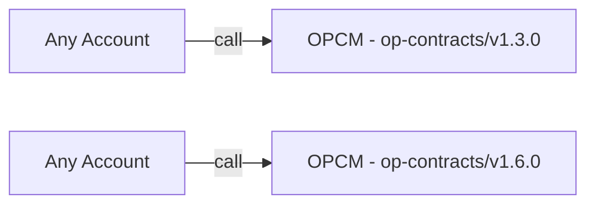

# Purpose

The original OPContractsManager (OPCM) design, outlined [here](./op-contracts-manager-arch.md), defined a singleton proxied contract that deployed the L1 contracts for standard OP Stack chains in a single transaction.

Implementing upgrade functionality for OP Stack chains via OPCM is now a key goal. As we approach this feature, we've identified several interim adjustments to OPCM that will be necessary to eventually support upgradability. Therefore, the purpose of this design document is to aid building OPCM upgradability features by making changes to OPCM's architecture.

# Summary

OPCM will transition from its current singleton architecture to a multi-deployment model, with each deployment focused on a specific L1 smart contract release version. To achieve this, the following changes need to be implemented:

- Remove the [proxy](https://github.com/ethereum-optimism/optimism/blob/4c015e3a36f8910e2cf8b447d62ab4c44b944cca/packages/contracts-bedrock/scripts/deploy/DeployImplementations.s.sol#L545) from OPCM.
- Remove [initialize](https://github.com/ethereum-optimism/optimism/blob/28283a927e3124fa0b2cf8d47d1a734e95478215/packages/contracts-bedrock/src/L1/OPContractsManager.sol#L210) functionality from OPCM and introduce standard constructor initialization.
- Add versioning to OPCM to expose which L1 contracts are deployed for the specific OPCM deployment e.g. OPCM address `0x1234...` deploys `op-contracts/v1.6.0`.
- Update `DeploySuperchain.s.sol`, `DeployImplementations.s.sol` and `DeployOPChain.s.sol` to work with the new paradigm of one OPCM per L1 smart contract release.
- **Optional**: Add authentication to OPCM in anticipation for upgrade features.

# Problem Statement + Context

We’ve identified the need to implement an upgradability feature for OP Stack chains. This will involve two core components: [op-deployer](../ecosystem/op-deployer.md) and [OPCM](./op-contracts-manager-arch.md). As of November 6, 2024, both op-deployer and OPCM support only the deployment of new chains at fixed versions.
Each new chain version requires additional conditional logic in both op-deployer and the OPCM singleton. This creates logic that is difficult to maintain and reason about. This approach will become increasingly unwieldy as we integrate OP Stack upgrade functionality into op-deployer and OPCM.

## Examples of Unwanted Conditional Logic 
- Deciding how to initialize the `SystemConfig` contract correctly via OPCM - [code](https://github.com/ethereum-optimism/optimism/blob/28283a927e3124fa0b2cf8d47d1a734e95478215/packages/contracts-bedrock/src/L1/OPContractsManager.sol#L457-L462). This branching logic exists because OPCM needed to be able to deploy chains at older tags (e.g. op-contracts/v1.6.0) as well as later chains. The primary challenge here is that the `develop` branch in the monorepo naturally evolves, requiring deployment (OPCM and op-deployer) code to evolve with it, all while continuing to support older deployments.
- `// TODO: Add a link to an example in op-deployer that contains unwanted conditional logic.`

Authentication was not originally implemented in OPCM because it solely supported deployments, with the rationale being that there was no immediate need to restrict access to the deploy function. However, with the introduction of upgrade functionality, it’s essential to establish a robust authentication mechanism within OPCM. We now need to determine appropriate access controls and define roles for authorized users who will be permitted to perform upgrades.

# Alternatives Considered

1. Continue with the approach of adding additional conditional logic for every new chain version that is released. As noted, this leads to a system that is complex and hard to maintain.
2. `// TODO - Add another alernative approach that was discussed here but wasn't chosen.`

# Proposed Solution

## OPCM Architecture Changes

Having one OPCM per *L1 smart contract release version*** means that we can remove the proxy pattern that currently exists with OPCM. The high level architecture changes can be seen below:

### Previous OPCM Deploys
Before OPCM was proxied so that it was upgradable. e.g. [`0x18CeC91779995AD14c880e4095456B9147160790`](https://etherscan.io/address/0x18CeC91779995AD14c880e4095456B9147160790)

### New OPCM Deploys
Now OPCM is not proxied and therefore not upgradable. This is by design though as we want to release a new OPCM for each new L1 smart contract release.

## Versioning

Now that each OPCM deploy is going to be tethered directly to an L1 smart contract release version, for improved UX, we should provide public getters to expose two pieces of information: 

1. The **current L1 smart contracts** that are deployed via this version of OPCM e.g. `op-contracts/v1.6.0`. This means we will no longer need to pass the standard versions toml [file](https://github.com/ethereum-optimism/optimism/blob/4c015e3a36f8910e2cf8b447d62ab4c44b944cca/packages/contracts-bedrock/scripts/deploy/DeployImplementations.s.sol#L61) around like [this](https://github.com/ethereum-optimism/optimism/blob/4c015e3a36f8910e2cf8b447d62ab4c44b944cca/packages/contracts-bedrock/scripts/deploy/DeployImplementations.s.sol#L1060). The implementation addresses can be added to the OPCM contract as as immutable values. 
2. The **address of the previous OPCM** contract. 

This creates a linked list whereby a user can find all prior OPCMs starting from the current OPCM contract. This will prove useful for implementing upgrade functionality because with this information an OPCM can easily expose the version of L1 smart contracts that it supports upgrading **from** and **to**.

## Authentication (Optional)

As we know that upgrades are coming to OPCM we can preemtively add authentication to OPCM as part of this architecture redesign. 

It is our intention to keep the OPCM [deploy](https://github.com/ethereum-optimism/optimism/blob/28283a927e3124fa0b2cf8d47d1a734e95478215/packages/contracts-bedrock/src/L1/OPContractsManager.sol#L226) function permissionless. 

- `//TODO Determine WHO should perform these upgrades`
- `//TODO Determine HOW these access controls should be implemented in OPCM`

# Risks & Uncertainties

`// TODO`

** *To view all official L1 smart releases, run `git tag -l | grep op-contracts` on the `develop` branch inside the [monorepo](https://github.com/ethereum-optimism/optimism).*