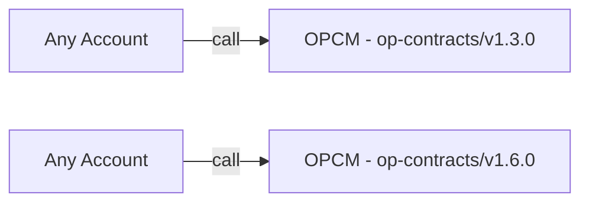

# Purpose

The original OPContractsManager (OPCM) design, outlined [here](./op-contracts-manager-arch.md), defined a singleton proxied contract that deployed the L1 contracts for standard OP Stack chains in a single transaction.

Implementing upgrade functionality for OP Stack chains via OPCM is now a key goal. As we approach this feature, we've identified several interim adjustments to OPCM that will not only enable future upgradability but also simplify its overall design. Therefore, the purpose of this design document is to streamline OPCM’s architecture, making it easier to build and integrate upgradability features.

# Summary

OPCM will transition from its current singleton architecture to a multi-deployment model, with each deployment focused on a specific L1 smart contract release version. To achieve this, the following changes need to be implemented:

- Remove the [proxy](https://github.com/ethereum-optimism/optimism/blob/4c015e3a36f8910e2cf8b447d62ab4c44b944cca/packages/contracts-bedrock/scripts/deploy/DeployImplementations.s.sol#L545) from OPCM.
- Remove [initialize](https://github.com/ethereum-optimism/optimism/blob/28283a927e3124fa0b2cf8d47d1a734e95478215/packages/contracts-bedrock/src/L1/OPContractsManager.sol#L210) functionality from OPCM and introduce standard constructor initialization.
- Add versioning to OPCM to expose which L1 contracts are deployed for the specific OPCM deployment e.g. `string constant l1ContractsVersion = "op-contracts/v1.6.0";` or something more nuanced that shows the relationship between the version string and the [standard release implementation addresses](https://github.com/ethereum-optimism/superchain-registry/blob/main/validation/standard/standard-versions-mainnet.toml#L9). This versioning is in addition to the [existing semvers](https://github.com/ethereum-optimism/optimism/blob/feat/isthmus-contracts/packages/contracts-bedrock/src/L1/OPContractsManager.sol#L133-L134) that exist on OPCM contracts today.
- Update `op-deployer`, `DeploySuperchain.s.sol`, `DeployImplementations.s.sol` and `DeployOPChain.s.sol` to work with the new multi-deployment paradigm of one OPCM per L1 smart contract release.

# Problem Statement + Context

[OPCM](./op-contracts-manager-arch.md)'s architecture will quickly become untenable as more L1 smart contract releases are supported for deployment. Each new release version requires additional conditional logic in both [op-deployer](../ecosystem/op-deployer.md) and the OPCM singleton. This creates logic that is difficult to maintain and reason about. This approach will become increasingly unwieldy as we integrate OP Stack upgrade functionality into op-deployer and OPCM. Examples of how these complexities are introduced can be seen below:

## Example of Unwanted Conditional Logic in OPCM
- Deciding how to initialize the `SystemConfig` contract correctly via OPCM - [code](https://github.com/ethereum-optimism/optimism/blob/28283a927e3124fa0b2cf8d47d1a734e95478215/packages/contracts-bedrock/src/L1/OPContractsManager.sol#L457-L462). This branching logic exists because OPCM needed to be able to deploy chains at older tags (e.g. `op-contracts/v1.6.0`) as well as later chains. The primary challenge here is that the `develop` branch in the monorepo naturally evolves, requiring deployment (OPCM and op-deployer) code to evolve with it, all while continuing to support older deployments.

## Example of Unwanted Complexity in op-deployer
- Each `op-deployer` releases currently bundles standard version TOML files from the superchain-registry. These files contain the addresses corresponding to each L1 smart contract release. Developers must [manually sync](https://github.com/ethereum-optimism/optimism/blob/bc9b6cd588588c9c4167c926a1782c658e5df921/op-chain-ops/Makefile#L50-L52) the TOML files before cutting a new release. Since these release addresses are tightly coupled to op-deployer, they need to be injected into OPCM. Without this injection, OPCM is unaware of the implementation addresses of any L1 smart contract releases. A system in which OPCM is 'release aware' simplifies the logic within op-deployer. In this setup, op-deployer would maintain a list of OPCM addresses and manage interactions with each address on a case-by-case basis.

# Alternatives Considered

Continue with the approach of adding additional conditional logic for every new chain version that is released. As noted, this leads to a system that is complex and hard to maintain.

# Proposed Solution

## OPCM Architecture Changes

Having one OPCM per *L1 smart contract release version*[^1] means that we can remove the proxy pattern that currently exists with OPCM. The high level architecture changes can be seen below:

### Previous OPCM Deploys
Before, OPCM was proxied so that it was upgradable. e.g. [`0x18CeC91779995AD14c880e4095456B9147160790`](https://etherscan.io/address/0x18CeC91779995AD14c880e4095456B9147160790)

### New OPCM Deploys
Now, OPCM is not proxied and therefore not upgradable. This is by design though as we want to release a new OPCM for each new L1 smart contract release.

In the event that we deploy a buggy OPCM and need to provide a patch fix, we can simply deploy a new OPCM contract. The new contract will explicitly include the address of the contract it replaces, e.g. `address replaces = <old-contract-address>`. By doing this we can easily tell which OPCM contract is the latest version to use by process of elimination. 

## Versioning

Now that each OPCM deploy is going to be tethered directly to an L1 smart contract release version, for improved UX, we should provide public getters to expose two pieces of information: 

1. The **current L1 smart contracts** that are deployed via this version of OPCM e.g. `op-contracts/v1.6.0`. This means we will no longer need to pass the standard versions toml [file](https://github.com/ethereum-optimism/optimism/blob/4c015e3a36f8910e2cf8b447d62ab4c44b944cca/packages/contracts-bedrock/scripts/deploy/DeployImplementations.s.sol#L61) around like [this](https://github.com/ethereum-optimism/optimism/blob/4c015e3a36f8910e2cf8b447d62ab4c44b944cca/packages/contracts-bedrock/scripts/deploy/DeployImplementations.s.sol#L1060). The implementation addresses can be added to the OPCM contract as as immutable values. 
2. The **address of the previous OPCM** contract. 

This creates a linked list whereby a user can find all prior OPCMs starting from the current OPCM contract. This will prove useful for implementing upgrade functionality because with this information an OPCM can easily expose the version of L1 smart contracts that it supports upgrading **from** and **to**.

# Risks & Uncertainties

## Further Commitment To Moving Logic On-Chain
Regardless of whether we continue with the singleton OPCM approach or adopt a different strategy, more Solidity production code will be necessary. While our engineering practices help minimize bugs, it is still worth considering whether increasing the surface area of on-chain interactions is desirable.

## Documentation
Having multiple implementations of OPCM that exist in parallel will mean that tacking and documenting them is even more important. Keeping documentation up to date will be paramount in ensuring our customers have the best experience using these tools. 

## Superchain-Registry
If an OPCM release is approved by governance, any deployments made from this address can be considered trustworthy. One side effect of this is that certain superchain-registry checks may no longer be necessary. The full scope of superchain-registry changes is currently unknown.

[^1]: *To view all official L1 smart releases, run `git tag -l | grep op-contracts` on the `develop` branch inside the [monorepo](https://github.com/ethereum-optimism/optimism).*