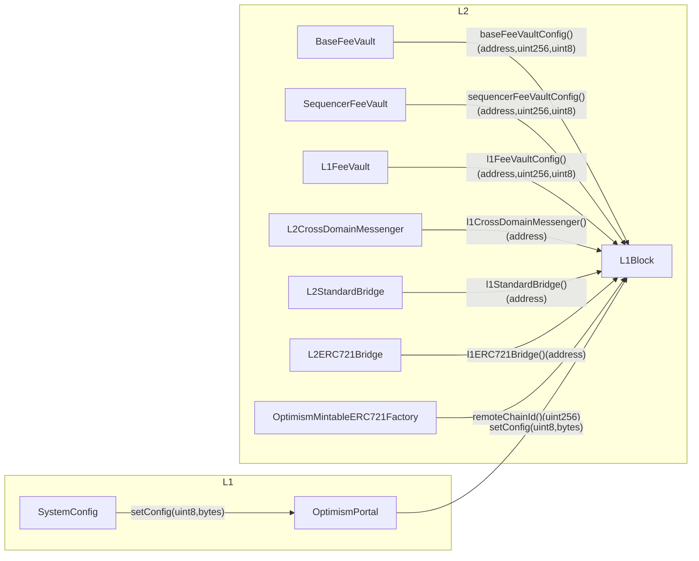

# Purpose

<!-- This section is also sometimes called “Motivations” or “Goals”. -->

<!-- It is fine to remove this section from the final document,
but understanding the purpose of the doc when writing is very helpful. -->

# Summary

<!-- Most (if not all) documents should have a summary.
While the length will likely be proportional to the length of the full document,
the summary should be as succinct as possible. -->

The L2 predeploys are refactored in a way such that the network specific configuration
is all sourced from a single location where it is ultimately set from L1 deposit transactions.
Any initializable logic in the L2 predeploys is also removed, to make the deposit transaction
based upgrade scheme simple to reason about.

This will accelerate the ability to ship secure software, as we will be able to get chains
on the same versions of the software and know which versions work very well together.

# Problem Statement + Context

<!-- Describe the specific problem that the document is seeking to address as well
as information needed to understand the problem and design space.
If more information is needed on the costs of the problem,
this is a good place to that information. -->

There is currently no good way to do releases of L2 predeploys. Historically, chains
have launched with an arbitrary commit for their L2 genesis, making the block history integrity
checks that are part of the superchain registry very difficult. We tell chains that are
trying to launch to use governance approved L1 contracts, the same should apply for L2.

Given all of the work for making releases and upgrades nice for the L1 contracts and the client software,
it is all a waste if we cannot also have good releases of the L2 predeploys.

Right now, OP Mainnet is running contracts at various versions of the software. It is actually very difficult
to reproduce the exact OP Mainnet set of contracts being used. It would require cherry picking bytecode from many
different commits. We run no tests against this particular combination of contracts. We believe it is safe
given our development practices, but every time that we do want to do a release it results in a lot of time
being spent trying to make sure that we are upgrading to a compatible set of contracts.

# Proposed Solution

<!-- A high level overview of the proposed solution.
When there are multiple alternatives there should be an explanation
of why one solution was picked over other solutions.
As a rule of thumb, including code snippets (except for defining an external API)
is likely too low level. -->

A WIP implementation can be found [here](https://github.com/ethereum-optimism/optimism/pull/12057).
The specs can be found [here](https://github.com/ethereum-optimism/specs/tree/17ef36cdc3bb9893b206a93464122d56730d30fb/specs/protocol/holocene).

Similar to the L1 MCP project, we move all of the network specific configuration out of the
individual contracts themselves and instead place all of it in a single place. Rather than using
`sload` to read the values, the contracts will make a `CALL` to the L1Block contract. These values
will be sourced from L1 via deposit transactions that come from the `SystemConfig.initialize` call.
We need to make sure that the max deposit gas limit is at least able to fullfill these deposit
transactions.

The general flow is as follows:



This is taken from the [specs](https://github.com/ethereum-optimism/specs/blob/17ef36cdc3bb9893b206a93464122d56730d30fb/specs/protocol/holocene/predeploys.md) and misses the `L2ProxyAdmin`. The `L2ProxyAdmin` must also be deterministic
and is explored in the following issue: https://github.com/ethereum-optimism/specs/issues/388. There is general
consensus on using the `DEPOSITOR_ACCOUNT` as the owner.

When we do a contract release, we commit to that bytecode as part of consensus. That is the bytecode used
with deposit transactions doing upgrades to the network. In the L2 genesis creation script, we could have
a library for each release of the predeploys. The genesis script would take the bytecode from the library if
configured for a specific hardfork at genesis, otherwise it would use the compiled source code. This gives
us a lot of flexibility and simplicity when it comes to being able to recreate an L2 genesis deterministically.

The block history integrity check becomes as simple as observing that a 32 byte state root in the genesis
block matches the expected value.

### Rationale Behind Certain Changes

#### SuperchainConfig "Upgrader" Role

The `upgrader` role can call the `OptimismPortal.upgrade(bytes memory data, uint32 gasLimit)` function
and it emits a deposit tx from the `DEPOSITOR_ACCOUNT` that calls the `L2ProxyAdmin`. Sourcing the auth
from the `SuperchainConfig` allows for simple management of this very important role, given that it impacts
stage 1 status. This is meant to simplify operations by removing the aliased L1 `ProxyAdmin` owner
being set as the L2 `ProxyAdmin`.

Since the the L1 and L2 `ProxyAdmin` contracts are intended to have the same owner, an additional
improvement (which may be excluded to limit scope creep), would be to remove the `Ownable`
dependency on the L1 `ProxyAdmin` contract, and instead have it read the
`SuperchainConfig.upgrader()` role to authorize upgrades. This would also be in alignment with the
Superchain strategy, as the Security Council should not manage the pause of chains which they are
not also responsible for upgrading, and participation in the pause is a benefit that chains get when
they join the Superchain ecosystem.Regardless, in order to preserve the existing auth model we MUST
ensure that the `upgrader` is the same account as the current L1 ProxyAdmin owner.

The `data` and `gasLimit` are allowed to be specified since we don't fully know what sorts of calls we may have to do.
We may only need to do simple `upgradeTo` calls, but we may also need to do `upgradeToAndCall`. To support the
[liquidity migration](https://github.com/ethereum-optimism/design-docs/blob/4b62eb12eceb8e4867ac101134730102c0f5a989/protocol/superchainerc20/liquidity-migration.md), we need to backport storage slots into the `OptimismMintableERC20Factory`
contract.

#### FeeAdmin role

The entity which is authorized to modify the various `FeeVault` configs must be able to vary from chain

to chain. Therefore a new `feeAdmin` role will be added to the `SystemConfig` contract. This role
can call a new `SystemConfig.setFeeConfig()` function which forwards config updates to
`OptimismPortal.setConfig()` with the appropriate `ConfigType`.

This role will be set in `SystemConfig.initialize()`, meaning that it can only be updated by an upgrade.

> [!NOTE]
> We need to guarantee 100% backwards compatibility in the roles during the upgrade, so for example
> the same 2/2 multisig that owns the L2 ProxyAdmin on base should be the FeeAdmin in base's
> SystemConfig.

In summary:

1. The `FeeAdmin` can update the `FeeConfig`.
2. The Upgrade Controller (aka [L1 ProxyAdmin Owner](https://github.com/ethereum-optimism/specs/blob/main/specs/protocol/stage-1.md#configuration-of-safes)) Safe cand update the `FeeAdmin`.

#### L2ProxyAdmin

A new contract exists called the `L2ProxyAdmin`, it simply inherits from the `ProxyAdmin` and overrides the
`owner()(address)` function to return `DEPOSITOR_ACCOUNT`.

Ideally we can remove the need for legacy proxy types since they don't exist on L2 eventually, but
that is considered a bonus when we do get around to it.

#### SystemConfig

The `SystemConfig`'s `initialize()` function will be updated to:

- Accept a new `Roles` struct, composed of the existing `owner` address, and the new
  `feeAdmin` role.
- Makes multiple calls to the OptimismPortal's `setConfig()` function to set the config values.

> [!IMPORTANT]
> We should consider if there is a risk associated with 'resetting' these values. Similar to the OptimismPortal's
> `DEFAULT_L2_SENDER` [reinit issue](https://github.com/ethereum-optimism/optimism/pull/8864).
> I do not believe so as they are only modifiable in the `initializer` and so cannot be
> changed in normal operation. However the current design will require that all
> `SystemConfig` upgrades do not unintentionally modify the existing values.

The `SystemConfig` will also get the following new external methods which are only callable by the
`feeAdmin`:

```solidity
function setBaseFeeVaultConfig(address _recipient, uint256 _min, Types.WithdrawalNetwork _network) external;
function setL1FeeVaultConfig(address _recipient, uint256 _min, Types.WithdrawalNetwork _network) external;
function setSequencerFeeVaultConfig(address _recipient, uint256 _min, Types.WithdrawalNetwork _network) external;
```

#### Initializable Predeploys Removed

All predeploys are no longer initializable. This allows for upgrades issued by deposit transactions to be very smooth.
This impacts the following contracts:

- `CrossDomainMessenger`
- `StandardBridge`
- `ERC721Bridge`

#### CrossDomainMessenger

Since the `CrossDomainMessenger` is no longer `initializable` we need to slightly modify the semantics around
the `xDomainMsgSender`. There is actually no need to set the value in storage during `initialize`, we could modify
the semantics such that if its `address(0)` in storage, then return the default value, otherwise return the
actual sender value. This should be safe since there is no way to be a sender from `address(0)`.

Given this insight and the fact that there is reentrancy check on `relayMessage`, it should be safe to use transient
storage without a call depth context. There is an [open PR](https://github.com/ethereum-optimism/optimism/pull/12356) to migrate to solc `0.8.25`.

## Resource Usage

<!-- What is the resource usage of the proposed solution?
Does it consume a large amount of computational resources or time? -->

The additional deposit gas is the only additional resource usage and its covered in the risks section
at the bottom of this document.

This approach expands the ABI of the `L1Block` contract, meaning that automatically generated solidity dispatcher
will binary search over the possible function selectors, consuming a bit more gas.

## Implications for the Predeploy Releases Process

- TODO: get clarity about how to package up L2 contracts releases. How will alternative clients consume the L2 Genesis?

### L2Genesis Generation

When a new predeploy release is created, the bytcode from each predeploy should be placed into a
an new autogenerated library which resembles the following:

```solidity
library HolocenePredeploys {
  bytes constant L1Block = hex"...";
  ...
}
```

The `L2Genesis.s.sol` solidity script will have additional functionality so that it can
optionally generate the L2 state from the current commit as it currently does using
`vm.getDeployedCode()`, or retrieve the code from the specified library.

### Upgrade Process

Note that this design modifies how L2 upgrade auth is managed (moving that management into a single
storage slot on L1), but does not change how upgrades to predeploy contracts are performed.
Predeploy upgrades can still be done either via a `TransactionDeposited()` event, or a [network
upgrade automation
transaction](https://github.com/ethereum-optimism/specs/blob/9f7226be064be0c87f90cbc6be6b0a4b4f58656a/specs/protocol/derivation.md#network-upgrade-automation-transactions).

Routine hardforks should continue to prefer using network upgrade automation transactions, with
deposit transaction upgrades being reserved for incident response or other extenuating circumstances.

# Alternatives Considered

<!-- List out a short summary of each possible solution that was considered.
Comparing the effort of each solution -->

There is a long history of alternatives here.

Another option would be to embed these config values directly into the client software's config and have the client
software create these deposit txs rather than the smart contracts. This is less flexible but comes with the tradeoff
of additional required rollup config and doesn't solve the problem for existing chains. Existing chains would need a way
to source this config, it would likely need to be hardcoded in the binary and that isn't super scalable.

# Risks & Uncertainties

<!-- An overview of what could go wrong.
Also any open questions that need more work to resolve. -->

## Sequenced transactions on a fresh chain

There is a concern that the sequencer can include transactions before these values are set on L2.
If we define the `SystemConfig.startBlock` as the [first block to start derivation in](https://github.com/ethereum-optimism/optimism/blob/d05fb505809717282d5cee7264a09d26002a4ddd/op-node/cmd/genesis/cmd.go#L174C30-L174C40),
which is set on `SystemConfig.initialize` and also the deposit transactions that set these values are
sent in the same block, then we should have the guarantee that no user transactions are included before
the deposit transactions.

## Max Resource Limit on Deposit Transactions

There is a concern around the max deposit gas limit being too small so that the `SystemConfig` cannot
deposit all of these values, we should have logic that reverts if the deposit gas limit is too small
in the `setResourceConfig()` function's [sanity checks](https://github.com/ethereum-optimism/optimism/blob/feat/holocene-contracts/packages/contracts-bedrock/src/L1/SystemConfig.sol#L538-L556). Since the `ResourceConfig` can be modified during
`initialize`, it should be sufficient to include testing to identify when the total cost of
`setConfig()` calls will exceed the resource limit in a single block.

A related concern is that the `useGas()`
[function](https://github.com/ethereum-optimism/optimism/blob/f99424ded3917ddc0c4ef14355d61e50a38d4d0d/packages/contracts-bedrock/src/L1/ResourceMetering.sol#L156)
which is called in the `upgrade()` and `setConfig()` functions does not check that the max resource limit is not exceeded by
the additional `prevBoughtGas`. This is in contrast with
[`_metered()`](https://github.com/ethereum-optimism/optimism/blob/f99424ded3917ddc0c4ef14355d61e50a38d4d0d/packages/contracts-bedrock/src/L1/ResourceMetering.sol#L128C1-L132C10) which does check `prevBoughtGas`. This requires investigation.
