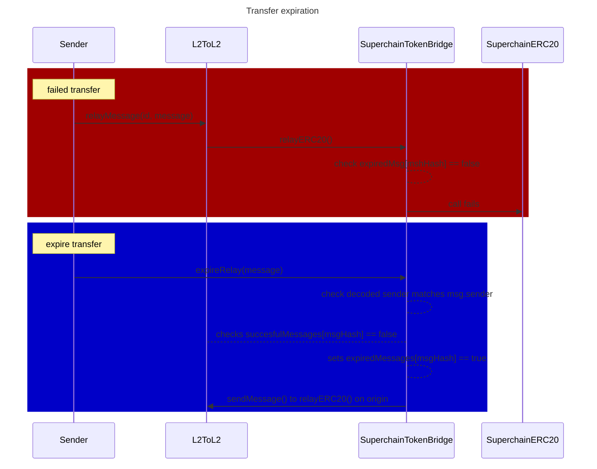
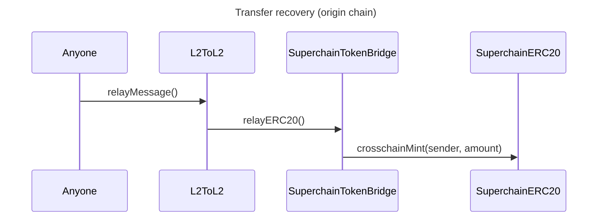
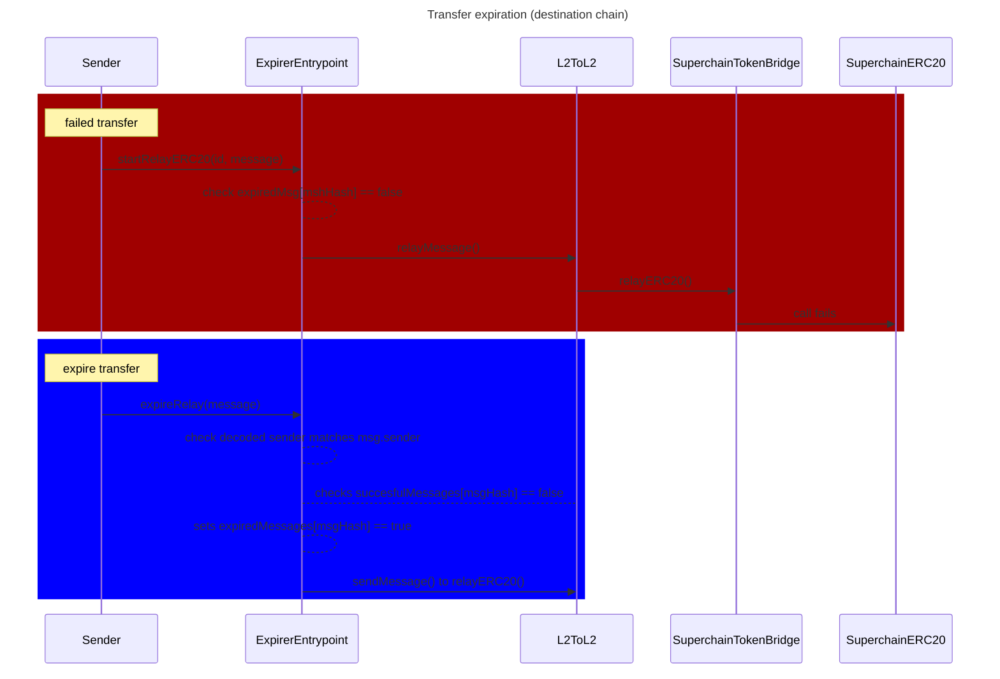

## Summary
This design document introduces possible designs to recover stuck `SuperchainERC20` cross-chain transfers due to a failed relay. It introduces a method for expiring messages and sending them back for the original sender to recover its burn balance in `origin`.

## Problem Statement 

Messages that fail to be relayed cannot be recovered in origin. This is particularly sensitive for messages part of `SuperchainERC20` cross-chain transfer, as tokens get burned in the origin chain. The user cannot recover their funds without a way to recover the message.

There are two ways a cross-chain transfer can fail:
1. The message never reaches the destination chain.
2. The message reaches the destination chain but fails to be relayed.

This document focuses on the second scenario applied to `SuperchainERC20` tokens. For the first scenario, refer [here](https://github.com/ethereum-optimism/specs/issues/460).

## Context

`SuperchainERC20` will fail to be relayed if the SafeCall to the `target` in the `relayMessage` function from the `L2ToL2CrossDomainMessenger` fails. Multiple reasons might lead to a revert on this call. Some of these could be that
- The `SuperchainERC20` is not deployed in the target chain
- The `SuperchainTokenBridge` does not have mint rights over the `SuperchainERC20`
- Out of gas

The `relayMessage` function does not store failed messages, but it does store successful ones in the `successfulMessages` mapping. While it is impossible to know whether a message has failed to be relayed, it is easy to check if it has still not been successfully relayed.

## New concepts
We introduce two concepts:
- **Expired transfer:** a valid cross-chain transfer marked as non-relayable on the destination chain. If a transfer gets marked as expired, it will not be possible to relay it ever again. This is necessary to prevent someone from relaying after recovering the transfer (and funds).
- **Recovered transfer:** A rollback process where the origin chain mints the burned tokens back to the user. A recovered transfer must only be processed once.

## Design properties
The new system will need to 
1. Enable users to expire messages if the expiry condition is met.
2. Store the expired messages so that these can no longer be relayed in the destination chain.
3. Send a message back to the `origin` chain.
4. Mint the tokens back to the original `sender` in the `origin` chain.

## Architecture

We will present two possible approaches for handling expiration and recovery of transfers. The first one will focus on modifying the `SuperchainTokenBridge` and the second one will leverage the `entrypoint` primitive to externalize logic from the bridge.

### Modify the `SuperchainTokenBridge`

This approach adds the whole expiration logic to the token bridge. It doesn't require to change access control.

The token bridge must include
- An `expiredMsg` mapping that marks `msgHash` to `bool`, indicating if a a message has been already expired.
- An `expireRelay` function that will:
	- Check the expiration condition is met (see [Expiration Methods](#expiration-methods))
	- Check that the `msgHash` is not part of the `sucessfulMessages` mapping in the `L2ToL2CrossDomainMessenger`
	- Add the `msgHash` to the `expiredMsg` mapping
	- Craft and send a message back to the `SuperchainTokenBridge` in `origin` with the original `sender` and `amount` information to mint back the burnt tokens. 

Additionally, in origin, the `SuperchainTokenBridge` will need a way to handle recovered transfers. We can reuse the `relayERC20` logic as it is, so there is no need to introduce new functions. The `SuperchainTokenBridge` already has access to calling this function, so there is no need to modify the security checks.

Notice that the message sent back to the origin in `expireRelay` could be triggered in a posterior `sendExpire` function. In that case, the design would need an additional storage, `expiredSent`, to prevent double calls to `sendExpire`. This design's downside is that an expired message could get sent back, marked as `expiredSent`, but fail to be relayed on the `origin` chain.

**Example flow**

We assume in this example that the original `sender` is the only one who can expire a message.

### Use entrypoints
Using [`Entrypoint` contracts](https://github.com/ethereum-optimism/design-docs/pull/163) might be a cleaner approach, as it separates concerns. 

The `SuperchainTokenBridge` can pass an `entrypoint` address that contains the expiring logic on the call to the `L2ToL2CrossDomainMessenger`. Then, in destination, only the `entrypoint` can relay the call to the `L2ToL2CrossDomainMessenger`, which allows to set the expiring logic. Any posterior attempt at relaying the message will be forced to go through the `entrypoint` and revert if expired.

The `entrypoint` must include 
- An `expiredMsg` mapping that marks `msgHash` to `bool`, indicating if a a message has been already expired.
- A `startRelayERC20` function to work as a regular interface for integrators that will need to call the `L2ToL2CrossDomainMessenger` through the `entrypoint` now.
	- This function will check that `expiredMsg[mshHash] == false` .
- An `expireRelay` function that will:
	- Check the expiration condition is met (see [Expiration Methods](#expiration-methods))
	- Check that the `msgHash` is not part of the `sucessfulMessages` mapping in the `L2ToL2CrossDomainMessenger`
	- Add the `msgHash` to the `expiredMsg` mapping
	- Craft and send a message back to `relayERC20` to the `SuperchainTokenBridge` in `origin` with the original `sender` and `amount` information to mint back the burnt tokens. 

The `relayERC20` in the `SuperchainTokenBridge` must be modified to also accept messages from the `entrypoint`. This is the primary point against using an `entrypoint` over the standard token.

**Example flow**

We use here the same example, where only the original `sender` can expire a message.

## Open Design Decisions

### Expiration Methods

Users or relays will be able to expire transfers. There are multiple possible criteria to determine a transfer expiration (can be overlapped):

- **Authorized caller(s):** Specific addresses can mark a transfer as expired:
    - The original sender.
    - One or multiple authorized addresses (relay).
    - A sender’s designated address.
    **Advantage:** Users can recover the funds immediately.
- **Time window:** Anyone can mark a transfer as expired after a set time window:
    - **Fixed time window:** A universal duration is applied to all transfers.
    - **User-defined time window:** The sender chooses an expiration period.
    **Advantage:** Expiration can be permissionless.
- **Failure-Triggered Expiration:** A transfer only expires when a relay attempt fails.
    **Advantage:** Focuses on addressing actual failed relays. 
    **Disadvantage:** requires changes on key contracts.

### Standarization vs Customization

We could enforce a single expiration method for all tokens at the Bridge level to ensure simplicity and clarity. Allowing per-token or per-user customization might be better, but it also introduces complexity and risks confusion.

**Example: custom time window**
The token bridge contract could emit a `setExpireWindow(msgHash, window)` alongside the call to the `L2ToL2CrossDomainMessenger` (where `msgHash` is the returned value from the `sendMessage` call) as part of the `sendERC20` call.

Then, in destination, anyone can pass this even identifier alongside the message they wish to expire to the `expireRelay` function that will:
- Check that the contract that emitted the `setExpireWindow` event is the bridge contract (checking `id.origin`).
- Check that the `msgHash` matches the referenced message.
- Decode the time window from the `SetExpireWindow` event.
- Check that the decoded time window from the `SetExpireWindow` matches (compared to current `timestamp` and `id.timestamp`)
- Check that the `msgHash` is not part of the `sucessfulMessages` mapping
- add the `msgHash` to the `expired` mapping
- Craft and send a message back to `origin` calling `relayERC20` on the `SuperchainTokenBridge` with the original `sender` and `amount` information. 

