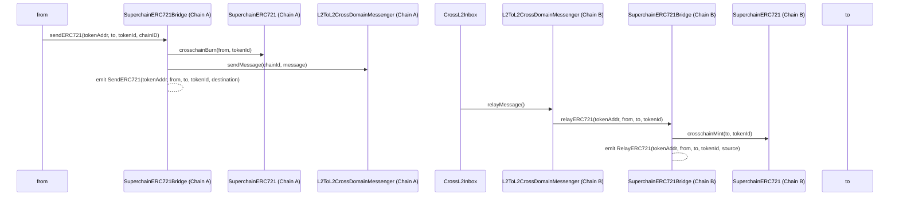

# Purpose

This document aims to design an interoperable ERC721 NFT standard for the Optimism Superchain ecosystem. As the Superchain grows with multiple L2 chains (OP Mainnet, Base, etc.), NFTs need to be transferable between these chains to create a unified and seamless user experience. Without this standard, NFT assets would be isolated within individual L2s, limiting the potential of the Superchain ecosystem.

# Summary

Introduce new `SuperchainERC721` contract and `SuperchainERC721Bridge` predeploy to provide standardized cross-chain NFT functionality across all Superchain L2s. This solution leverages the Superchain's native cross-chain messaging system (L2ToL2CrossDomainMessenger) to achieve secure and efficient NFT transfers between different OP Stack chains.

# Problem Statement + Context

As the Optimism Superchain expands with multiple L2 chains built on the OP Stack, several challenges emerge:

- Each L2 in the Superchain ecosystem currently operates in isolation regarding NFTs
- Existing NFT standards (ERC721) don't account for cross-L2 transfers within the Superchain
- Need for standardized bridge mechanisms that integrate with Superchain's native cross-chain messaging
- Requirement to maintain NFT uniqueness and provenance across all Superchain L2s
- Need for gas-efficient cross-chain transfers leveraging the Superchain's shared security model

# Proposed Solution

Two core contracts are proposed to create a unified NFT standard for the Superchain:

## SuperchainERC721

Extends standard ERC721 with Superchain-specific cross-chain capabilities through `IL2ERC721CrossChain` interface:

```jsx
interface IL2ERC721CrossChain is IERC165 {
    /// @notice Emitted when a crosschain transfer mints tokens.
    /// @param to       Address of the account tokens are being minted for.
    /// @param tokenId   ID of the token being minted.
    /// @param sender   Address of the account that finilized the crosschain transfer.
    event CrosschainMint(address indexed to, uint256 tokenId, address indexed sender);

    /// @notice Emitted when a crosschain transfer burns tokens.
    /// @param from     Address of the account tokens are being burned from.
    /// @param tokenId   ID of the token being burned.
    /// @param sender   Address of the account that initiated the crosschain transfer.
    event CrosschainBurn(address indexed from, uint256 tokenId, address indexed sender);

    /// @notice Mint tokens through a crosschain transfer.
    /// @param _to       Address to mint tokens to.
    /// @param _tokenId  ID of the token being minted.
    function crosschainMint(address _to, uint256 _tokenId) external;

    /// @notice Burn tokens through a crosschain transfer.
    /// @param _from     Address to burn tokens from.
    /// @param _tokenId  ID of the token being burned.
    function crosschainBurn(address _from, uint256 _tokenId) external;
}

abstract contract SuperchainERC721 is ERC721, IL2ERC721CrossChain {
    /// @notice Mint NFT through a crosschain transfer.
    /// @param _to       Address to mint NFT to.
    /// @param _tokenId  ID of the NFT being minted.
    function crosschainMint(address _to, uint256 _tokenId) external {
        if (msg.sender != Predeploys.SUPERCHAIN_ERC721_BRIDGE) revert Unauthorized();

        _mint(_to, _tokenId);

        emit CrosschainMint(_to, _tokenId, msg.sender);
    }

    /// @notice Burn NFT through a crosschain transfer.
    /// @param _from     Address to burn NFT from.
    /// @param _tokenId  ID of the NFT being burned.
    function crosschainBurn(address _from, uint256 _tokenId) external {
        if (msg.sender != Predeploys.SUPERCHAIN_ERC721_BRIDGE) revert Unauthorized();

        _burn(_from, _tokenId);

        emit CrosschainBurn(_from, _tokenId, msg.sender);
    }

    //// @inheritdoc IERC165
    function supportsInterface(bytes4 _interfaceId) public view virtual returns (bool) {
        return _interfaceId == type(IERC165).interfaceId || _interfaceId == type(IERC721).interfaceId
            || _interfaceId == type(IL2ERC721CrossChain).interfaceId;
    }
}
```

## SuperchainERC721Bridge 

A standardized bridge contract deployed on all Superchain L2s that:
- Integrates with L2ToL2CrossDomainMessenger for secure cross-chain messaging
- Handles NFT locking/unlocking and minting/burning across L2s
- Maintains consistent NFT state across the Superchain

```jsx
contract SuperchainERC721Bridge {

    error InvalidCrossDomainSender();
    error InvalidERC721();

    /// @notice Emitted when an ERC721 is sent from one chain to another.
    /// @param token       Address of the token being sent.
    /// @param from        Address of the sender.
    /// @param to          Address of the recipient.
    /// @param tokenId     ID of the token being sent.
    /// @param destination Chain ID of the destination chain.
    event SendERC721(address indexed token, address indexed from, address indexed to, uint256 tokenId, uint256 destination);

    /// @notice Emitted when an ERC721 is successfully relayed on this chain.
    /// @param token       Address of the token being relayed.
    /// @param from        Address of the msg.sender of sendERC721 on the source chain.
    /// @param to          Address of the recipient.
    /// @param tokenId     ID of the token being relayed.
    /// @param source      Chain ID of the source chain.
    event RelayERC721(address indexed token, address indexed from, address indexed to, uint256 tokenId, uint256 source);

    /// @notice Address of the L2ToL2CrossDomainMessenger Predeploy.
    address internal constant MESSENGER = Predeploys.L2_TO_L2_CROSS_DOMAIN_MESSENGER;

    /// @notice Sends an ERC721 to a destination chain.
    /// @param _token       Address of the token being sent.
    /// @param _to          Address of the recipient.
    /// @param _tokenId     ID of the token being sent.
    /// @param _chainId     Chain ID of the destination chain.
    /// @return msgHash_    Hash of the sent message.
    function sendERC721(address _token, address _to, uint256 _tokenId, uint256 _chainId) external returns (bytes32 msgHash_) {
        if (_to == address(0)) revert ZeroAddress();

        if (!IERC165(_token).supportsInterface(type(IL2ERC721CrossChain).interfaceId)) revert InvalidERC721();

        ISuperchainERC721(_token).crosschainBurn(msg.sender, _tokenId);

        bytes memory message = abi.encodeCall(this.relayERC721, (_token, msg.sender, _to, _tokenId));
        msgHash_ = IL2ToL2CrossDomainMessenger(MESSENGER).sendMessage(_chainId, address(this), message);

        emit SendERC721(_token, msg.sender, _to, _tokenId, _chainId);
    }

    /// @notice Relays an ERC721 received from another chain.
    /// @param _token       Address of the token being relayed.
    /// @param _from        Address of the msg.sender of sendERC721 on the source chain.
    /// @param _to          Address of the recipient.
    /// @param _tokenId     ID of the token being relayed.
    function relayERC721(address _token, address _from, address _to, uint256 _tokenId) external {
        if (msg.sender != MESSENGER) revert Unauthorized();

        (address crossDomainMessageSender, uint256 source) =
            _decodeSentMessagePayload(_sentMessage);

        if (crossDomainMessageSender != address(this)) revert InvalidCrossDomainSender();

        ISuperchainERC721(_token).crosschainMint(_to, _tokenId);

        emit RelayERC721(_token, _from, _to, _tokenId, source);
    }

}
```

## Cross-Chain Transfer Flow

The cross-chain transfer process leverages Superchain's native message passing:

1. User initiates transfer on source L2 through SuperchainERC721Bridge
2. NFT is burned on source L2
3. Cross-chain message is sent via L2ToL2CrossDomainMessenger
4. Message is received and verified on destination L2
5. NFT is minted to recipient on destination L2



# Open Questions

## Security Considerations

- How to handle potential chain re-orgs on different L2s?
- What happens if an L2 sequencer is temporarily unavailable?
- How to ensure NFT uniqueness across all Superchain L2s?

## Scalability & UX

- Should we implement a universal NFT indexer for the Superchain?
- How to handle NFT metadata consistency across L2s?
- How to optimize gas costs for cross-chain transfers?

## Protocol Integration

- How should this standard interact with existing OP Stack precompiles?
- Should we provide standard interfaces for NFT marketplaces to support cross-L2 listings?

# Alternatives Considered

## Independent Bridge Contracts

Considered having each L2 implement their own bridge contracts, but rejected due to:
- Inconsistent security models
- Poor user experience
- Inefficient use of Superchain's shared infrastructure

## Centralized Bridge Service

Considered a centralized bridging service but rejected because:
- Contradicts Superchain's decentralization principles
- Creates single point of failure
- Doesn't leverage Superchain's native security guarantees

# Risks & Uncertainties

- Impact of potential Superchain protocol upgrades on the NFT standard
- Cross-chain message latency affecting user experience
- Gas cost variations between different L2s
- Complexity in handling failed cross-chain transfers
- Integration challenges with existing NFT ecosystems
- Need for coordinated upgrades across all Superchain L2s

# Future Considerations

- Support for more complex NFT standards (ERC1155, etc.)
- Integration with L1<>L2 NFT bridges
- Cross-chain NFT lending and fractionalization
- Standardized royalty handling across L2s
- Universal NFT indexing and discovery mechanism for the Superchain