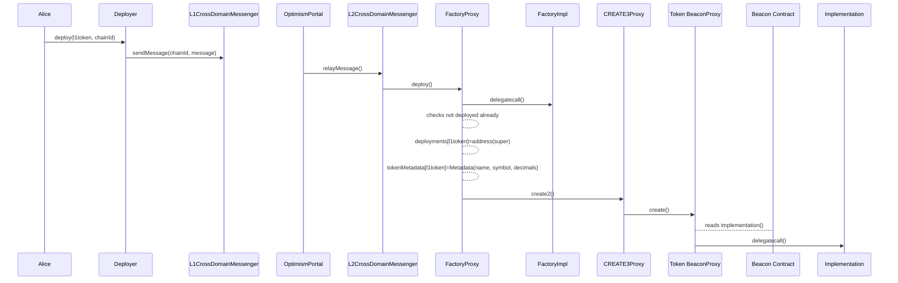
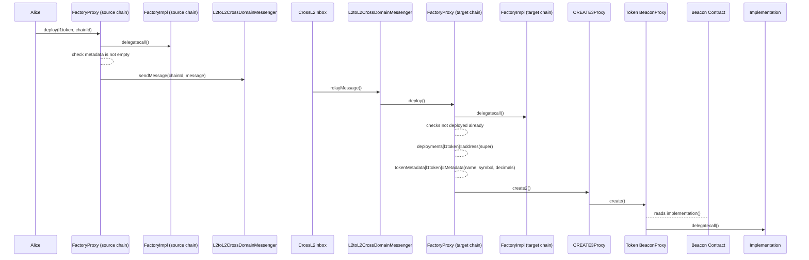

## Summary

This document presents the requirements for a factory that deploys `SuperchainERC20` tokens for tokens native to L1.

## Overview

The `SuperchainERC20Factory` will be a proxied predeploy. It will deploy proxied `SuperchainERC20` tokens using the Beacon pattern. This structure allows upgrading all `SuperchainERC20` implementations at once if needed.

Even though this document is specific for L1 native tokens, it should serve as a basis for other cases.

## Problem Statement + Context

The `SuperchainERC20` [standard](https://github.com/ethereum-optimism/specs/blob/aee0b2b2b45447daedef4b09bedc1fe7794d645d/specs/interop/token-bridging.md) will make ERC20s interoperable across the Superchain. However, the standard does not solve one of the main challenges in the future of Superchain: dealing with synchronized deployments and upgrades.

Moreover, the `SuperchainERC20` corresponding to a legacy token will require a liquidity migration conversion method, as presented in the corresponding [design document](https://github.com/ethereum-optimism/design-docs/pull/46#discussion_r1678444097). The system requires a registry to track the allowed representations for the conversion to be safe.

Both these problems can be solved by introducing factories that comply with the following requirements:

- **Same address deployment:** the `SuperchainERC20` standard requires the same address across chains.
  - Notice this is not strictly necessary: allowing different addresses of `SuperchainERC20`s to communicate using a registry is possible. However, maintaining a registry would be a demanding task.
- **Implementation upgradability:** it should be easy to upgrade `SuperchainERC20` implementations across chains.
- **Factory upgradability:** The factory should be upgradable to follow OP Factories structure.
- [Nice to have] **Conservation of properties:** Underlying ERC20 properties, such as name, symbol and decimal, should be conserved.

> 💡
> The presented solution is focused on tokens that are native to L1. For L2 native tokens, the factory implementation should be modified, but with similar core ideas.

## Proposed Solution

In what follows, we will list each requirement and detail how the factory should look to accomplish them.

### Same address: Predeploys + `CREATE3`

**Predeploys**

Factories will live in each L2 as a predeploy on the same address, which is crucial to achieving the same address for `SuperchainERC20`s across chains.

If the same address for the `SuperchainERC20` on L1 is also needed, then the address at which the predeploy is initialized should match the factory's L1 address.

**Creation method**

The `SuperchainERC20` addresses should be independent of the implementations. `CREATE` was discarded due to nonce dependability, and `CREATE2` was discarded because of its dependence on the creation code. For these reasons, the factory should use `CREATE3`.

The salt will be the L1 address.

### Implementation Upgradability: Beacon Proxies

**BeaconProxies**

The factory will deploy `SuperchainERC20`s as BeaconProxies, as this is the easiest way to upgrade multiple proxies simultaneously. Each BeaconProxy will delegate-call to the implementation address provided by the Beacon Contract.

**Beacon Contract**

The Beacon Contract holds the implementation address for the BeaconProxies. It will be a predeploy (consistent with the current architecture of the OP stack).

**Implementations**

Each type of ERC20 (vanilla, vote token, rebasing, xERC20, etc) will require their unique implementation and, therefore, factory. Optimism should deploy and support the most common implementations. Anyone can deploy their custom implementations and factories but without predeploys.

In an implementation update, the upgraded chains must perform a hardfork to change the constant value in the Beacon Contract representing the implementation address.

### Factory Upgradability

The factory will be a simple Proxy contract pointing to the current implementation. In case of an upgrade to the factory, the upgrading chains will need to deploy the new implementation and perform a hardfork to update the implementation address.

### Conservation of Properties

The first deployment should be initialized from a Deployer contract in L1 called `NATIVE_INITIALIZER`, with a message that includes name, symbol, and decimal information. The predeployed factory on L2 will check that the message comes from the whitelisted address of the Deployer (which will live as a state variable in the predeploy) and proceed with the rest of the `SuperchainERC20` deployment.

After the first deployment, it is possible to deploy from L1 or from the factory that already deployed and stored the metadata using interop.

An alternative design to deploy from L1 is to use the `L1 blockhash` along with storage proofs to prove the properties. This would allow to initialize deployments from L2 as well (the factory would need to implement two external functions in this case).

The factory will store

```solidity

mapping(address => DeploymentData) public deploymentsData;
```

that maps each L1 address to the `DeploymentData` struct

```solidity
struct DeploymentData {
  address superchainERC20;
  uint8 decimals;
  string name;
  string symbol;
}
```

## Implementation

**Proxy Factory**

Will follow the [`Proxy.sol` implementation](https://github.com/ethereum-optimism/optimism/blob/v1.1.4/packages/contracts-bedrock/src/universal/Proxy.sol) and `delegatecall()` to the factory implementation address.

**Factory Implementation**

```solidity
contract SuperchainERC20Factory is Semver {
  address public constant NATIVE_INITIALIZER = 0x0...;

  // address of superchainERC20 can be packed with decimals to save a slot
  struct DeploymentData {
    address superchainERC20;
    uint8 decimals;
    string name;
    string symbol;
  }

  mapping(address => DeploymentData) public deploymentsData;

  event SuperchainERC20Deployed(address indexed superchainERC20, address indexed l1Token, string name, string symbol, uint8 decimals);

  constructor() Semver(1, 0, 0) {}

  // This function can be called from L1 or L2. A real implementation would probably move the
  // deployment logic to an internal function and split deploy() into deployFromL1() and deployFromL2()
  // external functions to minimize branching.
  function deploy(address _remoteToken, uint8 _decimals, string memory _name, string memory _symbol) external returns (address _superchainERC20) {
    if (msg.sender == Predeploys.L2CrossChainMessenger) {
        require(IL2CrossChainMessenger(Predeploys.L2CrossChainMessenger).xDomainMessageSender() == NATIVE_INITIALIZER, "Invalid initializer");
    } else if (msg.sender == Predeploys.L2ToL2CrossDomainMessenger) {
        require(IL2toL2CrossDomainMessenger(Predeploys.L2ToL2CrossDomainMessenger).crossDomainMessageSender() == address(this), "Invalid cross-domain sender");
    } else {
        revert("Unauthorized caller");
    }

    require(deployments[_remoteToken] == address(0), "Token already deployed");

    // Encode the BeaconProxy creation code with the beacon contract address and metadata
    // [To discuss] It is possible to deploy with a string.concat 'SUPER' or 's' before the name
    bytes memory _creationCode = abi.encodePacked(
        type(BeaconProxy).creationCode,
        abi.encode(Predeploy.SuperchainBeacon, abi.encode(_remoteToken, _decimals, _name, _symbol))
    );

    bytes32 salt = keccak256(abi.encode(_remoteToken));
    _superchainERC20 = CREATE3.deploy(salt, _creationCode);

    deploymentsData[_remoteToken] = DeploymentsData(_superchainERC20, _decimals, _name, _symbol);

    emit SuperchainERC20Deployed(_superchainERC20, _remoteToken, _decimals, _name, _symbol);
  }

  // discuss having an array of chainIds and a for
  function deployWithMetadata(address _remoteToken, uint256 _chainId) external {
    DeploymentData storage _metadata = deploymentsData[_remoteToken];
    require(_metadata.superchainERC20 != address(0), "Token has not been deployed yet");

    bytes memory _message = abi.encodeCall(this.deploy, (_remoteToken, _metadata.decimals, _metadata.name, _metadata.symbol));
    IL2toL2CrossDomainMessenger(Predeploys.L2ToL2CrossDomainMessenger).sendMessage({destination: _chainId, target: address(this), message: _message});
  }
}
```

The name `_remoteToken` was chosen over `_l1Token` to contemplate future L2 native cases.

`NATIVE_INITIALIZER`

This contract will be deployed on the chain where the token is native. In this case, that would be L1 and messengers will be the `L1CrossDomainMessenger`s.

```solidity
contract NATIVE_INITIALIZER {
  mapping(uint8 => address) public messenger;
  address public constant L2Factory;
  address public owner;

  constructor(address _L2Factory, address _owner) {
    L2Factory = _L2Factory;
    transferOwnership(_owner);
  }

  function updateMessenger(uint8 chainId, address messenger) external onlyOwner {
    messengers[chainId] = messenger;
  }

  function deploy(address _token, uint8 _chainId) external {
    // Retrieve token metadata
    string memory _name = IERC20Metadata(_token).name();
    string memory _symbol = IERC20Metadata(_token).symbol();
    uint8 _decimals = IERC20Metadata(_token).decimals();

    // Encode the message with token details
    bytes memory message = abi.encodeCall(
      SuperchainERC20Factory.deploy,
      (_token, _name, _symbol, _decimals)
    );

    // Send the message to the L2Factory using messenger
    // TODO: check min gas
    IMessenger(messenger(chainId)).sendMessage(
      L2Factory,
      message,
      MIN_GAS_LIMIT
    );
  }
}
```

**BeaconProxy (SuperchainERC20)**

The Token should follow a simple BeaconProxy implementation, like Openzeppelin:

https://github.com/OpenZeppelin/openzeppelin-contracts/blob/master/contracts/proxy/beacon/BeaconProxy.sol

**Beacon Contract**

```solidity
contract SuperchainERC20Beacon is IBeacon {
    /// TODO: Replace with real implementation address
    address internal constant IMPLEMENTATION_ADDRESS = 0x0000000000000000000000000000000000000000;

    function implementation() external pure override returns (address) {
        return IMPLEMENTATION_ADDRESS;
    }
}
```

## User Stories

### L1 initialized `SuperchainERC20` deployment

1. Anyone can initialize a deployment for an L1 token by calling the `L1Initializer` contract in L1. The function call will include the target `chainId`. The message will include name, symbol, and decimal information.
2. The cross-chain message will trigger the predeployed factory in the target chain with the L1 address as salt.
3. The factory stores the child address and metadata on a `deploymentsData` mapping.



### L2 initialized `SuperchainERC20` deployment

1. Anyone can initialize a deployment for an already deployed token L2 address by calling the `deployWithMetadata()` function on the chain that already holds the metadata and selecting a target `chainId`. The function will call the target chainId’s Factory via the `L2toL2CrossDomainMessenger` . The message will include the metadata.
2. The cross-chain message will trigger the factory in the target chain with the L1 address as salt.
3. The factory stores the child address and metadata on a `deploymentsData` mapping.



### `SuperchainERC20` implementation upgrade

1. Anyone can deploy a new implementation on each chain to be upgraded.
2. Core developers and Foundation will organize a hardfork between the upgraded chains.
3. The hardfork will update the implementation address on the Beacon Contract.

## Open Questions

- How should different ERC20 implementations be handled? One or multiple implementations per Beacon Contract predeploy?
- Should the `NATIVE_INITIALIZER` act as an ownable Router or have one per chain? The Router approach seems better for bytecode equivalence among factory implementations.
- How should native token deployment in L2 behave?
- We could string.concat an ‘s’ before the name of the deployed SuperchainERC20. Is this a good idea?
