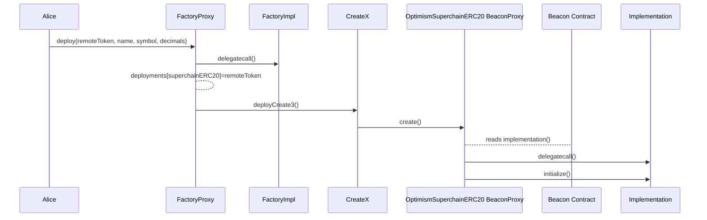
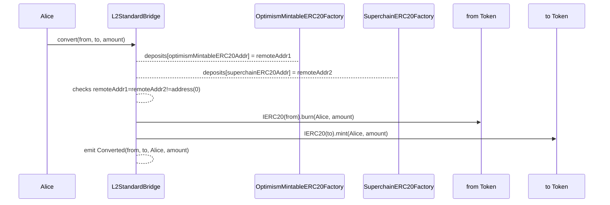

## Summary

This document presents the requirements for a factory that deploys `OptimismSuperchainERC20` tokens.

## Overview

The `SuperchainERC20Factory` will be a proxied predeploy. It will deploy proxied `OptimismSuperchainERC20` tokens using the Beacon pattern. This structure allows upgrading all implementations at once if needed.

Even though this document is specific for L1 native tokens, it should serve as a basis for other cases.

## Problem Statement + Context

The `SuperchainERC20` [standard](https://github.com/ethereum-optimism/specs/blob/aee0b2b2b45447daedef4b09bedc1fe7794d645d/specs/interop/token-bridging.md) will make ERC20s interoperable across the Superchain. However, the standard does not solve one of the main challenges in the future of Superchain: dealing with synchronized deployments and upgrades.

Moreover, the `SuperchainERC20` corresponding to a legacy token (`OptimismSuperchainERC20`) will require a liquidity migration conversion method, as presented in the corresponding [spec document](https://github.com/ethereum-optimism/specs/pull/294). The system requires a registry to track the allowed representations for the conversion to be safe.

Both these problems can be solved by introducing factories that comply with the following requirements:

- **Same address deployment:** the `SuperchainERC20` standard requires the same address across chains.
  - Notice this is not strictly necessary: allowing different addresses of `SuperchainERC20`s to communicate using a registry is possible. However, maintaining a registry would be a demanding task.
- **Implementation upgradability:** it should be easy to upgrade `OptimismSuperchainERC20` implementations across chains.
- **Factory upgradability:** The factory should be upgradable to follow OP Factories structure.
- **Deployment history:** The factory should keep a history of deployed tokens, acting as a registry.

> 💡
> The presented solution is focused on tokens that are native to L1. For L2 native tokens, the factory implementation should be modified.

## Proposed Solution

In what follows, we will list each requirement and detail how the factory should look to accomplish them.

### Same address: Predeploys + `CREATE3`

**Predeploys**

Factories will live in each L2 as a predeploy on the same address, which is crucial to achieving the same address for `OptimismSuperchainERC20`s across chains.

**Creation method**

The `OptimismSuperchainERC20` addresses should be independent of the implementations. `CREATE` was discarded due to nonce dependability, and `CREATE2` was discarded because of its dependence on the creation code. For these reasons, the factory should use `CREATE3`. The safest way to use `CREATE3` is through [CreateX](https://github.com/pcaversaccio/createx), which will be a pre-install in the OP stack.

The salt will be composed of the L1 address and the token metadata. This implies that the same L1 token can have multiple SuperchainERC20 representation, as long as the metadata also changes.

### Implementation Upgradability: Beacon Proxies

**BeaconProxies**

The factory will deploy `OptimismSuperchainERC20`s as BeaconProxies, as this is the easiest way to upgrade multiple proxies simultaneously. Each BeaconProxy will delegate-call to the implementation address provided by the Beacon Contract.

**Beacon Contract**

The Beacon Contract holds the implementation address for the BeaconProxies. It will be a predeploy and implement the interface defined in [EIP-1967](https://eips.ethereum.org/EIPS/eip-1967).

**Implementations**

In an implementation update, the upgraded chains must perform a protocl upgrade to change the constant value in the Beacon Contract representing the implementation address. 
The address of the implementation will be determined similarly to [other upgrade transactions](https://github.com/ethereum-optimism/specs/blob/1f8ace7f21e44ff028951965ab552c81b892f199/specs/fjord/derivation.md#gaspriceoracle-deployment).

### Factory Upgradability

The factory will be a simple Proxy contract pointing to the current implementation. In case of an upgrade to the factory, the upgrading chains will need to deploy the new implementation and perform a protocol upgrade to update the implementation address.

### Deployment history

The factory will store a `deployments` mapping that maps each deployed `OptimismSuperchainERC20` address to the corresponding L1 address (remote address).

```solidity
mapping(address superc20 => address remoteToken) public deployments;
```

This mapping is necessary to implement the conversion between legacy and superchain tokens in the `L2StandardBridge`. This is because the `L2StandardBridge` will check the mapping with the superchain token address to check it's been deployed by the official factory and verify it shares the `remoteToken` with the legacy token (see the [liquidity migration specs](https://github.com/ethereum-optimism/specs/pull/294) for more details).

## Implementation

**Proxy Factory**

Will follow the [`Proxy.sol` implementation](https://github.com/ethereum-optimism/optimism/blob/v1.1.4/packages/contracts-bedrock/src/universal/Proxy.sol) and `delegatecall()` to the factory implementation address.

**Factory Implementation**

```solidity
contract OptimismSuperchainERC20Factory is ISemver {
  mapping(address superc20 => address remoteToken) public deployments;
  string public constant version = "1.0.0";

  event OptimismSuperchainERC20Deployed(address indexed superchainERC20, address indexed remoteToken, string name, string symbol, uint8 decimals);

  constructor() {}
  function deploy(
      address _remoteToken,
      string memory _name,
      string memory _symbol,
      uint8 _decimals
  ) external returns (address _superchainERC20) {
    bytes memory initCallData = abi.encodeCall(
      SUPERCHAIN_IMPL.initialize,
      (_remoteToken, _name, _symbol, _decimals)
    );

    bytes memory _creationCode = bytes.concat(
      type(BeaconProxy).creationCode,
      abi.encode(Predeploy.OptimismSuperchainERC20Beacon, initCallData)
    );

    bytes32 salt = keccak256(abi.encode(_remoteToken, _name, _symbol, _decimals));

    _superchainERC20 = Preinstall.CreateX.deployCreate3(salt, creationCode);

    deployments[_superchainERC20] = _remoteToken;

    emit OptimismSuperchainERC20Deployed(
      _superchainERC20,
      _remoteToken,
      _name,
      _symbol,
      _decimals
    );
  }
}
```

The name `_remoteToken` was chosen over `_l1Token` to contemplate future L2 native cases.

**BeaconProxy (OptimismSuperchainERC20)**

The Token should follow a simple BeaconProxy implementation, like Openzeppelin:

https://github.com/OpenZeppelin/openzeppelin-contracts/blob/master/contracts/proxy/beacon/BeaconProxy.sol

**Beacon Contract**

```solidity
contract OptimismSuperchainERC20Beacon is IBeacon {
  /// TODO: Replace with real implementation address
  address internal constant IMPLEMENTATION_ADDRESS = 0x0000000000000000000000000000000000000000;

  function implementation() external pure override returns (address) {
    return IMPLEMENTATION_ADDRESS;
  }
}
```

**Implementation**
The implementation should include

- An `initialize` function that takes `(address _remoteToken, string _name, string _symbol, uint8 decimals)` and stores these in the storage of the BeaconProxy.
- A function to reinitialize after proxy deployments or upgrades.

## User Stories

### `OptimismSuperchainERC20` deployment

1. Anyone can deploy a `OptimismSuperchainERC20` by calling the `deploy` function in the `OptimismSuperchainERC20Factory` contract with `_remoteToken`, `_name`, `_symbol` and `decimals` as inputs.
2. The factory stores the `_remoteToken` address for each deployed SuperchainERC20 address.



### `SuperchainERC20` implementation upgrade

1. Anyone can deploy a new implementation on each chain to be upgraded.
2. Core developers and Foundation will organize a protocol upgrade between the upgraded chains.
3. The protocol upgrade will update the implementation address on the Beacon Contract.

### Convert
