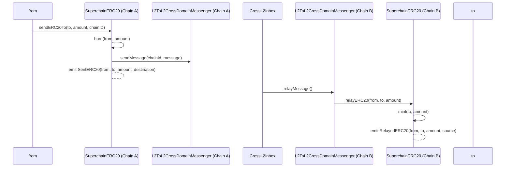
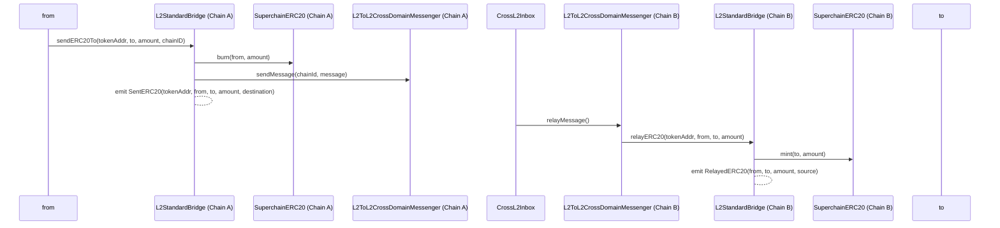

## Summary

This design doc evaluates the pros and cons of moving the interop specific functions from the [`SuperchainERC20` standard](https://github.com/ethereum-optimism/specs/blob/main/specs/interop/token-bridging.md) to the `L2StandardBridge`. The goal of this document is to open up the discussion and ensure that the best design path is taken.

## The current design

The current version of the `SuperchainERC20` standard, as presented in the [specs](https://github.com/ethereum-optimism/specs/blob/main/specs/interop/token-bridging.md), extends the ERC20 to include interop specific functions. In particular, it introduces two functions: 

- `sendERC20`: burns tokens and initializes a message to the `L2ToL2CrossDomainMessenger`.
- `relayERC20`: process incoming messages from the `L2ToL2CrossDomainMessenger` and mints the corresponding amount.

The current flow can be seen below:

## The alternative design

Even though the current design works well, it's not obvious that it is the best approach. An alternative design could move the interop functions from the token to the `L2StandardBridge`.
This would look like follows:

- The `L2StandardBridge` will include both `sendERC20` and `relayERC20` with the same logic, but adding the token address as an input.
    - The `L2StandardBridge` already had mint and burn permissions on the `SuperchainERC20`,  which was necessary for the conversion, so the modification would not require permission changes.
- The `OptimismSuperchainERC20` will remain a contract separate from the `OptimismMintableERC20` and require liquidity migration using the `convert` function in the `L2StandardBridge`.
    - This is necessary to conserve the invariant of the same address corresponding to the same (trusted) implementation, which is key to cross-chain access control.
    - The OptimismSuperchainERC20 will be a Beacon Proxy. The OptimismSuperchainERC20 implementation would now be similar to the OptimismMintableERC20 implementation (give mint and burn rights to the L2StandardBridge and include a remoteToken ), but with an initialize function to replace the constructor.
    - It is possible to reuse the `OptimismMintableERC20Factory` and avoid introducing a new predeploy factory.

**Code modifications:**

- The `OptimismMintableERC20Factory` will be upgraded to deploy `OptimismSuperchainERC20` , with the corresponding `init_code` as the `OptimismMintableERC20`s and using CREATE3.
- The `BeaconContract` and `convert` function will work the same way.
    - The `OptimismSuperchainERC20Factory` will of course be modified to deploy the new simpler implementations, but will still record deployments in a mapping.

The updated flow would look like follows:

It’s important to notice that, even though this functions get implemented in the bridge, tokens will still have agency to reimplement the bridging functions on their contract if they want so. The alternative design gives the optionality.

## Comparison

### Pros of using the alternative design

- **Compatible with the current design:** adding the `sendERC20` and `relayERC20` functions to the bridge does not imply that these should no longer exist in the token. It only gives the option to token developers not to include them.
- **Separation of functionalities:** bridging lives in the bridge, token functions live in the token. This fosters clarity but also comes with improved upgrade flows.
    - If bridging functions are implemented on the ERC20, updates to the bridge might require updates to every ERC20. This might be easy to do for implementations that use a BeaconProxy structure, but not in other cases.
- **Easier for integrators:** integrators must deal with a single entrypoint instead of many. This would improve their devX considerably.
- **Improved indexing and monitoring:** only monitoring events and traces coming from a single source would be necessary instead of many. Improved monitoring correlates with improved security.
- **Improved backwards compatibility:** the only modifications required to implement interop for a token are including `remoteToken` and giving mint and burn permissions to the `L2StandardBridge`, which can be implemented before the hardfork. This would not be possible with the current design. 
- **Homogeneous implementation:** most tokens on other chains do not implement bridging functionalities (except for OFTs and some others), which leads to a fragmented developer experience.

### Cons of using the alternative design

- **Timing:**
    - **Changing code:** even though not many contracts and tests would need to be changed, it is still a considerable factor. The code has not only been developed but also extensively reviewed.
    - **Communication:** a lot of teams are already aware of the current standard. Changes would need to be communicated. There is place for miscommunication or errors at this point.

## Takeaways

All things considered, moving the `sendERC20` and `relayERC20` seems like the best long-term solution. It's a more general approach that considers the current approach to a particular case.
There is some concern about the timing, especially regarding communication, but it is considered worth it.