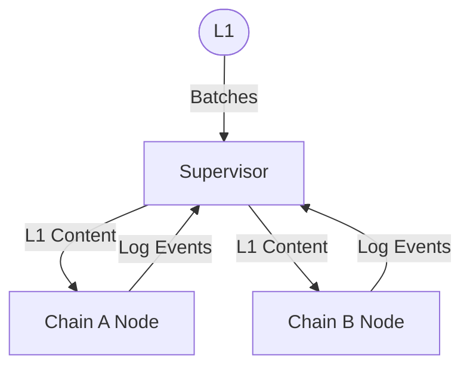

# Purpose
To explore the control-flow of Superchain systems, particularly the relationship between Supervisor and Node, and to make some recomendations.

This document comes from a conversation held recently (@protolambda and @axelKingsley) around the Supervisor's edge cases. To credit @ajsutton, once an idea is discovered, it's often a good idea to state it clearly, and let it mature untouched for a moment. This 1-pager is an attempt at doing that.

# Summary
The Superchain is reliant on central "Supervisor" components which currently act as indexers to all log events on the chain. The Supervisor should take a more central role in ensuring consistency between nodes.

# Problem Statement + Context
In designing the Supervisor, we've encountered issues around the idea of inter-chain consistency. When the Supervisor attempts to calculate "Cross" safety of messages on chains, there are additional considerations for data which is L1 derived. Here are some examples:
* Chains A and B may have diverged their L1 source, and so messages which should be valid appear not to be, or messages which appear invalid appear valid.
* Chain A may be on L1-Block N, while depending on a messages on Chain B which will only appear in L1-Block N+1. *Even if* L1-Block N+1 is known in the database, it is inadmissable for safety calculations for Chain A, since the chain is derived only from L1-Block N.
* Even when L1-Block N would update both Chains A and B, the *OP-Node* of one of those chains may not update right away, and so it is unclear if both chains have an update.

The problem at its core is that OP-Nodes are self-managing, and therefore uncoordinated. When Nodes are uncoordinated, the Supervisor must take extra steps to track and ensure consistency when calculating Superchain attributes (Cross Safety).

# Alternatives Considered
The Supervisor has gone through many archetypes:
* Currently, the Supervisor is *only* an index and Cross-Safety calculator. It assumes that Nodes will feed it all required information, and it responds to queries. In this form, the Supervisor must track the L1 derived block for each chain, and must always account for the possibility that the view at that block is incomplete.
* In the past, the Supervisor was briefly responsible for indexing *and* handling some control signals around reorg. When Reorgs are needed, the Supervisor spurs the Nodes to do that work.

I think in both cases we missed the ideal - The Supervisor should be the central owner of *data consistency*, because it is itself a centralized datastore. Therefore, the Supervisor's responsibilities can include feeding *data* to Nodes.

# Proposed Solution

For Nodes participating in The Superchain, it doesn't make sense for all of them to seek out their own L1 inputs. Rather, the Supervisor should be responsible for getting batches from the L1 and delivering them to the appropriate nodes.

### What Does this Get Us?
The largest benefit I see is that the Supervisor is now confident that all Chains use a consistent L1 height for their "Local" safety. Now, all Cross Safety calculations can be done without trying to adjust individual Chain "views" of L1 sources. L1 derivation information becomes much simpler too. Now, from a given L1 block, The Supervisor can record the L1 derivation of all chains at the same time. And since we've guaranteed consistency, it is *less* critical that we record historical L1 Derivation links.

# Risks & Uncertainties

1. This doesn't solve all our problems. Nodes may still be inconsistent if for any reason a software error would cause they to desynchronize
2. Nodes would have to allow for this alternative mechanism to be given L1 data

# Taking the Idea Further
This document is aimed at convincing the reading that the Supervisor is a suitable L1 source for Nodes in an interoperating set.

However, we could extend this idea to see what other responsibilities the Supervisor could hold:

1. The Supervisor could be responsible for receiving and routing unsafe block data in the same way this document proposes we handle L1 data. This would allow for the Supervisor to *supervise* its underlying Node's sync of the chain. This would get messy considering OP-Node and OP-Geth already share syncing responsibilities.
2. The Supervisor could host APIs that would route down to the individual nodes. Because in this proposal the Supervisor is the one responsible for feeding the data to the Nodes, it is able to ensure that grouped calls against the individual networks are done only at one L1 height (for example `getHead` to return every Head-Block in the Superchain). Without this, callers would need to individually call the networks and would further need to ensure they are all based at the same L1.

At a high level, these types of ideas take aspects of `proxyd`, specifically around node-state-consistency, and make them a responsibility of the Supervisor. As we've designed it today, participating in the Superchain requires the runing of a Supervisor, and Nodes for every Chain. We could take that group and image it as a "Supernode". If we index our designs toward that idea, we can imagine that the Supervisor holds responsibility around *data consistency*, because it is concerned with providing a calculation (Cross Safety) over consistent data.