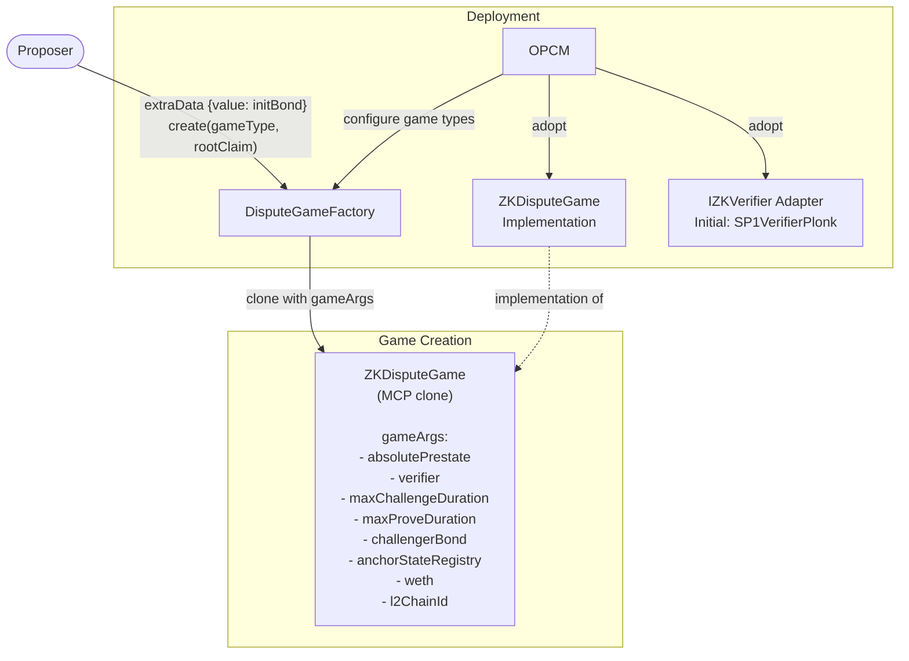
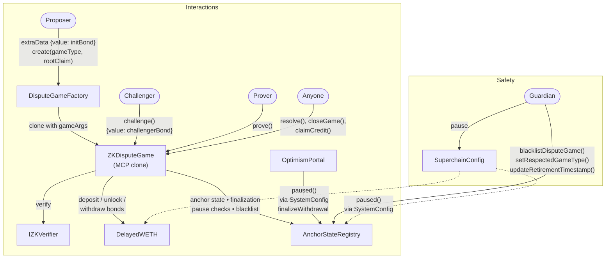
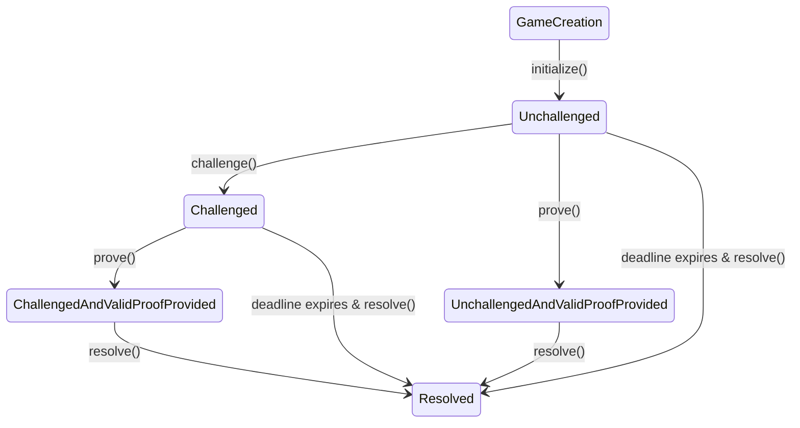
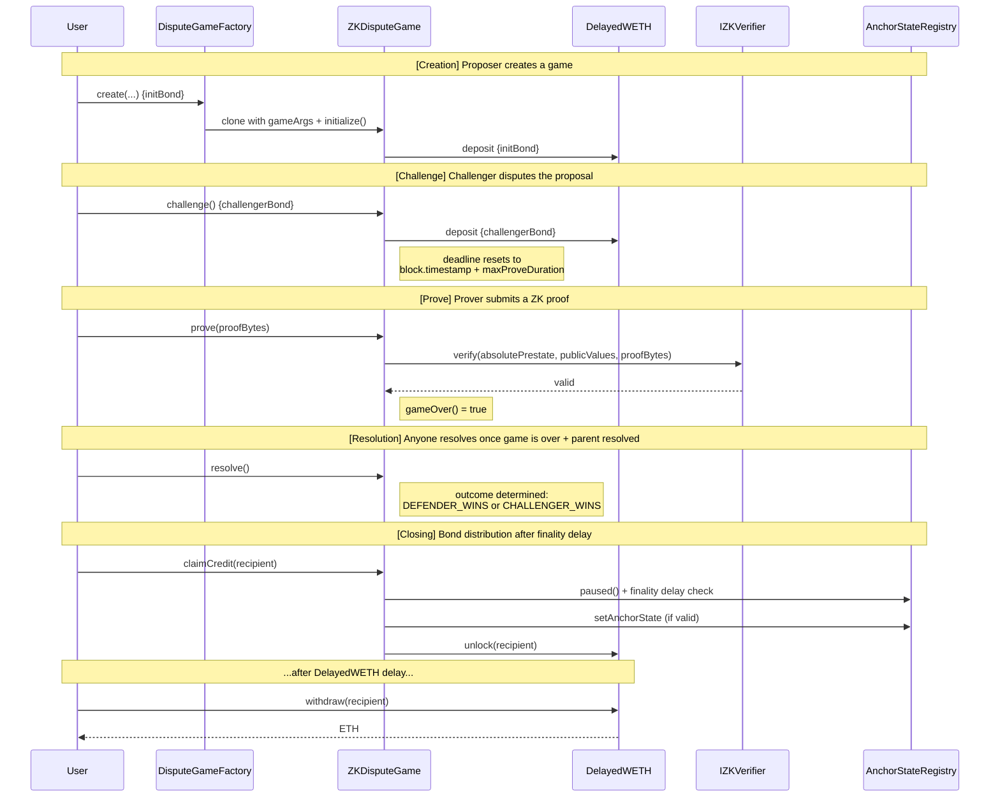

# Design Doc: ZK Dispute Game Contracts for the OP Stack

| Field | Content |
| --- | --- |
| **Author** | Wonderland |
| **Created at** | 2026-02-27 |
| **Initial Reviewers** | TBD |
| **Need Approval From** | TBD |
| **Status** | Draft |

# **Purpose**

The goal is to integrate a ZK-based dispute game into the OP Stack as a first-class game type, offered alongside the current multi-round bisection protocol.

> ⚙
> This design doc covers the smart contract work only. Off-chain components are covered in a separate design doc and work pipeline.

# Summary

The proposed `ZKDisputeGame` is a new dispute game type that resolves disputes in a single round: a proposer posts an output root with a bond, anyone can challenge it by depositing a challenger bond, and a prover submits a ZK proof to defend the claim or lets the proving window expire. The contract is fully permissionless (proposing, challenging, and proving), integrates with `DelayedWETH` for bond safety, uses the MCP clone pattern for per-chain deployment via OPCM, and calls the ZK verifier through a generic `IZKVerifier` interface. The first supported backend is SP1 (PLONK) by Succinct.

# Problem Statement + Context

The OP Stack currently relies on fault proofs, which require seven days in total by default to finalize withdrawals. The fault proof system uses an interactive bisection protocol where dispute are resolved through multiple rounds of on-chain interaction. This multi-round process is complex and may further delay even more the withdrawal finality.

ZK proofs offer an alternative: instead of interactively bisecting to find the disputed instruction, a prover generates a single cryptographic proof that the entire state transition is correct. This eliminates the need for multiple rounds of interaction and the associated time window.

The current OP Succinct Lite implementation (ZK-Fault Proof mode) was created as a separate project, and it has demonstrated feasibility in production-grade level. 

Nevertheless, it is not OP Stack compliant in several critical ways:

- No verifier agnosticism: The contract is tightly coupled to SP1’s verification interface and specific parameters (`AGGREGATION_VKEY`, `RANGE_VKEY_COMMITMENT`).
- `AccessManager` dependency: An external dedicated `AccessManager` contract gates who can propose and challenge, instead of being strictly permissionless.
- No `DelayedWETH`: Bonds are held as raw ETH, without the guardrails that allow the Guardian to freeze funds if a bug is discovered post-resolution.
- Missing safety checks: No pause check in `closeGame`, which must be present to comply with the current security mode as in Fault Proofs.
- No OPCM integration: The ZK game type is not recognized by it.
- No MCP compatibility: All configurations live in the constructor immutables, preventing OPCM from deploying per-chain instances from a shared implementation.

> 📝
> The design doc builds on the following existing contracts: `OptimisticZkGame` [0.2.0](https://github.com/ethereum-optimism/optimism/blob/80804af288d016d28bf26e3b14e58679bb070d87/packages/contracts-bedrock/src/dispute/zk/OptimisticZkGame.sol) (equivalent to `OPSuccinctFaultDisputeGame` [2.0.0](https://github.com/succinctlabs/op-succinct/blob/47435327eecf8d207fe6f5f1945078224a85e954/contracts/src/fp/OPSuccinctFaultDisputeGame.sol)) with the FDG described in [develop](https://github.com/ethereum-optimism/optimism/tree/develop/packages/contracts-bedrock/src/dispute).

# Proposed Solution

## Design Principles

- Align with the current OP Stack security model for proofs.
- Maintain the Stage 1 reachable by default.
- Establish the ground for zkVM agnosticism.

## General Architecture

The `ZKDisputeGame` (as a renaming of the current `OptimisticZkGame`/`OPSuccinctFaultDisputeGame`) sits at the center of the OP Stack dispute system, interacting with the same infrastructure as the existing `FaultDisputeGame`.

The following chart provides an insight of how the general architecture of the design would look like:



### Contracts Involved

| Contract | What it does | Key interactions |
| --- | --- | --- |
| **ZKDisputeGame** (clones) | Per-proposal dispute game instance. Runs the single-round **challenge → prove → resolve** lifecycle and tracks bond accounting. | Exposes `challenge()`, `prove()`, `resolve()`. Verifies proofs via `IZKVerifier`. Uses `DelayedWETH` for deposit/unlock/withdraw of bonds. Consults `AnchorStateRegistry` for pause/blacklist/finalization |
| **ZKDisputeGame** (implementation) | Shared implementation contract. It is cloned (MCP) to create each game instance. | Deployed/upgraded by OPCM. Serves as the bytecode base for MCP clones |
| **DisputeGameFactory** | Factory that creates MCP clones of `ZKDisputeGame`. | `create(...)` instantiates a new game. Appends per-chain `gameArgs` (CWIA) |
| **AnchorStateRegistry** | Source of truth for game **finalization**, **anchor state**, **respected game type**, and **blacklisting**. | Enforces pause/blacklist checks. Governs which games can finalize withdrawals (via `isGameClaimValid` or equivalent) |
| **DelayedWETH** | Bond custody with a time “airgap” lifecycle (deposit → unlock → withdraw). | Holds bond deposits. Adds delay before withdrawal so the system can pause/freeze funds if needed |
| **IZKVerifier** | Generic verifier interface. A concrete deployment verifies a specific SP1 proof version. OPCM manages verifier versions. | `verify(absolutePrestate, publicValues, proofBytes)`. Versioning/upgrades coordinated by OPCM |
| **Other related contracts (unchanged)** | `SuperchainConfig`, `OptimismPortal`, `SystemConfig` remain as in the known OP Stack flow. | Portal consumes game status/root claim for withdrawals. `SuperchainConfig` provides `paused()` (read by ASR through `SystemConfig`) |

### Actors

- **Proposer**: Fully permissionless. Anyone can create games via the `create` function in `DisputeGameFactory`, with the required bond.
- **Challenger**: Fully permissionless. Anyone can challenge any proposal.
- **Prover**: Fully permissionless. Anyone can submit a valid proof.
- **Guardian**: Pause the system, blacklist games, set respect game type (same as in Fault Proofs).
- **OPCM / ProxyAdmin Owner**: Deploys implementations, configures game types in the factory, manages prestates and verifier versions.

## What Changes

### 1. MCP Pattern Migration

All the per-chain configurations moves out of constructor immutables and into the `gameArgs` appended by `DisputeGameFactory` at clone time CWIA (clones-with-immutable-args), following the same pattern as in FDG. That means the `ZKDisputeGame` implementation contract has no constructor immutables related to the chain or program identity. This MCP pattern is what allows a single implementation contract to serve every chain, where each game instance is a lightweight clone that shares the implementation’s bytecode but carries its own per-chain configuration. 

The following fields are included in `gameArgs`:

- `absolutePrestate`: identifies the ZK program being proven. In the case of SP1 deployment, this corresponds to the program’s verification key.
- `verifier`: address of the verifier contract.
- `maxChallengeDuration`: Time window for challenges.
- `maxProveDuration`: Time window for proof submission after a challenge.
- `challengerBond`: bond required to challenge a proposal.
- `anchorStateRegistry`
- `weth` (per-chain `DelayedWETH`)
- `l2ChainId`

The `absolutePrestate` represents the zkVM-specific program identity values. For example, for the SP1 program, the `absolutePrestate` corresponds to the program’s verification key in the OP Succinct implementation.

The `anchorStateRegistry`, `weth`, and `l2ChainId` are already known by OPCM from the chain's deployment, and are injected by `makeGameArgs()` directly. 

### 2. Verifier Agnosticism

The `ZKDisputeGame` interacts with ZK provers through a generic `IZKVerifier` interface, making the contract fully verifier-agnostic. The verifier address comes from `gameArgs`, meaning OPCM controls which verifier each chain uses.

```solidity
function prove(bytes calldata _proofBytes) external {

		// (...) Packing the public values, specific to each game

    IZKVerifier(verifier()).verify(
        absolutePrestate(), 
        publicValues, 
        _proofBytes
    );

    // (...) Rest of the logic
}
```

The prove function constructs the public values from the game’s on-chain state (`l1Head`, `startingOutputRoot`, `rootClaim`, `L2SequenceNumber`, and `l2ChainId`), then calls the `IZKVerifier` with `verify`. Such an interface will be:

```solidity
interface IZKVerifier {
    function verify(
        bytes32 programId, // equivalent to absolutePrestate() in the dispute game context
        bytes calldata publicValues,
        bytes calldata proof
    ) external view;
}
```

Existing verifiers can be integrated by wrapping them in an `IZKVerifier`compatible adapter.

**Verifier Added**

The `ZKDisputeGame` can accept any verifier that complies with `ZKVerifier` interface. The first verifier to be integrated in this phase will be the `PLONKVerifier` of Succinct, deployed behind an adapter implementing the `IZKVerifier`. PLONK is chosen over other offered like Groth16 because it has a better trust model and a simpler upgrade path. The performance tradeoff (~3-4x slower proving, ~30K more gas) is negligible in a dispute context where proofs are rare and time windows span hours.

**Verifier Upgrade Path**

Verifier upgrades follow the same pattern as MIPS VM upgrades in FDG. The `verifier` and `absolutePrestate` are both in `gameArgs`, so they can be swapped per chain without redeploying the `ZKDisputeGame` implementation. When the verifier requires a change, it needs to:

1. Deploy a new verifier. This might include updating the new program as well if changed.
2. If the program changed, compute a new `absolutePrestate`.
3. OPCM update `gameArgs` with new `verifier` and/or new `absolutePrestate`.
4. In-progress games play out under the old rules. The guardian may retire old games via `updateRetirementTimestamp()` if needed..
5. New games use updated configuration.

### 3. `DelayedWETH` Integration

Bonds move from raw ETH held in the contract to the `DelayedWETH`. This matches the `FaultDisputeGame`, giving the Guardian a time window to freeze funds post-resolution if a bug is discovered.

### 4. Safety Checks Alignment

Two checks from `FaultDisputeGame.closeGame()` are added in `ZKDisputeGame`:

- Pause check: reverts if `AnchorStateRegistry` is paused.
- Resolve check: reverts if `resolvedAt==0`.

### 5. Permissionless Access

The `AccessManager` contract is removed entirely. Proposing, challenging, and proving are all fully permissionless, matching the `FaultDisputeGame` model.

### 6. Chain Identification

The OP Succinct contracts use `ROLLUP_CONFIG_HASH` as a proof public value. This value is replaced with the `l2ChainId` for two reasons:

- **Operational simplicity**: `l2ChainId` is a single integer already available in `SystemConfig` and passed through `gameArgs` by OPCM.
- **Hardfork resilience**: When a new hardfork adds fields to `RollupConfig`, the hash changes for every chain and must be updated on-chain. With `l2ChainId`, hardfork config changes are absorbed uniquely into the program update (as a new `absolutePrestate`).

### 7. Parent Validation

In FDG, every game starts from a fixed anchor root, as a known-good state agreed upon at deployment time. ZK games cannot rely on this approach because each proof must verify a state transition from a specific starting point to a specific ending point. Each ZK game chains off the output of a previously resolved game, using its proven result as the starting state for the next proof.

That means the parent-chaining model introduces checks not present in FDG (which always starts from the anchor):

- Parent must not be blacklisted or retired
- Parent must be the same game type
- Parent must not have resolved as `CHALLENGER_WINS`
- Parent’s `l2SequenceNumber` must be at or above the anchor state
- `isGameRespected` check on the parent is removed (which only gates withdrawals, not chaining)

If a parent is blacklisted or retired after child games have already been created, the Guardian must individually blacklist or retire those child games, which places them into REFUND mode.

### 8. OPCM Integration

The `ZKDisputeGame` (as game type = 10) integrates into OPCM v2 through the existing `DisputeGameConfig` flow - the same as Cannon and Permissionless Cannon. No new OPCM primitives are needed - the integration reuses the existing pattern with three additions specific to the ZK game type.

OPCM needs three things to support a new game type:

1. An implementation address: The `ZKDisputeGame` is deployed once (with `DeployImplementations` script) and is tracked in `OPContractsManagerContainer.Implementations` alongside the existing fault game implementations.
2. Config struct for per-chain parameters: A new `ZKDisputeGameConfig` struct carries the fields that vary per deployment (`absolutePrestate`, `verifier`, `maxChallengeDuration`, `maxProveDuration` and `challengerBond`. This struct is ABI-encoded by the caller (op-deployer or upgrade scripts) and passed as the `gameArgs` bytes in `DisputeGameConfig`.
OPCM’s `_makeGameArgs()` decodes it, injects the chain specific values it already knows (`anchorStateRegistry`, `delayedWETH`, `l2ChainId`) and packs the final CWIA bytes for the factory. 
    
    ```solidity
    // anchorStateRegistry, delayedWETH, and l2ChainId are injected
    // by OPCM directly.
    struct ZKDisputeGameConfig {
        Claim absolutePrestate;
        address verifier;
        Duration maxChallengeDuration;
        Duration maxProveDuration;
        uint256 challengerBond;
    }
    
    ...
    
    // Game type ID 10 (ZK_GAME_TYPE)
    if (_gcfg.gameType.raw() == GameTypes.ZK_GAME_TYPE.raw()) {
        ZKDisputeGameConfig memory cfg =
            abi.decode(_gcfg.gameArgs, (ZKDisputeGameConfig));
        return abi.encodePacked(
            cfg.absolutePrestate,
            cfg.verifier,
            cfg.maxChallengeDuration,
            cfg.maxProveDuration,
            cfg.challengerBond,
            address(_anchorStateRegistry),
            address(_delayedWETH),
            _l2ChainId
        );
    }
    ```
    
3. Validation: `ZK_DISPUTE_GAME` is added to the `validGameTypes` array in `_assertValidFullConfig()`, extending the current set of three (Cannon, Permissioned Cannon, Cannon Kona) to four.

## Game Lifecycle

### State transitions

The games contains up to five states: `unchallenged`, `unchallenged with proof`, `challenged`, `challenge with proof`, and `resolved`.



### Creation

Proposing is fully permissionless, anyone can create a new game. The factory deploys an MCP clone which validates the proposal against a set of invariants.

- Starting Point: The game can start from the anchor state (e.g., where `parentIndex = type(uint32).max`) or reference a parent.
- Parent Validation: When a parent is referenced:
    - Parent is not blacklisted
    - Parent is not retired (falling under the `retirementTimestamp`)
    - Parent is the same game type as the child
    - Parent has not resolved as `CHALLENGER_WINS`
    - Parent’s `l2SequenceNumber` is at or above the anchor state
        
        > 📝
        > The `OptimisticZkGame`/`OPSuccinctFaultDisputeGame` checks `isGameRespected(parent)`. This is removed, the respected game type controls which games can finalize withdrawals (via `isGameClaimValid`), but should not prevent in-progress proposal chains from being completed after a game type change.
        
- Bond: The `initBond` is defined by the factory, and deposited into `DelayedWETH`.

### Challenge

Challenging is fully permissionless. Anyone can challenge an unchallenged proposal by calling the `challenge` function and depositing the `challengerBond`.

- Timing: Must be called before the challenge deadline (defined by `createdAt` + `maxChallengeDuration`).
- Single challenger: Only one challenge is allowed per game.
- Deadline extension: A challenge resets the deadline to `block.timestamp` + `maxProveDuration`.
- Bond: Deposited into `DelayedWETH`.

### Proving

Proving is fully permissionless. Anyone can submit a valid proof by calling the `prove` function, regardless of whether the game was challenged.

- Timing: Must be called before the current deadline. If the game is unchallenged, the deadline is the challenge deadline. If challenged, it is the prover’s deadline.
- Verification: The proof is verified according to the verifier contract chosen (e.g., SP1 verifier). Reverts when the proof is invalid.
- Immediate game over: A valid proof makes `gameOver()` return `true` immediately, regardless of the deadline. The game can be resolved as soon as the parent is also resolved.
- Prover incentive: If challenged and a valid proof is submitted, then the prover receives the challenger bond. If unchallenged, the prover receives no reward.

### Resolution

Resolution is permissionless. Anyone can call the `resolve` function once the game is over.

- Parent dependency: The parent game must be resolved before the child.
- Parent invalidity propagation: If the parent is resolved as `CHALLENGER_WINS`, the child automatically inherits the `CHALLENGER_WINS` result. If the child was never challenged, the proposer bond is effectively burned.
- Outcome determination: when the parent is `DEFENDER_WINS`, it means that the game can resolve under the following cases:
    
    
    | **Proposal status at resolution** | **Outcome** | **Bond distribution Set** |
    | --- | --- | --- |
    | Unchallenged | Defender wins | Proposer recovers bond |
    | Challenged | Challenger wins | Challenger receives all bonds |
    | Unchallenged with Valid Proof Provided | Defender wins | Proposer recovers bond, prover gets nothing |
    | Challenged with Valid Proof Provided | Defender wins | Proposer recovers bond, prover* receives challenger bond |
    
    **The proposer and the prover might be the same address*.
    

### Closing and Bond Distribution

After resolution, bonds are distributed through a two-phase process, aligned with the `FaultDisputeGame`.

1. `closeGame`: Closing a game is permissionless. It is also called when the `claimCredit` function is called.
    - Pause check: It reverts if the `AnchorStateRegistry` is paused.
    - Resolved check: it reverts with `GameNotResolved`.
    - Finalization: The airgap period of the `AnchorStateRegistry` has passed since resolution (e.g., `block.timestamp - resolvedAt > DISPUTE_GAME_FINALITY_DELAY_SECONDS`).
    - Anchor update: Register the game as the new anchor if the game passed correctly (through `isGameClaimValid`).
    - Bonds: the `isGameProper` determines the distribution through `NORMAL` (bonds go to winners) or `REFUND` (bonds return to original depositors, see _Appendix F: Bond Distribution Scenarios_) modes.
2. `claimCredit` via `DelayedWETH` which:
    1. Triggers `closeGame` if needed.
    2. Calls `unlock` to prepare the funds.
    3. After the delay, the `withdraw` can be called to transfer the ETH. This delay allows for pausing and freezing funds if a critical issue is discovered post-resolution.

# Impact on Developer Experience

- For Chain Operators: Needs to be familiar with the zkVM employed. The monitoring work it is more time sensitive as each game are naturally resolved faster than games in Fault Proofs.
- For Proposers and Challengers: Reduce the monitoring work and simplify the bond’s management with no need for interactive games.
- For Provers: They might be incentivized given the bonds to be taken or given other motivations (e.g., accelerate withdrawals). Those provers can come from a prover network or any local prover.
- App Developers and Users: Any L2-L1 message or funds that relies on the `CrossDomainMessenger` can be finalized in a matter of hours, not days.

# Alternatives Considered

## Add a Privileged Proposer

The premise of the project has been making proposals permissionless by default. However, it is still possible to add a proposer role which acts in a privileged position to create proposals before anyone, and let game creation to be permissionless when it is down. This feature might offer additional stability and still be Stage 1 compliant.

However, full permissionless mode is chosen for simplicity, and given the experience provided by Fault Proofs, whose system already operates in full permissionless mode.

## SP1-Specific Game Contract Instead of Verifier-Agnostic

Instead of using a generic `IZKVerifier` with a single `absolutePrestate`, the contract could call `ISP1Verifier` directly and store the `aggregationVkey` + `rangeVkeyCommitment` as separate fields in `gameArgs`. This would work with the existing two-program SP1 architecture.

This is currently considered a fallback if the unified program is not ready in time, meaning that the contract implementation would be tailored to the SP1 program with a future migration path in mind. 

## Keeping with `RollupConfigHash`

We considered keeping `rollupConfigHash` as an explicit on-chain check but rejected it due to fragility, it relies on SHA-256 of JSON serialization, which is sensitive to field ordering and the many fields involved. Saving the config within the `absolutePrestate` is a safer decision, but there is a concern: OP Enterprise chains with custom configs each need their own program and vkeys, which impacts the `absolutePrestate` and requires updating it.

## Other Game Creation Conditionals

Three options were considered for how the anchor state should interact with parent validation during game creation:

1. No anchor check: allow games to reference any non-blacklisted parent regardless of the anchor position.
2. Parent must be at or above anchor: Enforce that the parent’s `l2SequenceNumber` is at or above the current anchor state’s `l2SequenceNumber`.
3. New game must be above anchor (but parent can be below): Only check that the new game’s `l2SequenceNumber`  is above the anchor.

For this, Option 2 was chosen. Under normal operation, a rational proposer would never use a parent below the anchor, since it increases the proving range unnecessarily when they could start from the anchor directly via `parentIndex = type(uint32).max`. There is an assumption the anchor advances slowly (12+ hours minimum) relative to proposal frequency (1 hour), making the orphaning risk negligible in practice.

Additionally, the following parent validation decisions were made:

- `isGameRespected` check on the parent is removed.
- Parent must be the same game type as the child.
- Blacklisting  and retirement are checked only at creation, not at resolution. The Guardian handles chains of games from an invalidadred parent by individually blacklisting them (REFUND mode) or by updating the retirement timestamp.

# Risk & Uncertainities

- Economic Analysis in Bonds and Durations: The contract is configurable (`initBond`, `challengerBond`, `maxChallengeDuration` and `maxProveDuration`) are all in `gameArgs` and can be set per chain. However, there are no established default values yet. Setting these incorrectly has direct consequences:
    - Bonds too low invite to spam and griefing
    - Bonds too high discourage honest participation
    - Durations too short risk valid proposals being rejected or being resolved wrongly
    - Durations too long delay withdrawals finality
    
    It is recommended to benchmark proving costs and document recommended values or standard chains, similar to how fault proof bonds are standardized today.
    
- Unified Program Dependency: The agnostic contract design depends on a unified ZK program. There are operational tooling concerns on how chains generate and manage their `absolutePrestate` value at scale.
- Interop: It will require a `SuperZKDisputeGame` variant that proves cross-chain consistent state via super roots.

# Appendix

## Appendix A: Implementation Changes

There are more desired implementation changes. A full list can be found here:

- https://github.com/ethereum-optimism/optimism/issues/18281

## Appendix B: `OptimisticZkGame`/`OPSuccinctFaultDisputeGame` vs. new `ZKDisputeGame`

The following table summarizes the differences between the previous approach (`OptimisticZkGame`/`OPSuccinctFaultDisputeGame`) and the new `ZKDisputeGame`

| Item | OptimisticZkGame / OPSuccinctFaultDisputeGame (old) | ZKDisputeGame |
| --- | --- | --- |
| **Game Type ID** | 10 and 6 respectively (but Succinct allocated 42 in its repo) | Take 10 |
| **Architecture pattern** | Constructor immutables. All config (`SP1_VERIFIER`, `ROLLUP_CONFIG_HASH`, `AGGREGATION_VKEY`, `RANGE_VKEY_COMMITMENT`, `CHALLENGER_BOND`, `ANCHOR_STATE_REGISTRY`, `ACCESS_MANAGER`, durations) hardcoded at deploy time. | MCP clones. A single shared implementation is cloned per proposal. All per-chain config is injected via `gameArgs` appended by `DisputeGameFactory`. |
| **Prestate representation** | Two separate fields: `AGGREGATION_VKEY` + `RANGE_VKEY_COMMITMENT`, stored as constructor immutables. | Unified `absolutePrestate` in `gameArgs`. This is a single representation for verifier-agnostic program identification.  |
| **Permissioning model** | `AccessManager`siloed. Both `initialize()` and `challenge()` call `isAllowedProposer()` / `isAllowedChallenger()`. Includes a `FALLBACK_TIMEOUT` for permissionless fallback. | Fully permissionless. |
| **Bond management** | Raw bonds in ETH + the contract receives `msg.value` through `initialize()` and `challenge()` | Integration with `DelayedWETH`. Bonds follow the deposit → unlock → withdraw lifecycle as in FDG. It has a delay window as a security measure |
| **Proof verification** | Calls `ISP1Verifier` directly with `AGGREGATION_VKEY` and `RANGE_VKEY_COMMITMENT` as separate immutable | **Verifier agnostic**. Calls `IZKVerifier.verify(absolutePrestate, publicValues, proofBytes)` Verifier address and absolute prestate comes from `gameArgs`. |
| **Verifier trust model** | Groth16 (implicit default from Succinct). | PLONK (explicit addition). Better fit for Stage 2 goals. |
| **Resolution model** | Immediate resolution when proof is provided and parent is resolved. No clock expiration needed. | Immediate resolution when proof provided + additional safety via `DelayedWETH` delay and `AnchorStateRegistry` finality delay. |
| **Chain identification** | `ROLLUP_CONFIG_HASH`: SHA-256 of JSON-serialized `RollupConfig` with a plethora of parameters. | `l2ChainId`: single integer from `SystemConfig`, injected via `gameArgs`. Config changes are absorbed into the program update (new `absolutePrestate`). |
| **OPCM integration** | None | Full integration. `ZK_DISPUTE_GAME` added to `validGameTypes`, `zkDisputeGameImpl` tracked in `Implementations`, `_makeGameArgs` encodes all `gameArgs` fields, upgrade path via `UpgradeInput`. |
| **Safety mechanisms** | No pause check. No `resolvedAt` zero-check. Bonds held as raw ETH in the contract. | 1. Pause check via `AnchorStateRegistry`, managed by `SuperchainConfig`. 

2. Game blacklisting. `disputeGameFinalityDelaySeconds` buffer. 

3. Bonds managed by `DelayedWETH` for withdrawal delay and refund. |
| **Upgrade path** | Requires redeployment of the entire contract with new constructor immutables. | Managed through OPCM |

## Appendix C: An Example of ZK Game Flow

A game that goes through until a successful resolution with a challenge, will look like this:



## Appendix D: SP1 Verifier Selection

In this iteration, the `ZKDisputeGame` offers the SP1+PLONK proof scheme verifier instead of Groth16, perhaps being the recommended by Succinct. There are various reasons for doing this:

The `ZKDisputeGame` can accept any verifier that complies with the `ZKVerifier` interface, and the first verifier integrated in this phase will be Succinct's `PLONKVerifier`. PLONK is chosen over Groth16 primarily for its stronger trust model and simpler upgrade path, with negligible performance tradeoffs in a dispute context. The table below compares both schemes across the dimensions that informed this decision.

| Dimension | Groth16 | PLONK | Impact on the ZK Game |
| --- | --- | --- | --- |
| **Proof size** | 260 bytes | 868 bytes | Higher calldata cost for PLONK (~600 bytes × 16 gas/byte = ~9,600 extra gas). Marginal in the context of total tx cost. |
| **Verification gas** | ~270,000 gas | ~300,000 gas | Negligible per game. |
| **SNARK wrapping time** | Baseline | ~90 seconds over baseline | Fixed additive cost. For a proof window measured in hours, this overhead is negligible. It does not affect the STARK proving stage, which dominates total time. |
| **Trusted setup** | Aztec Ignition ceremony +  contributions from Succinct team members. If the circuit changes (SP1 upgrade), a new ceremony is required. | Universal since it reuses the Aztec Ignition ceremony directly. Circuit changes do not require a new ceremony. | PLONK’s universal setup removes the ceremony overhead for SP1 upgrades. Groth16 requires Succinct to coordinate a new setup per version. |
| **Trust assumption** | Requires at least 1 honest participant in the circuit-specific ceremony. | Requires at least 1 honest participant in Aztec Ignition (176 participants, broad community). | PLONK’s trust model is strictly better: it depends on a larger, more established ceremony. This is already reflected in the [L2Beat assessment](https://l2beat.com/zk-catalog/sp1#trusted-setups). |
| **Battle-testing** | Widely deployed: Zcash, Tornado Cash, zkSync Era, Polygon zkEVM. De facto standard for on-chain verification since 2016. | Growing adoption: Aztec, Scroll, several SP1 deployments. Less history than Groth16, but SP1 supports it officially. | Groth16 has a longer track record. Both are audited in the SP1 context. |
| **SP1 version upgrades** | Each SP1 version ships a new Groth16 verifier contract (new circuit keys). A new trusted-setup ceremony is required per version. | Each SP1 version ships a new PLONK verifier contract. Circuit description changes doesn’t require a new ceremony. | PLONK reduces operational friction: upgrades do not depend on coordinating trusted-setup ceremonies. |

> 📝
> Succinct’s [documentation](https://docs.succinct.xyz/docs/sp1/generating-proofs/proof-types#groth16-recommended) marks Groth16 as “recommended” for general use perhaps.

## Appendix E: Game Status Definitions

The `closeGame` function relies on the `AnchorStateRegistry` to evaluate the game status and determine two outcomes: the bond distribution mode (`isGameProper`) and whether the anchor state should be updated (`isGameClaimValid`). The following table summarizes each status.

| **Status** | **Condition** | **Effect on closeGame** |
| --- | --- | --- |
| **Registered** | Created by `DisputeGameFactory` | Prerequisite for Proper |
| **Blacklisted** | Marked by Guardian | Fails Proper → REFUND mode |
| **Retired** | createdAt ≤ retirementTimestamp | Fails Proper → REFUND mode |
| **Proper** | Registered, not Blacklisted, not Retired, not Paused | NORMAL mode |
| **Respected** | Game type was respected at creation | Prerequisite for Valid Claim |
| **Resolved** | `DEFENDER_WINS` or `CHALLENGER_WINS` | Prerequisite for Finalized |
| **Finalized** | Resolved + airgap elapsed | Required for `closeGame` |
| **Valid Claim** | Proper + Respected + Finalized + `DEFENDER_WINS` | Anchor updated |

> ☝
> Paused can be considered a global status from `SuperchainConfig` and applies all games equally. When paused, `closeGame` reverts rather than entering REFUND mode.

## Appendix F: Bond Distribution Scenarios

The following table exhausts all possible bond distribution outcomes.

| Scenario (Mode) | Game status | Proposer gets | Challenger gets | Prover gets |
| --- | --- | --- | --- | --- |
| Unchallenged, deadline expires (NORMAL) | `DEFENDER_WINS` | `initBond` | - | - |
| Unchallenged, proof provided (NORMAL) | `DEFENDER_WINS` | `initBond` | Nothing | - |
| Challenged, no proof by deadline (NORMAL) | `CHALLENGER_WINS` | Nothing | `initBond` + `challengerBond` | - |
| Challenged, proof provided, prover == proposer (NORMAL) | `DEFENDER_WINS` | `initBond` + `challengerBond` | Nothing | *Same as proposer* |
| Challenged, proof provided, prover != proposer (NORMAL) | `DEFENDER_WINS` | `initBond` | Nothing | `challengerBond` |
| Parent is `CHALLENGER_WINS`, child was challenged (NORMAL) | `CHALLENGER_WINS` | Nothing | `initBond` + `challengerBond` | - |
| Parent is `CHALLENGER_WINS`, child was NOT challenged (NORMAL) | `CHALLENGER_WINS` | Nothing (burned) | - | - |
| Game was blacklisted (REFUND) | - | `initBond` | `challengerBond` | - |
| Game was retired (REFUND) | - | `initBond` | `challengerBond` | - |
| Game type changed mid-play (REFUND) | - | `initBond` | `challengerBond` | - |
