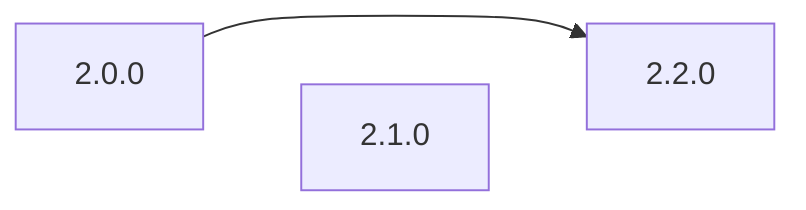

# L1 Upgrades: Failure Modes and Recovery Path Analysis

<!-- START doctoc generated TOC please keep comment here to allow auto update -->
<!-- DON'T EDIT THIS SECTION, INSTEAD RE-RUN doctoc TO UPDATE -->

- [Introduction](#introduction)
- [Introduction](#introduction-1)
  - [FM1: Contract Initializers](#fm1-contract-initializers)
  - [FM2: Storage Layout Corruption in an OP Chain Contract](#fm2-storage-layout-corruption-in-an-op-chain-contract)
  - [FM3: Storage Layout Corruption in the Upgrade Controller Safe](#fm3-storage-layout-corruption-in-the-upgrade-controller-safe)
  - [FM4: Failure to follow upgrade path](#fm4-failure-to-follow-upgrade-path)
  - [FM5: Patches result in a complex upgrade path](#fm5-patches-result-in-a-complex-upgrade-path)
  - [FM5: Gas Limit Exceeded](#fm5-gas-limit-exceeded)
  - [FM6: Supply Chain Attack Against op-deployer or Contract Artifacts](#fm6-supply-chain-attack-against-op-deployer-or-contract-artifacts)
  - [Generic items we need to take into account:](#generic-items-we-need-to-take-into-account)
- [Action Items](#action-items)
- [Audit Requirements](#audit-requirements)

<!-- END doctoc generated TOC please keep comment here to allow auto update -->

_Italics are used to indicate things that need to be replaced._

|                    |            |
| ------------------ | ---------- |
| Author             | Maurelian  |
| Created at         | 2024-03-26 |
| Initial Reviewers  | @blmalone  |
| Need Approval From | [TBD]      |
| Status             | Draft      |

## Introduction

This document covers the L1 Upgrades project, which aims to improve and standardize the approach to upgrading L1 contracts across the superchain. The project introduces a new upgrade system that consolidates ProxyAdmin contracts, implements a two-step upgrade flow, and provides a more deterministic and safer upgrade process.

Below are references for this project:

- [L1 Upgrades Design Doc](../protocol/l1-upgrades.md)
- [OPCM spec](https://github.com/ethereum-optimism/specs/blob/opcm/upgrades/specs/experimental/op-contracts-manager.md)

### FM1: Failing to reset initialized state

#### **Description:**

A common and dangerous failure mode of upgradeable contracts is for the `initialize()` function to be called multiple times,
which can occur if the `initialized` state is not properly managed.

#### **Risk Assessment:**

High impact, Medium likelihood

#### **Mitigations:**

The spec has been updated to ensure that upgrades do not touch the `initialized` state, and instead rely on
new state which ensure that the new `upgrade()` function can only be called once.

The upgraded state of the contracts being upgraded should be externally accessible, so that it can be verified
on-chain by the OPCM, and the upgrade can be reverted if the state is not as expected.

#### **Detection:**

Global event monitoring COULD be used on `monitorism` for the `Initialized` event, however in the past similar monitoring
has been deemed too noisy and not useful.

#### **Recovery Path(s)**:

An emergency upgrade would be required.

#### Action items:

- [ ] Expose the upgraded state of the contracts being upgraded.
- [ ] Add a check to the OPCM to verify the upgraded state of the contracts being upgraded.

### FM2: Storage Layout Corruption in an OP Chain Contract

#### **Description:**

During an upgrade, incorrect storage layout modifications could lead to
corruption of contract state. This could happen if the upgrade process doesn't
properly account for existing storage slots or if there are conflicts in the
storage layout between versions.

#### **Risk Assessment:**

High impact, Low likelihood

#### **Mitigations:**

Existing mitigations for this failure mode include:

1. The use of spacer variables in L1 contracts to prevent storage collisions.
2. The use of storage layout lock files tracked in git to detect breaking changes.
3. The use of off-chain checks in the `superchain-ops` scripts to ensure that getters
   continue to return the expected values.
4. The use of state change validation prior to execution.

Additionally, the [proposal](../protocol/l1-upgrades.md#modfications-to-l1-contracts) of adding a new minimally invasive
`upgrade()` method to L1 contracts ensures minimal storage write operations during the upgrade process.

#### **Detection:**

Unexpected storage layout changes which are not caught by the mitigations above will be very difficult to detect, unless they
immediately impact on the operation of the system. For example changing the value of `L1CrossDomainMessenger.otherMessenger()`
will break both the messenger's `relayMessage()` and `sendMessage()` functions. Other values, such as an entry in a mapping or
a rarely used address will be harder to detect.

Regardless, strong emphasis should be placed on mitigation here.

#### **Recovery Path(s)**:

Emergency upgrade to fix the affected storage slots.

#### Action items:

- [ ] Any changes to storage layout lock files must be carefully reviewed.
- [ ] Implement a fork-based testing strategy, to run the existing foundry test
      suite against the system after it is upgraded, which should catch any
      storage layout corruption.

### FM3: Storage Layout Corruption in the Upgrade Controller Safe

#### **Description:**

The decision was made to have the Upgrade Controller Safe DELEGATECALL
to `OPCM.upgrade()`, as this reduces the risk needing to transfer ownership to the OPCM.

However this creates the risk of modifying storage in the Upgrade Controller Safe.

#### **Risk Assessment:**

High impact, Low likelihood

#### **Mitigations:**

Similar to FM2, we have existing mitigation patterns in place which we can employ here:

1. The use of off-chain checks in the `superchain-ops` scripts to ensure that getters
   continue to return the expected values.
2. The use of state change validation prior to execution.

We can also add static analysis to ensure that no `SSTORE` operations occur
within `OPCM.upgrade()`. Slither would likely be a good approach here, or
another tool which operates on the IR.

#### **Detection:**

As with FM2, unless something breaks immediately, this will be very hard to
detect. Strong emphasis should be placed on mitigation.

#### **Recovery Path(s)**:

It may be impossible to recover from this, depending on which storage changes have been made.

Perhaps now is the time to consider adding the Recover Module.

#### Action items:

- [ ] Implement static analysis based checks to ensure that no `SSTORE` operations occur
      within `OPCM.upgrade()`.

### FM4: Failure to follow upgrade path

#### **Description:**

For an OP Chain upgrading though multiple releases, there is a risk that the correct upgrade path is not followed.

For example, skipping from v2.0.0 to v2.2.0 without going through v2.1.0.

This is a particular risk we have chosen to accept as opposed to enforcing the upgrade path onchain,
because doing so comes with operational [complications](https://github.com/ethereum-optimism/design-docs/blob/main/protocol/op-contracts-manager-single-release-redesign.md#managing-patches-for-opcm-deployments).

#### **Risk Assessment:**

Medium impact, Medium likelihood

#### **Mitigations:**

1. Define the correct upgrade path in the `superchain-registry`.
2. Enforce the correct upgrade path in `op-deployer` which is the official interface for upgrading OP Chains.

#### **Detection:**

**Monitoring:** We could consider introducing monitoring which:

1. Reads OPCM addresses from the `superchain-registry`
2. Monitors those addresses for `Upgraded` events
3. Detects when the version is not correctly incremented.

However, such monitoring would likely be difficult to maintain, would only focus on the 'official' superchain, and is unlikely to be triggered as effective mitigations are not difficult to implement.

#### **Recovery Path(s):**

The recovery path is highly dependent on the nature of the failure resulting from an invalid upgrade path, which is very difficult to predict.

#### Action items:

- [ ] Define the correct upgrade path in the `superchain-registry`.
- [ ] Enforce the correct upgrade path in `op-deployer` which is the official interface for upgrading OP Chains.

### FM5: Gas Limit Exceeded

#### **Description:**

As the number of OP Chains grows, upgrades might exceed block gas limits, causing failed upgrades.

#### **Risk Assessment:**

Low impact, Medium likelihood

#### **Mitigations:**

Gas benchmarks should be created to determine the full cost of upgradings all OP Chains. This will require
a dependency on the `superchain-registry` to track the number of OP Chains.

#### **Detection:**

This will be detected when an upgrade fails due to OOG. That's fine.

#### **Recovery Path(s):**

The upgrade will need to be gas optimized or rearchitected to break it up. We can cross that bridge when we get to it.

#### Action items:

- [ ] Create gas benchmarks for upgrading all OP Chains.

### FM6: Supply Chain Attack Against op-deployer or Contract Artifacts

#### **Description:**

The upgrade process relies on artifacts and tooling which could be compromised in a supply chain attack,
leading to deployment of malicious contracts.

#### **Risk Assessment:**

High impact, Low likelihood

#### **Mitigations:**

1. `op-deployer` should include the ability to verify that the deployed contracts can be
   compiled from the local source code.
2. `op-deployer` should include etherscan verification of the deployed contracts.

#### **Detection:**

Contract verification on should catch any malicious contracts being deployed.

#### **Recovery Path(s):**

This would require an emergency upgrade to replace the malicious contracts.

### Generic items we need to take into account:

See [./fma-generic-hardfork.md](./fma-generic-hardfork.md).

- [x] Check this box to confirm that these items have been considered and updated if necessary.

## Action Items

Below is what needs to be done before launch to reduce the chances of the above failure modes occurring, and to ensure they can be detected and recovered from:

- Action items are listed in the relevant failure mode sections above.

## Audit Requirements

The OPCM will not require an audit, however it necessitates changes to L1 contracts which will.
