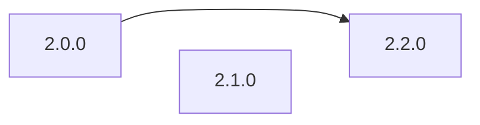
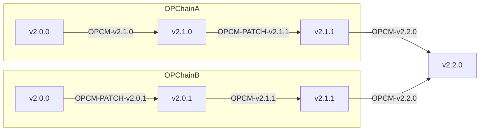

# L1 Upgrades: Failure Modes and Recovery Path Analysis

<!-- START doctoc generated TOC please keep comment here to allow auto update -->
<!-- DON'T EDIT THIS SECTION, INSTEAD RE-RUN doctoc TO UPDATE -->

- [Introduction](#introduction)
- [Failure Modes and Recovery Paths](#failure-modes-and-recovery-paths)
  - [[Name of Failure Mode 1]](#name-of-failure-mode-1)
  - [[Name of Failure Mode 2]](#name-of-failure-mode-2)
- [Audit Requirements](#audit-requirements)
- [Action Items](#action-items)
- [Appendix](#appendix)
  - [Appendix A: This is a Placeholder Title](#appendix-a-this-is-a-placeholder-title)

<!-- END doctoc generated TOC please keep comment here to allow auto update -->

_Italics are used to indicate things that need to be replaced._

|                    |            |
| ------------------ | ---------- |
| Author             | Maurelian  |
| Created at         | 2024-03-26 |
| Initial Reviewers  | @blmalone      |
| Need Approval From | [TBD]      |
| Status             | Draft      |

## Introduction

## Introduction

This document covers the L1 Upgrades project, which aims to improve and standardize the approach to upgrading L1 contracts across the superchain. The project introduces a new upgrade system that consolidates ProxyAdmin contracts, implements a two-step upgrade flow, and provides a more deterministic and safer upgrade process.

Below are references for this project:

- [L1 Upgrades Design Doc](../protocol/l1-upgrades.md)
- [OPCM spec](https://github.com/ethereum-optimism/specs/blob/opcm/upgrades/specs/experimental/op-contracts-manager.md)

### FM1: Contract Initializers

#### **Description:**

During the first step of the ugprade, the contracts will not yet have a shared
storage location for the `initialized` value. Therefore each contract will require custom storage
manipulation to properly reset the `initialized` value, without modifying values which may be
packed into the same slot.

Moreoever, contracts could be re-initialized if the initialization state is not properly managed
during the two-step upgrade process.

#### **Risk Assessment:**

High impact, Medium likelihood

#### **Mitigations:**

1. In the first step to reset the initializer with varied layouts, a custom, one-time use, contract can be
   created which hardcodes the exact modifications required for each contract with a unique
   contracts specific function, such as `resetL1CrossDomainMessenger()`.
2. Upgrading to use OpenZeppelin's unstructured storage for initialization state reduces the risk
   of incorrectly reinitializing at the end of the upgrade, as it ensures that the `initializer`
   modifier can operate on the same slot across contracts.
3. After calling `OPCM.upgrade()` the `superchain-ops` script can use `vm.load()` and attempt to call `L1CrossDomainMessenger.upgrade()` (for example) to verify the intitialized status.
4. Tenderly simulation should look for unexpected storage changes.

#### **Detection:**

Global event monitoring COULD be used on `monitorism` for the `Initialized` event, however in the past similar monitoring
has been deemed too noisy and not useful.

#### **Recovery Path(s)**:

An emergency upgrade would be required.

### FM2: Storage Layout Corruption in an OP Chain Contract

#### **Description:**

During an upgrade, incorrect storage layout modifications could lead to
corruption of contract state. This could happen if the upgrade process doesn't
properly account for existing storage slots or if there are conflicts in the
storage layout between versions.

We disregard issues with the initializer as they are covered in FM1.

#### **Risk Assessment:**

High impact, Low likelihood

#### **Mitigations:**

Existing mitigations for this failure mode include:

1. The use of spacer variables in L1 contracts to prevent storage collisions.
2. The use of storage layout lock files tracked in git to detect breaking changes.
3. The use of off-chain checks in the `superchain-ops` scripts to ensure that getters
   continue to return the expected values.
4. The use of state change validation prior to execution.

Additionally, the [proposal](../protocol/l1-upgrades.md#modfications-to-l1-contracts) of adding a new minimally invasive
`upgrade()` method to L1 contracts ensures minimal storage write operations during the upgrade process.

#### **Detection:**

Unexpected storage layout changes which are not caught by the mitigations above will be very difficult to detect, unless they
immediately impact on the operation of the system. For example changing the value of `L1CrossDomainMessenger.otherMessenger()`
will break both the messenger's `relayMessage()` and `sendMessage()` functions. Other values, such as an entry in a mapping or
a rarely used address will be harder to detect.

Regardless, strong emphasis should be placed on mitigation here.

#### **Recovery Path(s)**:

Emergency upgrade to fix the affected storage slots.

### FM3: Storage Layout Corruption in the Upgrade Controller Safe

#### **Description:**

The decision was made to have the Upgrade Controller Safe DELEGATECALL
to `OPCM.upgrade()`, as this reduces the risk needing to transfer ownership to the OPCM.

However this creates the risk of modifying storage in the Upgrade Controller Safe.

#### **Risk Assessment:**

High impact, Low likelihood

#### **Mitigations:**

Similar to FM2, we have existing mitigation patterns in place which we can employ here:

1. The use of off-chain checks in the `superchain-ops` scripts to ensure that getters
   continue to return the expected values.
2. The use of state change validation prior to execution.

We can also add static analysis to ensure that no `SSTORE` operations occur
within `OPCM.upgrade()`. Slither would likely be a good approach here, or
another tool which operates on the IR.

#### **Detection:**

As with FM2, unless something breaks immediately, this will be very hard to
detect. Strong emphasis should be placed on mitigation.

#### **Recovery Path(s)**:

It may be impossible to recover from this, depending on which storage changes have been made.

Perhaps now is the time to consider adding the Recover Module.

### FM4: Failure to follow upgrade path

#### **Description:**

For an OP Chain upgrading though multiple releases, there is a risk that the correct upgrade path is not followed.

For example, skipping from v2.0.0 to v2.2.0 without going through v2.1.0.

This is a particular risk we have chosen to accept as opposed to enforcing the upgrade path onchain,
because doing so comes with operational [complications](https://github.com/ethereum-optimism/design-docs/blob/main/protocol/op-contracts-manager-single-release-redesign.md#managing-patches-for-opcm-deployments).

#### **Risk Assessment:**

Medium impact, Medium likelihood

#### **Mitigations:**

1. Define the correct upgrade path in the `superchain-registry`.
2. Enforce the correct upgrade path in `op-deployer` which is the official interface for upgrading OP Chains.

#### **Detection:**

**Montoring:** We could consider introducing monitoring which:

1. Reads OPCM addresses from the `superchain-registry`
2. Monitors those addresses for `Upgraded` events
3. Detects when the version is not correctly incremented.

However, such monitoring would likely be difficult to maintain, would only focus on the 'official' superchain, and is unlikely to be triggered as effective mitigations are not difficult to implement.

#### **Recovery Path(s):**

The recovery path is highly dependent on the nature of the failure resulting from an invalid upgrade path, which is very difficult to predict.

### FM5: Patches result in a complex upgrade path

#### **Description:**

Note: this item is somewhat meta as it describes a complexity arising from a generic failure mode, but
it felt like it was worth documenting here.

Consider the following sequence of events involving two chains (`OPChainA` and `OPChainB`):

- Both chains are deployed at `v2.0.0`
- `OPChainA` upgrades to `v2.1.0`
- `OPChainB` (for whatever reason) is not ready to upgrade and remains on `v2.0.0`
- A bug is identified which exists in both versions (`v2.0.0` and `v2.1.0`).
- The bug is patched by deploying two new `OPContractsManager`s:
  - `OPCM-v2.0.0->v2.0.1` which patches `v2.0.0` to `v2.0.1`
  - `OPCM-v2.1.0->v2.1.1` which patches `v2.1.0` to `v2.1.1`
- Both chains undergo the patch upgrade:
  - `OPChainA` is now on `v2.1.1`
  - `OPChainB` is now on `v2.0.1`
- `OPChainB` eventually becomes ready to upgrade to `v2.1.1`
- Finally, both chains wish to upgrade to `v2.2.0`

Systems could be upgraded incorrectly if the proper upgrade path order is not followed (e.g., skipping from v2.0.0 to v2.2.0 without going through v2.1.0).

Relative to the happy path from v2.0.0 to v2.2.0, which requires two OPCMs:

1. `OPCM-v2.1.0`
2. `OPCM-v2.2.0`

This scenario would require two additional PATCH OPCMs, and an additional OCPM for upgrading from the earlier patched version to the newer patched version (ie. `v2.0.1` to `v2.1.1`), for a total of 5 OPCMs:

1. `OPCM-v2.1.0`
2. `OPCM-PATCH-v2.0.1`
3. `OPCM-v2.1.1`
4. `OPCM-PATCH-v2.1.1`
5. `OPCM-v2.2.0`

This is not necessarily dangerous, but is likely to complicate operations in various ways.

#### **Risk Assessment:**

Low impact, Medium likelihood

#### **Mitigations:**

This is not directly mitigable aside from ongoing efforts to avoid releasing buggy code.

It also underscores the need for a machine readable format which can serve to describe multiple valid
paths between two versions. That can be done during development however.

#### **Detection:**

This is detected whenever and however it is detected.

#### **Recovery Path(s):**

N/A.

### FM5: Gas Limit Exceeded

#### **Description:**

As the number of OP Chains grows, upgrades might exceed block gas limits, causing failed upgrades.

#### **Risk Assessment:**

Low impact, Medium likelihood

#### **Mitigations:**

Gas benchmarks should be created to determine the full cost of upgradings all OP Chains. This will require
a dependency on the `superchain-registry` to track the number of OP Chains.

#### **Detection:**

This will be detected when an upgrade fails due to OOG. That's fine.

#### **Recovery Path(s):**

The upgrade will need to be gas optimized or rearchitected to break it up. We can cross that bridge when we get to it.

### FM6: Supply Chain Attack Against op-deployer or Contract Artifacts

#### **Description:**

The upgrade process relies on artifacts and tooling which could be compromised in a supply chain attack,
leading to deployment of malicious contracts.

#### **Risk Assessment:**

TODO

#### **Mitigations:**

TODO

#### **Detection:**

TODO

#### **Recovery Path(s):**

TODO

### Generic items we need to take into account:

See [./fma-generic-hardfork.md](./fma-generic-hardfork.md).

- [x] Check this box to confirm that these items have been considered and updated if necessary.

## Action Items

Below is what needs to be done before launch to reduce the chances of the above failure modes occurring, and to ensure they can be detected and recovered from:

- [ ] Resolve all comments on this document and incorporate them into the document itself (Assignee: document author)
- [ ] _Action item 2 (Assignee: tag assignee)_
- [ ] _Action item 3 (Assignee: tag assignee)_

## Audit Requirements

The OPCM will not require an audit, however it will necessitate changes to L1 contracts which will.
