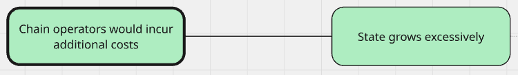

# MinBaseFee: Threat Model

| Author              | Alberto                     |
| ------------------- | --------------------------- |
| Created at          | 2025-08-06                  |
| Initial Reviewers   |                             |
| Needs Approval From | Matt Solomon, _anyone else?_ |
| Status              | Review                       |

## Introduction

This document models the potential negative outcomes from the release of minimum base fee - a configurable minimum base fee for OP Stack chains to shorten the length of priority fee auctions.

Below are references for this project:

- Design docs: [minimum-base-fee.md](../protocol/minimum-base-fee.md)
- Methodology: [Threat Modelling at OP Labs](https://blog.oplabs.co/using-threat-modelling-as-a-strategic-development-tool)

## Summary

| Severity Level | Outcome | Likelihood | Key Mitigations | Tracking Issues |
| --- | --- | --- | --- | --- |
| Liveness | Chain Split | Possible | Shift left specs, rigorous testing, define fuzzing behavior | [#742](https://github.com/ethereum-optimism/specs/issues/742), [#16841](https://github.com/ethereum-optimism/optimism/issues/16841) |
| Liveness | Transactions Stuck in L2 | Probable | Produce good documentation, develop tooling for log2 values, expand registry sanity checks | [#1093](https://github.com/ethereum-optimism/superchain-registry/issues/1093), [#1710](https://github.com/ethereum-optimism/docs/issues/1710), [#16959](https://github.com/ethereum-optimism/optimism/issues/16959) |
| Not critical | Feature is ineffective | Possible | Conduct simulations | [#16958](https://github.com/ethereum-optimism/optimism/issues/16958) |
| Not critical | Additional costs for operators | Possible | Analyze state growth impact | [#16807](https://github.com/ethereum-optimism/optimism/issues/16807) |

## Risks and Their Mitigations

In this section, we describe the risks identified with an implementation of MinBaseFee, from most to least severe. For each one we also describe the mitigations that were proposed to bring the likelihood to acceptable levels.

### Chain split


An off-chain implementation bug was identified as a possible failure that would lead to a chain split, considered to be worse than a liveness failure, but not as severe as a large loss of assets.

#### Mitigations

- Shift left the specs
- Rigorous acceptance and fuzzing tests
- Explicitly define behaviour for fuzzing conditions
- The [operator fee FMAs](https://github.com/ethereum-optimism/design-docs/blob/main/security/fma-operator-fee.md) can be studied for more mitigations applied to a similar feature and outcome

### Transactions get stuck in L2


Setting the MinBaseFee to an inappropriate value is currently considered probable. This failure would lead to several negative outcomes, of which the most severe would be a liveness issue with transactions getting stuck in L2 if MinBaseFee is set to a value that is too high.


A not so severe outcome from an inappropriate value being used for MinBaseFee would be that the feature would have no effect, if MinBaseFee is set too low.


Another not so severe outcome from an inappropriate value being used for MinBaseFee would be reputational damages from unhappy users paying too much.

#### Mitigations

There are several ways in which MinBaseFee can be set to an inappropriate value.


It is considered unlikely that a smart contract or log2 bug will make it into production, due to the simplicity of the feature and the combined internal and external reviews that are part of the delivery process.

It is also considered unlikely that a malicious compromise of SystemConfigOwner would lead to these outcomes, since there exist already more severe outcomes that can be achieved with such a compromise.

However, it is considered **likely** that a mistake would eventually happen when SystemConfigOwner sets the value, either by a common governance failure by a partner, or by misunderstanding the log2 aspect of the fee. These risks we can mitigate.

#### Specific Mitigations

- Share knowledge about OP Labs protocol upgrade processes
- Good documentation
- Tooling to be sure of what the right log2 value is for the parameter
- `superchain-registry` sanity checks

### Feature is permanently ineffective


We don't know enough about this feature to be sure that it will have the intended effect, and it is possible that we will design it in a way that has no effect at all. This would mean wasted effort in developing this feature, when we could deliver something else.

#### Mitigations

- Conduct simulations

### Unexpected additional costs for chain operators



It was considered that the state growth derived from the additional parameter might cause additional infrastructure costs for chain operators. Upon further investigation, we concluded that activating the minimum base fee will result in an extra 16MB (approximately) of DB growth for all full or archive nodes (storing the full history of the chain). This is because this feature adds a single extra byte to every block, and we are assuming a 2s block time. This is calculated as 

```
(1 byte / 2 seconds) x 365 days × 24 hours × 60 minutes × 60 seconds = 15,768,000 bytes in 1 year.
```

This is a small increase in DB growth rate, and therefore does not require any additional mitigations at this time. There is no impact on state growth with this feature, since it is affects blocks (history) and not state.

## Audit Requirements

Following the [Audit Framework](https://gov.optimism.io/t/op-labs-audit-framework-when-to-get-external-security-review-and-how-to-prepare-for-it/6864), MinBaseFee is a **Low Complexity and Medium Risk** feature, requiring at least an Internal Audit.

Given that smart contract changes to core protocol components are included, this is upgraded to an External Audit as required by partners.
