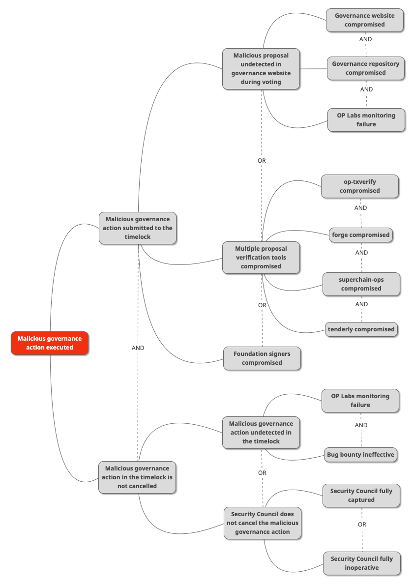

# [Project Name]: Failure Modes and Recovery Path Analysis

<!-- START doctoc generated TOC please keep comment here to allow auto update -->
<!-- DON'T EDIT THIS SECTION, INSTEAD RE-RUN doctoc TO UPDATE -->

- [Introduction](#introduction)
- [Failure Modes and Recovery Paths](#failure-modes-and-recovery-paths)
  - [[Name of Failure Mode 1]](#name-of-failure-mode-1)
  - [[Name of Failure Mode 2]](#name-of-failure-mode-2)
- [Audit Requirements](#audit-requirements)
- [Action Items](#action-items)
- [Appendix](#appendix)
  - [Appendix A: This is a Placeholder Title](#appendix-a-this-is-a-placeholder-title)

<!-- END doctoc generated TOC please keep comment here to allow auto update -->

_Italics are used to indicate things that need to be replaced._

|                    |                                                    |
| ------------------ | -------------------------------------------------- |
| Author             | _Author Name_                                      |
| Created at         | _YYYY-MM-DD_                                       |
| Initial Reviewers  | _Reviewer Name 1, Reviewer Name 2_                 |
| Need Approval From | _Security Reviewer Name_                           |
| Status             | _Draft / In Review / Implementing Actions / Final_ |

> [!NOTE]
> 📢 Remember:
>
> - The single approver in the “Need Approval From” must be from the Security team.
> - Maintain the “Status” property accordingly. An FMA document can have the following statuses:
>   - **Draft 📝:** Doc is created but not yet ready for review.
>   - **In Review 🔎:** Security is reviewing, and Engineering is iterating on the design. A checklist of action items will be created during this phase.
>   - **Implementing Actions 🛫:** Security has signed off on the content of the document, including the resulting action items. Engineering is responsible for implementing the action items, and updating the checklist.
>   - **Final 👍:** Security will transition the status of the document to Final once all action items are completed.

> [!TIP]
> Guidelines for writing a good analysis, and what the reviewer will look for:
>
> - Show your work: Include steps and tools for each conclusion.
> - Completeness of risks considered.
> - Include both implementation and operational failure modes
> - Provide references to support the reviewer.
> - The size of the document will likely be proportional to the project's complexity.
> - The ultimate goal of this document is to identify action items to improve the security of the project. The FMA review process can be accelerated by proactively identifying action items during the writing process.

## Introduction

This document covers _[project name, high-level summary of the project, and scope of this analysis]._

Below are references for this project:

- _Link 1, e.g. project charter or design doc_
- _Link 2, etc._

## Failure Modes and Recovery Paths

**_Use one sub-header per failure mode, so the full set of failure modes is easily scannable from the table of contents._**

### FM1: [Name of Failure Mode 1]

- **Description:** _Details of the failure mode go here. What the causes and effects of this failure?_
- **Risk Assessment:** _Simple low/medium/high rating of impact (severity) + likelihood._
- **Mitigations:** _What mechanisms are in place, or what should we add, to:_
  1. _reduce the chance of this occurring?_
  2. _reduce the impact of this occurring?_
- **Detection:** _How do we detect if this occurs?_
- **Recovery Path(s)**: _How do we resolve this? Is it a simple, quick recovery or a big effort? Would recovery require a governance vote or a hard fork?_

### FM2: [Name of Failure Mode 2]

- **Description:** _Details of the failure mode go here. What the causes and effects of this failure?_
- **Risk Assessment:** _Simple low/medium/high rating of impact (severity) + likelihood._
  **Mitigations:** _What mechanisms are in place, or what should we add, to:_
  1. _reduce the chance of this occurring?_
  2. _reduce the impact of this occurring?_
- **Detection:** _How do we detect if this occurs?_
- **Recovery Path(s)**: _How do we resolve this? Is it a simple, quick recovery or a big effort? Would recovery require a governance vote or a hard fork?_

### FM1: Malicious Governance Action

- **Description:** 

In the proposed governance model, there are two prerequisites to execute a malicious governance action:
1. Submitting a malicious proposal to the timelock
2. The Security Council not removing the malicious proposal from the timelock

Each one of these can be achieved in several ways, as illustrated in the mindmap above.

**Introduce a malicious proposal into the governance proposal in the governance website.**
All of the following would need to be compromised:
- Compromise the superchain-ops repository to inject a malicious proposal. 
- Since EVM Safety signs-off the repository commit with the proposal, the attacker would need to compromise the website so that the published governance proposal points to the malicious commit.
- Until the malicious proposal is executed, EVM Safety or the community would have time to follow the commit, simulate the proposal, and discover the attack.

**Multiple proposal verification tools compromised**
The attacker could also compromise the tooling to have the Foundation signers submit a proposal different from the one published in the governance website. All of the following would need to be compromised:
- Compromise the superchain-ops repository to inject a malicious proposal.
- Compromise Tenderly so it doesn't show certain storage changes of the malicious proposal, and shows signature hashes matching the published proposal.
- Compromise Forge and op-txverify so that they show signature hashes matching the published proposal.

**Foundation signers compromised**
The attacker could also submit a malicious proposal to the timelock by convincing a quorum of Foundation signers to sign a proposal different from the one published in the governance website.

If the attacker succeeds in submitting a malicious proposal to the timelock, one of the following is required to execute a malicious governance action:

**Malicious governance action undetected in the timelock**
Both the following conditions need to be met:
- EVM Safety would routinely execute and verify all proposals in the timelock, using the same tools and following the same process as the one used for the published proposals. Either human error or multiple tool compromise would be necessary for this to fail.
- Bug bounty hunters, incentivized by a bounty, and using tools not known to the attacker, would also need to miss the malicious proposal.

**Security Council not removing the malicious proposal from the timelock**
One of the following is required:
- All members of the Security Council would need to be compromised for an extended period of time.
- None of the Security Council members would be capable of signing the cancellation of the malicious proposal.

To facilitate the assessment of this combined failure mode, its five attack paths will be discussed as independent failure modes.

### FM1.1: Introducing a malicious proposal into the governance proposal in the governance website

**Description:**
The attacker would replace the published proposal with a malicious one in the governance website, pointing to a malicious commit in superchain-ops.

**Risk Assessment:**
Medium severity, low likelihood.
 - Potential impact: Medium. Enabler towards the execution of a malicious governance action. Light reputational damage by itself.
 - Likelihood: Low. The attacker would need to compromise both the superchain-ops repository and the governance website.

**Mitigations:**
 - During the signing ceremony to submit the proposal to the timelock, the ceremony facilitator from EVM Safety would verify the proposal on Tenderly.

**Detection:**
 - Tenderly simulation by EVM Safety during the signing ceremony.

### FM1.2: Multiple proposal verification tools compromised

**Description:**
The attacker would compromise superchain-ops to inject a malicious proposal, and then compromise Tenderly, Forge and op-txverify to mask its malicious effects to verifiers.

**Risk Assessment:**
Medium severity, low likelihood.
 - Potential impact: Medium. Enabler towards the execution of a malicious governance action. Light reputational damage by itself.
 - Likelihood: Extremely Low. The attacker would need to compromise two different OP Labs repositories, and two different third party services.

**Mitigations:**
 - No mitigations are proposed.

**Detection:**
 - No detection is proposed.

### FM1.3: Foundation signers compromised

**Description:**
The attacker would compromise a quorum of Foundation signers to submit a malicious proposal to the timelock.

**Risk Assessment:**
Medium severity, low likelihood.
 - Potential impact: Medium. Enabler towards the execution of a malicious governance action. Light reputational damage by itself.
 - Likelihood: Low. The attacker would need to compromise a quorum of Foundation signers.

**Mitigations:**
 - No mitigations are proposed.

**Detection:**
 - The Ceremony Facilitator would notice that the proposal is not valid.

### FM1.4: Malicious proposal remains undetected in the timelock

**Description:**
The malicious proposal would be in the timelock, with neither EVM Safety nor bug bounty hunters realising it is malicious, and would be executed.

**Risk Assessment:**
High severity, extremely low likelihood.
 - Potential impact: High. The attacker would execute a malicious governance action.
 - Likelihood: Extremely Low. A malicious proposal would have to have been submitted to the timelock, and neither EVM Safety nor bug bounty hunters realise it is malicious.

**Mitigations:**
 - EVM Safety would routinely execute and verify all proposals in the timelock, using the same tools and following the same process as the one used for the published proposals.
 - Bug bounty hunters would be incentivized by a bounty to detect malicious proposals using tools not known to the attacker.

**Detection:**
 - No detection is proposed.

### FM1.5: Security Council not removing the malicious proposal from the timelock

**Description:**
With a malicious proposal to the timelock, and the Security Council would not remove it. This would be the result of all members of the Security Council being compromised for an extended period of time, or all members of the Security Council being unable to sign the cancellation of the malicious proposal due to other circumstances.

**Risk Assessment:**
High severity, extremely low likelihood.
 - Potential impact: High. The attacker would execute a malicious governance action.
 - Likelihood: Extremely Low. A malicious proposal would have to have been submitted to the timelock, and a single signer capable of signing the cancellation of the malicious proposal would be enough to avoid this scenario.

**Mitigations:**
 - No mitigations are proposed.

**Detection:**
 - No detection is proposed.

### FM2: Denial of Service

The compromise of a reduced number of Security Council signers would result on a denial of service for the governance pipeline. To mitigate this, the current 2/2 governance pipeline would remain available to execute emergency instantaneous governance actions such as the one to remove the compromised signer from the Security Council

<TBA>

### FM3: Spamming the Timelock

The compromise of a quorum of Foundation signers would result on spamming the timelock with malicious governance actions. To mitigate this, a quorum of Security Council signers would have the permission to instantaneously pause the submission of new actions to the timelock and to clear its queue. This emergency action would return the governance pipeline to the current 2/2 process until control of the Foundation multisig is restored.

<TBA>

### Generic items we need to take into account:

See [generic hardfork failure modes](./fma-generic-hardfork.md) and [generic smart contract failure modes](./fma-generic-contracts.md).
Incorporate any applicable failure modes with FMA-specific mitigations and detections directly into this document.

- [ ] Check this box to confirm that these items have been considered and updated if necessary.

## Action Items

Below is what needs to be done before launch to reduce the chances of the above failure modes occurring, and to ensure they can be detected and recovered from:

- [ ] Resolve all comments on this document and incorporate them into the document itself (Assignee: document author)
- [ ] _Action item 2 (Assignee: tag assignee)_
- [ ] _Action item 3 (Assignee: tag assignee)_

## Audit Requirements

_Given the failure modes and action items, will this project require an audit? See [FMAs in the SDLC](https://github.com/ethereum-optimism/pm/blob/main/src/fmas.md#determine-audit-requirements) for a reference decision making framework. Please explain your reasoning._

## Appendix

### Appendix A: This is a Placeholder Title

_Appendices must include any additional relevant info, processes, or documentation that is relevant for verifying and reproducing the above info. Examples:_

- _If you used certain tools, specify their versions or commit hashes._
- _If you followed some process/procedure, document the steps in that process or link to somewhere that process is defined._
