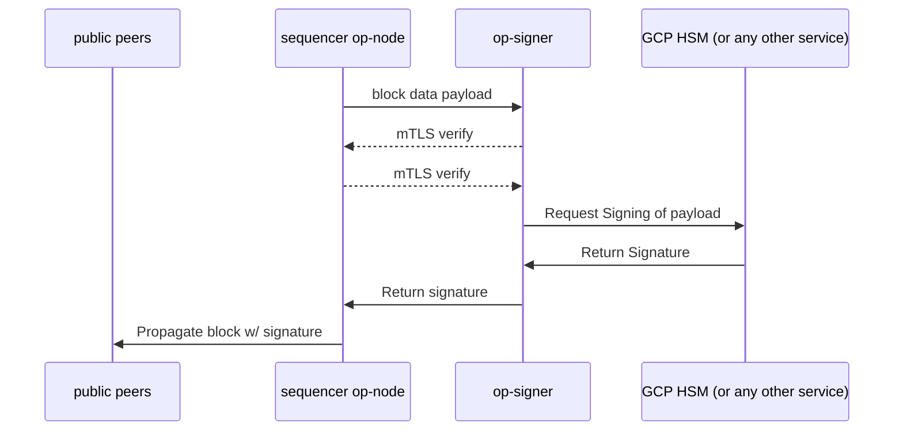

# Integrating op-node with op-signer

# Purpose

Integrate op-node with op-signer, for more modular structure of a deployed op-stack. 

## Summary

In order to run a sequencer on a OP Stack, you must have the sequencer op-node communicate and gossip the new block payload with other nodes in the network via p2p. This new block payload is signed with a correct private key to prove the validity of the payload before being gossiped to the peers.  

Previously, the operator of the sequencer node and the signer of the payload was equal, and this private key is directly injected as a run flag of op-node. There are few improvements to make: 

1. Direct injection of key is dangerous and can be compromised. With a separate key management system, node operators do not need access to the private keys, which is safer. With this proposal, we can apply the same level of security to the sequencer nodes as well.
2. We can abstract away such key management to introduce a more modular system. This allows us to have separate operators of the sequencer node and the signer of the payload, or have the secret key management into a more isolated service. 

# Context

Fortunately, there already exists `op-signer`, which serves a similar purpose in the op stack system, specifically the op-batcher and op-proposer. 

`op-batcher` also has to sign transactions prior to sending the batched transactions to L1. Instead of injecting the private key directly into the run flag of op-batcher, you can input the rpc endpoint for handling the key management. This includes configurations like the signer endpoint, mtls certificate for communication, etc. 

Users of op-batcher can choose from: 

1. private-key
2. mnemonic + hd path
3. remote signer configuration

to sign the new transactions. 

However, op-node uses different signing scheme than the op-batcher, requiring the introduction of new RPC: 

The signing of block payload in op-node is a custom signing structure where the signing hash is: `[32]byte keccak256Hash([32]byte domain, [32]byte chainId, [32]byte keccak256(payloadBytes))` (see op-node/p2p/signer.go). This signing hash is signed with the private key, to produce a ECDSA signature of 65 bytes. 

# Proposed Solution

Above design can be applied to op-node to allow for remote signing of new block payloads in a sequencer. 

For this, we need changes in the following modules: 

1. op-node to import corresponding `opsigner` module from the op-service

This module allows the user to choose from private-key / mnemonic / remote signer and create a single Signer from the factory. This involves importing `op-service/signer` and `op-service/crypto` into op-node.

2. Modify `op-service/signer` to handle signing of block payload, in addition to tx signing. 

Currently, `op-service` only has `SignTransactions` function which calls `eth_signTranasction`. To abstractify the signing method for different use cases, we might add different signing strategy types, or add new functions like `SignBlockPayload`. 

1. Modify `op-signer` to serve different signing requests.

Currently, `op-signer` only handles `eth_signTrasnaction`. We need to introduce a new rpc endpoint to handle signing of block payload

The diagram illustrates what the result op-stack service looks like:



## New RPC: eth_signBlockPayload

new eth-domain RPC (or under some other namespace)

```go
func eth_signBlockPayload(signingHash [32]byte) (sig *[65]byte, err error) 
// where signingHash is keccak256Hash([32]byte domain, [32]byte chainId, [32]byte keccak256(payloadBytes))
```

This new RPC will be added to:

1. optimism/op-service/signer/client.go: new SignBlockPayload function which calls, the eth_signBlockPayload RPC. This method is called by the op-node’s p2p/signer.go
2. optimism-infra/op-signer/service/service.go: new SignBlockPayload, which is the receiver counterpart of the RPC. 

Most implementation of this RPC will be decoupling the signing logic from op-node, and moving code around different parts of the monorepo/op-signer. 

### Considerations

Above signing structure is a custom scheme, and does not align with other more official signing schemes like the ones introduced by EIP-712 or ERC-191, so we can’t use something like `eth_sign` or `eth_signTypedData`. 

We could migrate the signing scheme of the p2p gossiped payload to the other methods of signing like the ones mentioned above. However, we need to preserve backwards compatibility of the signing scheme for the existing nodes in the network to continue working after this change. 

## Usage of op-signer
Previously, the only usage of op-signer was for the transaction signing of batcher and proposer. This uses the sender address of the tx and the secret key.

However, for block payload signing, the sender address is not needed - we only need to sign the signingHash with the private key from the KMS. Therefore, we could make `p2p.signer.address` flag optional because it's required for the op-signer to be integrated with services like op-node (see `op-service/signer/cli.go`)

After generating the appropriate key in the KMS, you have to add additional field to the config.yaml of op-signer as follows: 
```yaml
auth:
  - name: op-node.primary.mainnet.prod.oplabs.cloud
    key: projects/oplabs-prod-mainnet/locations/eur6/keyRings/testop-signer/cryptoKeys/op-node/cryptoKeyVersions/1
// ... other existing keys
  - name: sequencer-batcher.primary.mainnet.prod.oplabs.cloud
    key: projects/oplabs-prod-mainnet/locations/eur6/keyRings/op-signer/cryptoKeys/batcher/cryptoKeyVersions/1
```
for each signing request, op-signer will look at the requesting server's domain, and look at this yaml file for a matching config. Then, it will look for the gcp kms key that matches the `key` name.


## Security

In such service where op-node and op-signer are located in a separate system and need to communicate, we need secure channel, where both parties can trust each other. For this, we use mutual TLS (mTLS). 

With mTLS, we can prove that both the client and the server are verified with their own respective certificate. This allows op-node to trust the op-signer, and op-signer to sign only the requests from valid op-node sequencers. 

Thankfully, op-signer already has mTLS support, as integrated in op-batcher and op-proposer. 

Here, users can specify

- tls.ca
- tls.cert
- tls.key

and the mTLS is handled in op-service/tls. We have to set up the correct CA and so that both the op-signer and op-node can verify the certificates from the TLS handshake. 

There has already been discussions about integrating op-signer with op-node, such as

- https://github.com/ethereum-optimism/optimism/pull/4357#discussion_r1045342439
- https://github.com/ethereum-optimism/optimism/pull/4669#discussion_r1067409473

# Alternatives Considered
- When we send the Block Payload from op-node to op-signer, we could send the full block payload arguments like the following: 
```go
type BlockPayloadArgs struct {
	domain [32]byte `json:"domain"`
	chainId *big.Int `json:"chainId"`
	payloadHash [32]byte `json:"payloadHash"`
}
```
This means we are sending more data to the op-signer, but may be more secure since the op-signer controls all of the logic for signing the payload. 

# Risks & Uncertainties

1. Because op-signer will sign any payloads sent to its RPC, we must ensure that only trusted entities can access the RPC of op-signer. Otherwise, an attacker might request op-signer to sign malicious block payloads, and use its signature to propagate invalid block data to peers in the network. To prevent this, we must ensure that we have safe mechanisms in place to only allow the connection between trusted entities. 
2. As we create secure connection between the op-signer and op-node (whether by mTLS or other methods), we must ensure that the time for signing the payload is quick enough. It must be always faster than the block build time, and quick enough for good gossiping across the network.