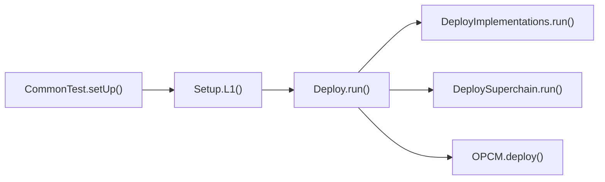
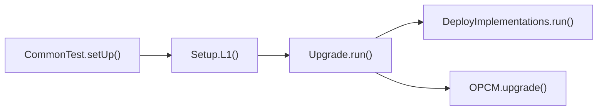

# Purpose

In order to safely implement the [L1 Upgrades design](../protocol/l1-upgrades.md)
the upgrade path should be tested, meaning that we should be able to:

1. start with a system matching the previous release
2. upgrade that system (using `OPCM.upgrade()`)
3. run tests against the upgraded system.

Put another way, we need two different methods for setting up the foundry tests which are
created by inheriting from `CommonTest`.

# Summary

<!-- Most (if not all) documents should have a summary.
While the length will likely be proportional to the length of the full document,
the summary should be as succinct as possible. -->

# Problem Statement + Context

Our test suite is currently not able to replicate the system from a previous release, which
prevents us from testing the upgrade path to the system currently under development.

As we're moving towards onchain upgrades via the OPCM, we want to be able to test that:

1. The upgrade works to move from the previous release to the system on `develop`.
2. The upgraded system passes the same set of unit test as the freshly deployed system on `develop`.

# Proposed Solution

## Deploying Superchain contracts with `op-deployer`

We propose to extend `op-deployer bootstrap` to enable deploying superchain contracts.

```shell
op-deployer bootstrap superchain <artifacts-locator>
```

## Setting up the system to test

The current foundry testing uses the following high level call flow.



This is roughly what each component does:

- **`CommonTest.setUp()`:**
  - Defines system config settings (ie. `useInterop`).
  - provides reusable addresses (`alice` and `bob`)
  - provides reusable generic contracts (`ERC20`)
- **`Setup.L1()`:**
  - Reads addresses from the deployments file stored on disk
  - labels addresses to make traces more readable
  - ie.
    ```solidity
      optimismPortal = IOptimismPortal(deploy.mustGetAddress("OptimismPortalProxy"));
      vm.label(address(optimismPortal), "OptimismPortal");
    ```
- **`Deploy.run()`:**
  - Deploys all necessary contracts via calls to `DeploySuperchain`, `DeployImplementations`.
- **`DeploySuperchain.run()`:**
  - Deploys superchain contracts (`SuperchainConfig` and `ProtocolVersions`).
- **`DeployImplementations.run()`:**
  - Deploys contracts (implementations and singletons) necessary for upgrading to the system on
    `develop`.
- **`OPCM.deploy()`:**
  - Deploys all proxies and bespoke singleton contracts as necessary for a new OP Chain.

This work would replace the `Deploy` script with a new `Upgrade` script, resulting in the following
call flow:



A description of what new components would do is:

- **`Upgrade.run()`:**
  - Calls `op-deployer bootstrap superchain` to deploy new superchain contracts (`SuperchainConfig`
    and `ProtocolVersions`), corresponding to the previous release.
  - Calls `op-deployer bootstrap opcm` to deploy release OPCM, corresponding to the previous release.
  - Calls to `DeployImplementations.run()` to deploy contracts necessary for upgrading to the system on `develop`.
  - Parses the deployment output from `op-deployer` and writes to disk using the `Deploy.save()`
    functions, so that `Setup.L1()` can read the deployment.
- **`OPCM.upgrade()`:**
  - Upgrades proxies to new implementation contracts and bespoke singleton contracts as necessary for a new OP Chain.
  - This flow is descibed in detail in the [L1 Upgrades design](../protocol/l1-upgrades.md#release-process).

This testing setup route would be indicated with a new `useUpgradedSystem` flag in `CommonTest`. The
new flag could only be enabled when other flags (`useAltDAOverride`, `useLegacyContracts`,
`useInteropOverride`, `customGasToken`) are disabled.

Note that this testing would need to be run against an `anvil` node, as `op-deployer bootstrap`
requires an RPC endpoint. I am not experienced with running `forge test` against an anvil node,
so appreciate any gotchas I might be missing.

# Alternatives Considered

An alternative considered was to add a new `op-deployer download` command to get artifacts, then
make minimal modifications to `DeploySuperchain` and `DeployImplementations` to deploy those
artifacts by providing branching logic to provide a different artifacts path to `vm.getCode()`.

The challenge with this approach is that `DeployImplementations` will need other changes from
release to release, so we would be in a position of needing branching logic to accomodate
at least the most recent release and current release in that script.

# Risks & Uncertainties

<!-- An overview of what could go wrong.
Also any open questions that need more work to resolve. -->
